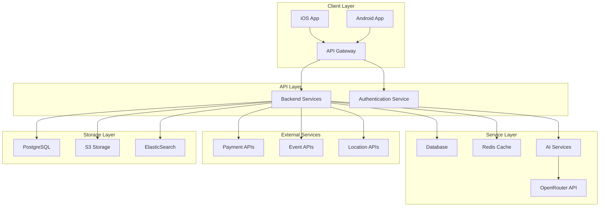

# Tribe Platform

An AI-powered matchmaking and engagement platform designed to create and sustain meaningful small-group connections (4-8 people) and encourage users to transition from digital to physical interactions.


## Overview

Tribe addresses the growing disconnect between online social networking and meaningful in-person relationships. Despite the proliferation of social media platforms, many people report feeling increasingly isolated and struggle to form genuine connections in their local communities.

The platform specifically focuses on local connections and caters to introverts who may find traditional social networking challenging. Tribe uses AI to actively facilitate real-world connections through personality-based matchmaking, automated group formation, and AI-driven engagement tools that encourage and simplify in-person meetups.

## Key Features

- **AI-Powered Smart Matchmaking & Auto Group Formation**: Automatically assigns users to compatible Tribes based on psychological profiles, shared values, and communication styles
- **Personality-Based Matching & User Profiling**: Collects and analyzes user personality traits, interests, and communication styles
- **User-Driven Tribe Creation & Search**: Functionality allowing users to search for existing Tribes or create their own
- **AI-Driven Continuous Engagement**: AI tools that provide conversation prompts, real-time group challenges, and spontaneous activity ideas
- **AI-Powered Real-Time Event & Activity Curation**: System that suggests local events, weather-based activities, and budget-friendly options
- **AI-Optimized Planning & Coordination**: Tools for scheduling, venue recommendations, RSVP tracking, and automated reminders
- **AI-Enhanced Group Management**: Tools for managing group logistics, tracking expenses, and setting shared goals
- **AI-Driven Gamification & Rewards**: System of badges, challenges, streaks, and rewards to incentivize real-world meetups

## System Architecture

Tribe follows a microservices architecture to enable independent scaling of components, facilitate rapid feature development, and support the diverse technical requirements of the system.

### High-Level Architecture



### Core Components

| Component | Description |
|-----------|-------------|
| Mobile Client | React Native application for iOS and Android |
| API Gateway | Entry point for client requests, handling routing and authentication |
| Auth Service | User authentication and identity management |
| Profile Service | User profile and personality data management |
| Tribe Service | Group formation and management |
| Matching Service | AI-powered matchmaking algorithms |
| Event Service | Event discovery and recommendations |
| Engagement Service | AI-driven conversation prompts and challenges |
| Planning Service | Event planning and coordination |
| Payment Service | Payment processing and expense tracking |
| Notification Service | Push notifications and in-app alerts |
| AI Orchestration | Coordination of AI capabilities across services |
| AI Engine | Core AI algorithms and models |

## Technology Stack

### Frontend
- **Framework**: React Native 0.72+
- **Language**: TypeScript 4.9+
- **State Management**: Redux Toolkit
- **Navigation**: React Navigation 6.0+
- **Styling**: Styled Components
- **API Communication**: Axios, Socket.io

### Backend
- **Runtime**: Node.js 18+
- **Framework**: Express.js/Nest.js
- **Language**: TypeScript 4.9+
- **Database**: PostgreSQL 15+
- **ORM**: Prisma
- **Caching**: Redis
- **Message Queue**: Bull/Redis

### AI Services
- **Language**: Python 3.10+
- **AI Integration**: OpenRouter API
- **ML Libraries**: TensorFlow.js, scikit-learn

### DevOps
- **Containerization**: Docker
- **Orchestration**: Kubernetes
- **CI/CD**: GitHub Actions
- **Monitoring**: Prometheus, Grafana
- **Logging**: Loki

## Getting Started

### Prerequisites

Before you begin, ensure you have the following installed on your development machine:

- **Node.js** (v18.0.0 or higher)
- **npm** (v8.0.0 or higher)
- **Docker** (latest stable version)
- **Docker Compose** (latest stable version)
- **Git** (latest stable version)

### Clone the Repository

```bash
# Clone the repository
git clone https://github.com/your-organization/tribe.git

# Navigate to the project directory
cd tribe
```

### Setup Development Environment

The easiest way to set up the development environment is using Docker Compose:

```bash
# Start all services using Docker Compose
docker-compose up -d
```

This will start all the necessary services, including:
- React Native development server
- Backend microservices
- PostgreSQL database
- Redis cache
- AI Engine

### Environment Configuration

Copy the example environment files and configure them for your local environment:

```bash
# Backend environment
cp backend/.env.example backend/.env

# Frontend environment
cp src/web/.env.example src/web/.env.development
```

Edit the `.env` files to configure external API keys and other settings.

### Running the Application

#### Mobile Application

```bash
# Navigate to the web directory
cd src/web

# Install dependencies
npm install

# Start the Metro bundler
npm start

# Run on iOS
npm run ios

# Run on Android
npm run android
```

#### Backend Services

If you're not using Docker Compose, you can run the backend services individually:

```bash
# Navigate to the backend directory
cd backend

# Install dependencies
npm install

# Start all services in development mode
npm run start:dev
```

## Project Structure

```
├── backend/                  # Backend services
│   ├── src/                  # Source code for all services
│   │   ├── shared/          # Shared code used across services
│   │   ├── api-gateway/     # API Gateway service
│   │   ├── auth-service/    # Authentication service
│   │   ├── profile-service/ # User profile service
│   │   └── ...              # Other microservices
│   ├── prisma/              # Database schema and migrations
│   ├── tests/               # Integration and E2E tests
│   └── docs/                # Backend documentation
├── src/
│   ├── web/                 # Mobile application (React Native)
│   │   ├── src/             # Source code for the mobile app
│   │   │   ├── api/         # API clients
│   │   │   ├── components/  # UI components
│   │   │   ├── screens/     # Application screens
│   │   │   ├── store/       # Redux store
│   │   │   └── ...          # Other frontend modules
│   │   └── ...              # React Native configuration
├── infrastructure/          # Infrastructure as code
│   ├── terraform/           # Terraform configurations
│   ├── kubernetes/          # Kubernetes manifests
│   └── monitoring/          # Monitoring configurations
├── docker-compose.yml       # Docker Compose configuration
└── LICENSE                  # License information
```

For more detailed information about specific components:
- [Backend Documentation](backend/README.md)
- [Mobile App Documentation](src/web/README.md)

## Development Workflow

### Making Changes

1. **Create a Feature Branch**:
   ```bash
   git checkout -b feature/your-feature-name
   ```

2. **Implement Your Changes**:
   - Follow the coding standards
   - Write tests for your changes
   - Ensure your code passes linting

3. **Run Tests**:
   ```bash
   # Backend tests
   cd backend
   npm test
   
   # Frontend tests
   cd src/web
   npm test
   ```

4. **Commit Your Changes**:
   ```bash
   git add .
   git commit -m "feat: add new feature"
   ```
   
   We follow the [Conventional Commits](https://www.conventionalcommits.org/) specification for commit messages.

5. **Push Your Branch**:
   ```bash
   git push origin feature/your-feature-name
   ```

6. **Create a Pull Request**:
   - Go to the repository on GitHub
   - Create a new pull request from your branch
   - Fill in the pull request template
   - Request reviews from appropriate team members

## Contribution Guidelines

### Code Style and Standards

- Use consistent formatting according to the provided ESLint and Prettier configs
- Follow naming conventions established in the codebase
- Write self-documenting code with clear variable and function names
- Include JSDoc comments for public APIs and complex functions

### Testing Requirements

- Write unit tests for all new features and bug fixes
- Maintain or improve code coverage percentages
- Include integration tests for complex functionality
- Verify that all tests pass before submitting a pull request

### Pull Request Process

1. Ensure your code follows the established style guidelines
2. Update documentation to reflect any changes
3. Include relevant tests for your changes
4. Ensure CI checks pass before requesting review
5. Request review from at least one maintainer
6. Address all review comments
7. Once approved, your PR will be merged by a maintainer

### Commit Message Format

We follow the Conventional Commits specification:

```
<type>[optional scope]: <description>

[optional body]

[optional footer(s)]
```

Types include:
- feat: A new feature
- fix: A bug fix
- docs: Documentation only changes
- style: Changes that don't affect the meaning of the code
- refactor: Code changes that neither fix a bug nor add a feature
- perf: Code changes that improve performance
- test: Adding missing tests or correcting existing tests
- chore: Changes to the build process or auxiliary tools

## Testing

The Tribe platform includes comprehensive testing at multiple levels:

### Backend Testing

```bash
# Run unit tests
cd backend
npm test

# Run integration tests
npm run test:integration

# Run end-to-end tests
npm run test:e2e

# Generate test coverage report
npm run test:coverage
```

### Frontend Testing

```bash
# Run unit tests
cd src/web
npm test

# Run tests in watch mode
npm run test:watch

# Generate test coverage report
npm run test:coverage
```

### Test Coverage Requirements

- Backend: Minimum 85% coverage for statements, branches, functions, and lines
- Frontend: Minimum 80% coverage for statements, branches, functions, and lines

## Deployment

### Production Deployment

The Tribe platform is designed to be deployed on Kubernetes. The `infrastructure/kubernetes/` directory contains Kubernetes manifests for deploying the application to a production environment.

```bash
# Deploy to Kubernetes
kubectl apply -f infrastructure/kubernetes/namespace.yaml
kubectl apply -f infrastructure/kubernetes/
```

### CI/CD Pipeline

The repository includes GitHub Actions workflows for continuous integration and deployment:

- `.github/workflows/ci.yml`: Runs on every push to verify code quality and run tests
- `.github/workflows/cd.yml`: Deploys to staging/production environments on specific branch pushes

See the deployment documentation in the backend docs directory for more details.

## Documentation

Comprehensive documentation is available throughout the repository:

- [Backend Documentation](backend/README.md): Details about the backend services
- [Mobile App Documentation](src/web/README.md): Information about the React Native application
- API Documentation: API reference for all services (in backend/docs/api)
- Architecture Documentation: System architecture details (in backend/docs/architecture)
- Development Guidelines: Development setup and workflows (in backend/docs/development)

Additional documentation can be found in the respective service directories.

## Versioning

We follow [Semantic Versioning](https://semver.org/) for version numbers:

- **Major version** (x.0.0): Incompatible API changes
- **Minor version** (0.x.0): Backwards-compatible functionality additions
- **Patch version** (0.0.x): Backwards-compatible bug fixes

A detailed history of changes is maintained in the project repository.

## License

The Tribe platform is proprietary software. Unauthorized copying, distribution, or use is strictly prohibited. See [LICENSE](LICENSE) for details.

## Contact

If you have questions about the Tribe platform, please reach out through:

- GitHub issues
- Project discussion forums
- Development team email (provided to approved contributors)