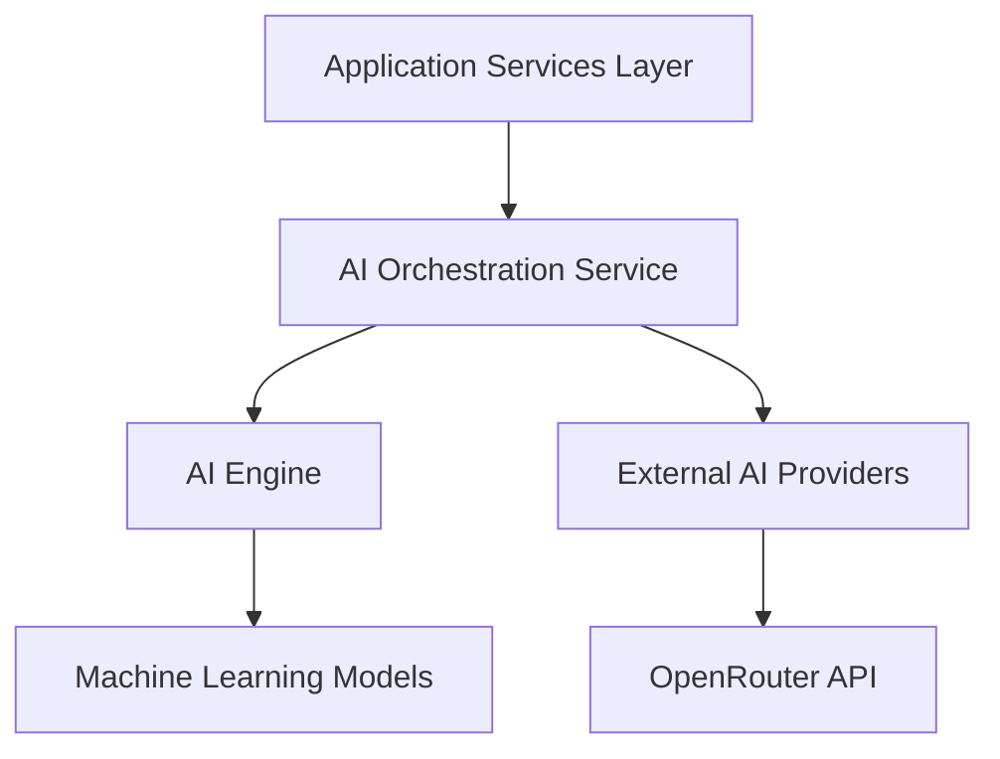
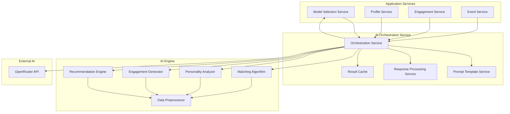
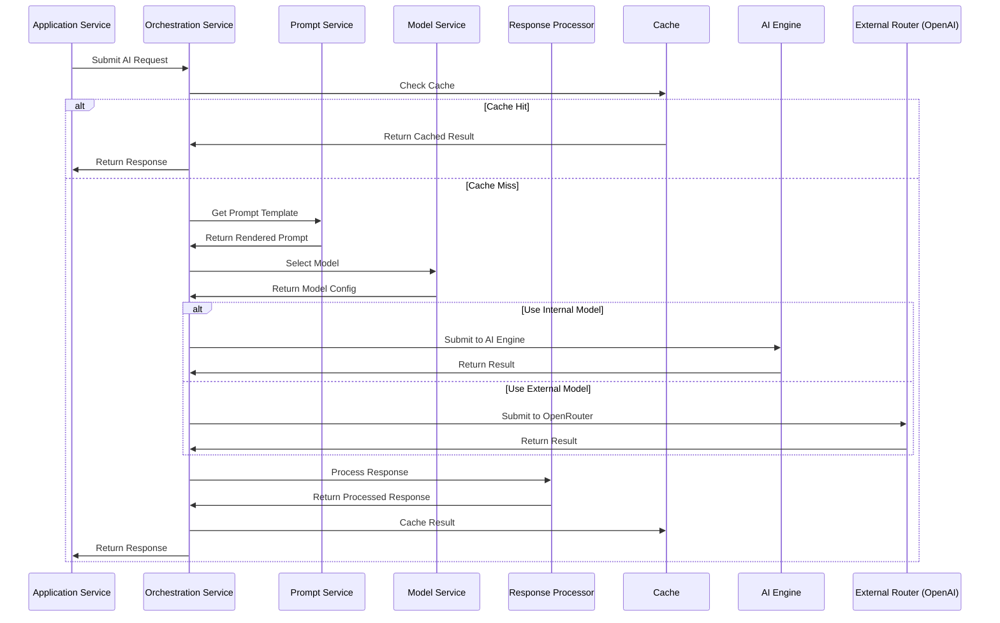
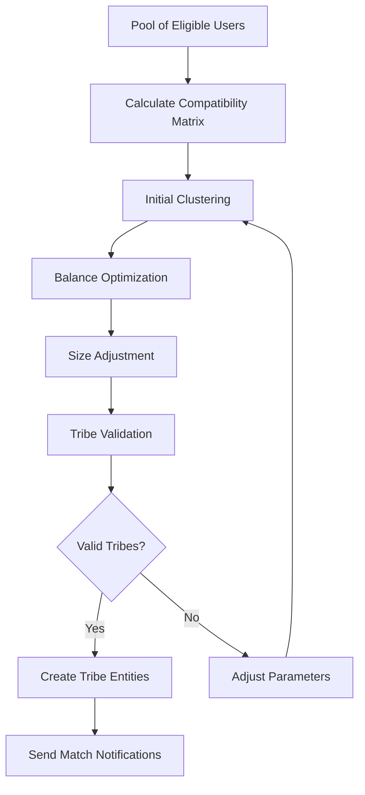

# AI Integration Architecture

## 1. Introduction

The Tribe platform's core value proposition revolves around creating meaningful connections between users through AI-powered matchmaking, personality analysis, and engagement facilitation. This document describes the architectural approach to integrating AI capabilities throughout the Tribe platform, detailing how these capabilities are designed, implemented, and operated to deliver the platform's key features.

### 1.1 Purpose and Scope

This architecture document serves as the definitive reference for how AI capabilities are integrated into the Tribe platform. It covers:

- The overall AI architecture and its components
- The interaction patterns between AI services and other platform components
- The implementation details of AI-powered features
- The operational considerations for AI services
- The security and compliance aspects of AI integration

The scope encompasses all AI-powered capabilities within the Tribe platform, focusing on the four core AI features: matchmaking, personality analysis, engagement generation, and recommendations.

### 1.2 Key AI Features

The Tribe platform leverages AI for four primary capabilities:

1. **Matchmaking & Group Formation**: AI algorithms that automatically form compatible Tribes based on user profiles, personality traits, interests, and communication styles. The system creates balanced groups of 4-8 members optimized for meaningful connections.

2. **Personality Analysis & User Profiling**: AI-driven analysis of user personality traits, communication styles, and preferences derived from assessments and behavioral data to create comprehensive user profiles.

3. **Engagement Generation**: AI tools that provide contextual conversation prompts, group challenges, and spontaneous activity suggestions to maintain engagement and facilitate meaningful interactions.

4. **Recommendations & Curation**: AI-powered systems that suggest relevant events, activities, and meetup opportunities based on group preferences, weather conditions, location, and budget considerations.

## 2. Architectural Overview

### 2.1 Architecture Layers

The AI integration architecture follows a layered approach that separates concerns and allows for flexibility, scalability, and maintainability:



1. **Application Services Layer**: Domain-specific microservices that leverage AI capabilities for their core functions (Matching Service, Profile Service, Engagement Service, Event Service).

2. **AI Orchestration Service**: A Node.js-based service that coordinates AI operations across the platform, managing model selection, prompt generation, and result processing.

3. **AI Engine**: A Python-based service that implements specialized AI algorithms, performs data preprocessing, and handles model-specific operations.

4. **External AI Providers**: Third-party AI services (primarily OpenRouter API) that provide access to state-of-the-art language models.

5. **Machine Learning Models**: Specialized models implemented within the AI Engine for specific tasks like compatibility scoring and personality trait extraction.

### 2.2 Component Diagram



### 2.3 Design Principles

The AI integration architecture is guided by the following design principles:

1. **Separation of Concerns**: Each component has a well-defined responsibility, allowing for independent development, testing, and scaling.

2. **Flexibility in Model Selection**: The architecture allows for different AI models to be used for different features, based on performance, cost, and capability requirements.

3. **Scalability**: Components can be scaled independently to handle varying loads, with compute-intensive operations isolated in dedicated services.

4. **Observability**: Comprehensive logging, monitoring, and tracing are built into every component to ensure visibility into AI operations.

5. **Graceful Degradation**: The system is designed to handle AI service disruptions with fallback mechanisms and degraded modes of operation.

6. **Continuous Learning**: The architecture supports the collection of feedback data to improve AI model performance over time.

7. **Security & Privacy by Design**: User data is protected throughout AI processing with appropriate controls for data minimization, encryption, and access limitations.

## 3. AI Engine

### 3.1 Purpose and Responsibilities

The AI Engine is a specialized Python service that implements core AI algorithms and data processing capabilities specific to the Tribe platform. Its primary responsibilities include:

- Executing compatibility analysis for matchmaking
- Processing personality assessment data
- Generating contextually relevant engagement prompts
- Implementing recommendation algorithms for events and activities
- Preprocessing data for external AI models
- Postprocessing results from external AI models

The AI Engine focuses on computationally intensive operations that benefit from Python's rich ecosystem of data science and machine learning libraries.

### 3.2 Implementation Details

The AI Engine is implemented as a Python FastAPI application with the following characteristics:

- **Language**: Python 3.10+
- **Framework**: FastAPI for high-performance API endpoints
- **Deployment**: Containerized with Docker, deployed on Kubernetes
- **Scaling**: Horizontal scaling with multiple instances behind a load balancer
- **Dependencies**:
  - scikit-learn for machine learning algorithms
  - pandas for data manipulation
  - numpy for numerical computing
  - pydantic for data validation
  - openai for OpenAI API integration
  - requests for HTTP communications

The service exposes a RESTful API consumed primarily by the AI Orchestration Service, with some direct integrations from application services for performance-critical operations.

### 3.3 Key Components

#### 3.3.1 Matching Algorithm

The matching algorithm is responsible for performing compatibility calculations between users and forming balanced Tribes. Its key functions include:

- Calculating compatibility scores between users based on multiple factors
- Clustering users into compatible groups
- Optimizing group composition for balance and diversity
- Evaluating the impact of adding a user to an existing Tribe

Key implementation details:
- Custom compatibility scoring algorithm using weighted feature comparison
- K-means clustering with constraints for initial group formation
- Graph-based optimization for balancing personality traits within groups

#### 3.3.2 Personality Analyzer

The personality analyzer processes user assessment data and behavioral signals to extract personality traits and communication styles. Its key functions include:

- Processing responses from personality assessments
- Extracting personality traits based on the OCEAN model
- Analyzing communication style preferences
- Updating personality profiles based on behavioral data

Key implementation details:
- Factor analysis for trait extraction from assessment responses
- Bayesian updating for incorporating new behavioral evidence
- Confidence scoring for trait assessments

#### 3.3.3 Engagement Generator

The engagement generator creates contextually relevant prompts, challenges, and activities for Tribes. Its key functions include:

- Generating conversation starters based on group interests
- Creating group challenges tailored to Tribe dynamics
- Suggesting spontaneous activities based on context
- Timing engagement interventions based on activity levels

Key implementation details:
- Context-aware prompt selection algorithms
- Interest-matching for activity suggestions
- Activity level monitoring for intervention timing

#### 3.3.4 Recommendation Engine

The recommendation engine suggests events, venues, and activities tailored to Tribe preferences. Its key functions include:

- Ranking external events based on Tribe interests
- Suggesting weather-appropriate activities
- Recommending venues based on group size and preferences
- Filtering recommendations by budget constraints

Key implementation details:
- Collaborative filtering for preference matching
- Contextual filtering for weather and location appropriateness
- Multi-criteria ranking algorithms

### 3.4 API Endpoints

The AI Engine exposes the following key API endpoints:

#### Matching Endpoints

```
POST /matching/compatibility
POST /matching/tribe-formation
POST /matching/tribe-impact
GET /matching/user-tribes/{userId}
```

#### Personality Endpoints

```
POST /personality/analyze
POST /personality/update
GET /personality/traits/{userId}
GET /personality/compatibility/{userId1}/{userId2}
```

#### Engagement Endpoints

```
POST /engagement/generate-prompts
POST /engagement/create-challenge
POST /engagement/suggest-activity
GET /engagement/intervention-timing/{tribeId}
```

#### Recommendation Endpoints

```
POST /recommendations/events
POST /recommendations/venues
POST /recommendations/activities
GET /recommendations/trending/{locationId}
```

Example response structure for a compatibility calculation:

```json
{
  "overallScore": 87.5,
  "factors": {
    "personalityCompatibility": {
      "score": 85.2,
      "details": {
        "openness": { "compatibility": "high", "score": 90 },
        "conscientiousness": { "compatibility": "medium", "score": 75 },
        "extraversion": { "compatibility": "high", "score": 88 },
        "agreeableness": { "compatibility": "high", "score": 92 },
        "neuroticism": { "compatibility": "medium", "score": 78 }
      }
    },
    "interestOverlap": {
      "score": 90.0,
      "sharedInterests": ["hiking", "photography", "board games"],
      "complementaryInterests": ["cooking", "music"]
    },
    "communicationStyleCompatibility": {
      "score": 82.5,
      "details": {
        "communicationPace": "compatible",
        "conflictResolution": "complementary",
        "socialEnergy": "matching"
      }
    },
    "locationProximity": {
      "score": 95.0,
      "distance": "3.2 miles"
    }
  },
  "explanations": [
    "Strong personality compatibility, especially in openness and agreeableness",
    "High degree of shared interests in outdoor activities and games",
    "Complementary communication styles with matching social energy levels",
    "Very close geographic proximity for easy meetups"
  ],
  "recommendationStrength": "strong"
}
```

## 4. AI Orchestration Service

### 4.1 Purpose and Responsibilities

The AI Orchestration Service is the central coordination point for AI capabilities across the Tribe platform. Its primary responsibilities include:

- Routing AI requests to appropriate providers (internal AI Engine or external services)
- Managing prompt templates and generation
- Selecting optimal AI models for different operations
- Processing and transforming AI responses
- Implementing caching and rate limiting for AI operations
- Providing a unified API for AI capabilities to application services
- Monitoring AI operations for performance, cost, and errors

This service acts as a façade for all AI operations, abstracting the underlying complexity of model selection, prompt engineering, and provider management from the application services.

### 4.2 Implementation Details

The AI Orchestration Service is implemented as a Node.js application with the following characteristics:

- **Language**: TypeScript
- **Framework**: Express.js/NestJS
- **Deployment**: Containerized with Docker, deployed on Kubernetes
- **Scaling**: Horizontal scaling with multiple instances behind a load balancer
- **Dependencies**:
  - OpenRouter SDK for external AI integration
  - Redis for caching and rate limiting
  - Bull for job queue management
  - Winston for logging
  - Prometheus client for metrics

The service is designed to be stateless, with state stored in external Redis and database services, enabling horizontal scaling without session affinity requirements.

### 4.3 Key Components

#### 4.3.1 Orchestration Service

The core orchestration service routes AI requests and manages the overall flow of AI operations. Key functions include:

- Routing requests to appropriate AI providers
- Managing request priorities and queuing
- Handling retries and fallbacks
- Coordinating asynchronous AI operations

Implementation details:
- Request router with provider selection logic
- Priority-based job queue using Bull/Redis
- Circuit breaker pattern for external services
- Correlation ID tracking across services

#### 4.3.2 Model Service

The model service manages AI model selection and configuration. Key functions include:

- Selecting appropriate models based on operation requirements
- Managing model configurations and parameters
- Tracking model performance and cost
- Implementing model version control

Implementation details:
- Model registry with capability mapping
- Performance metrics tracking
- Cost optimization algorithms
- A/B testing framework for model comparison

#### 4.3.3 Prompt Service

The prompt service manages prompt templates and generation. Key functions include:

- Storing and versioning prompt templates
- Rendering templates with context-specific variables
- Optimizing prompts for different models
- Analyzing prompt effectiveness

Implementation details:
- Template registry with versioning
- Variable substitution engine
- Template inheritance and composition
- Prompt analytics for optimization

#### 4.3.4 Response Processor

The response processor handles the transformation and validation of AI responses. Key functions include:

- Parsing and validating model outputs
- Transforming responses to standardized formats
- Extracting structured data from text responses
- Implementing content filtering and safety checks

Implementation details:
- JSON schema validation
- Output parsers for different response types
- Content safety classifiers
- Structure extraction utilities

### 4.4 Request Processing Flow



The request processing flow follows these steps:

1. Application service submits an AI request with feature type, operation, and context
2. Orchestration service checks if a valid cached response exists
3. If cache hit, return the cached response
4. If cache miss, the orchestration service:
   - Retrieves and renders the appropriate prompt template
   - Selects the optimal model based on operation requirements
   - Routes the request to either the AI Engine or external provider
   - Processes the response for structure and safety
   - Caches the result if appropriate
   - Returns the processed response to the application service

### 4.5 API Endpoints

The AI Orchestration Service exposes the following key API endpoints:

#### Orchestration Endpoints

```
POST /ai/orchestrate
POST /ai/orchestrate/async
GET /ai/orchestrate/status/:requestId
```

#### Feature-specific Endpoints

```
POST /ai/matching/compatibility
POST /ai/personality/analyze
POST /ai/engagement/generate
POST /ai/recommendations/suggest
```

#### Administration Endpoints

```
GET /ai/admin/models
GET /ai/admin/prompts
GET /ai/admin/metrics
POST /ai/admin/cache/invalidate
```

Example request for the orchestrate endpoint:

```json
{
  "feature": "MATCHING",
  "operation": "USER_TO_TRIBES",
  "context": {
    "userProfile": {
      "id": "user123",
      "traits": {
        "openness": 0.8,
        "conscientiousness": 0.6,
        "extraversion": 0.5,
        "agreeableness": 0.9,
        "neuroticism": 0.3
      },
      "interests": ["hiking", "photography", "cooking", "board games"],
      "communicationStyle": "thoughtful",
      "location": {
        "latitude": 47.6062,
        "longitude": -122.3321
      }
    },
    "tribes": [
      {
        "id": "tribe456",
        "name": "Weekend Explorers",
        "description": "We explore hiking trails, parks, and outdoor activities every weekend.",
        "memberCount": 5,
        "interests": ["hiking", "outdoor activities", "photography"],
        "location": {
          "latitude": 47.6092,
          "longitude": -122.3425
        },
        "members": [
          {
            "id": "member1",
            "traits": { /* personality traits */ }
          },
          // Additional members...
        ]
      },
      // Additional tribes...
    ]
  },
  "options": {
    "includeDetails": true,
    "threshold": 0.7
  },
  "modelPreference": "gpt-4",
  "priority": "NORMAL"
}
```

Example response:

```json
{
  "requestId": "req-789xyz",
  "feature": "MATCHING",
  "operation": "USER_TO_TRIBES",
  "status": "COMPLETED",
  "result": {
    "matches": [
      {
        "tribeId": "tribe456",
        "tribeName": "Weekend Explorers",
        "compatibilityScore": 0.87,
        "compatibilityDetails": {
          "personalityCompatibility": 0.85,
          "interestOverlap": 0.90,
          "locationProximity": 0.95,
          "groupDynamics": 0.82
        },
        "explanation": "High compatibility based on shared interests in hiking and photography, complementary personality traits, and very close location."
      },
      // Additional matches...
    ],
    "recommendations": [
      "Weekend Explorers is highly recommended due to shared outdoor interests and complementary personality traits.",
      // Additional recommendations...
    ]
  },
  "model": {
    "name": "gpt-4",
    "provider": "openai",
    "version": "0613"
  },
  "timing": {
    "totalMs": 1243,
    "promptMs": 57,
    "inferenceMs": 1150,
    "processingMs": 36
  },
  "cached": false
}
```

## 5. External AI Integration

### 5.1 OpenRouter Integration

The Tribe platform integrates with OpenRouter API to access state-of-the-art language models from multiple providers. The integration is implemented in the AI Orchestration Service with the following components:

#### 5.1.1 Authentication and Configuration

- API key management with secure storage in AWS Secrets Manager
- Environment-specific configurations (development, staging, production)
- Provider-specific settings for each supported model
- Request rate and token usage tracking

#### 5.1.2 Request Handling

- Conversion of internal request format to OpenRouter API format
- Dynamic prompt construction using the Prompt Service
- Parameter mapping for different model requirements
- Timeout and retry configuration

#### 5.1.3 Response Processing

- Parsing OpenRouter API responses into internal formats
- Error handling and categorization
- Token usage tracking for cost monitoring
- Response validation and safety filtering

#### 5.1.4 Implementation Example

```typescript
export class OpenRouterService implements ExternalAIProvider {
  constructor(
    private configService: ConfigService,
    private secretsManager: SecretsManagerService,
    private metricsService: MetricsService
  ) {}

  async initialize(): Promise<void> {
    this.apiKey = await this.secretsManager.getSecret('openrouter/api-key');
    this.client = new OpenRouter({
      apiKey: this.apiKey,
      baseURL: this.configService.get('openrouter.baseUrl'),
      defaultModel: this.configService.get('openrouter.defaultModel'),
      timeout: this.configService.get('openrouter.timeout')
    });
  }

  async generateCompletion(request: AICompletionRequest): Promise<AICompletionResponse> {
    const startTime = Date.now();
    
    try {
      const response = await this.client.generateCompletion({
        model: request.model || this.defaultModel,
        prompt: request.prompt,
        max_tokens: request.maxTokens,
        temperature: request.temperature,
        top_p: request.topP,
        frequency_penalty: request.frequencyPenalty,
        presence_penalty: request.presencePenalty,
        stop: request.stopSequences
      });

      const duration = Date.now() - startTime;
      this.metricsService.recordExternalAIRequest({
        provider: 'openrouter',
        model: request.model,
        operation: request.operation,
        status: 'success',
        durationMs: duration,
        promptTokens: response.usage.prompt_tokens,
        completionTokens: response.usage.completion_tokens
      });

      return {
        id: response.id,
        text: response.choices[0].text,
        model: response.model,
        usage: {
          promptTokens: response.usage.prompt_tokens,
          completionTokens: response.usage.completion_tokens,
          totalTokens: response.usage.total_tokens
        },
        metadata: {
          provider: 'openrouter',
          durationMs: duration
        }
      };
    } catch (error) {
      const duration = Date.now() - startTime;
      this.metricsService.recordExternalAIRequest({
        provider: 'openrouter',
        model: request.model,
        operation: request.operation,
        status: 'error',
        durationMs: duration,
        error: error.message
      });
      
      throw new ExternalAIProviderError(
        `OpenRouter API error: ${error.message}`,
        request,
        error
      );
    }
  }
}
```

### 5.2 Model Selection Strategy

The model selection strategy is implemented in the Model Service, which selects the optimal model for each AI operation based on multiple factors:

#### 5.2.1 Selection Criteria

- **Operation Requirements**: Different operations require different model capabilities (e.g., complexity, reasoning, token length)
- **Performance Metrics**: Historical performance of models for similar operations
- **Cost Considerations**: Token usage and pricing for different models
- **Response Time Requirements**: Latency constraints for different features
- **Availability**: Current status and rate limits of different providers

#### 5.2.2 Model Mapping

| Feature | Operation | Primary Model | Fallback Model | Rationale |
|---------|-----------|---------------|---------------|-----------|
| Matching | Tribe Formation | gpt-4 | claude-2 | Complex reasoning for group dynamics |
| Matching | User-Tribe Compatibility | gpt-3.5-turbo | claude-instant-v1 | Good balance of speed and accuracy |
| Personality | Trait Analysis | gpt-4 | claude-2 | Depth of analysis for personality traits |
| Personality | Communication Style | gpt-3.5-turbo | claude-instant-v1 | Patterns are well-established |
| Engagement | Conversation Prompts | gpt-3.5-turbo | claude-instant-v1 | Creative yet contextual responses |
| Engagement | Group Challenges | gpt-4 | claude-2 | Complex reasoning for group dynamics |
| Recommendations | Event Suggestions | gpt-3.5-turbo | claude-instant-v1 | Straightforward pattern matching |
| Recommendations | Activity Planning | gpt-4 | claude-2 | Complex multi-factor optimization |

#### 5.2.3 Dynamic Selection Logic

The Model Service implements a scoring algorithm that weighs multiple factors to select the optimal model for each request:

```typescript
function selectOptimalModel(request: AIRequest, availableModels: AIModel[]): AIModel {
  // Filter models that meet minimum requirements
  const eligibleModels = availableModels.filter(model => 
    model.capabilities.includes(request.requiredCapability) &&
    model.maxTokens >= request.estimatedTokens &&
    model.status === 'available'
  );
  
  if (eligibleModels.length === 0) {
    throw new NoEligibleModelError(request);
  }
  
  // Score each eligible model
  const scoredModels = eligibleModels.map(model => {
    const performanceScore = getHistoricalPerformance(model.id, request.operation);
    const costScore = 1.0 - (model.costPerToken / MAX_COST_PER_TOKEN);
    const latencyScore = 1.0 - (model.avgLatencyMs / MAX_LATENCY_MS);
    
    // Weight factors based on request priority
    let weights;
    switch (request.priority) {
      case 'HIGH':
        weights = { performance: 0.5, cost: 0.1, latency: 0.4 };
        break;
      case 'LOW':
        weights = { performance: 0.3, cost: 0.6, latency: 0.1 };
        break;
      default: // NORMAL
        weights = { performance: 0.4, cost: 0.3, latency: 0.3 };
    }
    
    const totalScore = 
      (performanceScore * weights.performance) +
      (costScore * weights.cost) +
      (latencyScore * weights.latency);
      
    return { model, totalScore };
  });
  
  // Return the highest-scoring model
  return scoredModels.sort((a, b) => b.totalScore - a.totalScore)[0].model;
}
```

### 5.3 Fallback Mechanisms

The AI Orchestration Service implements multiple fallback mechanisms to handle scenarios where external AI services are unavailable or return errors:

#### 5.3.1 Provider Fallbacks

- **Alternative Provider**: If the primary provider (e.g., OpenAI via OpenRouter) fails, try an alternative provider (e.g., Anthropic directly)
- **Model Downgrading**: If a high-capability model is unavailable, fall back to a less capable but more available model

#### 5.3.2 Cached Responses

- Store successful responses in a Redis cache with appropriate TTL
- For repeated or similar requests, return cached responses when external services fail
- Implement cache warming for common request patterns

#### 5.3.3 Simplified Processing

- For complex operations, fall back to simpler algorithms or heuristics
- Implement deterministic fallbacks for critical operations that don't require generative AI
- Use pre-computed results for common scenarios

#### 5.3.4 Circuit Breaker Pattern

The AI Orchestration Service implements a circuit breaker pattern to prevent cascading failures:

```typescript
class AICircuitBreaker {
  private state: 'CLOSED' | 'OPEN' | 'HALF_OPEN' = 'CLOSED';
  private failureCount: number = 0;
  private lastFailureTime: number = 0;
  private readonly failureThreshold: number;
  private readonly resetTimeout: number;
  
  constructor(options: {
    failureThreshold: number,
    resetTimeout: number
  }) {
    this.failureThreshold = options.failureThreshold;
    this.resetTimeout = options.resetTimeout;
  }
  
  async executeRequest<T>(
    request: AIRequest,
    operation: () => Promise<T>,
    fallback: () => Promise<T>
  ): Promise<T> {
    if (this.state === 'OPEN') {
      const timeSinceLastFailure = Date.now() - this.lastFailureTime;
      if (timeSinceLastFailure > this.resetTimeout) {
        this.state = 'HALF_OPEN';
      } else {
        return await fallback();
      }
    }
    
    try {
      const result = await operation();
      if (this.state === 'HALF_OPEN') {
        this.state = 'CLOSED';
        this.failureCount = 0;
      }
      return result;
    } catch (error) {
      this.lastFailureTime = Date.now();
      this.failureCount++;
      
      if (this.failureCount >= this.failureThreshold || this.state === 'HALF_OPEN') {
        this.state = 'OPEN';
      }
      
      return await fallback();
    }
  }
}
```

## 6. AI Feature Implementations

### 6.1 Matchmaking and Group Formation

The matchmaking and group formation feature is one of the core AI-powered capabilities of the Tribe platform, enabling the creation of compatible and balanced Tribes.

#### 6.1.1 Compatibility Algorithm

The compatibility algorithm calculates a compatibility score between users based on multiple factors:

- **Personality Compatibility**: Based on the OCEAN model (Openness, Conscientiousness, Extraversion, Agreeableness, Neuroticism)
- **Interest Overlap**: Shared and complementary interests
- **Communication Style**: Matching or complementary communication preferences
- **Location Proximity**: Geographic distance for in-person meetups
- **Group Dynamics**: Impact on existing group balance

The algorithm applies different weights to these factors based on the Tribe's purpose and characteristics:

```typescript
function calculateCompatibilityScore(
  user: UserProfile,
  tribe: Tribe,
  members: UserProfile[],
  weights: FactorWeights
): CompatibilityResult {
  // Calculate individual factor scores
  const personalityScore = calculatePersonalityCompatibility(user, members);
  const interestScore = calculateInterestOverlap(user, tribe);
  const communicationScore = calculateCommunicationCompatibility(user, members);
  const locationScore = calculateLocationProximity(user, tribe);
  const groupDynamicsScore = calculateGroupDynamicsImpact(user, members);
  
  // Apply weights
  const overallScore = 
    (personalityScore * weights.personality) +
    (interestScore * weights.interests) +
    (communicationScore * weights.communication) +
    (locationScore * weights.location) +
    (groupDynamicsScore * weights.groupDynamics);
  
  // Generate explanation
  const explanation = generateCompatibilityExplanation({
    personalityScore,
    interestScore,
    communicationScore,
    locationScore,
    groupDynamicsScore
  });
  
  return {
    overallScore,
    factors: {
      personality: personalityScore,
      interests: interestScore,
      communication: communicationScore,
      location: locationScore,
      groupDynamics: groupDynamicsScore
    },
    explanation
  };
}
```

#### 6.1.2 Tribe Formation Algorithm

The tribe formation algorithm uses a multi-step process to form balanced and compatible Tribes:

1. **Eligibility Filtering**: Filter users based on basic criteria (location, availability, preferences)
2. **Compatibility Matrix**: Calculate pairwise compatibility scores between all eligible users
3. **Initial Clustering**: Use a modified k-means algorithm to form initial clusters based on compatibility
4. **Balance Optimization**: Refine clusters to optimize for group balance across personality dimensions
5. **Size Adjustment**: Ensure all tribes meet the size requirements (4-8 members)
6. **Validation**: Validate that formed tribes meet minimum compatibility thresholds



#### 6.1.3 AI Enhancement

The matchmaking process is enhanced with generative AI in several ways:

- **Compatibility Analysis**: When numeric algorithms are insufficient, generative AI evaluates complex compatibility factors like communication style and group dynamics
- **Explanation Generation**: AI generates natural language explanations for why users were matched to specific Tribes
- **Edge Case Handling**: For unique profiles or unusual combinations, AI provides specialized compatibility assessments
- **Balance Optimization**: AI assists in determining optimal group composition for balance across multiple dimensions

### 6.2 Personality Analysis

The personality analysis feature processes user assessment responses and behavioral data to create comprehensive personality profiles that power the matchmaking and recommendation features.

#### 6.2.1 Assessment Processing

The assessment processing pipeline extracts personality traits from structured assessment responses:

1. **Data Collection**: Gather responses from the personality assessment questionnaire
2. **Response Validation**: Validate responses for consistency and completion
3. **Factor Analysis**: Apply statistical techniques to extract core personality dimensions
4. **Trait Scoring**: Calculate scores for each trait based on the OCEAN model
5. **Confidence Calculation**: Determine confidence levels for trait scores
6. **Profile Generation**: Create a comprehensive personality profile

#### 6.2.2 Trait Extraction

The trait extraction process uses a combination of rule-based scoring and AI-enhanced analysis:

```python
def extract_personality_traits(assessment_responses):
    """Extract OCEAN personality traits from assessment responses."""
    # Basic scoring using predefined weights
    basic_scores = calculate_basic_trait_scores(assessment_responses)
    
    # Enhance with AI analysis for nuanced interpretation
    enhanced_scores = enhance_trait_scores_with_ai(
        assessment_responses, basic_scores
    )
    
    # Calculate confidence levels based on response consistency
    confidence_levels = calculate_confidence_levels(
        assessment_responses, enhanced_scores
    )
    
    # Generate detailed profile with subscales
    detailed_profile = generate_detailed_profile(
        enhanced_scores, confidence_levels
    )
    
    return {
        "basic_traits": enhanced_scores,
        "detailed_profile": detailed_profile,
        "confidence_levels": confidence_levels
    }
```

#### 6.2.3 Communication Style Analysis

The communication style analysis identifies how users prefer to communicate and interact with others:

- **Communication Pace**: Preference for fast vs. deliberate communication
- **Information Processing**: Visual, auditory, or kinesthetic preferences
- **Social Energy**: How users gain and spend social energy
- **Conflict Resolution**: Approaches to handling disagreements
- **Decision-Making**: Collaborative vs. independent decision-making

This analysis is performed using a combination of direct assessment questions and AI interpretation of responses:

```python
def analyze_communication_style(assessment_responses, behavioral_data=None):
    """Analyze user's communication style preferences."""
    # Extract direct responses to communication questions
    comm_responses = extract_communication_questions(assessment_responses)
    
    # Calculate initial style metrics
    initial_styles = calculate_communication_metrics(comm_responses)
    
    # Enhance with behavioral data if available
    if behavioral_data:
        enhanced_styles = incorporate_behavioral_data(
            initial_styles, behavioral_data
        )
    else:
        enhanced_styles = initial_styles
    
    # Use AI to generate nuanced interpretation
    ai_interpretation = generate_ai_communication_interpretation(
        assessment_responses, enhanced_styles
    )
    
    # Combine quantitative scores with qualitative interpretation
    return {
        "communication_pace": enhanced_styles["pace"],
        "information_processing": enhanced_styles["processing"],
        "social_energy": enhanced_styles["energy"],
        "conflict_resolution": enhanced_styles["conflict"],
        "decision_making": enhanced_styles["decisions"],
        "interpretation": ai_interpretation
    }
```

#### 6.2.4 Behavioral Analysis

The behavioral analysis component updates personality profiles based on ongoing user behavior:

- **Interaction Patterns**: How users engage with others in chats and meetups
- **Event Preferences**: Types of events users attend and enjoy
- **Response Patterns**: How users respond to different types of content
- **Feedback Data**: Explicit feedback from users about their experiences

This provides a dynamic personality profile that evolves over time based on actual behavior:

```python
def update_personality_with_behavior(
    user_id, current_profile, new_behavioral_data
):
    """Update a user's personality profile with new behavioral data."""
    # Weight behavioral data based on recency and relevance
    weighted_data = weight_behavioral_data(new_behavioral_data)
    
    # Calculate behavior-based trait adjustments
    trait_adjustments = calculate_trait_adjustments(
        weighted_data, current_profile
    )
    
    # Apply Bayesian update to current trait estimates
    updated_traits = apply_bayesian_update(
        current_profile["traits"], 
        trait_adjustments,
        current_profile["confidence_levels"]
    )
    
    # Update confidence levels based on new data
    updated_confidence = update_confidence_levels(
        current_profile["confidence_levels"],
        weighted_data
    )
    
    # Generate explanation of significant changes
    change_explanation = explain_profile_changes(
        current_profile["traits"],
        updated_traits
    )
    
    return {
        "previous_profile": current_profile,
        "updated_profile": {
            "traits": updated_traits,
            "confidence_levels": updated_confidence,
        },
        "changes": change_explanation
    }
```

### 6.3 Engagement Generation

The engagement generation feature creates AI-driven conversation prompts, challenges, and activity suggestions to maintain group engagement and facilitate meaningful interactions.

#### 6.3.1 Conversation Prompts

The conversation prompt generator creates contextually relevant prompts to spark discussions in Tribe chats:

- **Interest-Based Prompts**: Questions related to shared interests
- **Value Exploration Prompts**: Prompts that explore shared values and perspectives
- **Experience Sharing Prompts**: Prompts that encourage sharing personal experiences
- **Opinion Prompts**: Questions about preferences and opinions
- **Hypothetical Scenarios**: Creative "what if" scenarios relevant to the group

The prompt selection process considers:
- Group interests and personality traits
- Conversation history and previous engagement
- Current activity level
- Time since last prompt

```typescript
async function generateConversationPrompts(
  tribe: Tribe,
  memberProfiles: UserProfile[],
  conversationHistory: ChatMessage[],
  options: PromptOptions
): Promise<EngagementPrompt[]> {
  // Analyze tribe characteristics
  const tribeInterests = extractTribeInterests(tribe, memberProfiles);
  const personalityDistribution = analyzePersonalityDistribution(memberProfiles);
  const pastPromptTopics = extractPastPromptTopics(conversationHistory);
  
  // Prepare context for AI prompt
  const promptContext = {
    tribeName: tribe.name,
    tribeDescription: tribe.description,
    memberCount: memberProfiles.length,
    sharedInterests: tribeInterests.shared,
    diverseInterests: tribeInterests.diverse,
    personalityDistribution,
    pastPromptTopics,
    recentConversationTopics: extractRecentTopics(conversationHistory),
    currentActivityLevel: calculateActivityLevel(conversationHistory),
    promptCount: options.count || 3,
    promptTypes: options.types || ['interest', 'value', 'experience', 'opinion', 'hypothetical']
  };
  
  // Generate prompts using AI
  const aiResponse = await aiOrchestrationService.generateCompletion({
    feature: 'ENGAGEMENT',
    operation: 'CONVERSATION_PROMPTS',
    context: promptContext,
    options: {
      temperature: 0.8,  // Higher creativity for prompts
      maxTokens: 500
    }
  });
  
  // Process and validate generated prompts
  const generatedPrompts = parsePromptsFromResponse(aiResponse);
  const validatedPrompts = validatePrompts(generatedPrompts, pastPromptTopics);
  
  // Store prompts for tracking engagement
  await promptRepository.storeGeneratedPrompts(tribe.id, validatedPrompts);
  
  return validatedPrompts;
}
```

#### 6.3.2 Group Challenges

The group challenge generator creates activities designed to increase engagement and strengthen bonds within Tribes:

- **Collaborative Challenges**: Tasks that require group collaboration
- **Learning Challenges**: Activities focused on learning new skills together
- **Creative Challenges**: Artistic or creative group activities
- **Physical Challenges**: Outdoor or fitness activities
- **Social Impact Challenges**: Community service or volunteering opportunities

Challenges are tailored to:
- The group's collective interests and values
- Member personality traits
- Geographic location and season
- Available time and resources

```typescript
async function generateGroupChallenge(
  tribe: Tribe,
  memberProfiles: UserProfile[],
  pastChallenges: TribeChallenge[],
  contextualFactors: ContextualFactors
): Promise<TribeChallenge> {
  // Analyze tribe characteristics
  const tribeAttributes = extractTribeAttributes(tribe, memberProfiles);
  const locationContext = enhanceLocationContext(tribe.location, contextualFactors);
  
  // Filter challenge types based on contextual factors
  const eligibleChallengeTypes = filterEligibleChallengeTypes(
    tribeAttributes,
    locationContext,
    pastChallenges
  );
  
  // Generate challenge using AI
  const aiResponse = await aiOrchestrationService.generateCompletion({
    feature: 'ENGAGEMENT',
    operation: 'GROUP_CHALLENGE',
    context: {
      tribeName: tribe.name,
      tribeDescription: tribe.description,
      memberCount: memberProfiles.length,
      tribeAttributes,
      locationContext,
      pastChallengeTypes: pastChallenges.map(c => c.type),
      eligibleChallengeTypes,
      seasonality: contextualFactors.season,
      weather: contextualFactors.weather,
      timeFrame: contextualFactors.timeFrame
    },
    options: {
      temperature: 0.7,
      maxTokens: 600
    }
  });
  
  // Process and enhance generated challenge
  const rawChallenge = parseChallengeFromResponse(aiResponse);
  const enhancedChallenge = enhanceChallengeWithResources(rawChallenge, locationContext);
  
  // Validate challenge suitability
  validateChallengeSuitability(enhancedChallenge, tribeAttributes);
  
  return {
    id: uuidv4(),
    tribeId: tribe.id,
    title: enhancedChallenge.title,
    description: enhancedChallenge.description,
    type: enhancedChallenge.type,
    difficulty: enhancedChallenge.difficulty,
    duration: enhancedChallenge.estimatedDuration,
    resources: enhancedChallenge.resources,
    steps: enhancedChallenge.steps,
    createdAt: new Date(),
    expiresAt: calculateExpirationDate(contextualFactors.timeFrame)
  };
}
```

#### 6.3.3 Activity Suggestions

The activity suggestion generator creates spontaneous activity ideas based on current context:

- **Weather-Based Activities**: Suggestions tailored to current weather conditions
- **Time-Based Activities**: Activities suitable for specific times of day or week
- **Location-Based Activities**: Activities leveraging nearby venues or attractions
- **Budget-Friendly Options**: Activities requiring minimal financial investment
- **Trending Activities**: Currently popular activities in the local area

Activity suggestions consider:
- Current weather and forecast
- Time of day and day of week
- Group size and composition
- Previous activities and feedback
- Local events and attractions

```typescript
async function suggestSpontaneousActivity(
  tribe: Tribe,
  memberProfiles: UserProfile[],
  contextualFactors: ActivityContext
): Promise<ActivitySuggestion[]> {
  // Gather contextual information
  const weatherContext = await weatherService.getCurrentConditions(tribe.location);
  const timeContext = createTimeContext(contextualFactors.timeOfDay, contextualFactors.dayOfWeek);
  const locationContext = await locationService.getNearbyVenues(
    tribe.location,
    memberProfiles.length,
    contextualFactors.radius || 5
  );
  const budgetContext = estimateBudgetPreferences(memberProfiles, tribe);
  
  // Generate activity suggestions using AI
  const aiResponse = await aiOrchestrationService.generateCompletion({
    feature: 'ENGAGEMENT',
    operation: 'ACTIVITY_SUGGESTION',
    context: {
      tribeName: tribe.name,
      memberCount: memberProfiles.length,
      interests: extractTribeInterests(tribe, memberProfiles),
      weather: weatherContext,
      timeContext,
      location: tribe.location,
      nearbyVenues: locationContext.venues,
      budgetPreference: budgetContext,
      previousActivities: extractPreviousActivities(tribe.id),
      suggestionCount: contextualFactors.count || 3
    },
    options: {
      temperature: 0.7,
      maxTokens: 800
    }
  });
  
  // Process and validate suggestions
  const suggestions = parseSuggestionsFromResponse(aiResponse);
  const enrichedSuggestions = enrichSuggestionsWithMetadata(
    suggestions,
    locationContext,
    weatherContext
  );
  
  return enrichedSuggestions.map(suggestion => ({
    id: uuidv4(),
    tribeId: tribe.id,
    title: suggestion.title,
    description: suggestion.description,
    category: suggestion.category,
    weatherAppropriate: suggestion.weatherAppropriate,
    estimatedCost: suggestion.estimatedCost,
    duration: suggestion.estimatedDuration,
    location: suggestion.location,
    venueDetails: suggestion.venueDetails,
    createdAt: new Date()
  }));
}
```

#### 6.3.4 Engagement Timing

The engagement timing system determines the optimal timing for introducing prompts, challenges, and suggestions:

- **Activity Monitoring**: Tracks group interaction frequency and patterns
- **Engagement Analysis**: Analyzes how past engagement attempts performed
- **Pattern Recognition**: Identifies times when the group is most responsive
- **Intervention Timing**: Calculates optimal timing for different engagement types

```typescript
async function determineOptimalEngagementTiming(
  tribe: Tribe,
  activityData: TribeActivityData,
  engagementHistory: EngagementHistory
): Promise<EngagementTiming> {
  // Analyze activity patterns
  const activityPatterns = analyzeActivityPatterns(activityData);
  const responseRates = calculateEngagementResponseRates(engagementHistory);
  const inactivityPeriods = identifyInactivityPeriods(activityData);
  
  // Determine if intervention is needed
  const currentActivityLevel = calculateCurrentActivityLevel(activityData);
  const needsIntervention = determineInterventionNeed(
    currentActivityLevel,
    activityPatterns,
    tribe.settings.engagementPreferences
  );
  
  // If intervention needed, determine optimal timing and type
  if (needsIntervention) {
    const optimalTiming = calculateOptimalTiming(
      activityPatterns,
      responseRates,
      new Date()
    );
    
    const optimalEngagementType = determineEngagementType(
      currentActivityLevel,
      engagementHistory,
      tribe.settings.engagementPreferences
    );
    
    return {
      needsIntervention: true,
      optimalTime: optimalTiming.time,
      confidenceScore: optimalTiming.confidence,
      recommendedEngagementType: optimalEngagementType,
      reasonForIntervention: currentActivityLevel.status,
      activityInsights: activityPatterns.insights
    };
  }
  
  return {
    needsIntervention: false,
    nextEvaluationTime: calculateNextEvaluationTime(activityPatterns),
    activityInsights: activityPatterns.insights
  };
}
```

### 6.4 Recommendations

The recommendation feature suggests events, venues, and activities tailored to Tribe preferences and contextual factors.

#### 6.4.1 Event Recommendations

The event recommendation system suggests local events that match a Tribe's interests and preferences:

- **Interest Matching**: Matches events to Tribe interests
- **Location Proximity**: Considers distance from Tribe members
- **Time Compatibility**: Filters for events at suitable times
- **Group Suitability**: Evaluates if events accommodate the group size
- **Budget Alignment**: Considers price range preferences

```typescript
async function recommendEvents(
  tribe: Tribe,
  memberProfiles: UserProfile[],
  options: EventRecommendationOptions
): Promise<EventRecommendation[]> {
  // Fetch candidate events from external and internal sources
  const externalEvents = await eventService.searchExternalEvents({
    location: tribe.location,
    radius: options.radius || 10,
    timeRange: options.timeRange,
    categories: extractTribeCategories(tribe, memberProfiles),
    maxResults: 50
  });
  
  const internalEvents = await eventService.getInternalEvents({
    location: tribe.location,
    radius: options.radius || 10,
    timeRange: options.timeRange
  });
  
  const allEvents = [...externalEvents, ...internalEvents];
  
  // Extract tribe preferences
  const tribePreferences = extractTribePreferences(tribe, memberProfiles);
  
  // Calculate base compatibility scores
  const scoredEvents = allEvents.map(event => ({
    event,
    baseScore: calculateEventCompatibility(event, tribePreferences)
  }));
  
  // Filter events based on minimum score threshold
  const eligibleEvents = scoredEvents.filter(e => 
    e.baseScore >= options.minCompatibility || 0.6
  );
  
  // If enough eligible events, process with standard pipeline
  if (eligibleEvents.length >= options.count || 3) {
    return processEligibleEvents(eligibleEvents, tribePreferences, options);
  }
  
  // If insufficient eligible events, use AI to expand recommendations
  return await generateAIEnhancedRecommendations(
    tribe,
    memberProfiles,
    eligibleEvents,
    options
  );
}

async function processEligibleEvents(
  eligibleEvents: ScoredEvent[],
  tribePreferences: TribePreferences,
  options: EventRecommendationOptions
): Promise<EventRecommendation[]> {
  // Apply contextual boosting factors
  const boostedEvents = applyContextualBoosting(
    eligibleEvents,
    tribePreferences,
    options.contextualFactors
  );
  
  // Sort by final score
  const sortedEvents = boostedEvents.sort((a, b) => b.finalScore - a.finalScore);
  
  // Take top N events
  const topEvents = sortedEvents.slice(0, options.count || 3);
  
  // Generate explanations for recommendations
  const recommendationsWithExplanations = await generateRecommendationExplanations(
    topEvents,
    tribePreferences
  );
  
  return recommendationsWithExplanations;
}
```

#### 6.4.2 Venue Recommendations

The venue recommendation system suggests locations for meetups based on Tribe preferences and activities:

- **Activity Suitability**: Matches venues to planned activities
- **Group Accommodation**: Ensures venue can accommodate the group size
- **Accessibility**: Considers location and transportation options
- **Atmosphere Matching**: Aligns venue atmosphere with Tribe personality
- **Budget Consideration**: Filters venues by price range

```typescript
async function recommendVenues(
  tribe: Tribe,
  activity: TribeActivity,
  memberProfiles: UserProfile[],
  options: VenueRecommendationOptions
): Promise<VenueRecommendation[]> {
  // Determine venue requirements based on activity
  const venueRequirements = determineVenueRequirements(activity, memberProfiles.length);
  
  // Fetch candidate venues from location service
  const candidateVenues = await locationService.searchVenues({
    location: options.location || tribe.location,
    radius: options.radius || 5,
    requirements: venueRequirements,
    categories: activity.venueCategories,
    priceLevel: options.priceLevel || extractPricePreference(memberProfiles)
  });
  
  // Extract tribe venue preferences
  const venuePreferences = extractVenuePreferences(tribe, memberProfiles, activity);
  
  // Score venues based on suitability
  const scoredVenues = candidateVenues.map(venue => ({
    venue,
    score: calculateVenueSuitability(venue, venuePreferences, venueRequirements)
  }));
  
  // Sort and filter venues
  const sortedVenues = scoredVenues
    .filter(v => v.score >= options.minScore || 0.7)
    .sort((a, b) => b.score - a.score);
  
  // Take top N venues
  const topVenues = sortedVenues.slice(0, options.count || 3);
  
  // Generate detailed recommendations
  return topVenues.map(v => ({
    venueId: v.venue.id,
    venueName: v.venue.name,
    venueType: v.venue.type,
    location: v.venue.location,
    compatibilityScore: v.score,
    suitabilityFactors: calculateSuitabilityFactors(v.venue, venuePreferences),
    priceLevel: v.venue.priceLevel,
    atmosphereDescription: generateAtmosphereDescription(v.venue, tribe),
    recommended: v.score >= 0.8,
    bestFor: determineBestUseCase(v.venue, activity)
  }));
}
```

#### 6.4.3 Weather-Based Recommendations

The weather-based recommendation system suggests activities appropriate for current and forecasted weather conditions:

- **Weather Analysis**: Processes current and forecasted weather data
- **Indoor/Outdoor Classification**: Classifies activities by indoor/outdoor suitability
- **Seasonal Matching**: Suggests season-appropriate activities
- **Weather Contingency**: Provides backup options for weather changes
- **Local Climate Knowledge**: Considers local climate patterns and norms

```typescript
async function recommendWeatherBasedActivities(
  tribe: Tribe,
  memberProfiles: UserProfile[],
  options: WeatherRecommendationOptions
): Promise<WeatherBasedRecommendation[]> {
  // Get current and forecasted weather
  const currentWeather = await weatherService.getCurrentConditions(
    options.location || tribe.location
  );
  
  const forecast = options.forecastDate ? 
    await weatherService.getForecast(options.location || tribe.location, options.forecastDate) :
    null;
  
  const weatherContext = createWeatherContext(currentWeather, forecast);
  
  // Categorize weather conditions
  const weatherCategory = categorizeWeatherConditions(weatherContext);
  
  // Extract tribe activity preferences
  const activityPreferences = extractActivityPreferences(tribe, memberProfiles);
  
  // Filter activity types suitable for weather
  const suitableActivityTypes = filterWeatherSuitableActivities(
    activityPreferences.activityTypes,
    weatherCategory
  );
  
  // If insufficient suitable activities, expand with AI suggestions
  if (suitableActivityTypes.length < 3) {
    return await generateAIWeatherRecommendations(
      tribe,
      memberProfiles,
      weatherContext,
      options
    );
  }
  
  // Find specific activities matching the suitable types
  const specificActivities = await activityService.findActivities({
    location: options.location || tribe.location,
    radius: options.radius || 5,
    activityTypes: suitableActivityTypes,
    weatherCategory: weatherCategory,
    priceLevel: options.priceLevel || extractPricePreference(memberProfiles),
    groupSize: memberProfiles.length
  });
  
  // Generate recommendations with weather context
  return specificActivities.slice(0, options.count || 5).map(activity => ({
    activityId: activity.id,
    activityName: activity.name,
    activityType: activity.type,
    weatherSuitability: calculateWeatherSuitability(activity, weatherContext),
    indoorOutdoor: activity.indoorOutdoor,
    weatherNotes: generateWeatherNotes(activity, weatherContext),
    location: activity.location,
    estimatedCost: activity.estimatedCost,
    weatherContingency: generateWeatherContingency(activity, weatherContext)
  }));
}
```

#### 6.4.4 Budget-Conscious Recommendations

The budget-conscious recommendation system suggests affordable activities that match Tribe preferences:

- **Budget Analysis**: Estimates budget preferences from user profiles
- **Cost Categorization**: Classifies activities by cost level
- **Value Optimization**: Prioritizes high-value experiences
- **Free Alternative Identification**: Finds free alternatives to paid activities
- **Cost Sharing Opportunities**: Identifies opportunities for group discounts

```typescript
async function recommendBudgetFriendlyActivities(
  tribe: Tribe,
  memberProfiles: UserProfile[],
  options: BudgetRecommendationOptions
): Promise<BudgetFriendlyRecommendation[]> {
  // Determine budget preference
  const budgetPreference = options.budgetLevel || estimateTribeBudgetPreference(memberProfiles);
  
  // Extract tribe interests and preferences
  const tribeInterests = extractTribeInterests(tribe, memberProfiles);
  
  // Search for budget-friendly activities
  const budgetActivities = await activityService.findBudgetFriendlyActivities({
    location: options.location || tribe.location,
    radius: options.radius || 5,
    interests: tribeInterests,
    budgetLevel: budgetPreference,
    groupSize: memberProfiles.length,
    timeFrame: options.timeFrame
  });
  
  // If insufficient activities found, generate AI recommendations
  if (budgetActivities.length < 3) {
    return await generateAIBudgetRecommendations(
      tribe,
      memberProfiles,
      budgetPreference,
      options
    );
  }
  
  // Enhance activities with budget-specific information
  const enhancedActivities = enhanceWithBudgetInfo(
    budgetActivities,
    budgetPreference,
    memberProfiles.length
  );
  
  // Sort by value score (quality/cost ratio)
  const sortedActivities = enhancedActivities
    .sort((a, b) => b.valueScore - a.valueScore)
    .slice(0, options.count || 5);
  
  // Generate final recommendations
  return sortedActivities.map(activity => ({
    activityId: activity.id,
    activityName: activity.name,
    activityType: activity.type,
    estimatedCostPerPerson: activity.costPerPerson,
    totalGroupCost: activity.totalCost,
    valueScore: activity.valueScore,
    budgetCategory: activity.budgetCategory,
    savingTips: activity.savingTips,
    groupDiscountAvailable: activity.groupDiscountAvailable,
    freeAlternative: activity.freeAlternative,
    costBreakdown: activity.costBreakdown
  }));
}
```

## 7. Prompt Engineering

### 7.1 Prompt Template System

The prompt template system enables consistent, maintainable, and optimizable prompts across all AI operations. The system implements a hierarchical template structure with inheritance and composition capabilities.

#### 7.1.1 Template Structure

Prompt templates are stored as structured documents with the following components:

- **Metadata**: Category, name, version, and creation/update timestamps
- **Template Content**: The actual prompt template with variable placeholders
- **Variables**: Definitions of required and optional variables
- **Examples**: Sample inputs and expected outputs
- **Usage Guidelines**: Notes on when and how to use the template
- **Model Requirements**: Specific needs for token limits, capabilities, etc.

```json
{
  "category": "MATCHING",
  "name": "tribe_compatibility_analysis",
  "version": "1.0.2",
  "created": "2023-09-15T10:30:00Z",
  "updated": "2023-10-05T14:45:00Z",
  "template": "Analyze the compatibility between the following user and Tribe based on personality traits, interests, and communication styles.\n\nUser Profile:\n{{userProfile}}\n\nTribe Information:\n{{tribeInfo}}\n\nExisting Members:\n{{memberProfiles}}\n\nProvide a detailed analysis covering:\n1. Personality compatibility with existing members\n2. Interest overlap with the Tribe's focus\n3. Communication style compatibility\n4. Overall group dynamic impact\n5. Specific strengths this user would bring to the Tribe\n\nInclude a numerical compatibility score from 0-100 and a brief explanation of your reasoning.",
  "variables": [
    {
      "name": "userProfile",
      "description": "JSON object containing user's personality traits, interests, and communication style",
      "required": true
    },
    {
      "name": "tribeInfo",
      "description": "JSON object containing Tribe name, description, and focus areas",
      "required": true
    },
    {
      "name": "memberProfiles",
      "description": "JSON array of existing member profiles with personality traits",
      "required": true
    }
  ],
  "examples": [
    {
      "variables": {
        "userProfile": "...",
        "tribeInfo": "...",
        "memberProfiles": "..."
      },
      "expectedOutput": "..."
    }
  ],
  "usageGuidelines": "Use this template for detailed compatibility analysis when considering adding a user to an existing Tribe. The analysis should consider both individual compatibility with members and impact on overall group dynamics.",
  "modelRequirements": {
    "minTokens": 1000,
    "preferredModels": ["gpt-4", "claude-2"],
    "fallbackModels": ["gpt-3.5-turbo"]
  }
}
```

#### 7.1.2 Template Management

The PromptTemplateService handles template management with the following functionality:

- **Storage and Retrieval**: Templates are stored in a database with versioning
- **Inheritance**: Templates can inherit from base templates
- **Composition**: Templates can include other templates as components
- **Validation**: Templates are validated for required variables and structure
- **Versioning**: Templates are versioned with major.minor format

```typescript
class PromptTemplateService {
  constructor(
    private templateRepository: PromptTemplateRepository,
    private variableProcessor: VariableProcessor,
    private templateValidator: TemplateValidator
  ) {}
  
  async getTemplate(category: string, name: string, version?: string): Promise<PromptTemplate> {
    // Get latest version if not specified
    const template = version ? 
      await this.templateRepository.getTemplate(category, name, version) :
      await this.templateRepository.getLatestTemplate(category, name);
    
    if (!template) {
      throw new TemplateNotFoundError(category, name, version);
    }
    
    // Process inheritance if template extends another
    if (template.extends) {
      const baseTemplate = await this.getTemplate(
        template.extends.category,
        template.extends.name,
        template.extends.version
      );
      
      return this.mergeTemplates(baseTemplate, template);
    }
    
    return template;
  }
  
  async renderTemplate(
    template: PromptTemplate,
    variables: Record<string, any>
  ): Promise<string> {
    // Validate that all required variables are provided
    this.templateValidator.validateVariables(template, variables);
    
    // Process variables (escape, format, etc.)
    const processedVariables = this.variableProcessor.processVariables(
      template.variables,
      variables
    );
    
    // Process any included templates
    const expandedTemplate = await this.expandIncludes(template);
    
    // Replace variables in template
    return this.substituteVariables(expandedTemplate.template, processedVariables);
  }
  
  private async expandIncludes(template: PromptTemplate): Promise<PromptTemplate> {
    if (!template.includes || template.includes.length === 0) {
      return template;
    }
    
    let expandedContent = template.template;
    
    for (const include of template.includes) {
      const includedTemplate = await this.getTemplate(
        include.category,
        include.name,
        include.version
      );
      
      expandedContent = expandedContent.replace(
        `{{include:${include.category}.${include.name}}}`,
        includedTemplate.template
      );
    }
    
    return {
      ...template,
      template: expandedContent
    };
  }
  
  private mergeTemplates(base: PromptTemplate, override: PromptTemplate): PromptTemplate {
    // Merge template properties, with override taking precedence
    return {
      ...base,
      ...override,
      template: override.template || base.template,
      variables: [...base.variables, ...override.variables],
      modelRequirements: {
        ...base.modelRequirements,
        ...override.modelRequirements
      }
    };
  }
  
  private substituteVariables(
    template: string,
    variables: Record<string, string>
  ): string {
    return template.replace(/\{\{(\w+)\}\}/g, (match, variableName) => {
      return variables[variableName] !== undefined ? 
        variables[variableName] : 
        match;
    });
  }
}
```

### 7.2 Feature-Specific Prompts

The platform implements specialized prompts optimized for each AI-powered feature:

#### 7.2.1 Matchmaking Prompts

Matchmaking prompts focus on evaluating compatibility between users and Tribes:

```
Analyze the compatibility between the following user and Tribe based on personality traits, interests, and communication styles.

User Profile:
{{userProfile}}

Tribe Information:
{{tribeInfo}}

Existing Members:
{{memberProfiles}}

Provide a detailed analysis covering:
1. Personality compatibility with existing members
2. Interest overlap with the Tribe's focus
3. Communication style compatibility
4. Overall group dynamic impact
5. Specific strengths this user would bring to the Tribe

Include a numerical compatibility score from 0-100 and a brief explanation of your reasoning.
```

Key characteristics:
- Structured output format for consistent parsing
- Emphasis on multiple compatibility dimensions
- Explicit request for numerical scoring
- Focus on both individual compatibility and group impact

#### 7.2.2 Personality Analysis Prompts

Personality analysis prompts extract traits and patterns from assessment responses:

```
Analyze the following personality assessment responses to identify the user's key personality traits, communication style, and social preferences.

Assessment Responses:
{{assessmentResponses}}

Provide a detailed analysis covering:
1. OCEAN personality dimensions with scores from 0-1 for each dimension
2. Communication style preferences
3. Social interaction tendencies
4. Decision-making approach
5. Conflict resolution style

For each dimension, include specific behavioral manifestations and explain how they might influence group dynamics. Also identify potential compatibility factors with different personality types.
```

Key characteristics:
- Focus on standardized personality dimensions (OCEAN model)
- Request for quantitative scoring
- Emphasis on behavioral manifestations
- Consideration of group interaction implications

#### 7.2.3 Engagement Prompts

Engagement prompts generate conversation starters and activities tailored to group dynamics:

```
Generate engaging conversation prompts for a Tribe with the following characteristics:

Tribe Name: {{tribeName}}
Tribe Description: {{tribeDescription}}
Shared Interests: {{sharedInterests}}
Personality Distribution: {{personalityDistribution}}
Recent Conversation Topics: {{recentTopics}}
Current Activity Level: {{activityLevel}}

Create {{promptCount}} diverse conversation starters that will engage all members of this Tribe. The prompts should:
1. Relate to their shared interests while introducing new perspectives
2. Accommodate different personality types within the group
3. Encourage meaningful sharing rather than superficial responses
4. Be specific enough to reduce response anxiety
5. Have potential to spark ongoing conversation

Each prompt should include a follow-up question to maintain engagement if the initial conversation slows.
```

Key characteristics:
- Customization based on Tribe specifics
- Emphasis on inclusivity for different personality types
- Structured format with follow-up elements
- Focus on depth rather than superficial engagement

#### 7.2.4 Recommendation Prompts

Recommendation prompts suggest activities and venues tailored to group preferences:

```
Recommend activities for a Tribe with the following characteristics:

Tribe Profile:
{{tribeProfile}}

Contextual Factors:
- Weather: {{weatherConditions}}
- Time: {{timeContext}}
- Budget Preference: {{budgetPreference}}
- Location: {{locationDetails}}
- Available Transportation: {{transportationOptions}}

Generate {{activityCount}} activity recommendations that:
1. Match the Tribe's shared interests
2. Are appropriate for the current weather conditions
3. Fit within the specified budget preference
4. Are feasible given the location and transportation options
5. Would appeal to the personality mix of the group

For each recommendation, include:
- Activity name and description
- Estimated cost per person
- Weather appropriateness rating (1-5)
- Why this activity would appeal to this specific Tribe
- A practical tip for organizing this activity
```

Key characteristics:
- Heavy contextualization based on multiple factors
- Practical, actionable recommendations
- Inclusion of logistics and planning elements
- Explicit reasoning for recommendations

### 7.3 Prompt Optimization

The platform employs a systematic approach to optimizing prompts for different AI models and use cases:

#### 7.3.1 Optimization Process

The prompt optimization process follows a structured methodology:

1. **Initial Design**: Create baseline prompts based on feature requirements
2. **A/B Testing**: Test variations with different structures, phrasings, and examples
3. **Performance Analysis**: Evaluate results based on output quality, consistency, and model efficiency
4. **Iterative Refinement**: Continuously improve prompts based on performance data
5. **Model-Specific Adaptation**: Optimize prompts for different AI models

```typescript
async function optimizePrompt(
  baseTemplate: PromptTemplate,
  testCases: PromptTestCase[],
  targetModels: string[]
): Promise<PromptOptimizationResult> {
  // Generate variations of the base template
  const variations = generateTemplateVariations(baseTemplate);
  
  // Test each variation against the test cases
  const testResults = await Promise.all(
    variations.map(async (variation) => {
      const results = await testTemplateVariation(
        variation,
        testCases,
        targetModels
      );
      
      return {
        variation,
        results
      };
    })
  );
  
  // Analyze results to find optimal variation for each model
  const modelOptimalVariations = {};
  
  for (const model of targetModels) {
    const modelResults = testResults.map(tr => ({
      variation: tr.variation,
      metrics: calculateAggregateMetrics(tr.results.filter(r => r.model === model))
    }));
    
    const optimalVariation = modelResults.reduce((best, current) => {
      return current.metrics.overallScore > best.metrics.overallScore ? current : best;
    }, modelResults[0]);
    
    modelOptimalVariations[model] = optimalVariation;
  }
  
  // Generate optimization report
  const optimizationReport = generateOptimizationReport(
    baseTemplate,
    variations,
    testResults,
    modelOptimalVariations
  );
  
  return {
    baseTemplate,
    variations,
    testResults,
    modelOptimalVariations,
    optimizationReport
  };
}

async function testTemplateVariation(
  variation: PromptTemplate,
  testCases: PromptTestCase[],
  models: string[]
): Promise<TemplateTestResult[]> {
  const results: TemplateTestResult[] = [];
  
  for (const testCase of testCases) {
    for (const model of models) {
      // Render template with test case variables
      const renderedPrompt = await promptTemplateService.renderTemplate(
        variation,
        testCase.variables
      );
      
      // Send to AI model
      const aiResponse = await aiOrchestrationService.generateCompletion({
        prompt: renderedPrompt,
        model: model,
        options: variation.modelRequirements
      });
      
      // Evaluate response
      const evaluationMetrics = evaluateResponse(
        aiResponse,
        testCase.expectedOutput,
        testCase.evaluationCriteria
      );
      
      results.push({
        testCaseId: testCase.id,
        model: model,
        prompt: renderedPrompt,
        response: aiResponse,
        metrics: evaluationMetrics
      });
    }
  }
  
  return results;
}
```

#### 7.3.2 Key Optimization Techniques

The platform employs several prompt optimization techniques:

- **Clear Instructions**: Explicit, step-by-step instructions for complex tasks
- **Few-Shot Examples**: Including examples of desired outputs for consistent results
- **Structured Outputs**: Requesting specific output formats for reliable parsing
- **Decomposition**: Breaking complex tasks into smaller, manageable components
- **Persona Setting**: Establishing a specific role or persona for the AI to adopt
- **Chain-of-Thought**: Prompting the model to show its reasoning process
- **Contextual Enrichment**: Providing rich contextual information for better outputs

#### 7.3.3 Model-Specific Optimizations

Different AI models require different prompt optimization approaches:

| Model | Optimization Techniques |
|-------|-------------------------|
| GPT-4 | Complex reasoning prompts, fewer examples, chain-of-thought approach |
| GPT-3.5 Turbo | More explicit instructions, additional examples, structured output templates |
| Claude-2 | Conversational framing, detailed instructions, explicit reasoning requests |
| Claude-instant | Simplified tasks, more examples, detailed output structure |

#### 7.3.4 Performance Monitoring

Prompt performance is continuously monitored and improved:

- **Success Rate**: Percentage of prompts that produce usable outputs
- **Parsing Success**: Reliability of structured output parsing
- **Token Efficiency**: Optimizing for token usage and cost
- **Response Quality**: Subjective and objective quality measures
- **User Feedback**: Incorporating user ratings of AI-generated content

## 8. Observability and Monitoring

### 8.1 Metrics Collection

The AI components implement comprehensive metrics collection to monitor performance, usage, and quality:

#### 8.1.1 Key Metrics

| Metric Category | Specific Metrics | Purpose |
|-----------------|------------------|---------|
| Request Metrics | Request count, success/failure rate, latency | Monitor API health and performance |
| Model Metrics | Token usage, model distribution, inference time | Track model utilization and cost |
| Feature Metrics | Feature usage, success rates by feature | Measure feature adoption and performance |
| Quality Metrics | Output quality scores, parsing success rates | Assess AI output quality |
| Business Metrics | Conversion rates, engagement metrics | Measure business impact |

#### 8.1.2 Implementation

Metrics are collected and exposed through a Prometheus-compatible endpoint:

```typescript
class AIMetricsService {
  private requestCounter: Counter;
  private latencyHistogram: Histogram;
  private tokenCounter: Counter;
  private qualityGauge: Gauge;
  private featureCounter: Counter;
  
  constructor(private register: Registry) {
    // Initialize Prometheus metrics
    this.requestCounter = new Counter({
      name: 'ai_requests_total',
      help: 'Total number of AI requests',
      labelNames: ['feature', 'operation', 'model', 'status']
    });
    
    this.latencyHistogram = new Histogram({
      name: 'ai_request_duration_seconds',
      help: 'AI request duration in seconds',
      labelNames: ['feature', 'operation', 'model'],
      buckets: [0.1, 0.3, 0.5, 1, 3, 5, 10, 30]
    });
    
    this.tokenCounter = new Counter({
      name: 'ai_token_usage_total',
      help: 'Total token usage for AI operations',
      labelNames: ['feature', 'operation', 'model', 'type']
    });
    
    this.qualityGauge = new Gauge({
      name: 'ai_output_quality',
      help: 'Quality rating of AI outputs',
      labelNames: ['feature', 'operation', 'model']
    });
    
    this.featureCounter = new Counter({
      name: 'ai_feature_usage_total',
      help: 'Total usage of AI features',
      labelNames: ['feature', 'operation', 'result']
    });
    
    // Register metrics
    register.registerMetric(this.requestCounter);
    register.registerMetric(this.latencyHistogram);
    register.registerMetric(this.tokenCounter);
    register.registerMetric(this.qualityGauge);
    register.registerMetric(this.featureCounter);
  }
  
  recordRequest(
    feature: string,
    operation: string,
    model: string,
    status: 'success' | 'error',
    durationMs: number,
    promptTokens: number,
    completionTokens: number
  ): void {
    // Increment request counter
    this.requestCounter.labels(feature, operation, model, status).inc();
    
    // Record latency
    this.latencyHistogram.labels(feature, operation, model).observe(durationMs / 1000);
    
    // Track token usage
    this.tokenCounter.labels(feature, operation, model, 'prompt').inc(promptTokens);
    this.tokenCounter.labels(feature, operation, model, 'completion').inc(completionTokens);
    this.tokenCounter.labels(feature, operation, model, 'total').inc(promptTokens + completionTokens);
    
    // Record feature usage
    this.featureCounter.labels(feature, operation, status).inc();
  }
  
  recordQualityFeedback(
    feature: string,
    operation: string,
    model: string,
    qualityScore: number
  ): void {
    this.qualityGauge.labels(feature, operation, model).set(qualityScore);
  }
}
```

### 8.2 Logging Strategy

The AI components implement a comprehensive logging strategy to enable troubleshooting, analysis, and auditing:

#### 8.2.1 Log Levels and Categories

| Log Level | Usage |
|-----------|-------|
| ERROR | Service failures, critical issues impacting users |
| WARN | Potential issues, degraded service conditions |
| INFO | Normal operational events, feature usage |
| DEBUG | Detailed information for troubleshooting |
| TRACE | Highly detailed debugging information |

#### 8.2.2 Structured Logging

Logs are formatted as structured JSON for easier querying and analysis:

```typescript
class AILogger {
  constructor(
    private logger: winston.Logger,
    private correlationService: CorrelationService
  ) {}
  
  info(message: string, context?: Record<string, any>): void {
    this.log('info', message, context);
  }
  
  error(message: string, error?: Error, context?: Record<string, any>): void {
    this.log('error', message, {
      ...context,
      error: error ? {
        message: error.message,
        stack: error.stack,
        name: error.name
      } : undefined
    });
  }
  
  // Additional methods for warn, debug, trace...
  
  private log(level: string, message: string, context?: Record<string, any>): void {
    const correlationId = this.correlationService.getCurrentCorrelationId();
    const timestamp = new Date().toISOString();
    
    this.logger.log(level, message, {
      timestamp,
      correlationId,
      component: 'ai-service',
      ...context
    });
  }
}
```

#### 8.2.3 Sensitive Data Handling

The logging system implements safeguards for sensitive user data:

- **Data Minimization**: Logging only necessary information
- **Redaction**: Automated redaction of sensitive fields (PII, etc.)
- **Anonymization**: Replacing identifiers with hashed or generic values
- **Retention Policies**: Shorter retention for logs with sensitive context

```typescript
function redactSensitiveData(logData: any): any {
  if (!logData) return logData;
  
  if (typeof logData === 'object') {
    const result = { ...logData };
    
    // Redact known sensitive fields
    const sensitiveFields = [
      'password', 'token', 'secret', 'key', 'authorization',
      'personalityTraits', 'traits', 'assessment'
    ];
    
    for (const field of sensitiveFields) {
      if (field in result) {
        result[field] = '[REDACTED]';
      }
    }
    
    // Recursively process nested objects
    for (const key in result) {
      if (typeof result[key] === 'object') {
        result[key] = redactSensitiveData(result[key]);
      }
    }
    
    return result;
  }
  
  return logData;
}
```

### 8.3 Performance Monitoring

The platform implements comprehensive performance monitoring for AI operations:

#### 8.3.1 Key Performance Indicators

| KPI | Description | Target |
|-----|-------------|--------|
| Response Time | Time to complete AI operations | P95 < 2s for sync, < 5s for async |
| Token Efficiency | Tokens used per operation | Depends on operation complexity |
| Success Rate | Percentage of successful operations | > 99.5% |
| Model Availability | Availability of AI models | > 99.9% |
| Quality Score | Output quality rating | > 4.5/5 |

#### 8.3.2 Monitoring Dashboards

The platform provides specialized dashboards for monitoring AI performance:

- **Operational Dashboard**: Real-time view of AI service health
- **Performance Dashboard**: Detailed performance metrics by feature and model
- **Quality Dashboard**: Output quality metrics and user feedback
- **Cost Dashboard**: Token usage and cost analysis
- **Error Dashboard**: Error rates and patterns

#### 8.3.3 Alerting Configuration

```typescript
function configureAlerts(prometheusRules: PrometheusRules): void {
  prometheusRules.addAlertGroup('ai-service', [
    {
      name: 'HighErrorRate',
      expr: 'sum(rate(ai_requests_total{status="error"}[5m])) / sum(rate(ai_requests_total[5m])) > 0.05',
      for: '5m',
      labels: {
        severity: 'warning'
      },
      annotations: {
        summary: 'High AI request error rate',
        description: 'AI service has a high error rate (>5%) over the last 5 minutes'
      }
    },
    {
      name: 'HighLatency',
      expr: 'histogram_quantile(0.95, sum(rate(ai_request_duration_seconds_bucket[5m])) by (le, feature)) > 5',
      for: '5m',
      labels: {
        severity: 'warning'
      },
      annotations: {
        summary: 'High AI request latency',
        description: 'AI service P95 latency is above 5 seconds for feature {{ $labels.feature }}'
      }
    },
    {
      name: 'ModelUnavailable',
      expr: 'sum(up{job="ai-service"}) < 1',
      for: '2m',
      labels: {
        severity: 'critical'
      },
      annotations: {
        summary: 'AI service is down',
        description: 'AI service has been unavailable for more than 2 minutes'
      }
    }
  ]);
}
```

### 8.4 Error Tracking

The platform implements comprehensive error tracking for AI operations:

#### 8.4.1 Error Categorization

| Error Category | Examples | Handling |
|----------------|----------|----------|
| Infrastructure Errors | Network issues, service outages | Retry with backoff, circuit breaking |
| Model Errors | Token limits, content policy violations | Model fallbacks, prompt adjustments |
| Input Errors | Invalid inputs, missing parameters | Validation, default values |
| Processing Errors | Parsing failures, unexpected formats | Graceful degradation, fallback logic |
| Business Logic Errors | Incompatible constraints, logic conflicts | Error messages, alternative suggestions |

#### 8.4.2 Error Analysis System

```typescript
class AIErrorAnalyzer {
  constructor(
    private errorRepository: ErrorRepository,
    private notificationService: NotificationService
  ) {}
  
  async recordError(error: AIServiceError): Promise<void> {
    // Categorize error
    const category = this.categorizeError(error);
    
    // Store error details
    await this.errorRepository.storeError({
      id: uuidv4(),
      timestamp: new Date(),
      category,
      feature: error.feature,
      operation: error.operation,
      model: error.model,
      errorMessage: error.message,
      stack: error.stack,
      request: error.request,
      correlationId: error.correlationId
    });
    
    // Check for error patterns
    await this.analyzeErrorPatterns(category, error.feature, error.operation);
  }
  
  private categorizeError(error: AIServiceError): ErrorCategory {
    if (error instanceof AINetworkError || error instanceof ServiceUnavailableError) {
      return 'INFRASTRUCTURE';
    } else if (error instanceof ModelError || error instanceof TokenLimitError) {
      return 'MODEL';
    } else if (error instanceof ValidationError || error instanceof MissingParameterError) {
      return 'INPUT';
    } else if (error instanceof ParsingError || error instanceof UnexpectedFormatError) {
      return 'PROCESSING';
    } else if (error instanceof BusinessLogicError) {
      return 'BUSINESS_LOGIC';
    } else {
      return 'UNKNOWN';
    }
  }
  
  private async analyzeErrorPatterns(
    category: ErrorCategory,
    feature: string,
    operation: string
  ): Promise<void> {
    // Get recent errors of the same category and feature
    const recentErrors = await this.errorRepository.getRecentErrors({
      category,
      feature,
      operation,
      timeWindow: 15 * 60 * 1000 // 15 minutes
    });
    
    // Check for error spike
    if (recentErrors.length >= 5) {
      const errorRate = this.calculateErrorRate(recentErrors);
      
      if (errorRate > 0.1) { // More than 10% error rate
        await this.notificationService.sendErrorAlert({
          category,
          feature,
          operation,
          errorCount: recentErrors.length,
          errorRate,
          message: `Error spike detected for ${feature}/${operation} with rate ${errorRate.toFixed(2)}`
        });
      }
    }
  }
  
  private calculateErrorRate(errors: AIErrorRecord[]): number {
    // Implementation depends on available metrics
    // This is a simplified version
    const uniqueRequests = new Set(errors.map(e => e.correlationId)).size;
    return uniqueRequests / 100; // Assuming 100 requests is the baseline
  }
}
```

## 9. Scaling and Performance

### 9.1 Scaling Strategy

The AI components implement a multi-layered scaling strategy to handle increasing load:

#### 9.1.1 Horizontal Scaling

- **AI Orchestration Service**: Scales horizontally with multiple instances behind a load balancer
- **AI Engine**: Scales horizontally for compute-intensive operations
- **Service Distribution**: Workloads distributed across multiple instances using consistent hashing

```typescript
// Kubernetes Horizontal Pod Autoscaler (HPA) configuration
const aiOrchestrationHPA = {
  apiVersion: 'autoscaling/v2',
  kind: 'HorizontalPodAutoscaler',
  metadata: {
    name: 'ai-orchestration-service'
  },
  spec: {
    scaleTargetRef: {
      apiVersion: 'apps/v1',
      kind: 'Deployment',
      name: 'ai-orchestration-service'
    },
    minReplicas: 3,
    maxReplicas: 10,
    metrics: [
      {
        type: 'Resource',
        resource: {
          name: 'cpu',
          target: {
            type: 'Utilization',
            averageUtilization: 70
          }
        }
      },
      {
        type: 'Resource',
        resource: {
          name: 'memory',
          target: {
            type: 'Utilization',
            averageUtilization: 80
          }
        }
      },
      {
        type: 'Pods',
        pods: {
          metric: {
            name: 'ai_request_rate'
          },
          target: {
            type: 'AverageValue',
            averageValue: 100
          }
        }
      }
    ]
  }
};
```

#### 9.1.2 Vertical Scaling

- **Resource Allocation**: CPU and memory allocation adjusted based on workload patterns
- **Instance Sizing**: Optimal instance sizing for different components based on resource utilization patterns
- **Burst Capacity**: Reserved capacity for handling traffic spikes

#### 9.1.3 Load Distribution

- **Queue-Based Processing**: Asynchronous processing using Redis-backed queues
- **Job Prioritization**: Critical operations prioritized in processing queues
- **Workload Segregation**: Separation of high-computation tasks from low-latency operations

```typescript
class AIJobQueue {
  private highPriorityQueue: Queue;
  private normalPriorityQueue: Queue;
  private lowPriorityQueue: Queue;
  
  constructor(private redisClient: Redis) {
    this.highPriorityQueue = new Queue('ai-high-priority', {
      redis: redisClient,
      defaultJobOptions: {
        attempts: 3,
        backoff: {
          type: 'exponential',
          delay: 1000
        }
      }
    });
    
    this.normalPriorityQueue = new Queue('ai-normal-priority', {
      redis: redisClient,
      defaultJobOptions: {
        attempts: 2,
        backoff: {
          type: 'exponential',
          delay: 2000
        }
      }
    });
    
    this.lowPriorityQueue = new Queue('ai-low-priority', {
      redis: redisClient,
      defaultJobOptions: {
        attempts: 1,
        backoff: {
          type: 'exponential',
          delay: 5000
        }
      }
    });
    
    // Set up processors with concurrency limits
    this.highPriorityQueue.process(10, this.processJob.bind(this));
    this.normalPriorityQueue.process(5, this.processJob.bind(this));
    this.lowPriorityQueue.process(2, this.processJob.bind(this));
  }
  
  async enqueueJob(
    job: AIJob,
    priority: 'HIGH' | 'NORMAL' | 'LOW' = 'NORMAL'
  ): Promise<JobId> {
    switch (priority) {
      case 'HIGH':
        return await this.highPriorityQueue.add(job);
      case 'LOW':
        return await this.lowPriorityQueue.add(job);
      default:
        return await this.normalPriorityQueue.add(job);
    }
  }
  
  private async processJob(job: Job): Promise<AIJobResult> {
    // Process job based on type
    switch (job.data.operation) {
      case 'MATCHING':
        return await this.processMatchingJob(job.data);
      case 'PERSONALITY':
        return await this.processPersonalityJob(job.data);
      case 'ENGAGEMENT':
        return await this.processEngagementJob(job.data);
      case 'RECOMMENDATION':
        return await this.processRecommendationJob(job.data);
      default:
        throw new Error(`Unknown job operation: ${job.data.operation}`);
    }
  }
  
  // Job processing methods...
}
```

### 9.2 Caching Strategy

The platform implements a multi-level caching strategy to improve performance and reduce costs:

#### 9.2.1 Response Caching

- **Cache Eligibility**: Responses cached based on operation type and data volatility
- **Cache Keys**: Deterministic hashing of request parameters for cache keys
- **Cache TTL**: Varying expiration times based on data freshness requirements
- **Cache Invalidation**: Explicit invalidation on relevant data changes

```typescript
class AIResponseCache {
  constructor(
    private redisClient: Redis,
    private cacheConfig: CacheConfig
  ) {}
  
  async getCachedResponse(request: AIRequest): Promise<AIResponse | null> {
    const cacheConfig = this.getCacheConfigForRequest(request);
    
    if (!cacheConfig.enabled) {
      return null;
    }
    
    const cacheKey = this.generateCacheKey(request);
    const cachedData = await this.redisClient.get(cacheKey);
    
    if (!cachedData) {
      return null;
    }
    
    try {
      const parsedData = JSON.parse(cachedData);
      return {
        ...parsedData,
        cached: true
      };
    } catch (error) {
      // Log cache parsing error
      return null;
    }
  }
  
  async cacheResponse(request: AIRequest, response: AIResponse): Promise<void> {
    const cacheConfig = this.getCacheConfigForRequest(request);
    
    if (!cacheConfig.enabled) {
      return;
    }
    
    const cacheKey = this.generateCacheKey(request);
    const ttl = cacheConfig.ttlSeconds;
    
    // Store without the 'cached' flag
    const responseToCache = { ...response };
    delete responseToCache.cached;
    
    await this.redisClient.set(
      cacheKey,
      JSON.stringify(responseToCache),
      'EX',
      ttl
    );
  }
  
  async invalidateCache(pattern: string): Promise<number> {
    const keys = await this.redisClient.keys(pattern);
    
    if (keys.length === 0) {
      return 0;
    }
    
    const deletedCount = await this.redisClient.del(...keys);
    return deletedCount;
  }
  
  private generateCacheKey(request: AIRequest): string {
    // Generate deterministic hash from request parameters
    const requestForHashing = {
      feature: request.feature,
      operation: request.operation,
      context: this.sanitizeContextForCaching(request.context),
      options: request.options,
      model: request.modelPreference
    };
    
    return `ai:cache:${createHash('sha256')
      .update(JSON.stringify(requestForHashing))
      .digest('hex')}`;
  }
  
  private sanitizeContextForCaching(context: any): any {
    // Remove or normalize volatile elements that shouldn't affect caching
    // This depends on the specific request type
    const sanitized = { ...context };
    
    // Remove timestamps, request IDs, etc.
    delete sanitized.requestId;
    delete sanitized.timestamp;
    delete sanitized.correlationId;
    
    return sanitized;
  }
  
  private getCacheConfigForRequest(request: AIRequest): OperationCacheConfig {
    const featureConfig = this.cacheConfig[request.feature] || {};
    const operationConfig = featureConfig[request.operation] || {};
    
    return {
      enabled: operationConfig.enabled ?? featureConfig.enabled ?? false,
      ttlSeconds: operationConfig.ttlSeconds ?? featureConfig.ttlSeconds ?? 3600
    };
  }
}
```

#### 9.2.2 Model Output Caching

- **Prompt Caching**: Caching results for common prompts
- **Embedding Caching**: Caching embeddings for frequent text inputs
- **Partial Result Caching**: Caching intermediate results for multi-step operations

#### 9.2.3 Data Caching

- **User Profile Caching**: Caching user profiles for frequent access
- **Tribe Data Caching**: Caching Tribe information for recommendation operations
- **Reference Data Caching**: Caching relatively static reference data

### 9.3 Performance Optimizations

The AI components implement multiple performance optimizations:

#### 9.3.1 Request Batching

- **Model Inference Batching**: Combining multiple inference requests into batch requests
- **Embedding Batching**: Processing multiple embedding requests in batches
- **Background Batching**: Accumulating non-time-sensitive requests for batch processing

```typescript
class AIBatchProcessor {
  private batchQueue: Map<string, BatchEntry[]> = new Map();
  private batchingInProgress: Map<string, boolean> = new Map();
  private batchSizes: Map<string, number> = new Map();
  private batchTimeouts: Map<string, NodeJS.Timeout> = new Map();
  
  constructor(
    private aiClient: AIClient,
    private config: BatchConfig
  ) {
    // Initialize batch configuration
    for (const [operation, config] of Object.entries(this.config)) {
      this.batchSizes.set(operation, config.maxBatchSize);
      this.batchQueue.set(operation, []);
      this.batchingInProgress.set(operation, false);
    }
  }
  
  async addToBatch(
    operation: string,
    request: any,
    timeout: number = 100
  ): Promise<any> {
    if (!this.batchSizes.has(operation)) {
      // Operation doesn't support batching, process immediately
      return await this.aiClient.process(operation, request);
    }
    
    return new Promise((resolve, reject) => {
      const entry: BatchEntry = {
        request,
        resolve,
        reject
      };
      
      const queue = this.batchQueue.get(operation) || [];
      queue.push(entry);
      this.batchQueue.set(operation, queue);
      
      // Process batch immediately if it's reached max size
      const maxBatchSize = this.batchSizes.get(operation) || 1;
      if (queue.length >= maxBatchSize) {
        this.processBatch(operation);
      } else if (!this.batchTimeouts.has(operation)) {
        // Set a timeout to process the batch if it doesn't reach max size
        const timeoutId = setTimeout(() => {
          this.processBatch(operation);
        }, timeout);
        this.batchTimeouts.set(operation, timeoutId);
      }
    });
  }
  
  private async processBatch(operation: string): Promise<void> {
    // Check if batching is already in progress
    if (this.batchingInProgress.get(operation)) {
      return;
    }
    
    // Clear timeout if it exists
    const timeoutId = this.batchTimeouts.get(operation);
    if (timeoutId) {
      clearTimeout(timeoutId);
      this.batchTimeouts.delete(operation);
    }
    
    // Get the entries to process
    const entries = this.batchQueue.get(operation) || [];
    if (entries.length === 0) {
      return;
    }
    
    // Clear the queue and mark batching as in progress
    this.batchQueue.set(operation, []);
    this.batchingInProgress.set(operation, true);
    
    try {
      // Create batch request
      const batchRequest = entries.map(entry => entry.request);
      
      // Process batch
      const batchResponse = await this.aiClient.processBatch(
        operation,
        batchRequest
      );
      
      // Distribute responses
      for (let i = 0; i < entries.length; i++) {
        entries[i].resolve(batchResponse[i]);
      }
    } catch (error) {
      // Handle batch error
      for (const entry of entries) {
        entry.reject(error);
      }
    } finally {
      // Mark batching as complete
      this.batchingInProgress.set(operation, false);
      
      // Check if there are more entries to process
      const remainingEntries = this.batchQueue.get(operation) || [];
      if (remainingEntries.length > 0) {
        this.processBatch(operation);
      }
    }
  }
}
```

#### 9.3.2 Model Selection Optimization

- **Right-Sizing**: Selecting appropriate models based on task complexity
- **Cost-Performance Balancing**: Balancing model performance against cost
- **Adaptive Selection**: Dynamically selecting models based on current load and performance requirements

#### 9.3.3 Content Optimization

- **Prompt Efficiency**: Optimizing prompts for token efficiency
- **Context Compression**: Compression techniques for large context windows
- **Output Formatting**: Efficient output formats to minimize token usage

### 9.4 Rate Limiting

The platform implements comprehensive rate limiting to manage resource usage and costs:

#### 9.4.1 External API Rate Limiting

- **Provider Limits**: Respecting API provider rate limits
- **Cost Management**: Limiting usage based on budget constraints
- **Priority-Based Allocation**: Allocating rate limits based on operation priority

```typescript
class ExternalAIRateLimiter {
  private rateLimits: Map<string, RateLimit> = new Map();
  private currentUsage: Map<string, number> = new Map();
  private tokensUsed: Map<string, number> = new Map();
  
  constructor(
    private config: RateLimitConfig,
    private metricsService: AIMetricsService
  ) {
    // Initialize rate limits from configuration
    for (const [model, limits] of Object.entries(config.models)) {
      this.rateLimits.set(model, limits);
      this.currentUsage.set(model, 0);
      this.tokensUsed.set(model, 0);
      
      // Reset usage counts periodically
      setInterval(() => {
        this.currentUsage.set(model, 0);
      }, limits.resetIntervalMs);
    }
  }
  
  async checkRateLimit(
    model: string,
    operation: string,
    priority: 'HIGH' | 'NORMAL' | 'LOW',
    estimatedTokens: number
  ): Promise<boolean> {
    const limits = this.rateLimits.get(model);
    if (!limits) {
      // No limits defined, allow the request
      return true;
    }
    
    const currentUsage = this.currentUsage.get(model) || 0;
    
    // Check if we're over the rate limit
    if (currentUsage >= limits.requestsPerInterval) {
      this.metricsService.recordRateLimitEvent(model, operation, 'exceeded');
      return false;
    }
    
    // Check token budget if applicable
    if (limits.maxTokensPerDay) {
      const tokensUsed = this.tokensUsed.get(model) || 0;
      if (tokensUsed + estimatedTokens > limits.maxTokensPerDay) {
        this.metricsService.recordRateLimitEvent(model, operation, 'token_budget_exceeded');
        return false;
      }
    }
    
    // Apply priority-based allocation if we're close to the limit
    const thresholdPercentage = currentUsage / limits.requestsPerInterval;
    
    if (thresholdPercentage > 0.8) {
      // We're at 80%+ of our limit, only allow HIGH priority
      if (priority !== 'HIGH') {
        this.metricsService.recordRateLimitEvent(model, operation, 'priority_throttled');
        return false;
      }
    } else if (thresholdPercentage > 0.6) {
      // We're at 60%+ of our limit, only allow HIGH and NORMAL priority
      if (priority === 'LOW') {
        this.metricsService.recordRateLimitEvent(model, operation, 'priority_throttled');
        return false;
      }
    }
    
    // Increment usage count
    this.currentUsage.set(model, currentUsage + 1);
    
    return true;
  }
  
  recordTokenUsage(model: string, promptTokens: number, completionTokens: number): void {
    const currentTokens = this.tokensUsed.get(model) || 0;
    const totalTokens = promptTokens + completionTokens;
    this.tokensUsed.set(model, currentTokens + totalTokens);
    
    // Schedule token usage reset at midnight
    if (!this.tokenResetScheduled) {
      const now = new Date();
      const midnight = new Date(now);
      midnight.setHours(24, 0, 0, 0);
      
      const msUntilMidnight = midnight.getTime() - now.getTime();
      
      setTimeout(() => {
        this.resetTokenUsage();
        this.tokenResetScheduled = false;
      }, msUntilMidnight);
      
      this.tokenResetScheduled = true;
    }
  }
  
  private resetTokenUsage(): void {
    for (const model of this.tokensUsed.keys()) {
      this.tokensUsed.set(model, 0);
    }
  }
}
```

#### 9.4.2 Internal Service Rate Limiting

- **Request Throttling**: Limiting requests based on service capacity
- **Concurrency Limits**: Controlling maximum concurrent operations
- **User Quotas**: Enforcing per-user usage limits

```typescript
class InternalRateLimiter {
  constructor(
    private redisClient: Redis,
    private config: InternalRateLimitConfig
  ) {}
  
  async checkRateLimit(
    userId: string,
    feature: string,
    operation: string
  ): Promise<RateLimitResult> {
    // Get applicable limits
    const limits = this.getLimits(feature, operation);
    
    // Check user-level limit
    const userKey = `rate_limit:user:${userId}:${feature}:${operation}`;
    const userLimit = await this.checkLimit(userKey, limits.userLimit);
    
    if (!userLimit.allowed) {
      return {
        allowed: false,
        reason: 'USER_LIMIT',
        retryAfter: userLimit.retryAfter
      };
    }
    
    // Check feature-level limit
    const featureKey = `rate_limit:feature:${feature}:${operation}`;
    const featureLimit = await this.checkLimit(featureKey, limits.featureLimit);
    
    if (!featureLimit.allowed) {
      return {
        allowed: false,
        reason: 'FEATURE_LIMIT',
        retryAfter: featureLimit.retryAfter
      };
    }
    
    // Check global limit
    const globalKey = `rate_limit:global`;
    const globalLimit = await this.checkLimit(globalKey, limits.globalLimit);
    
    if (!globalLimit.allowed) {
      return {
        allowed: false,
        reason: 'GLOBAL_LIMIT',
        retryAfter: globalLimit.retryAfter
      };
    }
    
    return { allowed: true };
  }
  
  private async checkLimit(
    key: string,
    limit: RateLimit
  ): Promise<LimitCheckResult> {
    // If no limit defined, allow the request
    if (!limit) {
      return { allowed: true };
    }
    
    // Get current count and TTL
    const count = await this.redisClient.get(key);
    const ttl = await this.redisClient.ttl(key);
    
    if (!count) {
      // First request in window, set counter with expiration
      await this.redisClient.set(key, '1', 'EX', limit.windowSeconds);
      return { allowed: true };
    }
    
    const currentCount = parseInt(count, 10);
    
    if (currentCount >= limit.maxRequests) {
      // Rate limit exceeded
      return {
        allowed: false,
        retryAfter: ttl
      };
    }
    
    // Increment counter
    await this.redisClient.incr(key);
    return { allowed: true };
  }
  
  private getLimits(
    feature: string,
    operation: string
  ): {
    userLimit: RateLimit;
    featureLimit: RateLimit;
    globalLimit: RateLimit;
  } {
    const featureConfig = this.config.features[feature] || {};
    const operationConfig = featureConfig.operations?.[operation] || {};
    
    return {
      userLimit: operationConfig.userLimit || featureConfig.userLimit || this.config.defaultUserLimit,
      featureLimit: operationConfig.featureLimit || featureConfig.featureLimit || this.config.defaultFeatureLimit,
      globalLimit: this.config.globalLimit
    };
  }
}
```

#### 9.4.3 Queue-Based Throttling

- **Queue Depth Management**: Throttling based on processing queue depth
- **Backpressure Mechanisms**: Applying backpressure when system is overloaded
- **Priority-Based Queueing**: Prioritizing critical operations during throttling

## 10. Security Considerations

### 10.1 Data Protection

The AI components implement comprehensive data protection measures:

#### 10.1.1 Data Minimization

- **Need-to-Know Principle**: Providing only necessary data to AI models
- **Data Stripping**: Removing sensitive fields before AI processing
- **Anonymization**: Replacing identifiers with pseudonyms or generic references

```typescript
function minimizeDataForAIProcessing(
  userData: UserProfile,
  purpose: AIProcessingPurpose
): MinimizedUserProfile {
  // Start with empty profile
  const minimizedProfile: MinimizedUserProfile = {
    traits: {},
    interests: []
  };
  
  // Add only required data based on processing purpose
  switch (purpose) {
    case 'MATCHING':
      // For matching, we need personality traits, interests, and communication style
      minimizedProfile.traits = userData.traits;
      minimizedProfile.interests = userData.interests;
      minimizedProfile.communicationStyle = userData.communicationStyle;
      // Include general location but not exact coordinates
      minimizedProfile.generalLocation = {
        city: userData.location.city,
        state: userData.location.state,
        country: userData.location.country
      };
      break;
      
    case 'ENGAGEMENT':
      // For engagement, we need interests and communication style
      minimizedProfile.interests = userData.interests;
      minimizedProfile.communicationStyle = userData.communicationStyle;
      // Include general personality traits but not detailed assessment data
      minimizedProfile.traits = {
        openness: userData.traits.openness,
        conscientiousness: userData.traits.conscientiousness,
        extraversion: userData.traits.extraversion,
        agreeableness: userData.traits.agreeableness,
        neuroticism: userData.traits.neuroticism
      };
      break;
      
    case 'RECOMMENDATIONS':
      // For recommendations, we need interests and preferences
      minimizedProfile.interests = userData.interests;
      minimizedProfile.preferences = userData.preferences;
      // Include general location for local recommendations
      minimizedProfile.generalLocation = {
        city: userData.location.city,
        state: userData.location.state,
        country: userData.location.country
      };
      break;
      
    default:
      // For unknown purposes, include minimal information
      minimizedProfile.interests = userData.interests;
  }
  
  return minimizedProfile;
}
```

#### 10.1.2 Encryption

- **Data in Transit**: Encryption of all communications using TLS 1.3
- **Data at Rest**: Encryption of stored user data and AI results
- **Key Management**: Secure management of encryption keys

#### 10.1.3 Data Retention

- **Minimal Retention**: Retaining data only as long as necessary
- **Retention Policies**: Explicit policies for different data types
- **Secure Deletion**: Secure deletion of data when no longer needed

```typescript
class AIDataRetentionManager {
  constructor(
    private dataStore: AIDataStore,
    private config: RetentionConfig
  ) {
    // Set up scheduled cleanup jobs
    this.scheduleCleanupJobs();
  }
  
  private scheduleCleanupJobs(): void {
    // Schedule different cleanup jobs based on retention policies
    
    // Daily cleanup for temporary data
    scheduleJob('0 0 * * *', () => {
      this.cleanupTemporaryData();
    });
    
    // Weekly cleanup for expired requests
    scheduleJob('0 0 * * 0', () => {
      this.cleanupExpiredRequests();
    });
    
    // Monthly cleanup for audit data
    scheduleJob('0 0 1 * *', () => {
      this.cleanupAuditData();
    });
  }
  
  async cleanupTemporaryData(): Promise<void> {
    const cutoffDate = new Date();
    cutoffDate.setHours(cutoffDate.getHours() - this.config.temporaryDataRetentionHours);
    
    // Delete temporary data older than cutoff
    await this.dataStore.deleteTemporaryData({
      createdBefore: cutoffDate
    });
    
    // Log cleanup
    logger.info(`Cleaned up temporary AI data older than ${cutoffDate}`);
  }
  
  async cleanupExpiredRequests(): Promise<void> {
    const cutoffDate = new Date();
    cutoffDate.setDate(cutoffDate.getDate() - this.config.requestDataRetentionDays);
    
    // Delete request data older than cutoff
    await this.dataStore.deleteRequestData({
      createdBefore: cutoffDate
    });
    
    // Log cleanup
    logger.info(`Cleaned up AI request data older than ${cutoffDate}`);
  }
  
  async cleanupAuditData(): Promise<void> {
    const cutoffDate = new Date();
    cutoffDate.setMonth(cutoffDate.getMonth() - this.config.auditDataRetentionMonths);
    
    // Archive audit data before deletion if configured
    if (this.config.archiveBeforeDelete) {
      await this.archiveAuditData(cutoffDate);
    }
    
    // Delete audit data older than cutoff
    await this.dataStore.deleteAuditData({
      createdBefore: cutoffDate
    });
    
    // Log cleanup
    logger.info(`Cleaned up AI audit data older than ${cutoffDate}`);
  }
  
  private async archiveAuditData(cutoffDate: Date): Promise<void> {
    // Archive data to long-term storage before deletion
    const auditData = await this.dataStore.getAuditData({
      createdBefore: cutoffDate
    });
    
    if (auditData.length > 0) {
      await this.dataStore.archiveData(auditData, 'audit');
      logger.info(`Archived ${auditData.length} audit records before deletion`);
    }
  }
}
```

### 10.2 API Security

The AI components implement comprehensive API security measures:

#### 10.2.1 Authentication and Authorization

- **API Authentication**: Strong authentication for all AI endpoints
- **Fine-grained Authorization**: Role-based access control for AI operations
- **Service-to-Service Auth**: Secure communication between internal services

```typescript
class AIAuthorizationMiddleware {
  constructor(
    private roleService: RoleService,
    private permissionConfig: AIPermissionConfig
  ) {}
  
  async authorize(
    req: Request,
    res: Response,
    next: NextFunction
  ): Promise<void> {
    try {
      // Extract user from request (set by authentication middleware)
      const user = req.user;
      
      if (!user) {
        return res.status(401).json({
          error: 'Unauthorized',
          message: 'Authentication required'
        });
      }
      
      // Get feature and operation from request
      const feature = req.body.feature || req.query.feature;
      const operation = req.body.operation || req.query.operation;
      
      if (!feature || !operation) {
        return res.status(400).json({
          error: 'BadRequest',
          message: 'Feature and operation are required'
        });
      }
      
      // Get required permissions for this operation
      const requiredPermission = this.getRequiredPermission(feature, operation);
      
      if (!requiredPermission) {
        return res.status(404).json({
          error: 'NotFound',
          message: 'Unknown feature or operation'
        });
      }
      
      // Check if user has the required role/permission
      const hasPermission = await this.roleService.userHasPermission(
        user.id,
        requiredPermission
      );
      
      if (!hasPermission) {
        return res.status(403).json({
          error: 'Forbidden',
          message: 'Insufficient permissions'
        });
      }
      
      // User is authorized, proceed
      next();
    } catch (error) {
      next(error);
    }
  }
  
  private getRequiredPermission(feature: string, operation: string): string {
    const featureConfig = this.permissionConfig.features[feature];
    
    if (!featureConfig) {
      return null;
    }
    
    return featureConfig.operations[operation] || featureConfig.defaultPermission;
  }
}
```

#### 10.2.2 Input Validation

- **Schema Validation**: Strict validation of all input parameters
- **Input Sanitization**: Sanitization of inputs to prevent injection attacks
- **Request Limits**: Size and complexity limits for requests

```typescript
const aiRequestSchema = Joi.object({
  feature: Joi.string()
    .valid('MATCHING', 'PERSONALITY', 'ENGAGEMENT', 'RECOMMENDATION')
    .required(),
    
  operation: Joi.string()
    .required()
    .when('feature', {
      switch: [
        {
          is: 'MATCHING',
          then: Joi.valid('USER_TO_TRIBES', 'TRIBE_FORMATION', 'COMPATIBILITY_SCORE')
        },
        {
          is: 'PERSONALITY',
          then: Joi.valid('ANALYZE_TRAITS', 'UPDATE_PROFILE', 'COMMUNICATION_STYLE')
        },
        {
          is: 'ENGAGEMENT',
          then: Joi.valid('GENERATE_PROMPTS', 'CREATE_CHALLENGE', 'SUGGEST_ACTIVITY')
        },
        {
          is: 'RECOMMENDATION',
          then: Joi.valid('SUGGEST_EVENTS', 'FIND_VENUES', 'WEATHER_ACTIVITIES')
        }
      ]
    }),
    
  context: Joi.object()
    .required()
    .min(1)
    .max(50)
    .unknown(true),
    
  options: Joi.object({
    temperature: Joi.number().min(0).max(1).default(0.7),
    maxTokens: Joi.number().integer().min(50).max(4000),
    includeDetails: Joi.boolean(),
    threshold: Joi.number().min(0).max(1)
  }).default({}),
  
  modelPreference: Joi.string().default(null),
  
  priority: Joi.string()
    .valid('HIGH', 'NORMAL', 'LOW')
    .default('NORMAL')
});

function validateAIRequest(
  req: Request,
  res: Response,
  next: NextFunction
): void {
  const { error, value } = aiRequestSchema.validate(req.body, {
    abortEarly: false,
    stripUnknown: true
  });
  
  if (error) {
    return res.status(400).json({
      error: 'ValidationError',
      message: 'Invalid request parameters',
      details: error.details.map(detail => ({
        path: detail.path.join('.'),
        message: detail.message
      }))
    });
  }
  
  // Update request with validated and sanitized values
  req.body = value;
  
  next();
}
```

#### 10.2.3 Rate Limiting

- **Request Rate Limiting**: Limiting request rates to prevent abuse
- **Token Budget Enforcement**: Enforcing token usage budgets
- **Graduated Rate Limits**: Different limits for different user tiers

### 10.3 Model Security

The AI components implement comprehensive model security measures:

#### 10.3.1 Prompt Injection Prevention

- **Input Sanitization**: Removing potentially malicious content from inputs
- **Prompt Structure**: Designing prompts to resist injection attacks
- **Output Validation**: Validating model outputs against expected formats

```typescript
function sanitizePromptInput(input: string): string {
  // Remove potential prompt injection patterns
  let sanitized = input;
  
  // Remove attempts to override system instructions
  sanitized = sanitized.replace(/system:|\[system\]|<system>|#system/gi, '[filtered]');
  
  // Remove attempts to issue commands
  sanitized = sanitized.replace(/\[command\]|<command>|#command/gi, '[filtered]');
  
  // Remove attempts to create new delimiters
  sanitized = sanitized.replace(/new delimiter is|use .* as delimiter/gi, '[filtered]');
  
  // Remove excessive newlines which could be used to "push" context out of view
  sanitized = sanitized.replace(/(\n\s*){3,}/g, '\n\n');
  
  // Limit overall length to prevent context overflow attacks
  const MAX_LENGTH = 1000;
  if (sanitized.length > MAX_LENGTH) {
    sanitized = sanitized.substring(0, MAX_LENGTH) + '...';
  }
  
  return sanitized;
}

function structureInjectionResistantPrompt(
  systemInstruction: string,
  userInput: string
): string {
  // Structure prompt to clearly separate system instructions from user input
  return `
<system>
The following is a system instruction. Always follow these instructions.
${systemInstruction}
</system>

<user_input>
${sanitizePromptInput(userInput)}
</user_input>

Your response:
`;
}
```

#### 10.3.2 Content Filtering

- **Output Filtering**: Filtering inappropriate or harmful content
- **Confidence Thresholds**: Requiring high confidence for sensitive operations
- **Human Review**: Flagging suspicious outputs for review

```typescript
class ContentFilter {
  constructor(
    private openRouterClient: OpenRouterClient,
    private filterConfig: FilterConfig
  ) {}
  
  async filterContent(content: string, context: FilterContext): Promise<FilterResult> {
    // Determine filter strength based on context
    const filterStrength = this.determineFilterStrength(context);
    
    // Check content against moderation model
    const moderationResult = await this.checkModeration(content, filterStrength);
    
    if (moderationResult.flagged) {
      // Content was flagged by the moderation check
      return {
        allowed: false,
        filtered: true,
        reason: moderationResult.categories.join(', '),
        confidence: moderationResult.confidence,
        needsHumanReview: moderationResult.confidence < 0.9
      };
    }
    
    // Check content against specific patterns
    const patternMatch = this.checkPatterns(content, context.patterns);
    
    if (patternMatch.matched) {
      // Content matched a disallowed pattern
      return {
        allowed: false,
        filtered: true,
        reason: `Pattern match: ${patternMatch.patternName}`,
        confidence: 1.0,
        needsHumanReview: false
      };
    }
    
    // Content passed all checks
    return {
      allowed: true,
      filtered: false
    };
  }
  
  private async checkModeration(
    content: string,
    filterStrength: FilterStrength
  ): Promise<ModerationResult> {
    try {
      // Call external moderation API
      const result = await this.openRouterClient.moderateContent({
        content,
        model: this.filterConfig.moderationModel,
        filter_strength: filterStrength
      });
      
      return {
        flagged: result.flagged,
        categories: result.categories,
        confidence: result.confidence
      };
    } catch (error) {
      // Log error and apply conservative filtering on failure
      logger.error('Moderation API error', { error: error.message });
      
      return {
        flagged: filterStrength === 'strict',
        categories: ['moderation_api_failure'],
        confidence: 0.5
      };
    }
  }
  
  private checkPatterns(
    content: string,
    additionalPatterns: RegExp[] = []
  ): PatternMatchResult {
    // Check against built-in disallowed patterns
    for (const [patternName, pattern] of Object.entries(this.filterConfig.disallowedPatterns)) {
      if (pattern.test(content)) {
        return {
          matched: true,
          patternName
        };
      }
    }
    
    // Check against additional context-specific patterns
    for (let i = 0; i < additionalPatterns.length; i++) {
      if (additionalPatterns[i].test(content)) {
        return {
          matched: true,
          patternName: `custom_pattern_${i}`
        };
      }
    }
    
    return {
      matched: false
    };
  }
  
  private determineFilterStrength(context: FilterContext): FilterStrength {
    // Determine appropriate filter strength based on context
    if (context.userContext === 'child') {
      return 'strict';
    }
    
    if (context.contentType === 'public') {
      return 'medium';
    }
    
    return context.filterStrength || 'medium';
  }
}
```

#### 10.3.3 Model Isolation

- **Service Boundaries**: Clear separation between AI services and other services
- **Permission Controls**: Limited access to AI model operations
- **Resource Isolation**: Dedicated resources for AI processing

### 10.4 Compliance

The AI components implement comprehensive compliance measures:

#### 10.4.1 Data Privacy Compliance

- **GDPR Compliance**: Implementation of data subject rights and protections
- **CCPA Compliance**: Implementation of consumer privacy rights
- **Data Processing Records**: Maintenance of records of AI data processing

```typescript
class AIPrivacyManager {
  constructor(
    private dataStore: AIDataStore,
    private aiOrchestrationService: AIOrchestrationService
  ) {}
  
  async handleDataSubjectRequest(
    userId: string,
    requestType: 'ACCESS' | 'DELETE' | 'EXPORT',
    options?: DataSubjectRequestOptions
  ): Promise<DataSubjectRequestResult> {
    // Log the privacy request
    logger.info('Processing data subject request', {
      userId,
      requestType,
      requestId: uuidv4()
    });
    
    switch (requestType) {
      case 'ACCESS':
        return await this.handleAccessRequest(userId, options);
        
      case 'DELETE':
        return await this.handleDeleteRequest(userId, options);
        
      case 'EXPORT':
        return await this.handleExportRequest(userId, options);
        
      default:
        throw new Error(`Unknown request type: ${requestType}`);
    }
  }
  
  private async handleAccessRequest(
    userId: string,
    options?: DataSubjectRequestOptions
  ): Promise<DataSubjectRequestResult> {
    // Retrieve all AI data related to the user
    const userData = await this.dataStore.getUserData(userId);
    
    return {
      success: true,
      requestType: 'ACCESS',
      userId,
      data: {
        processingActivities: this.summarizeProcessingActivities(userData),
        dataCategories: this.categorizeUserData(userData)
      }
    };
  }
  
  private async handleDeleteRequest(
    userId: string,
    options?: DataSubjectRequestOptions
  ): Promise<DataSubjectRequestResult> {
    // Delete user data from AI systems
    const deleteResult = await this.dataStore.deleteUserData(userId);
    
    // Optionally delete derived data
    if (options?.includeDerived) {
      await this.aiOrchestrationService.deleteUserInsights(userId);
    }
    
    return {
      success: true,
      requestType: 'DELETE',
      userId,
      data: {
        recordsDeleted: deleteResult.count,
        derivedDataDeleted: options?.includeDerived
      }
    };
  }
  
  private async handleExportRequest(
    userId: string,
    options?: DataSubjectRequestOptions
  ): Promise<DataSubjectRequestResult> {
    // Export user data in a portable format
    const userData = await this.dataStore.getUserData(userId);
    const exportFormat = options?.format || 'JSON';
    
    const exportedData = this.formatDataForExport(userData, exportFormat);
    
    return {
      success: true,
      requestType: 'EXPORT',
      userId,
      data: exportedData
    };
  }
  
  private summarizeProcessingActivities(userData: UserAIData[]): ProcessingActivitySummary[] {
    const activities: ProcessingActivitySummary[] = [];
    const activityMap = new Map<string, ProcessingActivitySummary>();
    
    for (const record of userData) {
      const key = `${record.feature}-${record.operation}`;
      
      if (!activityMap.has(key)) {
        activityMap.set(key, {
          feature: record.feature,
          operation: record.operation,
          purpose: this.getProcessingPurpose(record.feature, record.operation),
          firstProcessed: record.timestamp,
          lastProcessed: record.timestamp,
          count: 1
        });
      } else {
        const activity = activityMap.get(key);
        activity.count++;
        
        if (record.timestamp < activity.firstProcessed) {
          activity.firstProcessed = record.timestamp;
        }
        
        if (record.timestamp > activity.lastProcessed) {
          activity.lastProcessed = record.timestamp;
        }
      }
    }
    
    return Array.from(activityMap.values());
  }
  
  private categorizeUserData(userData: UserAIData[]): DataCategorySummary[] {
    // Implementation to categorize types of data processed
    // ...
  }
  
  private formatDataForExport(userData: UserAIData[], format: 'JSON' | 'CSV'): any {
    // Implementation to format data for export
    // ...
  }
  
  private getProcessingPurpose(feature: string, operation: string): string {
    // Map features and operations to human-readable processing purposes
    const purposes = {
      'MATCHING': {
        'USER_TO_TRIBES': 'Providing tribe recommendations based on compatibility',
        'TRIBE_FORMATION': 'Creating balanced groups for optimal social experience',
        'COMPATIBILITY_SCORE': 'Evaluating interpersonal compatibility'
      },
      'PERSONALITY': {
        'ANALYZE_TRAITS': 'Understanding personality characteristics for better matching',
        'UPDATE_PROFILE': 'Improving personality profile accuracy',
        'COMMUNICATION_STYLE': 'Identifying communication preferences'
      },
      // Additional mappings...
    };
    
    return purposes[feature]?.[operation] || 'General service provision';
  }
}
```

#### 10.4.2 Ethical AI Principles

- **Fairness**: Ensuring AI systems do not discriminate or create bias
- **Transparency**: Providing clarity about AI usage and decision-making
- **Accountability**: Clear responsibility for AI system operations

#### 10.4.3 Audit Logging

- **Comprehensive Logging**: Logging all AI operations for audit purposes
- **Immutable Records**: Maintaining immutable records of AI processing
- **Access Logging**: Tracking access to AI systems and data

```typescript
class AIAuditLogger {
  constructor(
    private auditStore: AuditLogStore,
    private correlationService: CorrelationService
  ) {}
  
  async logAIOperation(
    operationDetails: AIOperationDetails,
    userId: string,
    requestData: any,
    responseData: any
  ): Promise<void> {
    const correlationId = this.correlationService.getCurrentCorrelationId();
    const timestamp = new Date();
    
    // Create audit record
    const auditRecord: AIAuditRecord = {
      id: uuidv4(),
      timestamp,
      correlationId,
      userId,
      feature: operationDetails.feature,
      operation: operationDetails.operation,
      model: operationDetails.model,
      requestSummary: this.summarizeRequest(requestData),
      responseSummary: this.summarizeResponse(responseData),
      processingTimeMs: operationDetails.processingTimeMs,
      tokenUsage: operationDetails.tokenUsage,
      clientInfo: operationDetails.clientInfo,
      status: operationDetails.status
    };
    
    // Store audit record
    await this.auditStore.storeAuditRecord(auditRecord);
    
    // Log high-level audit information
    logger.info('AI operation audit', {
      correlationId,
      userId,
      feature: operationDetails.feature,
      operation: operationDetails.operation,
      status: operationDetails.status,
      processingTimeMs: operationDetails.processingTimeMs
    });
  }
  
  private summarizeRequest(requestData: any): RequestSummary {
    // Create a summary of the request for audit purposes
    // This avoids storing complete request data which might contain sensitive information
    
    return {
      featureRequested: requestData.feature,
      operationRequested: requestData.operation,
      contextSize: this.calculateContextSize(requestData.context),
      hasUserData: this.containsUserData(requestData.context),
      optionsUsed: requestData.options ? Object.keys(requestData.options) : []
    };
  }
  
  private summarizeResponse(responseData: any): ResponseSummary {
    // Create a summary of the response for audit purposes
    
    return {
      status: responseData.status,
      resultType: this.determineResultType(responseData),
      resultSize: this.calculateResultSize(responseData.result)
    };
  }
  
  private calculateContextSize(context: any): number {
    if (!context) return 0;
    return JSON.stringify(context).length;
  }
  
  private calculateResultSize(result: any): number {
    if (!result) return 0;
    return JSON.stringify(result).length;
  }
  
  private containsUserData(context: any): boolean {
    if (!context) return false;
    
    // Check for common user data field names
    const userDataFields = ['userProfile', 'personalityTraits', 'user', 'member'];
    
    return this.objectContainsKeys(context, userDataFields);
  }
  
  private objectContainsKeys(obj: any, keys: string[]): boolean {
    if (!obj || typeof obj !== 'object') return false;
    
    for (const key of Object.keys(obj)) {
      if (keys.includes(key)) return true;
      
      if (typeof obj[key] === 'object' && this.objectContainsKeys(obj[key], keys)) {
        return true;
      }
    }
    
    return false;
  }
  
  private determineResultType(responseData: any): string {
    if (!responseData.result) return 'empty';
    
    if (Array.isArray(responseData.result)) {
      return `array[${responseData.result.length}]`;
    }
    
    if (typeof responseData.result === 'object') {
      return `object{${Object.keys(responseData.result).join(',')}}`;
    }
    
    return typeof responseData.result;
  }
}
```

## 11. Future Enhancements

### 11.1 Model Improvements

The platform has several planned improvements to its AI models:

#### 11.1.1 Fine-tuned Models

- **Personality Analysis**: Fine-tuning models on personality assessment data
- **Engagement Generation**: Fine-tuning for conversational prompts and challenges
- **Recommendation Refinement**: Fine-tuning for local activity recommendations

#### 11.1.2 Multi-modal Capabilities

- **Image Understanding**: Processing images for event and activity recommendations
- **Voice Interaction**: Supporting voice interfaces for accessibility
- **Location Understanding**: Better processing of geographic and spatial context

#### 11.1.3 Performance Optimization

- **Model Quantization**: Implementing quantized models for faster inference
- **Model Distillation**: Creating smaller, specialized models for specific tasks
- **Inference Optimization**: Tuning inference parameters for optimal performance

### 11.2 Feature Expansions

The platform plans to expand its AI capabilities with new features:

#### 11.2.1 Advanced Matchmaking

- **Group Dynamic Prediction**: Predicting long-term group success and satisfaction
- **Interest Evolution**: Tracking and adapting to changing user interests over time
- **Contextual Matching**: Considering life events and seasonal factors in matching

#### 11.2.2 Enhanced Engagement

- **Personalized Learning**: Suggesting skill-building activities based on group interests
- **Goal Achievement**: AI-assisted goal setting and tracking for Tribes
- **Conflict Resolution**: AI-assisted conflict resolution and mediation

#### 11.2.3 Expanded Recommendations

- **Multi-Tribe Events**: Recommending events that bring multiple compatible Tribes together
- **Personalized Event Paths**: Creating custom event sequences for progressive engagement
- **Local Business Integration**: Deeper integration with local businesses for special offers

### 11.3 Architecture Evolution

The AI integration architecture will evolve to support growth and new capabilities:

#### 11.3.1 Scalability Improvements

- **Global Distribution**: Enhanced support for global user base with region-specific models
- **Workload Specialization**: Dedicated infrastructure for different AI workloads
- **Real-time Processing**: Reduced latency for real-time AI features

#### 11.3.2 Technical Advancements

- **Vector Database Integration**: Implementing vector databases for semantic search
- **Streaming Responses**: Supporting streaming responses for large outputs
- **Edge AI**: Moving select AI capabilities closer to users for improved performance

#### 11.3.3 Operational Enhancements

- **AI Observability**: Enhanced monitoring and analysis of AI operations
- **Automated Optimization**: Self-optimizing prompts and model selection
- **Cost Optimization**: Improved strategies for managing AI operational costs

## 12. Conclusion

The AI integration architecture is central to the Tribe platform's value proposition of creating meaningful connections between users. By leveraging state-of-the-art AI capabilities through a layered, flexible architecture, the platform delivers intelligent matchmaking, personality analysis, engagement facilitation, and recommendations that help users transition from digital interactions to real-world connections.

The architecture is designed with several key principles in mind:
- Separation of concerns between different AI components
- Flexibility in model selection and integration
- Scalability to handle growing user bases and feature sets
- Security and privacy by design
- Observability for continuous improvement

As the platform evolves, the AI integration architecture will continue to advance, incorporating new models, features, and optimizations to enhance the user experience and support the platform's mission of fostering meaningful local connections.

## 13. Appendices

### 13.1 Glossary

| Term | Definition |
|------|------------|
| AI Engine | Python-based service that implements specialized AI algorithms and data processing |
| AI Orchestration Service | Node.js-based service that coordinates AI operations across the platform |
| Auto-matching | Process of automatically assigning users to compatible Tribes |
| Compatibility Score | Numeric value representing how well a user matches with a Tribe |
| Engagement Prompt | AI-generated conversation starter or activity suggestion |
| External AI Provider | Third-party service providing AI capabilities (e.g., OpenRouter) |
| Feature | High-level AI capability category (Matching, Personality, Engagement, Recommendation) |
| Model | Specific AI model used for generating outputs (e.g., GPT-4, Claude-2) |
| OCEAN Model | Five-factor personality model (Openness, Conscientiousness, Extraversion, Agreeableness, Neuroticism) |
| Operation | Specific AI task within a feature category |
| Personality Profile | Collection of traits, preferences, and characteristics describing a user |
| Prompt Template | Structured format for generating prompts with variable substitution |
| Tribe | Group of 4-8 users formed based on compatibility and shared interests |

### 13.2 References

| Reference | Description | URL |
|-----------|-------------|-----|
| OpenRouter API Documentation | API reference for OpenRouter | https://openrouter.ai/docs |
| Personality Assessment Frameworks | Documentation on personality assessment methodologies | Internal Link |
| AI Model Performance Benchmarks | Benchmark data for different AI models | Internal Link |
| Prompt Engineering Guide | Best practices for prompt engineering | Internal Link |
| AI Security Best Practices | Security guidelines for AI systems | Internal Link |

### 13.3 Version History

| Version | Date | Author | Changes |
|---------|------|--------|---------|
| 1.0.0 | 2023-09-01 | AI Architecture Team | Initial version |
| 1.1.0 | 2023-10-15 | AI Architecture Team | Added detailed prompt engineering section |
| 1.2.0 | 2023-11-30 | AI Architecture Team | Updated external AI integration with OpenRouter improvements |
| 1.3.0 | 2024-01-15 | AI Architecture Team | Added security considerations and compliance sections |