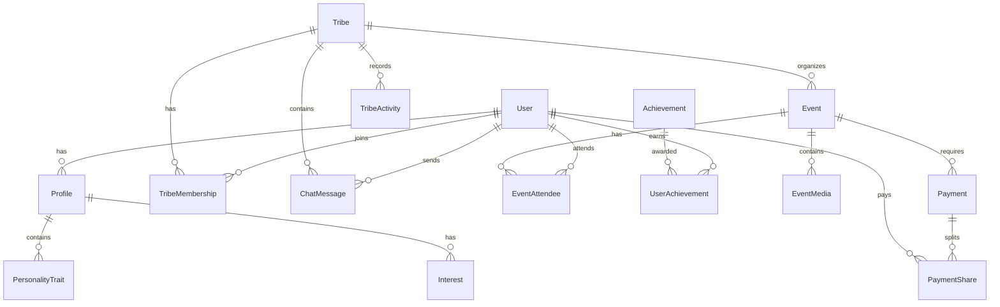

# Tribe Platform Data Model Architecture

## Introduction

This document provides a comprehensive overview of the data model architecture for the Tribe platform. The data model is designed to support the core functionality of creating meaningful small-group connections (4-8 people) and facilitating the transition from digital to physical interactions. The database schema is implemented using PostgreSQL with Prisma ORM for type-safe database access.

## Database Technology Stack

The Tribe platform uses the following database technologies:

### Primary Database

PostgreSQL 15+ is used as the primary relational database for its robust support of complex relationships, ACID compliance, and advanced query capabilities. PostgreSQL was chosen for its ability to handle the complex social relationships and group dynamics central to the Tribe platform.

### Extensions

The following PostgreSQL extensions are utilized:
- PostGIS: For location-based queries and geospatial functionality
- uuid-ossp: For UUID generation
- pg_trgm: For text search and similarity matching

### ORM

Prisma 4.16+ serves as the Object-Relational Mapping (ORM) layer, providing type-safe database access with migration support. Prisma was selected for its TypeScript integration, schema-based approach, and developer-friendly API.

### Supplementary Storage

In addition to PostgreSQL, the platform uses:
- Redis: For caching, session storage, and real-time features
- Amazon S3: For media storage (user uploads, profile images)
- ElasticSearch: For advanced search capabilities
- TimescaleDB: For time-series data (engagement metrics, activity tracking)

## Core Entity Relationships

The data model is organized around several core entities that form the foundation of the Tribe platform. The following diagram illustrates the high-level relationships between these entities:

### User Domain

The User domain encompasses all user-related entities:
- User: Core user account information including authentication details
- Profile: User profile information including demographics and preferences
- PersonalityTrait: Personality characteristics based on the OCEAN model
- Interest: User interests categorized by type and intensity level

### Tribe Domain

The Tribe domain represents the group-based entities:
- Tribe: Small groups of 4-8 users with shared interests
- TribeMembership: Relationship between users and tribes
- TribeInterest: Interests associated with a tribe
- TribeActivity: Record of activities within a tribe
- ChatMessage: Messages exchanged within a tribe
- TribeGoal: Goals set by tribe members

### Event Domain

The Event domain covers all event-related entities:
- Event: Planned meetups organized by tribes
- EventAttendee: User attendance and RSVP information
- Venue: Physical locations where events take place
- EventMedia: Photos and other media associated with events
- EventSuggestion: AI-generated event recommendations

### Payment Domain

The Payment domain handles financial transactions:
- PaymentMethod: User payment methods
- Transaction: Financial transactions for events
- PaymentSplit: Expense sharing between tribe members
- PaymentShare: Individual portions of a split payment

### Engagement Domain

The Engagement domain focuses on user engagement and gamification:
- Achievement: Defined accomplishments users can earn
- UserAchievement: Record of achievements earned by users
- Notification: System notifications for users

## Detailed Entity Descriptions

This section provides detailed descriptions of each entity in the data model, including key fields, relationships, and purpose.

### User Entities

Core entities related to user accounts and profiles.

#### User

**Description**: Represents a user account in the system

**Key Fields**:
- id (UUID): Primary identifier for the user
- email (String): User's email address (unique)
- passwordHash (String): Hashed password for local authentication
- role (UserRole): User's role in the system (USER, ADMIN, etc.)
- status (UserStatus): Account status (ACTIVE, PENDING, etc.)
- authProvider (AuthProvider): Authentication provider (LOCAL, GOOGLE, etc.)
- isVerified (Boolean): Whether the user's email is verified

**Relationships**:
- Profile (one-to-one): User's profile information
- TribeMembership (one-to-many): Tribes the user belongs to
- Tribe (one-to-many): Tribes created by the user
- Event (one-to-many): Events created by the user
- EventAttendee (one-to-many): Events the user is attending

#### Profile

**Description**: Contains user profile information and preferences

**Key Fields**:
- id (UUID): Primary identifier for the profile
- userId (UUID): Reference to the associated user
- name (String): User's display name
- bio (String): User's biography or description
- location (String): User's location name
- latitude (Float): Latitude coordinate
- longitude (Float): Longitude coordinate
- communicationStyle (CommunicationStyle): User's preferred communication style
- maxTravelDistance (Integer): Maximum distance user is willing to travel

**Relationships**:
- User (many-to-one): User this profile belongs to
- PersonalityTrait (one-to-many): User's personality traits
- Interest (one-to-many): User's interests

#### PersonalityTrait

**Description**: Represents a specific personality trait measurement for a user

**Key Fields**:
- id (UUID): Primary identifier
- profileId (UUID): Reference to the user profile
- trait (PersonalityTraitType): Type of personality trait (OPENNESS, CONSCIENTIOUSNESS, etc.)
- score (Decimal): Numerical score for this trait (0-100)
- assessedAt (DateTime): When this trait was assessed

**Relationships**:
- Profile (many-to-one): Profile this trait belongs to

#### Interest

**Description**: Represents a user's interest in a specific category

**Key Fields**:
- id (UUID): Primary identifier
- profileId (UUID): Reference to the user profile
- category (InterestCategory): Category of interest (OUTDOOR_ADVENTURES, FOOD_DINING, etc.)
- name (String): Specific name of the interest
- level (InterestLevel): Level of interest (LOW, MEDIUM, HIGH)

**Relationships**:
- Profile (many-to-one): Profile this interest belongs to

### Tribe Entities

Entities related to tribes and group interactions.

#### Tribe

**Description**: Represents a small group of 4-8 users with shared interests

**Key Fields**:
- id (UUID): Primary identifier
- name (String): Name of the tribe
- description (String): Description of the tribe's purpose
- location (String): General location of the tribe
- latitude (Float): Latitude coordinate
- longitude (Float): Longitude coordinate
- status (TribeStatus): Current status (FORMING, ACTIVE, etc.)
- privacy (TribePrivacy): Privacy setting (PUBLIC, PRIVATE)
- maxMembers (Integer): Maximum number of members (default 8)
- createdBy (UUID): Reference to the creator user

**Relationships**:
- User (many-to-one): User who created the tribe
- TribeMembership (one-to-many): Members of the tribe
- TribeInterest (one-to-many): Interests associated with the tribe
- TribeActivity (one-to-many): Activities within the tribe
- ChatMessage (one-to-many): Messages exchanged in the tribe
- Event (one-to-many): Events organized by the tribe

#### TribeMembership

**Description**: Represents a user's membership in a tribe

**Key Fields**:
- id (UUID): Primary identifier
- tribeId (UUID): Reference to the tribe
- userId (UUID): Reference to the user
- role (MemberRole): Role in the tribe (CREATOR, MEMBER)
- status (MembershipStatus): Status of membership (ACTIVE, PENDING, etc.)
- joinedAt (DateTime): When the user joined the tribe
- lastActive (DateTime): When the user was last active in the tribe

**Relationships**:
- Tribe (many-to-one): Tribe this membership belongs to
- User (many-to-one): User who is a member

#### TribeInterest

**Description**: Represents an interest associated with a tribe

**Key Fields**:
- id (UUID): Primary identifier
- tribeId (UUID): Reference to the tribe
- category (InterestCategory): Category of interest
- name (String): Specific name of the interest
- isPrimary (Boolean): Whether this is a primary interest for the tribe

**Relationships**:
- Tribe (many-to-one): Tribe this interest belongs to

#### TribeActivity

**Description**: Records activities that occur within a tribe

**Key Fields**:
- id (UUID): Primary identifier
- tribeId (UUID): Reference to the tribe
- userId (UUID): Reference to the user who performed the activity
- activityType (ActivityType): Type of activity (MEMBER_JOINED, EVENT_CREATED, etc.)
- description (String): Description of the activity
- timestamp (DateTime): When the activity occurred
- metadata (JSON): Additional data about the activity

**Relationships**:
- Tribe (many-to-one): Tribe where the activity occurred
- User (many-to-one): User who performed the activity

#### ChatMessage

**Description**: Represents a message sent within a tribe's chat

**Key Fields**:
- id (UUID): Primary identifier
- tribeId (UUID): Reference to the tribe
- userId (UUID): Reference to the sender (null for system messages)
- content (String): Message content
- messageType (MessageType): Type of message (TEXT, IMAGE, AI_PROMPT, etc.)
- sentAt (DateTime): When the message was sent
- isRead (Boolean): Whether the message has been read
- metadata (JSON): Additional data about the message

**Relationships**:
- Tribe (many-to-one): Tribe where the message was sent
- User (many-to-one): User who sent the message

#### TribeGoal

**Description**: Represents a goal set by a tribe

**Key Fields**:
- id (UUID): Primary identifier
- tribeId (UUID): Reference to the tribe
- title (String): Title of the goal
- description (String): Description of the goal
- createdBy (UUID): Reference to the user who created the goal
- targetDate (DateTime): Target date for completing the goal
- isCompleted (Boolean): Whether the goal has been completed
- completedAt (DateTime): When the goal was completed

**Relationships**:
- Tribe (many-to-one): Tribe this goal belongs to
- User (many-to-one): User who created the goal

### Event Entities

Entities related to event planning and execution.

#### Event

**Description**: Represents a planned meetup or activity

**Key Fields**:
- id (UUID): Primary identifier
- name (String): Name of the event
- description (String): Description of the event
- tribeId (UUID): Reference to the organizing tribe
- createdBy (UUID): Reference to the creator user
- eventType (EventType): Type of event (IN_PERSON, VIRTUAL, HYBRID)
- status (EventStatus): Status of the event (SCHEDULED, ACTIVE, etc.)
- startTime (DateTime): When the event starts
- endTime (DateTime): When the event ends
- location (String): Location name
- latitude (Float): Latitude coordinate
- longitude (Float): Longitude coordinate
- venueId (UUID): Reference to the venue
- weatherData (JSON): Weather forecast for the event
- cost (Decimal): Cost of the event
- paymentRequired (Boolean): Whether payment is required to attend

**Relationships**:
- Tribe (many-to-one): Tribe organizing the event
- User (many-to-one): User who created the event
- Venue (many-to-one): Venue where the event takes place
- EventAttendee (one-to-many): Users attending the event
- EventMedia (one-to-many): Media associated with the event
- Transaction (one-to-many): Payments for the event
- PaymentSplit (one-to-many): Payment splits for the event

#### EventAttendee

**Description**: Represents a user's attendance at an event

**Key Fields**:
- id (UUID): Primary identifier
- eventId (UUID): Reference to the event
- userId (UUID): Reference to the user
- rsvpStatus (RSVPStatus): RSVP status (GOING, MAYBE, etc.)
- rsvpTime (DateTime): When the RSVP was made
- hasCheckedIn (Boolean): Whether the user has checked in
- checkedInAt (DateTime): When the user checked in
- paymentStatus (PaymentStatus): Status of payment (if required)

**Relationships**:
- Event (many-to-one): Event being attended
- User (many-to-one): User attending the event

#### Venue

**Description**: Represents a physical location where events can take place

**Key Fields**:
- id (UUID): Primary identifier
- name (String): Name of the venue
- address (String): Physical address
- latitude (Float): Latitude coordinate
- longitude (Float): Longitude coordinate
- placeId (String): External place ID (e.g., Google Places)
- website (String): Website URL
- phoneNumber (String): Contact phone number
- capacity (Integer): Maximum capacity
- priceLevel (Integer): Price level (1-5)
- rating (Decimal): Average rating (0-5)

**Relationships**:
- Event (one-to-many): Events held at this venue
- EventSuggestion (one-to-many): Event suggestions for this venue

#### EventMedia

**Description**: Represents media associated with an event

**Key Fields**:
- id (UUID): Primary identifier
- eventId (UUID): Reference to the event
- type (String): Type of media (image, video, etc.)
- url (String): URL to the media file
- uploadedBy (UUID): Reference to the user who uploaded the media
- uploadedAt (DateTime): When the media was uploaded

**Relationships**:
- Event (many-to-one): Event this media belongs to
- User (many-to-one): User who uploaded the media

#### EventSuggestion

**Description**: Represents an AI-generated event suggestion

**Key Fields**:
- id (UUID): Primary identifier
- tribeId (UUID): Reference to the target tribe
- name (String): Suggested event name
- description (String): Suggested event description
- category (InterestCategory): Category of the suggested event
- suggestedDate (DateTime): Suggested date and time
- location (String): Suggested location
- venueId (UUID): Reference to a suggested venue
- estimatedCost (Decimal): Estimated cost
- weatherDependent (Boolean): Whether the suggestion depends on weather
- status (String): Status of the suggestion (PENDING, ACCEPTED, etc.)
- convertedToEventId (UUID): Reference to the created event (if accepted)

**Relationships**:
- Tribe (many-to-one): Tribe receiving the suggestion
- Venue (many-to-one): Suggested venue
- Event (many-to-one): Event created from this suggestion

### Payment Entities

Entities related to payments and financial transactions.

#### PaymentMethod

**Description**: Represents a user's payment method

**Key Fields**:
- id (UUID): Primary identifier
- userId (UUID): Reference to the user
- provider (PaymentProvider): Payment provider (STRIPE, VENMO, etc.)
- type (PaymentMethodType): Type of payment method (CREDIT_CARD, BANK_ACCOUNT, etc.)
- token (String): Tokenized payment method information
- last4 (String): Last 4 digits (for cards)
- isDefault (Boolean): Whether this is the default payment method

**Relationships**:
- User (many-to-one): User who owns this payment method
- Transaction (one-to-many): Transactions using this payment method

#### Transaction

**Description**: Represents a financial transaction

**Key Fields**:
- id (UUID): Primary identifier
- type (TransactionType): Type of transaction (EVENT_PAYMENT, SPLIT_PAYMENT, etc.)
- status (TransactionStatus): Status of the transaction (COMPLETED, FAILED, etc.)
- amount (Decimal): Transaction amount
- currency (String): Currency code (USD, etc.)
- description (String): Description of the transaction
- userId (UUID): Reference to the user
- paymentMethodId (UUID): Reference to the payment method used
- provider (PaymentProvider): Payment provider used
- providerTransactionId (String): Transaction ID from the provider
- eventId (UUID): Reference to the associated event
- splitId (UUID): Reference to the associated payment split

**Relationships**:
- User (many-to-one): User who made the transaction
- PaymentMethod (many-to-one): Payment method used
- Event (many-to-one): Event associated with the transaction
- PaymentSplit (many-to-one): Payment split associated with the transaction
- PaymentShare (one-to-one): Payment share this transaction fulfills

#### PaymentSplit

**Description**: Represents a shared expense between tribe members

**Key Fields**:
- id (UUID): Primary identifier
- eventId (UUID): Reference to the associated event
- createdBy (UUID): Reference to the user who created the split
- description (String): Description of the expense
- totalAmount (Decimal): Total amount to be split
- currency (String): Currency code (USD, etc.)
- splitType (SplitType): How the amount is split (EQUAL, PERCENTAGE, etc.)
- status (SplitStatus): Status of the split (PENDING, COMPLETED, etc.)
- dueDate (DateTime): When payments are due

**Relationships**:
- Event (many-to-one): Event associated with this split
- User (many-to-one): User who created the split
- PaymentShare (one-to-many): Individual shares of this split
- Transaction (one-to-many): Transactions associated with this split

#### PaymentShare

**Description**: Represents an individual's share of a split payment

**Key Fields**:
- id (UUID): Primary identifier
- splitId (UUID): Reference to the payment split
- userId (UUID): Reference to the user
- amount (Decimal): Amount this user owes
- percentage (Decimal): Percentage of the total (for percentage splits)
- status (PaymentStatus): Status of this share (PENDING, COMPLETED, etc.)
- transactionId (UUID): Reference to the fulfilling transaction

**Relationships**:
- PaymentSplit (many-to-one): Split this share belongs to
- User (many-to-one): User responsible for this share
- Transaction (one-to-one): Transaction that fulfills this share

### Engagement Entities

Entities related to user engagement and gamification.

#### Achievement

**Description**: Represents a defined achievement that users can earn

**Key Fields**:
- id (UUID): Primary identifier
- name (String): Name of the achievement
- description (String): Description of how to earn the achievement
- category (String): Category of achievement
- pointValue (Integer): Points awarded for earning this achievement
- iconUrl (String): URL to the achievement icon
- criteria (JSON): Criteria for earning the achievement

**Relationships**:
- UserAchievement (one-to-many): Instances of users earning this achievement

#### UserAchievement

**Description**: Represents an achievement earned by a user

**Key Fields**:
- id (UUID): Primary identifier
- userId (UUID): Reference to the user
- achievementId (UUID): Reference to the achievement
- awardedAt (DateTime): When the achievement was awarded
- metadata (JSON): Additional data about how the achievement was earned

**Relationships**:
- User (many-to-one): User who earned the achievement
- Achievement (many-to-one): Achievement that was earned

#### Notification

**Description**: Represents a notification sent to a user

**Key Fields**:
- id (UUID): Primary identifier
- userId (UUID): Reference to the recipient user
- type (String): Type of notification
- title (String): Notification title
- body (String): Notification content
- isRead (Boolean): Whether the notification has been read
- data (JSON): Additional data for the notification
- createdAt (DateTime): When the notification was created
- expiresAt (DateTime): When the notification expires

**Relationships**:
- User (many-to-one): User receiving the notification

## Enumerations

This section documents the key enumerations used throughout the data model.

### User Enumerations

Enumerations related to user accounts and profiles.

- **UserRole**: USER, TRIBE_CREATOR, ADMIN  
  *Defines the possible roles a user can have in the system*

- **UserStatus**: PENDING, ACTIVE, INACTIVE, SUSPENDED, DELETED  
  *Defines the possible states of a user account*

- **AuthProvider**: LOCAL, GOOGLE, APPLE, FACEBOOK  
  *Defines the authentication providers supported by the system*

- **PersonalityTraitType**: OPENNESS, CONSCIENTIOUSNESS, EXTRAVERSION, AGREEABLENESS, NEUROTICISM  
  *Defines the Big Five personality traits (OCEAN model)*

- **CommunicationStyle**: DIRECT, THOUGHTFUL, SUPPORTIVE, ANALYTICAL, EXPRESSIVE  
  *Defines communication style preferences*

- **InterestCategory**: OUTDOOR_ADVENTURES, ARTS_CULTURE, FOOD_DINING, SPORTS_FITNESS, GAMES_ENTERTAINMENT, LEARNING_EDUCATION, TECHNOLOGY, WELLNESS_MINDFULNESS  
  *Defines categories of interests for users and tribes*

- **InterestLevel**: LOW, MEDIUM, HIGH  
  *Defines the level of interest in a particular category*

### Tribe Enumerations

Enumerations related to tribes and group interactions.

- **TribeStatus**: FORMING, ACTIVE, AT_RISK, INACTIVE, DISSOLVED  
  *Defines the possible states of a tribe throughout its lifecycle*

- **TribePrivacy**: PUBLIC, PRIVATE  
  *Defines the privacy settings for a tribe*

- **MemberRole**: CREATOR, MEMBER  
  *Defines the possible roles a user can have within a tribe*

- **MembershipStatus**: PENDING, ACTIVE, INACTIVE, REMOVED, LEFT  
  *Defines the possible states of a user's membership in a tribe*

- **ActivityType**: TRIBE_CREATED, MEMBER_JOINED, MEMBER_LEFT, EVENT_CREATED, EVENT_COMPLETED, AI_SUGGESTION, CHALLENGE_CREATED, CHALLENGE_COMPLETED  
  *Defines the types of activities that can occur within a tribe*

- **MessageType**: TEXT, IMAGE, SYSTEM, AI_PROMPT, EVENT  
  *Defines the types of messages that can be sent in tribe chats*

### Event Enumerations

Enumerations related to events and meetups.

- **EventStatus**: DRAFT, SCHEDULED, ACTIVE, COMPLETED, CANCELLED  
  *Defines the possible states of an event throughout its lifecycle*

- **EventType**: IN_PERSON, VIRTUAL, HYBRID  
  *Defines the types of events that can be created*

- **EventVisibility**: TRIBE_ONLY, PUBLIC  
  *Defines the visibility settings for events*

- **RSVPStatus**: GOING, MAYBE, NOT_GOING, NO_RESPONSE  
  *Defines the possible RSVP statuses for event attendees*

### Payment Enumerations

Enumerations related to payments and financial transactions.

- **PaymentProvider**: STRIPE, VENMO, MANUAL  
  *Defines the payment providers supported by the system*

- **PaymentMethodType**: CREDIT_CARD, DEBIT_CARD, BANK_ACCOUNT, VENMO_BALANCE, CASH  
  *Defines the types of payment methods*

- **TransactionType**: EVENT_PAYMENT, SPLIT_PAYMENT, REFUND  
  *Defines the types of financial transactions*

- **TransactionStatus**: INITIATED, PROCESSING, COMPLETED, FAILED, REFUNDED, CANCELLED  
  *Defines the possible states of a transaction*

- **SplitType**: EQUAL, PERCENTAGE, CUSTOM  
  *Defines how a payment is split among users*

- **SplitStatus**: PENDING, PARTIAL, COMPLETED, CANCELLED  
  *Defines the possible states of a payment split*

- **PaymentStatus**: NOT_REQUIRED, PENDING, COMPLETED, FAILED  
  *Defines the possible states of a payment*

## Data Access Patterns

This section describes common data access patterns and optimization strategies for the Tribe platform.

### Common Access Patterns

The most frequent data access patterns in the Tribe platform include:

1. **User Profile Retrieval**
   - Description: Fetching a user's profile with personality traits and interests
   - Optimization: Indexed by userId with eager loading of related entities

2. **Tribe Discovery**
   - Description: Searching for tribes based on location, interests, and availability
   - Optimization: Geospatial indexing, full-text search on name/description, composite indexes on interests

3. **Tribe Detail View**
   - Description: Fetching a tribe with its members, activities, and upcoming events
   - Optimization: Indexed by tribeId with selective loading of related entities

4. **Event Discovery**
   - Description: Finding events based on date range, location, and interests
   - Optimization: Composite indexes on date and location, filtered by tribe membership

5. **Chat History**
   - Description: Retrieving recent messages for a tribe's chat
   - Optimization: Indexed by tribeId and sentAt, with pagination

6. **AI Matchmaking**
   - Description: Finding compatible users for tribe formation
   - Optimization: Materialized views of compatibility scores, batch processing

### Indexing Strategy

The following indexes are implemented to optimize common queries:

**User Table**
- email_idx (BTREE): User lookup by email
- auth_provider_idx (BTREE): Social login lookup

**Profile Table**
- user_id_idx (BTREE): Profile lookup by user
- location_idx (GIST): Geospatial queries

**Tribe Table**
- tribe_name_idx (BTREE): Tribe lookup by name
- tribe_status_idx (BTREE): Filtering by status
- tribe_location_idx (GIST): Geospatial queries

**TribeMembership Table**
- membership_user_idx (BTREE): Finding a user's tribes
- tribe_user_unique (UNIQUE): Ensuring unique membership

**Event Table**
- event_tribe_idx (BTREE): Finding a tribe's events
- event_start_time_idx (BTREE): Date-based filtering
- event_location_idx (GIST): Geospatial queries

**ChatMessage Table**
- chat_sent_at_idx (BTREE): Chronological message retrieval

### Caching Strategy

The following caching strategies are implemented to improve performance:

1. **User Profile Caching**
   - Implementation: Redis cache with 24-hour TTL
   - Invalidation: On profile update

2. **Tribe Data Caching**
   - Implementation: Redis cache with 1-hour TTL
   - Invalidation: On tribe update or membership change

3. **Event Listing Caching**
   - Implementation: Redis cache with 15-minute TTL
   - Invalidation: On event creation, update, or RSVP change

4. **Chat Message Caching**
   - Implementation: Redis cache with message count limit
   - Invalidation: On new message or read status change

5. **Location Data Caching**
   - Implementation: Redis geospatial features
   - Invalidation: Time-based expiration (24 hours)

6. **Authentication Token Caching**
   - Implementation: Redis with token-based keys
   - Invalidation: On logout or token expiration

## Data Flow Diagrams

This section illustrates key data flows within the Tribe platform.

### User Registration and Profile Creation

Flow of data during user registration and profile creation process:

1. User submits registration information (email, password)
2. System creates User record with PENDING status
3. System sends verification email
4. User verifies email, status changes to ACTIVE
5. User completes personality assessment
6. System creates Profile record
7. System creates PersonalityTrait records based on assessment
8. User selects interests
9. System creates Interest records
10. Profile is now complete and ready for matchmaking

### Tribe Formation

Flow of data during AI-powered tribe formation process:

1. User opts in for auto-matching
2. System retrieves eligible user profiles
3. AI analyzes personality traits and interests
4. System identifies compatible users
5. System creates new Tribe record
6. System creates TribeMembership records for each matched user
7. System creates TribeInterest records based on shared interests
8. System creates TribeActivity records for tribe creation
9. System sends notifications to all matched users
10. Users can accept or decline the tribe invitation

### Event Planning and Execution

Flow of data during event planning and execution process:

1. User or AI initiates event creation
2. System creates Event record with DRAFT status
3. System queries external APIs for venue and weather data
4. System updates Event with additional details
5. Event status changes to SCHEDULED
6. System creates EventAttendee records for tribe members
7. Members update their RSVP status
8. If payment required, system creates PaymentSplit and PaymentShare records
9. Members make payments, creating Transaction records
10. On event day, members check in, updating EventAttendee records
11. After event, status changes to COMPLETED
12. System awards achievements based on participation

### AI Engagement Flow

Flow of data during AI-driven engagement processes:

1. System monitors tribe activity levels
2. For inactive tribes, AI generates engagement prompts
3. System creates ChatMessage with AI_PROMPT type
4. System sends notifications to tribe members
5. Members respond, creating regular ChatMessage records
6. AI analyzes responses and generates follow-up prompts
7. System tracks engagement metrics
8. AI suggests real-world activities based on conversation
9. System creates EventSuggestion records
10. If accepted, suggestion converts to an Event

## Data Migration Strategy

This section outlines the approach to database schema evolution and data migration.

### Schema Evolution

The Tribe platform uses Prisma Migrate for schema evolution with the following principles:

- All schema changes are version-controlled in the repository
- Migrations are created using Prisma Migrate and reviewed before application
- Backward compatibility is maintained whenever possible
- Breaking changes require a migration plan with data transformation
- All migrations are tested in development and staging environments before production
- Rollback plans are created for complex migrations

### Migration Process

The migration process follows these steps:

1. Developer updates schema.prisma file with changes
2. Prisma Migrate generates migration files
3. Migration is tested in development environment
4. Migration is reviewed by team members
5. Migration is applied to staging environment and tested
6. Migration is scheduled for production deployment
7. Migration is applied during maintenance window
8. Verification tests confirm successful migration

### Data Transformation

For migrations requiring data transformation, the following approaches are used:

- Simple transformations are included in migration files
- Complex transformations use separate scripts
- Large data transformations are performed in batches
- Temporary tables are used for complex restructuring
- Data validation is performed before and after transformation

## Performance Considerations

This section outlines key performance considerations for the data model.

### Query Optimization

Strategies for optimizing database queries:

- Use appropriate indexes for common query patterns
- Implement query parameterization to leverage prepared statements
- Use pagination for large result sets
- Implement denormalization for frequently accessed data
- Use materialized views for complex aggregations
- Optimize joins with appropriate indexes
- Use database-specific features like PostgreSQL's JSONB for flexible data

### Connection Pooling

Connection pooling configuration for optimal database performance:

- min_connections: 5
- max_connections: 20
- idle_timeout: 10000
- connection_timeout: 3000
- strategy: Maintain a balance between resource utilization and availability

### Scaling Considerations

Approaches for scaling the database as the platform grows:

- Vertical scaling for initial growth phases
- Read replicas for read-heavy workloads
- Sharding by tribe ID for very large deployments
- Caching layer to reduce database load
- Archiving historical data to maintain performance

## Security and Compliance

This section outlines data security and compliance considerations.

### Data Classification

Classification of data types by sensitivity:

| Level | Data Types | Protection |
|-------|------------|------------|
| Highly Sensitive | Authentication credentials, Payment information, Personality assessment data | Encryption at rest and in transit, field-level encryption, access logging |
| Sensitive | Personal contact information, Location data, Private messages | Encryption at rest and in transit, role-based access control |
| Internal | Tribe information, Event details, User interests | Standard access controls, encryption in transit |
| Public | Public tribe listings, Public event information | Integrity controls |

### Data Protection Measures

Measures implemented to protect sensitive data:

- Encryption of sensitive data at rest using AES-256
- TLS 1.3 for all data in transit
- Field-level encryption for highly sensitive data
- Role-based access control for database access
- Audit logging for sensitive data access
- Data minimization principles applied throughout the model
- Automated data retention and purging policies

### Compliance Considerations

Key compliance requirements addressed in the data model:

**GDPR**
- Right to be forgotten implemented via soft deletion and anonymization
- Data portability supported through export APIs
- Consent tracking for marketing and analytics
- Data minimization principles applied throughout

**CCPA**
- Data inventory and classification
- User data access and deletion capabilities
- Opt-out mechanisms for data sharing
- Tracking of data sharing with third parties

**PCI DSS**
- Tokenization of payment information
- Scope reduction by using third-party payment processors
- Secure handling of payment-related data
- Audit trails for payment transactions

## Conclusion

The Tribe platform's data model is designed to support the core functionality of creating meaningful small-group connections and facilitating the transition from digital to physical interactions. The model balances performance, security, and flexibility to accommodate the platform's AI-powered matchmaking and engagement features. As the platform evolves, the data model will continue to be refined based on usage patterns and performance metrics.