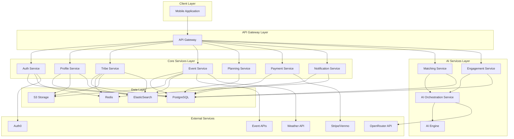
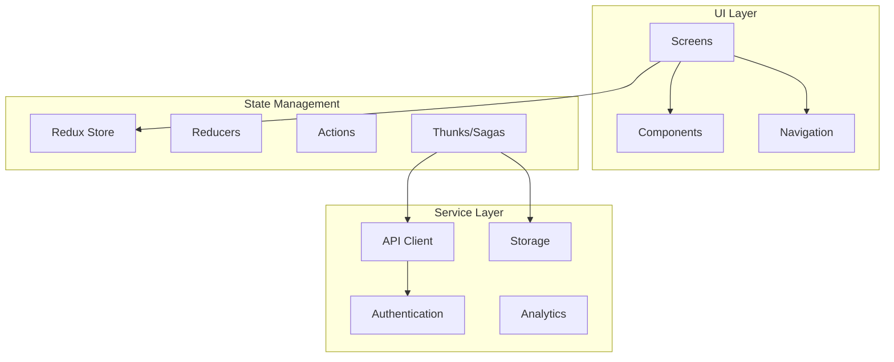
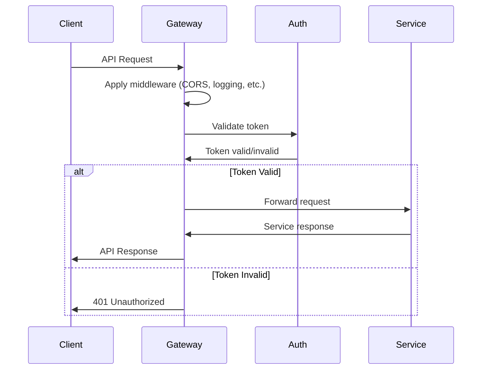
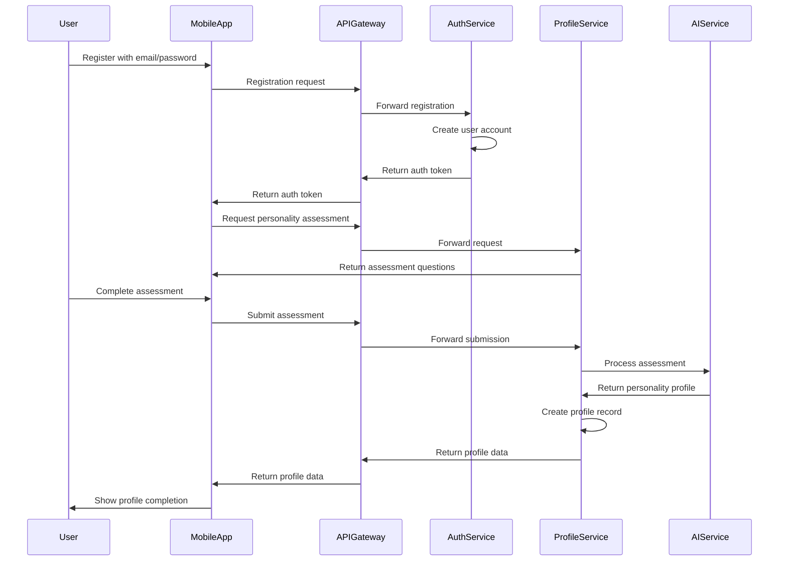
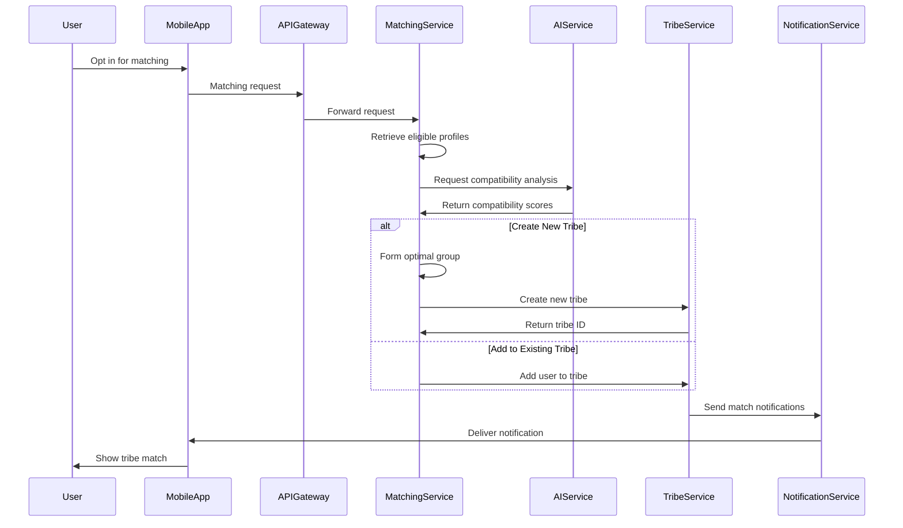
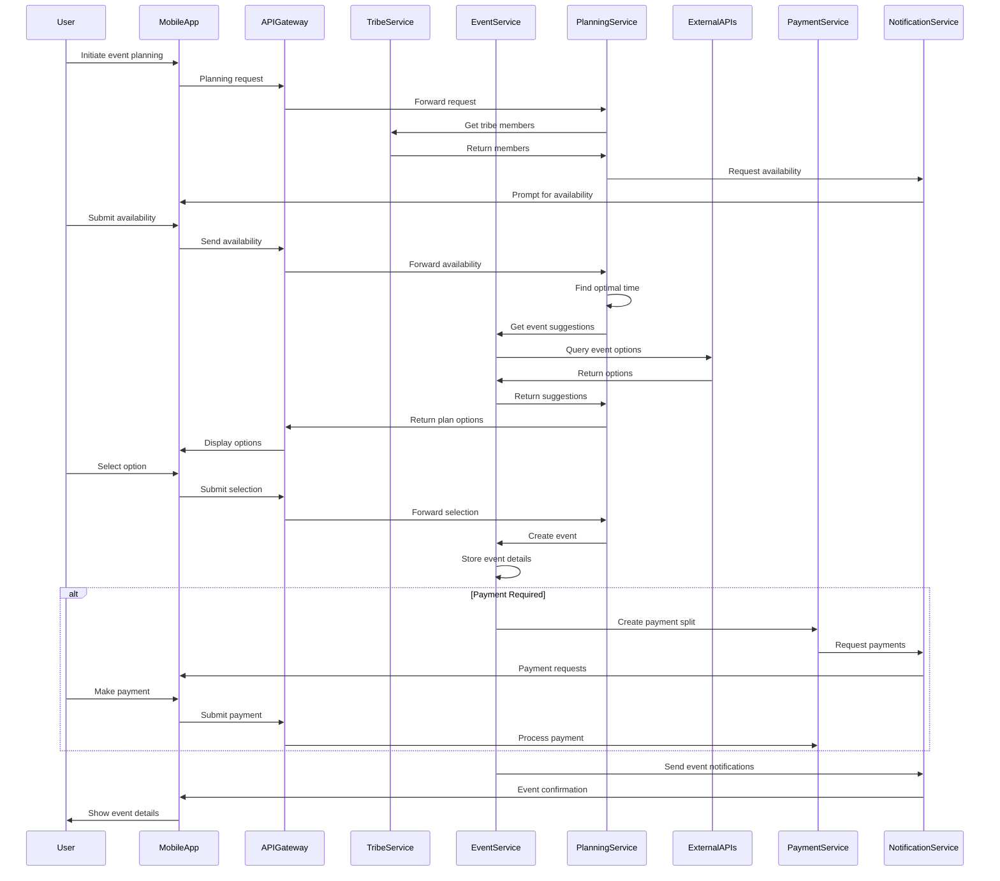
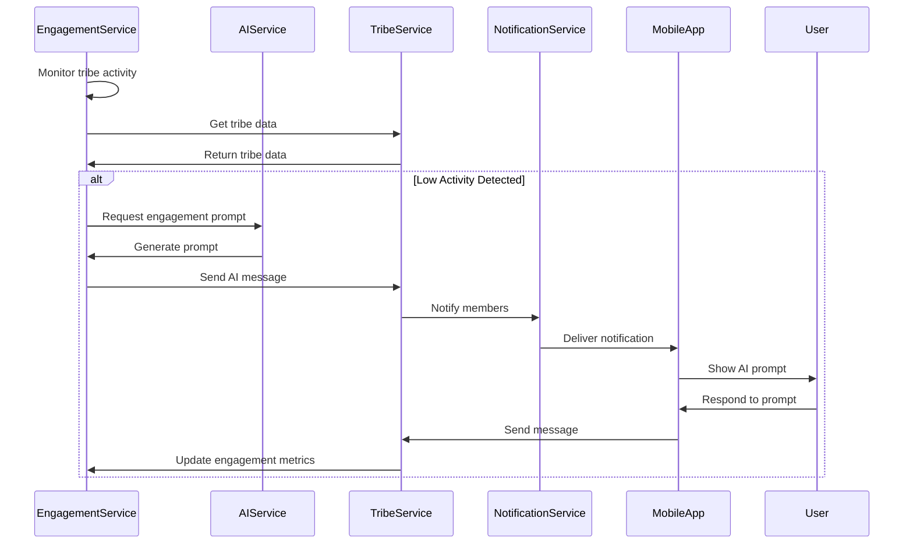

# 1. Introduction

This document provides a comprehensive overview of the Tribe platform's architecture. Tribe is an AI-powered matchmaking and engagement platform designed to create and sustain meaningful small-group connections (4-8 people) and encourage users to transition from digital to physical interactions.

The architecture is designed to support the platform's core value proposition of creating meaningful connections through AI-powered matchmaking, personality-based user profiling, and engagement tools that facilitate real-world meetups.

## 1.1 Purpose and Scope

The purpose of this document is to provide a high-level overview of the Tribe platform's architecture, explaining the key design decisions, component structure, and implementation strategies. It serves as an entry point to more detailed documentation on specific aspects of the system.

This document covers:
- Architectural principles and patterns
- System component overview
- Communication patterns
- Data flow
- Integration points
- Deployment strategy
- Cross-cutting concerns

Detailed information about specific components can be found in the referenced documents.

## 1.2 Architectural Goals

The Tribe platform architecture is designed to achieve the following goals:

- **Scalability**: Enable independent scaling of components based on demand, particularly for AI-intensive operations
- **Flexibility**: Support rapid feature development and experimentation
- **Resilience**: Isolate failures to prevent system-wide outages
- **Performance**: Deliver responsive user experiences even under load
- **Security**: Protect sensitive user data and ensure secure communications
- **Maintainability**: Keep codebases modular and focused for easier maintenance
- **Observability**: Provide comprehensive monitoring and debugging capabilities

# 2. Architectural Overview

The Tribe platform follows a microservices architecture pattern, with a mobile-first approach for client applications. The system is composed of specialized services that communicate through well-defined APIs and messaging patterns.

## 2.1 High-Level Architecture


The architecture consists of the following layers:

- **Client Layer**: Mobile applications built with React Native for iOS and Android
- **API Gateway Layer**: Entry point for client requests, handling routing, authentication, and rate limiting
- **Core Services Layer**: Domain-specific microservices implementing the core business functionality
- **AI Services Layer**: Specialized services for AI-powered features like matchmaking and engagement
- **Data Layer**: Persistent storage and caching components
- **External Services**: Third-party services integrated into the platform

## 2.2 Key Components

The Tribe platform consists of the following key components:

| Component | Description | Primary Responsibilities |
|-----------|-------------|-------------------------|
| Mobile Application | React Native app for iOS and Android | User interface, local data caching, offline capabilities |
| API Gateway | Entry point for client requests | Request routing, authentication, rate limiting |
| Auth Service | User authentication and identity management | Registration, login, token management |
| Profile Service | User profile and personality data management | Profile CRUD, personality assessment processing |
| Tribe Service | Group formation and management | Tribe CRUD, membership management, chat functionality |
| Event Service | Event discovery and management | Event CRUD, discovery, recommendations |
| Planning Service | Event planning and coordination | Scheduling, availability collection, venue recommendations |
| Payment Service | Payment processing and expense tracking | Payment processing, expense splitting |
| Notification Service | Notification delivery and management | Push notifications, email, in-app notifications |
| Matching Service | AI-powered matchmaking | Compatibility analysis, tribe formation |
| Engagement Service | AI-driven engagement tools | Conversation prompts, challenges, activity suggestions |
| AI Orchestration Service | Coordination of AI capabilities | Model selection, prompt management, response processing |
| AI Engine | Specialized AI algorithms | Personality analysis, matching algorithms, recommendation generation |

Detailed information about each service can be found in the [Services Documentation](services.md).

## 2.3 Architectural Patterns

The Tribe platform implements several architectural patterns:

- **Microservices**: The system is decomposed into small, focused services organized around business capabilities
- **API Gateway**: A single entry point for all client requests, providing routing, authentication, and other cross-cutting concerns
- **Event-Driven Architecture**: Services communicate through events for asynchronous operations
- **CQRS (partial)**: Separation of read and write operations for performance-critical components
- **Circuit Breaker**: Preventing cascading failures when services or external dependencies fail
- **Bulkhead**: Isolating components to contain failures
- **Saga**: Managing distributed transactions across services
- **Service Mesh**: Managing service-to-service communication with observability and resilience features

# 3. Component Architecture

This section provides more detailed information about the key components of the Tribe platform.

## 3.1 Mobile Application

The mobile application is built with React Native to provide a consistent experience across iOS and Android platforms. It follows a mobile-first approach with offline capabilities.

**Key Features**:
- Cross-platform support (iOS and Android)
- Offline-first design with local data caching
- Push notification integration
- Native device feature access (camera, location, etc.)
- Responsive UI with platform-specific adaptations

**Technical Implementation**:
- React Native for cross-platform development
- Redux for state management
- React Navigation for navigation
- Offline support with local SQLite database
- TypeScript for type safety

**Architecture**:


## 3.2 API Gateway

The API Gateway serves as the entry point for all client requests, providing a unified interface to the backend services.

**Key Features**:
- Request routing to appropriate services
- Authentication and authorization
- Rate limiting and throttling
- Request/response transformation
- Logging and monitoring

**Technical Implementation**:
- Node.js with Express
- JWT validation for authentication
- Redis-based rate limiting
- HTTP proxy for service routing
- Helmet for security headers

**Request Flow**:


## 3.3 Core Services

The core services implement the primary business capabilities of the Tribe platform. Each service is responsible for a specific domain and owns the data and logic related to that domain.

**Common Service Structure**:
```
service/
├── src/
│   ├── config/           # Service configuration
│   ├── controllers/      # API endpoints
│   ├── models/           # Data models
│   ├── services/         # Business logic
│   ├── utils/            # Utility functions
│   ├── validations/      # Input validation
│   ├── middleware/       # Request processing middleware
│   └── index.ts          # Service entry point
├── tests/                # Unit and integration tests
├── Dockerfile            # Container definition
├── package.json          # Dependencies and scripts
└── tsconfig.json         # TypeScript configuration
```

**Technical Implementation**:
- Node.js with Express/Nest.js
- TypeScript for type safety
- Prisma ORM for database access
- Jest for testing
- Docker for containerization

Detailed information about each core service can be found in the [Services Documentation](services.md).

## 3.4 AI Services

The AI services provide the intelligence that powers the Tribe platform's core features. These services leverage AI models through the OpenRouter API and implement specialized algorithms for matchmaking, engagement, and recommendations.

**Key Components**:
- **Matching Service**: Implements AI-powered matchmaking for tribe formation
- **Engagement Service**: Generates AI-driven engagement prompts and monitors group activity
- **AI Orchestration Service**: Coordinates AI capabilities across the platform
- **AI Engine**: Provides specialized AI capabilities for the platform

**Technical Implementation**:
- AI Orchestration Service: Node.js with Express
- AI Engine: Python with FastAPI
- Integration with OpenRouter API for language models
- Redis for caching and rate limiting
- Specialized algorithms for matchmaking and recommendations

Detailed information about the AI architecture can be found in the [AI Integration Documentation](ai-integration.md).

## 3.5 Data Layer

The data layer provides persistent storage and caching capabilities for the Tribe platform.

**Key Components**:
- **PostgreSQL**: Primary relational database for structured data
- **Redis**: Caching, session storage, and real-time features
- **S3**: Object storage for media files
- **ElasticSearch**: Full-text search capabilities

**Data Model**:
The Tribe platform's data model is centered around several core entities:
- User: Core user account information
- Profile: User profile information including personality traits
- Tribe: Small groups of 4-8 users with shared interests
- Event: Planned meetups organized by tribes
- Chat: Communication between tribe members

Detailed information about the data model can be found in the [Data Model Documentation](data-model.md).

# 4. Communication Patterns

The Tribe platform implements various communication patterns to enable efficient interaction between components.

## 4.1 Synchronous Communication

Synchronous communication is used for direct request-response interactions where an immediate response is required.

**REST APIs**:
- Primary method for service-to-service communication
- JSON over HTTPS for data exchange
- Standardized error handling
- Versioned endpoints for backward compatibility

**Implementation**:
- Express.js/Nest.js for API implementation
- OpenAPI/Swagger for documentation
- Axios/node-fetch for client requests
- Circuit breakers for resilience

**Use Cases**:
- User authentication
- Profile retrieval
- Direct queries requiring immediate response

## 4.2 Asynchronous Communication

Asynchronous communication is used for operations that don't require an immediate response or for event-driven interactions.

**Message Queues**:
- RabbitMQ for reliable message delivery
- Queues for work distribution
- Dead letter queues for failed messages
- Message persistence for reliability

**Publish-Subscribe**:
- Redis Pub/Sub for real-time events
- Topic-based routing
- Multiple subscribers per event

**Implementation**:
- Bull for Redis-based job queues
- amqplib for RabbitMQ integration
- Event schemas for consistency

**Use Cases**:
- Notifications
- Background processing
- Cross-service events

## 4.3 Real-time Communication

Real-time communication is used for interactive features that require immediate updates to connected clients.

**WebSockets**:
- Socket.io for bidirectional communication
- Room-based grouping for tribe chats
- Presence tracking
- Reconnection handling

**Implementation**:
- Socket.io server integrated with Express
- Authentication middleware for secure connections
- Event-based message handling

**Use Cases**:
- Chat functionality
- Real-time notifications
- Collaborative features

## 4.4 Service Discovery

Service discovery enables services to locate and communicate with each other in a dynamic environment.

**Implementation Approaches**:
- **Environment Variables**: For simple deployments
- **DNS-based Discovery**: Using service names in Kubernetes
- **Service Registry**: Using Consul for more complex scenarios

**Current Implementation**:
- Kubernetes DNS for service discovery
- Service names as hostnames
- Health checks for availability monitoring

# 5. Data Flow

This section describes the key data flows within the Tribe platform.

## 5.1 User Registration and Profile Creation


This flow illustrates the process of user registration and profile creation, including the personality assessment that is central to the Tribe platform's matchmaking capabilities.

## 5.2 Tribe Formation


This flow illustrates the AI-powered matchmaking process that forms tribes based on compatibility analysis.

## 5.3 Event Planning and Execution


This flow illustrates the process of planning and executing an event, including availability collection, event suggestion, and payment processing.

## 5.4 AI-Driven Engagement


This flow illustrates how the AI-driven engagement features monitor tribe activity and generate prompts to maintain engagement.

# 6. Integration Points

The Tribe platform integrates with several external services to provide its core functionality.

## 6.1 External API Integrations

| Service | Purpose | Integration Method | Data Exchange |
|---------|---------|-------------------|---------------|
| OpenRouter API | AI capabilities | REST API | JSON requests/responses |
| Auth0 | Authentication | OAuth 2.0, API | User identity, tokens |
| Stripe/Venmo | Payment processing | API, webhooks | Payment information, confirmations |
| Eventbrite/Meetup | Event discovery | OAuth 2.0, API | Event data |
| Google Places | Venue information | API | Location data |
| OpenWeatherMap | Weather data | API | Weather forecasts |
| Firebase Cloud Messaging | Push notifications | API | Notification delivery |

## 6.2 Integration Patterns

The Tribe platform implements several integration patterns for external services:

**API Adapter Pattern**:
- Dedicated adapter classes for each external service
- Consistent interface for service consumers
- Error handling and retries
- Fallback mechanisms

**Webhook Handling**:
- Secure webhook endpoints for asynchronous updates
- Signature verification for authenticity
- Idempotent processing for reliability
- Event publication for internal consumers

**Caching Strategy**:
- Response caching for frequently accessed data
- TTL-based invalidation
- Stale-while-revalidate pattern
- Fallback to cached data during outages

## 6.3 Resilience Patterns

The Tribe platform implements several resilience patterns for external integrations:

**Circuit Breaker**:
- Prevents cascading failures when external services are unavailable
- Configurable thresholds and recovery periods
- Automatic recovery when service is restored

**Retry with Backoff**:
- Automatic retry for transient failures
- Exponential backoff to prevent overwhelming services
- Jitter to prevent thundering herd problem

**Fallback Mechanisms**:
- Default responses when services are unavailable
- Degraded functionality rather than complete failure
- Cached data as fallback

# 7. Deployment Architecture

The Tribe platform is deployed using containerization and orchestration to ensure scalability, reliability, and maintainability.

## 7.1 Containerization

All services are containerized using Docker:

**Base Images**:
- Node.js services: `node:18-alpine`
- Python services: `python:3.10-slim`

**Multi-stage Builds**:
- Separate build and runtime stages
- Minimal final images
- Development and production configurations

**Example Dockerfile**:
```dockerfile
# Build stage
FROM node:18-alpine AS build
WORKDIR /app
COPY package*.json ./
RUN npm ci
COPY . .
RUN npm run build

# Production stage
FROM node:18-alpine
WORKDIR /app
COPY --from=build /app/dist ./dist
COPY --from=build /app/node_modules ./node_modules
COPY --from=build /app/package*.json ./

EXPOSE 3000
CMD ["node", "dist/index.js"]
```

## 7.2 Orchestration

Services are deployed to Kubernetes for orchestration:

**Deployment Strategies**:
- **Stateless Services**: Deployment resources with multiple replicas
- **Stateful Services**: StatefulSet resources for ordered deployment
- **Background Jobs**: CronJob resources for scheduled tasks

**Scaling Strategies**:
- Horizontal Pod Autoscaler for automatic scaling
- Custom metrics for AI services
- Resource limits and requests for efficient allocation

**Configuration Management**:
- ConfigMaps for non-sensitive configuration
- Secrets for sensitive data
- Environment-specific configurations

## 7.3 Infrastructure

The Tribe platform is deployed on AWS infrastructure:

**Core Services**:
- Amazon EKS for Kubernetes orchestration
- Amazon RDS for PostgreSQL databases
- Amazon ElastiCache for Redis
- Amazon S3 for object storage
- Amazon CloudFront for CDN

**Networking**:
- VPC with public and private subnets
- NAT Gateway for outbound traffic
- Load Balancer for ingress traffic
- Security Groups for access control

**Monitoring and Logging**:
- Amazon CloudWatch for metrics and logs
- Prometheus and Grafana for detailed monitoring
- ELK stack for log aggregation and analysis

## 7.4 CI/CD Pipeline

The Tribe platform uses a CI/CD pipeline for automated testing and deployment:

**Pipeline Stages**:
1. Code checkout
2. Static analysis and linting
3. Unit testing
4. Build and package
5. Integration testing
6. Deployment to staging
7. End-to-end testing
8. Deployment to production

**Tools**:
- GitHub Actions for CI/CD
- Docker for containerization
- Kubernetes for orchestration
- Terraform for infrastructure as code
- Jest and Cypress for testing

# 8. Cross-Cutting Concerns

This section describes how the Tribe platform addresses cross-cutting concerns that affect multiple components.

## 8.1 Security

The Tribe platform implements a comprehensive security strategy:

**Authentication and Authorization**:
- JWT-based authentication
- Role-based access control
- OAuth 2.0 for social login
- Multi-factor authentication

**Data Protection**:
- Encryption at rest and in transit
- Field-level encryption for sensitive data
- Secure credential storage
- Data minimization principles

**API Security**:
- Input validation
- Rate limiting
- CORS protection
- Security headers

**Infrastructure Security**:
- Network segmentation
- Firewall rules
- Security groups
- Regular security updates

## 8.2 Logging and Monitoring

The Tribe platform implements comprehensive logging and monitoring:

**Logging Strategy**:
- Structured logging with JSON format
- Correlation IDs for request tracing
- Log levels for filtering
- Centralized log aggregation

**Monitoring**:
- Health checks for service availability
- Metrics collection for performance
- Alerting for anomalies
- Dashboards for visualization

**Observability**:
- Distributed tracing with OpenTelemetry
- Performance profiling
- Error tracking
- User experience monitoring

## 8.3 Error Handling

The Tribe platform implements a consistent error handling strategy:

**Error Types**:
- Operational errors (expected during normal operation)
- Programming errors (bugs)
- External service errors

**Error Response Format**:
```json
{
  "error": {
    "code": "RESOURCE_NOT_FOUND",
    "message": "The requested resource was not found",
    "details": { ... },
    "requestId": "abc123"
  }
}
```

**Error Handling Patterns**:
- Try-catch blocks for synchronous code
- Promise chains with .catch() for asynchronous code
- Global error handlers for unhandled errors
- Circuit breakers for external service errors

## 8.4 Performance Optimization

The Tribe platform implements several performance optimization strategies:

**Caching**:
- Response caching for frequently accessed data
- Distributed caching with Redis
- Client-side caching for mobile app

**Database Optimization**:
- Indexing for common queries
- Query optimization
- Connection pooling
- Read replicas for read-heavy workloads

**Network Optimization**:
- CDN for static assets
- Compression for API responses
- Batch requests for reducing round trips
- Persistent connections

## 8.5 Scalability

The Tribe platform is designed for scalability:

**Horizontal Scaling**:
- Stateless services for easy replication
- Load balancing for distribution
- Auto-scaling based on metrics

**Vertical Scaling**:
- Resource allocation based on workload
- Performance monitoring for bottlenecks

**Data Scalability**:
- Database sharding for large datasets
- Caching for read-heavy workloads
- Asynchronous processing for write-heavy workloads

# 9. Development Practices

This section describes the development practices used in the Tribe platform.

## 9.1 Code Organization

The Tribe platform follows a consistent code organization pattern:

**Directory Structure**:
```
service/
├── src/
│   ├── config/           # Service configuration
│   ├── controllers/      # API endpoints
│   │   ├── controller1.ts
│   │   └── index.ts
│   ├── models/           # Data models
│   │   ├── model1.ts
│   │   └── index.ts
│   ├── services/         # Business logic
│   │   ├── service1.ts
│   │   └── index.ts
│   ├── utils/            # Utility functions
│   │   ├── util1.ts
│   │   └── index.ts
│   ├── validations/      # Input validation
│   │   ├── validation1.ts
│   │   └── index.ts
│   ├── middleware/       # Request processing middleware
│   │   ├── middleware1.ts
│   │   └── index.ts
│   └── index.ts          # Service entry point
├── tests/                # Unit and integration tests
│   ├── unit/
│   └── integration/
├── Dockerfile            # Container definition
├── package.json          # Dependencies and scripts
└── tsconfig.json         # TypeScript configuration
```

**Module Pattern**:
- Each module exports its public interface
- Index files re-export from multiple files
- Clear separation of concerns

## 9.2 Testing Strategy

The Tribe platform implements a comprehensive testing strategy:

**Test Types**:
- Unit tests for individual functions and components
- Integration tests for service interactions
- End-to-end tests for complete user flows
- Performance tests for load and stress testing

**Testing Tools**:
- Jest for unit and integration testing
- Supertest for API testing
- Cypress for end-to-end testing
- Artillery for performance testing

**Test Coverage**:
- Minimum 80% code coverage for critical services
- CI/CD pipeline integration
- Pre-commit hooks for local testing

## 9.3 Documentation

The Tribe platform maintains comprehensive documentation:

**Code Documentation**:
- JSDoc/TSDoc comments for functions and classes
- README files for each service
- Architecture decision records (ADRs)

**API Documentation**:
- OpenAPI/Swagger specifications
- API reference documentation
- Example requests and responses

**System Documentation**:
- Architecture overview (this document)
- Service-specific documentation
- Data model documentation
- Deployment documentation

## 9.4 Version Control

The Tribe platform uses Git for version control:

**Branching Strategy**:
- Main branch for production code
- Development branch for integration
- Feature branches for new features
- Release branches for version preparation

**Commit Conventions**:
- Conventional Commits format
- Semantic versioning
- Automated changelog generation

**Code Review Process**:
- Pull request for all changes
- Required approvals before merging
- Automated checks (linting, tests, etc.)
- Code quality metrics

# 10. Future Directions

This section outlines planned future enhancements to the Tribe platform architecture.

## 10.1 Architecture Evolution

Planned architectural improvements:

- **Service Mesh**: Implementing a service mesh for enhanced observability and traffic management
- **GraphQL API**: Adding a GraphQL layer for more flexible client-server interactions
- **Event Sourcing**: Implementing event sourcing for critical domains to improve auditability and enable advanced analytics
- **Serverless Components**: Moving appropriate workloads to serverless architecture for improved scalability and cost efficiency

## 10.2 Technology Upgrades

Planned technology upgrades:

- **Node.js**: Upgrading to latest LTS version
- **TypeScript**: Adopting stricter type checking
- **React Native**: Upgrading to latest version for improved performance and features
- **Database**: Exploring advanced PostgreSQL features and extensions
- **AI Models**: Integrating with newer AI models as they become available

## 10.3 Feature Roadmap

Architectural implications of planned features:

- **Advanced Matchmaking**: Enhancing AI capabilities for more sophisticated matching
- **International Expansion**: Multi-region deployment and localization support
- **Enterprise Features**: Dedicated infrastructure for enterprise customers
- **Analytics Platform**: Comprehensive data analytics for business intelligence
- **Developer API**: Public API for third-party integrations

# 11. Conclusion

The Tribe platform architecture is designed to support the core value proposition of creating meaningful connections through AI-powered matchmaking, personality-based user profiling, and engagement tools that facilitate real-world meetups.

The microservices architecture provides the flexibility, scalability, and resilience needed to deliver these capabilities while enabling rapid feature development and experimentation. The separation of concerns between different services allows for independent scaling and evolution of components based on their specific requirements.

The integration of AI capabilities through the AI Orchestration Service and AI Engine provides the intelligence that powers the platform's core features, while the use of modern cloud infrastructure ensures reliable and scalable operation.

As the platform evolves, the architecture will continue to adapt to support new features and requirements while maintaining the core principles of scalability, flexibility, resilience, and maintainability.

# 12. References

- [Services Documentation](services.md): Detailed information about each microservice
- [Data Model Documentation](data-model.md): Detailed information about the data model
- [AI Integration Documentation](ai-integration.md): Detailed information about the AI architecture
- [API Documentation](../api): API reference documentation for each service
- [Deployment Documentation](../deployment): Information about deployment and infrastructure
- [Development Guidelines](../development): Guidelines for development practices