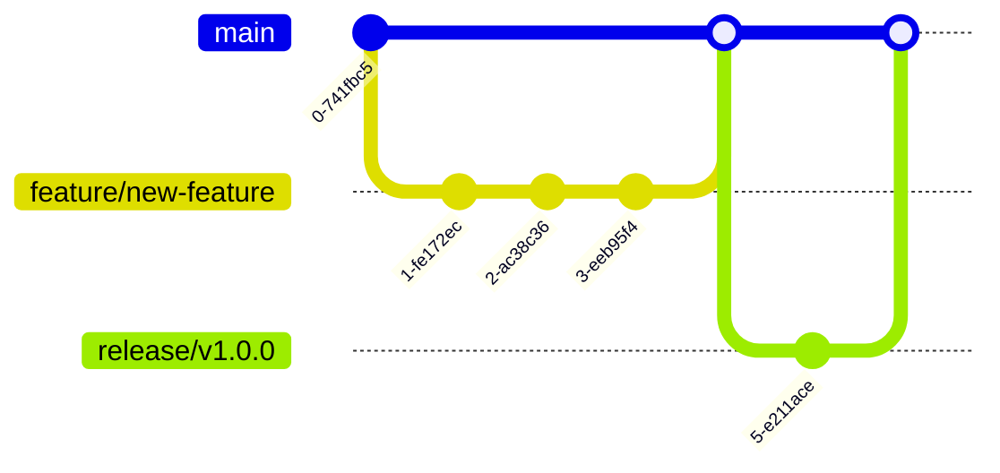

# CI/CD Pipeline Documentation

## Overview

The Tribe platform employs a robust CI/CD (Continuous Integration/Continuous Deployment) pipeline to automate the building, testing, and deployment of applications across development, staging, and production environments. This document provides a comprehensive overview of the pipeline's architecture, components, and workflows.

### Pipeline Goals

The CI/CD pipeline for the Tribe platform is designed to achieve the following objectives:

- **Automation**: Minimize manual intervention in the build, test, and deployment processes
- **Quality Assurance**: Ensure that all code changes meet quality standards before deployment
- **Reliability**: Provide consistent, repeatable deployments across all environments
- **Traceability**: Maintain clear visibility into what code is deployed in each environment
- **Security**: Enforce security checks throughout the pipeline
- **Developer Experience**: Enable developers to focus on code, not deployment mechanics
- **Fast Feedback**: Provide quick feedback on code changes to developers

### Key Components

The Tribe CI/CD pipeline utilizes the following key components:

- **GitHub Actions**: Primary CI tool for automated testing, building, and initial validation
- **Jenkins**: Secondary CI/CD tool for complex orchestration and integration with external systems
- **ArgoCD**: GitOps tool for Kubernetes deployments and configuration management
- **AWS ECR**: Container registry for storing Docker images
- **Terraform**: Infrastructure as Code tool for managing cloud resources
- **Helm**: Package manager for Kubernetes applications
- **Trivy**: Security scanner for container vulnerabilities
- **Prometheus/Grafana**: Monitoring stack for pipeline and deployment metrics

### Pipeline Architecture


The CI/CD pipeline follows a GitOps approach, where the desired state of the application is declared in version-controlled repositories. Changes to the application code or infrastructure trigger automated processes that update the actual state to match the desired state.

## Continuous Integration

### GitHub Actions Workflows

The Tribe platform uses GitHub Actions as the primary tool for Continuous Integration. The CI workflow is triggered by:

- Push events to main, development, and feature branches
- Pull request events
- Manual workflow dispatch

The CI workflow includes the following stages:

1. **Setup**: Prepare the environment and check out the code
2. **Lint**: Validate code style and format
3. **Unit Tests**: Run unit tests for all components
4. **Integration Tests**: Run integration tests
5. **Security Scan**: Check for vulnerabilities in code and dependencies
6. **Build**: Build application artifacts
7. **Containerize**: Build Docker images for services

### Build Process

The build process varies slightly for different components of the platform:

#### Backend Services

Backend services are built using Node.js 18 for JavaScript/TypeScript services and Python 3.10 for AI-related services. The build process includes:

1. Installing dependencies
2. Running TypeScript compilation
3. Creating optimized production bundles
4. Building Docker images using multi-stage builds

#### Mobile Application

The React Native mobile app build process includes:

1. Installing dependencies
2. Running TypeScript compilation
3. Building the app for specific platforms (iOS/Android)
4. Creating Expo builds for development and distribution

### Testing Strategy

The CI pipeline incorporates a comprehensive testing strategy:

| Test Type | Tools | Scope | When Run |
|-----------|-------|-------|----------|
| Unit Tests | Jest, pytest | Individual components and functions | Every commit |
| Integration Tests | Supertest, pytest | API endpoints, service interactions | Every PR, main branch commits |
| Contract Tests | Pact | Service-to-service interactions | Every PR, main branch commits |
| Security Scans | SonarQube, npm audit, Trivy | Code vulnerabilities, dependencies | Every PR, main branch commits |
| Linting | ESLint, Prettier | Code style, formatting | Every commit |

### Quality Gates

The CI pipeline enforces several quality gates that must be passed before allowing changes to progress:

- **Code Coverage**: Minimum 80% code coverage for unit tests
- **Security Vulnerabilities**: No critical or high vulnerabilities allowed
- **Build Success**: All builds must complete successfully
- **Linting**: Zero linting errors allowed
- **Test Success**: All tests must pass

Failure to meet any of these criteria results in a failed CI run, and developers are notified to address the issues.

### Pull Request Validation

Pull requests undergo additional validation steps:

1. Required reviews from at least one team member
2. Status checks must pass (CI workflow, linting, tests)
3. Branch must be up to date with the base branch
4. No merge conflicts allowed

The CI workflow produces detailed reports on test results, code coverage, and security scans that are attached to the pull request for easy review.

## Continuous Deployment

### Deployment Workflows

The Continuous Deployment workflow is triggered by:

- Merges to the `development` branch (deploys to development environment)
- Merges to a `release/*` branch (deploys to staging environment)
- Merges to the `main` branch (deploys to production environment)
- Manual workflow dispatch (for any environment)

The CD workflow follows these steps:

1. Determine the target environment based on the trigger
2. Build and tag container images appropriately
3. Push container images to AWS ECR
4. Update Kubernetes manifests with new image tags
5. Commit changes to the GitOps repository
6. ArgoCD detects the changes and synchronizes the cluster state
7. Run post-deployment verification tests

### Environment Configuration

Each environment has specific configurations managed through Kubernetes ConfigMaps, Secrets, and environment variables:


| Environment | Configuration Approach | Kubernetes Namespace | External API Mode |
|-------------|------------------------|---------------------|------------------|
| Development | Dynamic, feature flags enabled | tribe-development | Sandbox/Test |
| Staging | Production-like, feature flags controlled | tribe-staging | Sandbox/Test |
| Production | Strict, limited feature flags | tribe-production | Production |

### Deployment Strategies

The Tribe platform employs different deployment strategies depending on the service and risk level:

#### Rolling Updates

Most services use rolling updates as the default deployment strategy:


Rolling updates are configured with:
- Max unavailable: 25%
- Max surge: 25%
- Readiness probe timeouts appropriate for each service

#### Blue-Green Deployments

For services that require zero-downtime and immediate rollback capability, such as the payment service:


#### Canary Deployments

For high-risk changes, especially in user-facing services:


### GitOps with ArgoCD

The Tribe platform implements GitOps using ArgoCD for Kubernetes deployments:


ArgoCD applications are configured for each service and environment:

1. ArgoCD monitors the GitOps repository for changes
2. When changes are detected, ArgoCD compares the desired state with the actual state
3. If differences are found, ArgoCD applies the changes to the Kubernetes cluster
4. ArgoCD continuously monitors the actual state to ensure it matches the desired state

### Promotion Workflow

Changes are promoted through environments in a controlled manner:


| Promotion Step | Requirements | Approval |
|----------------|--------------|----------|
| Dev → Staging | All tests pass, QA signoff | Tech Lead approval |
| Staging → Production | UAT complete, performance verified | Product Owner approval |

## Infrastructure as Code

### Terraform for Cloud Resources

The Tribe platform uses Terraform to manage AWS cloud resources:

- **Repository Structure**: Infrastructure code is stored in the `infrastructure/terraform` directory
- **State Management**: Terraform state is stored in an S3 bucket with DynamoDB for state locking
- **Modularity**: Resources are organized into reusable modules
- **Environment Separation**: Separate Terraform workspaces for development, staging, and production

Terraform manages the following AWS resources:

- VPC and networking components
- EKS clusters
- RDS databases
- ElastiCache instances
- S3 buckets
- IAM roles and policies
- CloudFront distributions

### Kubernetes Manifests

Kubernetes manifests are organized in a GitOps repository with the following structure:

```
kubernetes/
├── base/                 # Base configurations
│   ├── api-gateway/
│   ├── auth-service/
│   ├── profile-service/
│   └── ...
├── overlays/             # Environment-specific overrides
│   ├── development/
│   ├── staging/
│   └── production/
└── shared/               # Shared resources
    ├── namespace.yaml
    ├── network-policies.yaml
    └── rbac.yaml
```

The manifests follow Kubernetes best practices:

- Resource limits and requests are specified for all containers
- Readiness and liveness probes are configured appropriately
- Network policies restrict traffic between services
- Pod disruption budgets ensure availability during upgrades

### Helm Charts

Helm is used for templating and managing complex Kubernetes applications:

- Common services with many configuration options
- Third-party applications (Prometheus, Grafana, etc.)
- Services that require consistent configuration across environments

The Helm charts are stored in the `infrastructure/helm` directory and follow the standard Helm chart structure.

### Configuration Management

Configuration is managed differently based on the type:

| Configuration Type | Management Approach | Tool |
|-------------------|---------------------|------|
| Environment Variables | ConfigMaps, Secrets | Kubernetes |
| Feature Flags | ConfigMaps | Kubernetes + Custom app config |
| Secrets | Encrypted Secrets | Kubernetes + AWS Secrets Manager |
| Infrastructure Config | Variables | Terraform |
| Application Config | Config files | ConfigMaps |

Configuration changes follow the same GitOps workflow as code changes, with appropriate approval processes for sensitive configurations.

## Containerization

### Docker Images

The Tribe platform uses a multi-stage build approach for Docker images to minimize image size and improve security:

```dockerfile
# Example Dockerfile for a Node.js service
FROM node:18-alpine AS builder
WORKDIR /app
COPY package*.json ./
RUN npm ci
COPY . .
RUN npm run build

FROM node:18-alpine
WORKDIR /app
COPY --from=builder /app/dist ./dist
COPY --from=builder /app/node_modules ./node_modules
COPY package*.json ./
USER node
EXPOSE 3000
CMD ["node", "dist/main.js"]
```

Each service has its own Dockerfile optimized for its specific requirements.

### Image Tagging Strategy

The container images follow a structured tagging strategy:

| Tag Type | Format | Purpose | Example |
|----------|--------|---------|---------|
| Semantic Version | v[major].[minor].[patch] | Release versions | v1.2.3 |
| Git SHA | git-[sha] | Exact code version | git-a1b2c3d |
| Environment | [env] | Environment-specific images | production |
| Latest | latest | Most recent build | latest |

Images are tagged with multiple tags to provide different ways to reference them:

```
tribe/auth-service:v1.2.3
tribe/auth-service:git-a1b2c3d
tribe/auth-service:production
```

### Container Registry

AWS ECR is used as the container registry with the following organization:

- Repository per service (e.g., `tribe/auth-service`)
- Immutable tags to prevent overwriting
- Lifecycle policies to clean up old images
- Vulnerability scanning enabled

### Security Scanning

Container images are scanned for vulnerabilities at multiple points:

1. During the build process using Trivy
2. After pushing to ECR using AWS ECR scanning
3. Periodically on deployed images

The security scanning process:


## Environment Management

### Development Environment

The development environment is designed for rapid iteration and testing:

- **Automation**: Fully automated deployments on every merge to the development branch
- **Configuration**: Development-specific settings with feature flags enabled
- **Data**: Sandbox data that can be reset as needed
- **Access**: Available to the development team for testing
- **Resources**: Sized appropriately for development workloads
- **External Integrations**: Connected to sandbox/test versions of external services

The deployment process to development is automatic and doesn't require approval.

### Staging Environment

The staging environment is designed to mirror production as closely as possible:

- **Automation**: Automated deployments from release branches with approval
- **Configuration**: Production-like settings with controlled feature flags
- **Data**: Anonymized production-like data
- **Access**: Available to QA, product, and development teams
- **Resources**: Sized similarly to production for accurate performance testing
- **External Integrations**: Connected to sandbox/test versions of external services

Deployments to staging require tech lead approval and successful QA in the development environment.

### Production Environment

The production environment is optimized for stability, performance, and security:

- **Automation**: Automated deployments from main branch with strict approval
- **Configuration**: Production settings with minimal feature flags
- **Data**: Real user data with strict privacy controls
- **Access**: Limited to authorized operations personnel
- **Resources**: Fully scaled for production workloads with auto-scaling
- **External Integrations**: Connected to production versions of external services

Deployments to production require product owner approval and successful UAT in the staging environment.

### Environment Promotion

The environment promotion process ensures changes are thoroughly tested before reaching production:


The promotion criteria includes:

- Testing completion and signoff
- Performance verification
- Security review
- Business approval

### Secrets Management

Secrets are managed securely across environments:

- **AWS Secrets Manager**: Stores sensitive configuration
- **Kubernetes Secrets**: Stores application-level secrets
- **Environment Segregation**: Separate secrets for each environment
- **Access Control**: Restricted access based on role
- **Rotation**: Regular rotation of credentials
- **Audit**: Logging of all secret access

## Monitoring and Feedback

### Build and Deployment Notifications

The CI/CD pipeline provides notifications at key points:

| Event | Notification Channel | Recipients | Information Included |
|-------|---------------------|------------|---------------------|
| Build Start | Slack | Development team | Repository, branch, commit |
| Build Failure | Slack, Email | Commit author, team | Error details, logs |
| Deployment Start | Slack | Development team | Environment, services |
| Deployment Success | Slack | Development team | Environment, version |
| Deployment Failure | Slack, Email | DevOps, team | Error details, logs |
| Approval Required | Slack, Email | Approvers | Environment, changes |

Example Slack notification for a successful deployment:

```
✅ Deployment Successful
Environment: staging
Services: api-gateway, auth-service, profile-service
Version: v1.2.3 (git-a1b2c3d)
Deployed by: CI/CD Pipeline
Duration: 4m 32s
Details: https://jenkins.tribeapp.com/job/deploy-staging/123
```

### Deployment Verification

Each deployment includes verification steps to ensure success:

1. **Health Checks**: Verify all services are responding correctly
2. **Smoke Tests**: Run basic functionality tests
3. **Synthetic Transactions**: Simulate key user journeys
4. **Metrics Monitoring**: Verify performance metrics are within expected ranges
5. **Log Analysis**: Check for unexpected errors or warnings

The verification process is automated and provides a pass/fail result that determines whether a deployment is considered successful.

### Rollback Procedures

In case of deployment failures, the CI/CD pipeline supports automated and manual rollbacks:


Rollback strategies vary by component:

| Component | Rollback Strategy | Time to Rollback |
|-----------|------------------|------------------|
| Kubernetes Deployments | Revert to previous ReplicaSet | 1-2 minutes |
| Blue-Green Deployments | Switch back to blue environment | < 1 minute |
| Database Migrations | Run down migrations | 5-15 minutes |
| Infrastructure Changes | Apply previous Terraform state | 5-30 minutes |

### Performance Monitoring

The CI/CD pipeline integrates with application performance monitoring tools:

1. **Deployment Markers**: Each deployment is marked in monitoring tools
2. **Baseline Comparison**: Performance is compared before and after deployment
3. **Anomaly Detection**: Unusual patterns trigger alerts
4. **Error Rate Monitoring**: Increased error rates after deployment trigger alerts
5. **Resource Utilization**: Changes in resource usage patterns are tracked

This monitoring helps quickly identify performance regressions introduced by deployments.

## Developer Workflow

### Local Development

Developers use a consistent local development environment that mirrors production:

1. **Docker Compose**: Local development uses Docker Compose for dependencies
2. **Kubernetes (optional)**: minikube or k3d for local Kubernetes development
3. **Environment Variables**: Configuration via `.env` files
4. **Hot Reloading**: Code changes reflect immediately

The setup process is automated with scripts to ensure consistency:

```bash
# Clone repositories
git clone https://github.com/tribe-platform/tribe-app.git
git clone https://github.com/tribe-platform/tribe-infrastructure.git

# Set up development environment
cd tribe-app
./scripts/setup-dev.sh

# Start local development environment
docker-compose up -d
npm run dev
```

### Feature Branch Workflow

Developers follow a feature branch workflow:



1. Create feature branch from development branch
2. Develop and test locally
3. Run unit tests and linting locally
4. Push changes and create PR
5. CI runs tests and builds
6. Code review and approval
7. Merge to development branch
8. Automated deployment to development environment

### CI Feedback Loop

Developers receive feedback from CI through multiple channels:

1. **GitHub Status Checks**: Visual indicators on PRs
2. **PR Comments**: Automated comments with test results, coverage reports
3. **Slack Notifications**: Alerts for build and test failures
4. **Email Notifications**: Detailed reports for significant issues

When CI failures occur, developers should:

1. Check the logs for specific errors
2. Run the failed tests locally to reproduce
3. Fix the issues and push changes
4. Verify the CI passes after changes

### Triggering Deployments

Deployments can be triggered in several ways:

| Environment | Automatic Trigger | Manual Trigger | Who Can Trigger |
|-------------|------------------|----------------|-----------------|
| Development | Merge to development branch | GitHub Actions workflow dispatch | Any developer |
| Staging | Merge to release branch | GitHub Actions workflow dispatch | Tech leads, QA |
| Production | Merge to main branch | GitHub Actions workflow dispatch | Tech leads, DevOps |

Manual deployments are useful for:
- Deploying specific versions
- Redeploying after infrastructure changes
- Testing deployment procedures

### Debugging Deployment Issues

When deployment issues occur, developers can:

1. Check deployment logs in GitHub Actions or Jenkins
2. Examine Kubernetes events and pod logs
3. Verify ArgoCD synchronization status
4. Check application logs and monitoring
5. Use the rollback procedure if necessary

Common deployment issues and solutions:

| Issue | Possible Causes | Solutions |
|-------|-----------------|-----------|
| Pod crash loops | Resource constraints, startup errors | Check pod logs, increase resources |
| Service unavailable | Network policies, misconfiguration | Check service/endpoint configuration |
| Database connection errors | Connection string, credentials | Verify secrets, check network |
| Missing configuration | ConfigMap issues | Check ConfigMap mounting |
| Performance degradation | Resource constraints, code issues | Check monitoring, scale resources |

## Security Considerations

### Pipeline Security

The CI/CD pipeline incorporates several security measures:

1. **Least Privilege**: Pipeline components only have the permissions they need
2. **Isolated Environments**: Build environments are isolated and ephemeral
3. **Code Signing**: Container images are signed for authenticity
4. **Secure Artifacts**: Build artifacts are stored in secured repositories
5. **Audit Logging**: All pipeline actions are logged and auditable

Pipeline credentials are managed using secure vaults:

- GitHub Secrets for GitHub Actions
- Jenkins Credentials for Jenkins
- AWS Secrets Manager for infrastructure automation

### Secrets Management

Secrets are handled securely throughout the pipeline:


Best practices implemented:

1. No secrets in code or configuration files
2. Encrypted at rest and in transit
3. Access limited by role and need
4. Regular rotation of credentials
5. Audit trail for all access

### Security Scanning

The pipeline incorporates multiple security scanning steps:

| Scan Type | Tool | When Run | Failure Criteria |
|-----------|------|----------|------------------|
| Static Application Security Testing | SonarQube | Every PR | Critical or High findings |
| Dependency Scanning | npm audit, OWASP Dependency Check | Every build | Critical vulnerabilities |
| Container Scanning | Trivy, ECR scanning | Before deployment | Critical vulnerabilities |
| Infrastructure as Code Scanning | tfsec, checkov | Before apply | High or Critical findings |
| Dynamic Application Security Testing | OWASP ZAP | Weekly | Critical findings |

Security findings are tracked and remediated according to severity:

- Critical: Block deployment, fix immediately
- High: Fix before next release
- Medium: Fix in upcoming sprints
- Low: Address when convenient

### Compliance Validation

The CI/CD pipeline helps ensure compliance with security standards:

1. **Automated Checks**: Compliance requirements validated automatically
2. **Evidence Collection**: Pipeline generates evidence for compliance audits
3. **Policy Enforcement**: Security policies enforced by pipeline
4. **Separation of Duties**: Different roles for development and deployment
5. **Audit Trail**: Complete history of changes and approvals

Compliance standards addressed include:

- SOC 2 requirements for change management
- PCI DSS for payment-related components
- GDPR for data protection
- Company-specific security policies

## Appendix

### GitHub Actions Workflow Reference

Example CI workflow:

```yaml
name: CI

on:
  push:
    branches: [ development, main, 'release/*' ]
  pull_request:
    branches: [ development, main ]
  workflow_dispatch:

jobs:
  lint:
    runs-on: ubuntu-latest
    steps:
      - uses: actions/checkout@v3
      - name: Setup Node.js
        uses: actions/setup-node@v3
        with:
          node-version: '18'
          cache: 'npm'
      - name: Install dependencies
        run: npm ci
      - name: Run linting
        run: npm run lint
  
  test:
    runs-on: ubuntu-latest
    needs: lint
    steps:
      - uses: actions/checkout@v3
      - name: Setup Node.js
        uses: actions/setup-node@v3
        with:
          node-version: '18'
          cache: 'npm'
      - name: Install dependencies
        run: npm ci
      - name: Run tests
        run: npm test
      - name: Upload coverage
        uses: actions/upload-artifact@v3
        with:
          name: coverage
          path: coverage/
  
  build:
    runs-on: ubuntu-latest
    needs: test
    steps:
      - uses: actions/checkout@v3
      - name: Setup Node.js
        uses: actions/setup-node@v3
        with:
          node-version: '18'
          cache: 'npm'
      - name: Install dependencies
        run: npm ci
      - name: Build
        run: npm run build
      - name: Upload build artifacts
        uses: actions/upload-artifact@v3
        with:
          name: build
          path: dist/
  
  container:
    runs-on: ubuntu-latest
    needs: build
    if: github.event_name == 'push' || github.event_name == 'workflow_dispatch'
    steps:
      - uses: actions/checkout@v3
      - name: Download build artifacts
        uses: actions/download-artifact@v3
        with:
          name: build
          path: dist/
      - name: Configure AWS credentials
        uses: aws-actions/configure-aws-credentials@v1
        with:
          aws-access-key-id: ${{ secrets.AWS_ACCESS_KEY_ID }}
          aws-secret-access-key: ${{ secrets.AWS_SECRET_ACCESS_KEY }}
          aws-region: us-west-2
      - name: Login to Amazon ECR
        id: login-ecr
        uses: aws-actions/amazon-ecr-login@v1
      - name: Build and push container
        uses: docker/build-push-action@v4
        with:
          context: .
          push: true
          tags: |
            ${{ steps.login-ecr.outputs.registry }}/tribe/api-gateway:${{ github.sha }}
            ${{ steps.login-ecr.outputs.registry }}/tribe/api-gateway:latest
      - name: Run Trivy vulnerability scanner
        uses: aquasecurity/trivy-action@master
        with:
          image-ref: ${{ steps.login-ecr.outputs.registry }}/tribe/api-gateway:${{ github.sha }}
          format: 'sarif'
          output: 'trivy-results.sarif'
          severity: 'CRITICAL,HIGH'
```

Example CD workflow:

```yaml
name: CD

on:
  push:
    branches: [ development, main, 'release/*' ]
  workflow_dispatch:
    inputs:
      environment:
        description: 'Environment to deploy to'
        required: true
        default: 'development'
        type: choice
        options:
          - development
          - staging
          - production

jobs:
  determine_environment:
    runs-on: ubuntu-latest
    outputs:
      environment: ${{ steps.set-env.outputs.environment }}
    steps:
      - id: set-env
        run: |
          if [ "${{ github.event_name }}" == "workflow_dispatch" ]; then
            echo "environment=${{ github.event.inputs.environment }}" >> $GITHUB_OUTPUT
          elif [ "${{ github.ref }}" == "refs/heads/main" ]; then
            echo "environment=production" >> $GITHUB_OUTPUT
          elif [[ "${{ github.ref }}" == refs/heads/release/* ]]; then
            echo "environment=staging" >> $GITHUB_OUTPUT
          else
            echo "environment=development" >> $GITHUB_OUTPUT
          fi
  
  deploy:
    needs: determine_environment
    runs-on: ubuntu-latest
    environment: ${{ needs.determine_environment.outputs.environment }}
    steps:
      - uses: actions/checkout@v3
      - name: Configure AWS credentials
        uses: aws-actions/configure-aws-credentials@v1
        with:
          aws-access-key-id: ${{ secrets.AWS_ACCESS_KEY_ID }}
          aws-secret-access-key: ${{ secrets.AWS_SECRET_ACCESS_KEY }}
          aws-region: us-west-2
      - name: Login to Amazon ECR
        id: login-ecr
        uses: aws-actions/amazon-ecr-login@v1
      - name: Setup Kustomize
        uses: imranismail/setup-kustomize@v1
      - name: Checkout manifests repository
        uses: actions/checkout@v3
        with:
          repository: tribe-platform/tribe-manifests
          path: manifests
          token: ${{ secrets.MANIFESTS_PAT }}
      - name: Update manifests
        run: |
          cd manifests/overlays/${{ needs.determine_environment.outputs.environment }}
          kustomize edit set image tribe/api-gateway=${{ steps.login-ecr.outputs.registry }}/tribe/api-gateway:${{ github.sha }}
      - name: Commit and push changes
        run: |
          cd manifests
          git config --local user.email "cicd@tribeapp.com"
          git config --local user.name "CI/CD Bot"
          git add .
          git commit -m "Update api-gateway image to ${{ github.sha }}"
          git push
```

### Jenkins Pipeline Reference

Example Jenkins pipeline for complex deployments:

```groovy
pipeline {
    agent {
        kubernetes {
            yaml """
apiVersion: v1
kind: Pod
spec:
  containers:
  - name: terraform
    image: hashicorp/terraform:1.4
    command:
    - cat
    tty: true
  - name: kubectl
    image: bitnami/kubectl:1.26
    command:
    - cat
    tty: true
  - name: aws
    image: amazon/aws-cli:2.9.19
    command:
    - cat
    tty: true
"""
        }
    }
    
    parameters {
        choice(name: 'ENVIRONMENT', choices: ['development', 'staging', 'production'], description: 'Environment to deploy to')
        string(name: 'VERSION', defaultValue: '', description: 'Version to deploy (leave empty for latest)')
    }
    
    stages {
        stage('Prepare') {
            steps {
                script {
                    env.VERSION = params.VERSION ?: "latest"
                    env.NAMESPACE = "tribe-${params.ENVIRONMENT}"
                }
            }
        }
        
        stage('Infrastructure') {
            when {
                expression { params.ENVIRONMENT == 'staging' || params.ENVIRONMENT == 'production' }
            }
            steps {
                container('terraform') {
                    withCredentials([string(credentialsId: 'aws-access-key', variable: 'AWS_ACCESS_KEY_ID'),
                                    string(credentialsId: 'aws-secret-key', variable: 'AWS_SECRET_ACCESS_KEY')]) {
                        sh """
                            cd terraform/${params.ENVIRONMENT}
                            terraform init
                            terraform workspace select ${params.ENVIRONMENT}
                            terraform plan -out=tfplan
                            terraform apply -auto-approve tfplan
                        """
                    }
                }
            }
        }
        
        stage('Deploy Application') {
            steps {
                container('kubectl') {
                    withCredentials([file(credentialsId: "kubeconfig-${params.ENVIRONMENT}", variable: 'KUBECONFIG')]) {
                        sh """
                            kubectl config use-context ${params.ENVIRONMENT}
                            kubectl apply -f kubernetes/overlays/${params.ENVIRONMENT}
                            kubectl rollout status deployment/api-gateway -n ${env.NAMESPACE} --timeout=5m
                        """
                    }
                }
            }
        }
        
        stage('Verify Deployment') {
            steps {
                container('kubectl') {
                    withCredentials([file(credentialsId: "kubeconfig-${params.ENVIRONMENT}", variable: 'KUBECONFIG')]) {
                        sh """
                            kubectl run smoke-test --image=curlimages/curl --restart=Never -n ${env.NAMESPACE} -- \
                              curl -s https://api-gateway.${env.NAMESPACE}.svc.cluster.local/health
                            kubectl logs smoke-test -n ${env.NAMESPACE}
                            kubectl delete pod smoke-test -n ${env.NAMESPACE}
                        """
                    }
                }
            }
        }
    }
    
    post {
        success {
            slackSend channel: '#deployments', 
                      color: 'good', 
                      message: "Deployment to ${params.ENVIRONMENT} successful: ${env.JOB_NAME} ${env.BUILD_NUMBER} (<${env.BUILD_URL}|Open>)"
        }
        failure {
            slackSend channel: '#deployments', 
                      color: 'danger', 
                      message: "Deployment to ${params.ENVIRONMENT} failed: ${env.JOB_NAME} ${env.BUILD_NUMBER} (<${env.BUILD_URL}|Open>)"
        }
    }
}
```

### ArgoCD Configuration Reference

Example ArgoCD application configuration:

```yaml
apiVersion: argoproj.io/v1alpha1
kind: Application
metadata:
  name: api-gateway
  namespace: argocd
  finalizers:
    - resources-finalizer.argocd.argoproj.io
spec:
  project: tribe
  source:
    repoURL: https://github.com/tribe-platform/tribe-manifests.git
    targetRevision: HEAD
    path: overlays/development
  destination:
    server: https://kubernetes.default.svc
    namespace: tribe-development
  syncPolicy:
    automated:
      prune: true
      selfHeal: true
      allowEmpty: false
    syncOptions:
      - CreateNamespace=true
      - PruneLast=true
      - ApplyOutOfSyncOnly=true
    retry:
      limit: 5
      backoff:
        duration: 5s
        factor: 2
        maxDuration: 3m
```

### Environment Variables Reference

Common environment variables used in the CI/CD pipeline:

| Variable | Purpose | Set In | Used By |
|----------|---------|--------|---------|
| NODE_ENV | Environment type | CI/CD pipeline, Kubernetes | All Node.js services |
| API_URL | API endpoint | CI/CD pipeline, Kubernetes | Frontend, Mobile app |
| DATABASE_URL | Database connection string | Kubernetes Secrets | Backend services |
| AWS_REGION | AWS region | CI/CD pipeline | Terraform, AWS CLI |
| REACT_APP_* | Frontend configuration | CI/CD pipeline | Frontend app |
| EXPO_* | Expo configuration | CI/CD pipeline | Mobile app |
| LOG_LEVEL | Logging verbosity | Kubernetes ConfigMap | All services |
| FEATURE_FLAGS | Feature flag configuration | Kubernetes ConfigMap | All services |

### Troubleshooting Guide

Common CI/CD issues and their solutions:

#### Build Failures

| Issue | Symptom | Solution |
|-------|---------|----------|
| Dependency installation fails | npm/pip errors in logs | Check package.json, requirements.txt for issues; verify registry access |
| Tests fail | Failed test reports in CI | Check test logs; reproduce locally; fix failing tests |
| Linting errors | ESLint/Prettier errors | Run linting locally; fix formatting issues |
| Out of memory | Build process killed | Increase memory limits in CI runner; optimize build process |

#### Deployment Failures

| Issue | Symptom | Solution |
|-------|---------|----------|
| Image pull failure | `ImagePullBackOff` in Kubernetes | Check image tag; verify ECR access; check registry credentials |
| Container crashes | `CrashLoopBackOff` in Kubernetes | Check container logs; verify resource limits; check startup probes |
| Service unavailable | Health checks failing | Check service logs; verify network policies; check dependencies |
| ArgoCD sync failure | Sync errors in ArgoCD UI | Check manifest validity; verify RBAC permissions; check ArgoCD logs |
| Resource conflicts | Deployment rejected | Check for conflicting resources; verify namespace; check for immutable field changes |

#### Pipeline Issues

| Issue | Symptom | Solution |
|-------|---------|----------|
| Pipeline times out | Job exceeds time limit | Optimize build steps; increase timeout limits; parallelize jobs |
| Credentials failure | Authentication errors | Verify secret configuration; check credential expiration; rotate if needed |
| Permission denied | Access denied errors | Check RBAC settings; verify service account permissions |
| GitOps repo sync issues | Failed push to manifest repo | Check bot credentials; verify branch protection rules; check for conflicts |