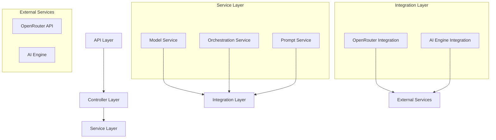

# AI Orchestration Service

## Introduction

The AI Orchestration Service is a critical component of the Tribe platform that serves as the central coordination layer for all AI capabilities. It manages model selection, prompt templates, and orchestrates AI operations across different features including matchmaking, personality analysis, engagement, recommendations, and conversations.

## Architecture Overview

The service follows a microservice architecture pattern and acts as a bridge between application services and AI capabilities, both internal (AI Engine) and external (OpenRouter API).

### Components

#### Model Service
Manages AI model configurations, selection, and validation. Provides functionality for retrieving models, selecting appropriate models for specific features, and validating model capabilities.

#### Orchestration Service
Core service that coordinates AI requests, processes them through appropriate models or AI Engine endpoints, and manages responses. Implements request queuing, caching, and error handling.

#### Prompt Service
Manages prompt templates for different AI features and operations. Handles template rendering with dynamic data.

#### OpenRouter Integration
Provides direct communication with the OpenRouter API for accessing various AI language models. Handles authentication, request formatting, response parsing, and error management.

#### AI Engine Integration
Communicates with the internal AI Engine microservice for specialized AI operations like matchmaking, personality analysis, and recommendation generation.

### Architecture Diagram

The service architecture follows a layered approach with controllers handling API requests, services implementing business logic, and integrations communicating with external systems.



## Features

### AI Model Management
Discover, select, and validate AI models from OpenRouter API based on capabilities and feature requirements.

### Request Orchestration
Coordinate AI requests with appropriate prioritization, queuing, and routing to the right AI provider.

### Prompt Template Management
Manage and render prompt templates for different AI features and operations.

### Response Caching
Cache AI responses to improve performance and reduce API costs.

### Error Handling
Standardized error handling with appropriate retry mechanisms and fallbacks.

### Metrics Collection
Collect and expose metrics for monitoring AI operations, latency, and error rates.

### Health Checks
Provide health check endpoints for monitoring service and dependency status.

## Setup

### Prerequisites

- Node.js 18+
- npm or yarn
- PostgreSQL database
- OpenRouter API key
- AI Engine service (for specialized AI operations)

### Environment Variables

| Variable | Description | Default Value | Required |
|----------|-------------|---------------|----------|
| PORT | Port for the service to listen on | 3004 | No |
| NODE_ENV | Environment (development, staging, production) | development | No |
| DATABASE_URL | PostgreSQL connection string | - | Yes |
| OPENROUTER_API_KEY | API key for OpenRouter | - | Yes |
| OPENROUTER_API_URL | Base URL for OpenRouter API | https://openrouter.ai/api/v1 | No |
| AI_ENGINE_URL | URL for the AI Engine microservice | - | Yes |
| AI_ENGINE_API_KEY | API key for the AI Engine microservice | - | Yes |
| MODEL_TIMEOUT | Timeout for AI model requests in milliseconds | 30000 | No |
| MAX_RETRIES | Maximum number of retries for failed requests | 3 | No |
| RETRY_DELAY | Base delay between retries in milliseconds | 1000 | No |

### Installation

1. Clone the repository
2. Navigate to the ai-orchestration-service directory
3. Run `npm install` to install dependencies
4. Set up environment variables in .env file
5. Run `npm run build` to build the service
6. Run `npm start` to start the service

## API Endpoints

### Health Check

```
GET /health
```

Check the health status of the service and its dependencies.

**Response:** Health status object with component statuses

### Metrics

```
GET /metrics
```

Get Prometheus metrics for monitoring.

**Response:** Prometheus metrics in text format

### Models

```
GET /api/v1/models
```

Get available AI models.

**Query Parameters:**
- `activeOnly` (boolean): Filter for active models only
- `provider` (string): Filter by provider
- `capability` (string): Filter by capability

**Response:** Array of model configurations

```
GET /api/v1/models/:id
```

Get a specific AI model by ID.

**Response:** Model configuration

```
GET /api/v1/models/feature/:feature
```

Get the most appropriate model for a specific feature.

**Query Parameters:**
- `preferredModelId` (string): Preferred model ID

**Response:** Model configuration

### Orchestration

```
POST /api/v1/orchestration
```

Create and process an orchestration request.

**Request Body:**
```json
{
  "feature": "OrchestrationFeature (MATCHING, PERSONALITY, ENGAGEMENT, RECOMMENDATION, CONVERSATION)",
  "input": "Feature-specific input data",
  "userId": "Optional user ID",
  "modelId": "Optional model ID",
  "parameters": "Optional model parameters",
  "priority": "Optional priority (HIGH, MEDIUM, LOW)"
}
```

**Response:** Orchestration response with results

```
GET /api/v1/orchestration/:id
```

Get an orchestration request by ID.

**Response:** Orchestration request details

```
GET /api/v1/orchestration/:id/response
```

Get the response for an orchestration request.

**Response:** Orchestration response with results

```
POST /api/v1/orchestration/:id/cancel
```

Cancel a pending orchestration request.

**Response:** Cancellation status

### Prompts

```
GET /api/v1/prompts
```

Get available prompt templates.

**Query Parameters:**
- `category` (string): Filter by category
- `feature` (string): Filter by feature

**Response:** Array of prompt templates

```
GET /api/v1/prompts/:id
```

Get a specific prompt template by ID.

**Response:** Prompt template

## Development

### Scripts

| Script | Description | Command |
|--------|-------------|---------|
| build | Build the service | `npm run build` |
| clean | Clean build artifacts | `npm run clean` |
| start | Start the service | `npm start` |
| dev | Start the service in development mode with hot reload | `npm run dev` |
| lint | Lint the code | `npm run lint` |
| lint:fix | Lint and fix the code | `npm run lint:fix` |
| test | Run tests | `npm test` |
| test:watch | Run tests in watch mode | `npm run test:watch` |
| test:coverage | Run tests with coverage | `npm run test:coverage` |

### Folder Structure

| Path | Description |
|------|-------------|
| src/config | Configuration files |
| src/controllers | API endpoint controllers |
| src/integrations | External service integrations |
| src/models | Data models and interfaces |
| src/services | Business logic services |
| src/utils | Utility functions |
| src/validations | Request validation schemas |
| tests | Test files |

### Testing

The service uses Jest for testing.

```
npm test          # Run tests
npm run test:coverage  # Run tests with coverage
```

### Linting

The service uses ESLint for code linting.

```
npm run lint      # Check for linting issues
npm run lint:fix  # Fix linting issues automatically
```

## Deployment

### Docker

Build the Docker image:

```
docker build -t tribe/ai-orchestration-service .
```

Run the Docker container:

```
docker run -p 3004:3004 --env-file .env tribe/ai-orchestration-service
```

### Kubernetes

Deploy to Kubernetes:

```
kubectl apply -f kubernetes/ai-orchestration-service-deployment.yaml
kubectl apply -f kubernetes/ai-orchestration-service-service.yaml
```

### Scaling

The service is designed to scale horizontally with multiple instances behind a load balancer.

**Scaling Considerations:**
- Database connection pooling
- Redis for distributed caching (optional)
- Stateless design for request handling

## Monitoring

### Metrics

The service exposes the following Prometheus metrics:

| Metric | Description |
|--------|-------------|
| orchestrationRequestCounter | Counter for orchestration requests by feature |
| orchestrationResponseCounter | Counter for orchestration responses by feature and status |
| orchestrationLatencyHistogram | Histogram for orchestration request latency |
| orchestrationErrorCounter | Counter for orchestration errors by feature and error type |
| modelRequestCounter | Counter for model requests by model ID |
| modelLatencyHistogram | Histogram for model request latency |
| modelErrorCounter | Counter for model errors by model ID and error type |
| promptTokensCounter | Counter for prompt tokens used |
| completionTokensCounter | Counter for completion tokens used |

### Logging

The service uses JSON structured logging with request IDs for correlation.

**Log Levels:**
- error
- warn
- info
- debug

### Health Checks

The `/health` endpoint provides health status for the following components:
- Database connection
- OpenRouter API
- AI Engine service
- Model service
- Orchestration service

## Troubleshooting

### Common Issues and Solutions

#### Service fails to start
**Possible causes:**
- Missing environment variables
- Database connection issues
- Port already in use

**Solutions:**
- Check .env file for required variables
- Verify database connection string
- Check if another service is using the port

#### OpenRouter API errors
**Possible causes:**
- Invalid API key
- Rate limiting
- Model not available

**Solutions:**
- Verify API key in environment variables
- Check rate limits in OpenRouter dashboard
- Verify model availability in OpenRouter

#### AI Engine connection errors
**Possible causes:**
- AI Engine service not running
- Invalid API key
- Network issues

**Solutions:**
- Verify AI Engine service is running
- Check AI Engine API key
- Check network connectivity between services

#### High latency in responses
**Possible causes:**
- AI model processing time
- Database performance
- Resource constraints

**Solutions:**
- Consider using faster models for time-sensitive operations
- Optimize database queries
- Scale service horizontally or vertically

### Logs

Check logs for detailed error information. The service uses structured logging with request IDs for correlation.

## Contributing

### Guidelines
- Follow the existing code style and patterns
- Write tests for new features and bug fixes
- Update documentation for API changes
- Use conventional commit messages

### Pull Request Process
1. Create a feature branch from develop
2. Implement changes with tests
3. Submit a pull request to develop
4. Address review comments
5. Merge after approval

## License

UNLICENSED - Proprietary software for the Tribe platform