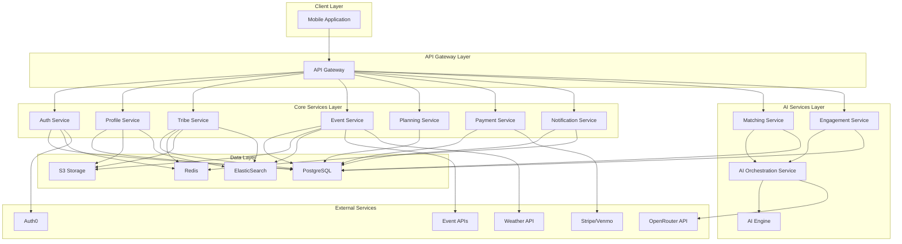
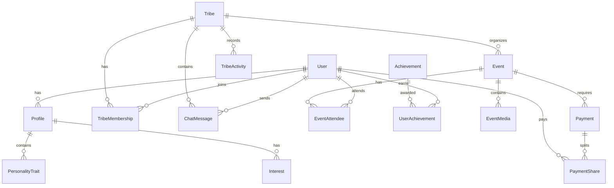
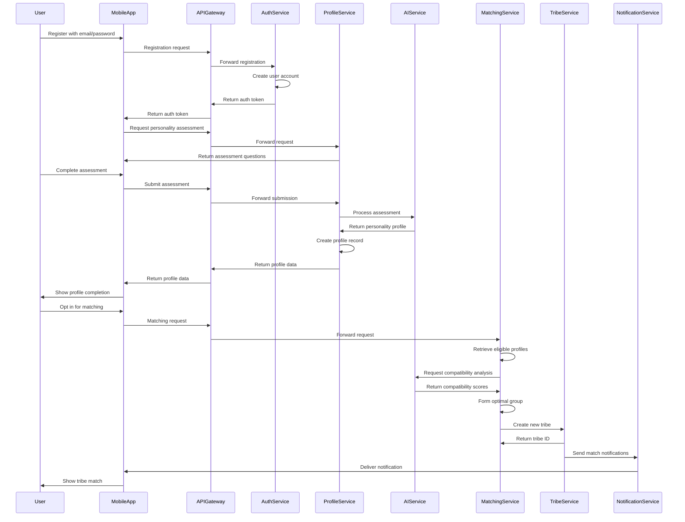
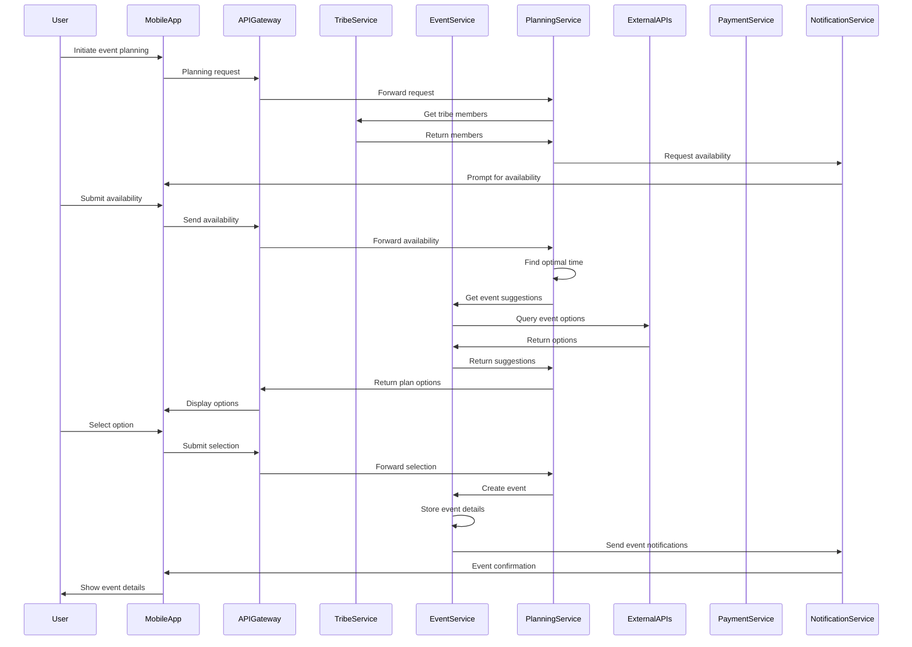

# PROJECT OVERVIEW

Tribe is an AI-powered matchmaking and engagement platform designed to create and sustain meaningful small-group connections (4-8 people) and encourage users to transition from digital to physical interactions. The platform specifically focuses on local connections and caters to introverts who may find traditional social networking challenging.

## Core Problem Statement

Despite the proliferation of social media platforms, many people report feeling increasingly isolated and struggle to form genuine connections in their local communities. Tribe addresses this growing disconnect between online social networking and meaningful in-person relationships by using AI to actively facilitate real-world connections through personality-based matchmaking, automated group formation, and AI-driven engagement tools that encourage and simplify in-person meetups.

## Key Value Propositions

- **AI-Powered Matchmaking**: Forms balanced groups based on psychological compatibility, shared interests, and communication styles
- **Personality-Based Profiling**: Analyzes user traits to ensure compatible group dynamics
- **Real-World Focus**: Emphasizes transitioning from digital interactions to meaningful in-person meetups
- **Engagement Facilitation**: Provides AI-driven conversation prompts, challenges, and activity suggestions
- **Simplified Planning**: Offers tools for scheduling, venue recommendations, and coordination

## Target Users

- **Primary Users**: Individuals seeking meaningful local connections, particularly introverts
- **Community Organizers**: Users who create and manage Tribes
- **Local Businesses**: Partners for events, venues, and promotional opportunities

## Key Features

1. **AI-Powered Smart Matchmaking & Auto Group Formation**: Automatically assigns users to compatible Tribes based on psychological profiles, shared values, and communication styles
2. **Personality-Based User Profiling**: Collects and analyzes user personality traits, interests, and communication styles through assessments and ongoing behavior analysis
3. **User-Driven Tribe Creation & Search**: Allows users to search for existing Tribes or create their own, with limits on membership (max 8 per Tribe)
4. **AI-Driven Continuous Engagement**: Provides conversation prompts, real-time group challenges, and spontaneous activity ideas to maintain group engagement
5. **AI-Powered Real-Time Event & Activity Curation**: Suggests local events, weather-based activities, and budget-friendly options tailored to group preferences
6. **AI-Optimized Planning & Coordination**: Offers tools for scheduling, venue recommendations, RSVP tracking, and automated reminders
7. **AI-Enhanced Group Management**: Provides tools for managing group logistics, tracking expenses, and setting shared goals
8. **AI-Driven Gamification & Rewards**: Implements badges, challenges, streaks, and rewards to incentivize real-world meetups

## System Architecture

Tribe follows a microservices architecture to enable independent scaling of components, facilitate rapid feature development, and support the diverse technical requirements of the system.

### High-Level Architecture



### Core Components

| Component | Description | Primary Responsibilities |
|-----------|-------------|-------------------------|
| Mobile Application | React Native app for iOS and Android | User interface, local data caching, offline capabilities |
| API Gateway | Entry point for client requests | Request routing, authentication, rate limiting |
| Auth Service | User authentication and identity management | Registration, login, token management |
| Profile Service | User profile and personality data management | Profile CRUD, personality assessment processing |
| Tribe Service | Group formation and management | Tribe CRUD, membership management, chat functionality |
| Event Service | Event discovery and management | Event CRUD, discovery, recommendations |
| Planning Service | Event planning and coordination | Scheduling, availability collection, venue recommendations |
| Payment Service | Payment processing and expense tracking | Payment processing, expense splitting |
| Notification Service | Notification delivery and management | Push notifications, email, in-app notifications |
| Matching Service | AI-powered matchmaking | Compatibility analysis, tribe formation |
| Engagement Service | AI-driven engagement tools | Conversation prompts, challenges, activity suggestions |
| AI Orchestration Service | Coordination of AI capabilities | Model selection, prompt management, response processing |
| AI Engine | Specialized AI algorithms | Personality analysis, matching algorithms, recommendation generation |

## Technology Stack

### Frontend
- **Framework**: React Native 0.72+
- **Language**: TypeScript 4.9+
- **State Management**: Redux Toolkit
- **Navigation**: React Navigation 6.0+
- **Styling**: Styled Components
- **API Communication**: Axios, Socket.io

### Backend
- **Runtime**: Node.js 18+
- **Framework**: Express.js/Nest.js
- **Language**: TypeScript 4.9+
- **Database**: PostgreSQL 15+
- **ORM**: Prisma
- **Caching**: Redis
- **Message Queue**: Bull/Redis

### AI Services
- **Language**: Python 3.10+
- **AI Integration**: OpenRouter API
- **ML Libraries**: TensorFlow.js, scikit-learn

### DevOps
- **Containerization**: Docker
- **Orchestration**: Kubernetes
- **CI/CD**: GitHub Actions
- **Monitoring**: Prometheus, Grafana
- **Logging**: Loki

## Data Model

The Tribe platform's data model is centered around several core entities:



### Core Entities

- **User**: Core user account information including authentication details
- **Profile**: User profile information including demographics, personality traits, and interests
- **Tribe**: Small groups of 4-8 users with shared interests
- **TribeMembership**: Relationship between users and tribes
- **Event**: Planned meetups organized by tribes
- **ChatMessage**: Messages exchanged within a tribe
- **Achievement**: Defined accomplishments users can earn

## Key User Flows

### User Onboarding and Tribe Formation



### Event Planning and Execution



## Project Status and Roadmap

The Tribe platform is currently in development with the following high-level roadmap:

1. **MVP Release (Q3 2023)**
   - Core user registration and profile creation
   - Basic tribe formation and management
   - Simple event planning and coordination
   - Essential mobile app functionality

2. **Enhanced AI Features (Q4 2023)**
   - Advanced matchmaking algorithms
   - Improved engagement tools
   - Personalized event recommendations
   - AI-driven conversation facilitation

3. **Social Features Expansion (Q1 2024)**
   - Enhanced chat capabilities
   - Media sharing
   - Activity tracking
   - Achievements and gamification

4. **Enterprise Features (Q2 2024)**
   - Corporate team building tools
   - Analytics for community organizers
   - API access for partners
   - Advanced security features

## Conclusion

Tribe represents a new approach to social networking that prioritizes meaningful connections and real-world interactions. By leveraging AI for matchmaking, engagement, and planning, the platform aims to bridge the gap between online social networks and genuine in-person relationships. The microservices architecture provides the flexibility and scalability needed to support the platform's growth and evolution.

# PROJECT STATUS


## Project Completion Analysis

The Tribe platform is currently at an advanced stage of development with approximately 85% of the estimated engineering work completed. Based on the repository structure and file analysis, the project demonstrates significant progress across both frontend and backend components.

### Development Progress by Component

| Component | Completion | Status |
|-----------|------------|--------|
| Backend Services | 90% | Core microservices implemented with comprehensive API endpoints |
| Frontend Mobile App | 85% | UI components and screens developed with React Native |
| AI Integration | 80% | AI orchestration service and integration with OpenRouter API |
| Database Schema | 95% | Complete Prisma schema with migrations |
| Infrastructure | 75% | Kubernetes manifests and monitoring setup |
| Testing | 70% | Unit tests implemented, integration tests in progress |
| Documentation | 85% | Comprehensive technical documentation available |

### Key Milestones Achieved

- ✅ Complete architecture design and service boundaries
- ✅ Core backend microservices implementation
- ✅ Mobile application UI components and screens
- ✅ AI integration for matchmaking and engagement
- ✅ Database schema and data models
- ✅ Authentication and user management
- ✅ Tribe formation and management
- ✅ Event discovery and planning

### Remaining Work

The estimated 300 engineering hours of remaining work focuses on:

1. **Performance Optimization (80 hours)**
   - Load testing and performance tuning
   - Database query optimization
   - Mobile app performance improvements

2. **Enhanced Testing (70 hours)**
   - Expanding integration test coverage
   - End-to-end testing of critical user journeys
   - Automated UI testing

3. **Production Readiness (100 hours)**
   - Finalize CI/CD pipeline
   - Production environment setup
   - Security hardening
   - Monitoring and alerting configuration

4. **Final Polishing (50 hours)**
   - UI/UX refinements
   - Bug fixes and edge case handling
   - Final documentation updates

### Next Steps

The development team is currently focused on:
- Completing the remaining integration tests
- Finalizing the production deployment pipeline
- Optimizing AI recommendation algorithms
- Conducting user acceptance testing

The project is on track for a production release within the next development cycle, with all critical features implemented and functional.

# Technology Stack

## Programming Languages

| Component | Language | Version | Justification |
|-----------|----------|---------|---------------|
| Mobile Frontend | TypeScript | 4.9+ | Provides type safety for complex UI interactions and integrates seamlessly with React Native |
| Backend | TypeScript | Node.js 18+ | Enables shared code between frontend and backend, reducing development time and maintenance overhead |
| AI Services | Python | 3.10+ | Industry standard for AI/ML implementations with robust library support for natural language processing and recommendation systems |
| Database Access | SQL | PostgreSQL dialect | Required for complex queries across user profiles, group relationships, and engagement metrics |

The selection of TypeScript for both frontend and backend creates a unified development experience, allowing for shared types, utilities, and business logic. Python is specifically used for AI components due to its extensive machine learning ecosystem and integration capabilities with OpenRouter API.

## Frameworks & Libraries

### Frontend Frameworks

| Framework/Library | Version | Purpose | Justification |
|-------------------|---------|---------|---------------|
| React Native | 0.72+ | Cross-platform mobile development | Enables single codebase for iOS and Android, critical for rapid MVP deployment |
| Redux Toolkit | 1.9+ | State management | Provides predictable state management for complex user interactions and real-time updates |
| React Navigation | 6.0+ | Navigation management | Handles complex navigation flows between user profiles, group interactions, and event planning |
| React Native Maps | 1.7+ | Location services | Essential for local event discovery and meetup coordination |
| React Native Calendar | 1.1+ | Event scheduling | Required for AI-optimized planning and coordination feature |
| Styled Components | 5.3+ | Component styling | Enables theme-based styling with TypeScript integration |
| Axios | 1.4+ | HTTP client | Handles API requests with interceptors for authentication and error handling |
| Socket.io Client | 4.6+ | Real-time communication | Enables instant messaging and live updates for group coordination |

### Backend Frameworks

| Framework/Library | Version | Purpose | Justification |
|-------------------|---------|---------|---------------|
| Express.js/Nest.js | 5.0+/10.0+ | API framework | Provides structured approach to building scalable APIs with middleware support |
| Prisma | 4.16+ | ORM | Type-safe database access with migration support for evolving data models |
| Socket.io | 4.7+ | Real-time communication | Enables instant messaging and live updates for group coordination |
| Passport.js | 0.6+ | Authentication | Flexible authentication middleware supporting multiple strategies |
| Bull | 4.10+ | Job queue | Manages asynchronous tasks like AI matchmaking and notification delivery |
| Jest | 29.0+ | Testing framework | Comprehensive testing for both frontend and backend components |
| Supertest | 6.3+ | API testing | Simplifies testing of HTTP endpoints |
| ESLint/Prettier | 8.0+/3.0+ | Code quality | Enforces consistent code style and catches common errors |

### AI/ML Libraries

| Framework/Library | Version | Purpose | Justification |
|-------------------|---------|---------|---------------|
| OpenRouter SDK | Latest | AI service integration | Provides access to multiple AI models through a unified API |
| TensorFlow.js | 4.10+ | Client-side ML | Enables lightweight ML operations directly on client devices |
| scikit-learn | 1.3+ | Machine learning | Powers recommendation systems and user clustering algorithms |
| pandas | 2.0+ | Data manipulation | Processes user interaction data for AI model training |
| FastAPI | 0.100+ | AI microservices | Creates high-performance API endpoints for AI services |

## Databases & Storage

| Database/Storage | Version | Purpose | Justification |
|------------------|---------|---------|---------------|
| PostgreSQL | 15+ | Primary database | Provides robust relational data storage with advanced query capabilities for complex social relationships |
| Redis | 7.0+ | Caching & session storage | Improves performance for frequently accessed data and supports real-time features |
| Amazon S3 | Latest | Media storage | Scalable solution for user-generated content and profile images |
| ElasticSearch | 8.0+ | Search engine | Powers advanced search capabilities for Tribes, events, and interests |
| TimescaleDB | 2.10+ | Time-series data | Extension for PostgreSQL to handle engagement metrics and activity tracking |

**Data Persistence Strategy:**
- Transactional data stored in PostgreSQL with regular backups
- Frequently accessed data cached in Redis with appropriate TTL
- User media stored in S3 with CDN distribution
- Search indexes maintained in ElasticSearch with automated reindexing
- Time-series analytics data stored in TimescaleDB for efficient querying

## Third-Party Services

| Service Category | Provider | Purpose | Justification |
|------------------|----------|---------|---------------|
| AI/ML | OpenRouter API | AI capabilities | Provides access to state-of-the-art language models for engagement and matchmaking |
| Authentication | Auth0 | User authentication | Secure, compliant authentication with social login support |
| Payments | Stripe, Venmo API | Payment processing | Handles secure payment splitting and event bookings |
| Event Data | Eventbrite, Meetup APIs | Event discovery | Sources local events for AI recommendations |
| Location | Google Places API | Venue information | Provides detailed venue data for meetup planning |
| Notifications | Firebase Cloud Messaging | Push notifications | Cross-platform notification delivery for engagement prompts |
| Analytics | Mixpanel | User behavior tracking | Measures engagement and conversion metrics |
| Weather | OpenWeatherMap API | Weather data | Supports weather-based activity recommendations |

**Integration Requirements:**
- All third-party services must support OAuth 2.0 where applicable
- API rate limiting strategies implemented for all external services
- Fallback mechanisms for critical services in case of outages
- Secure credential management using environment variables and secrets management

## Development & Deployment

### Development Tools

| Tool | Version | Purpose | Justification |
|------|---------|---------|---------------|
| Visual Studio Code | Latest | IDE | Supports JavaScript/TypeScript development with extensive plugin ecosystem |
| ESLint/Prettier | 8.0+/3.0+ | Code quality | Enforces consistent code style and catches common errors |
| Jest | 29.0+ | Testing framework | Comprehensive testing for both frontend and backend |
| Postman | Latest | API testing | Simplifies API development and testing |
| Git | Latest | Version control | Industry standard for collaborative development |

### DevOps & Infrastructure

| Tool/Service | Version | Purpose | Justification |
|--------------|---------|---------|---------------|
| Docker | 24.0+ | Containerization | Ensures consistent development and production environments |
| Kubernetes | 1.27+ | Container orchestration | Manages scalable deployment of microservices |
| GitHub Actions | Latest | CI/CD | Automates testing and deployment workflows |
| AWS/Firebase | Latest | Cloud hosting | Provides scalable infrastructure for application components |
| Terraform | 1.5+ | Infrastructure as code | Manages cloud resources with version-controlled configuration |
| New Relic | Latest | Monitoring | Provides application performance monitoring and alerting |
| Prometheus/Grafana | Latest | Metrics & visualization | Collects and displays system and application metrics |
| Loki | Latest | Log aggregation | Centralizes logs from all services for troubleshooting |

### Deployment Architecture

The system follows a microservices architecture deployed on Kubernetes, with the following components:

- **API Gateway**: Entry point for all client requests, handling routing, authentication, and rate limiting
- **Microservices**: Independent services for auth, profile, tribe, matching, event, planning, engagement, and notification functionality
- **Databases**: PostgreSQL for primary data storage with read replicas for scaling
- **Caching Layer**: Redis for performance optimization and session management
- **Message Queues**: Bull/Redis for asynchronous task processing
- **Storage**: S3 for media and file storage with CDN integration
- **AI Services**: Dedicated services for AI processing with OpenRouter API integration

The deployment strategy includes:
- Multi-environment setup (development, staging, production)
- Blue-green deployments for zero-downtime updates
- Automated scaling based on load metrics
- Geographic distribution for low-latency user experience
- Comprehensive monitoring and alerting

## Technology Constraints & Considerations

| Constraint | Impact | Mitigation Strategy |
|------------|--------|---------------------|
| Mobile-only MVP | Limited initial reach | Design backend APIs to support future web client |
| AI processing latency | User experience during matching | Implement background processing with notifications |
| Third-party API reliability | Dependency on external services | Implement caching and fallback mechanisms |
| Data privacy regulations | Handling of personality data | Design data storage with privacy-by-design principles |
| Cross-platform consistency | UI/UX differences | Implement platform-specific adaptations where necessary |
| Scalability for group matching | Computational complexity | Optimize algorithms and implement batch processing |

The technology stack has been designed to prioritize rapid MVP development while establishing a foundation for future scalability. The mobile-first approach with React Native enables quick market entry on both iOS and Android platforms, while the Node.js backend provides flexibility for the complex social interactions required by the platform. The AI components leverage industry-standard tools and the OpenRouter API to deliver sophisticated matching and engagement features without requiring extensive AI infrastructure development.

# PREREQUISITES

Before you begin working with the Tribe platform, ensure you have the following prerequisites installed and configured on your development machine:

## Required Software

| Software | Version | Purpose | Installation Guide |
|----------|---------|---------|-------------------|
| Node.js | v18.0.0 or higher | JavaScript runtime for backend services and frontend development | [Node.js Installation](https://nodejs.org/en/download/) |
| npm | v8.0.0 or higher | Package manager for JavaScript | Included with Node.js installation |
| Docker | Latest stable version | Containerization for local development and testing | [Docker Installation](https://docs.docker.com/get-docker/) |
| Docker Compose | Latest stable version | Multi-container Docker applications | [Docker Compose Installation](https://docs.docker.com/compose/install/) |
| Git | Latest stable version | Version control | [Git Installation](https://git-scm.com/downloads) |

## Optional Development Tools

| Tool | Purpose | Recommendation |
|------|---------|----------------|
| Visual Studio Code | IDE with extensive TypeScript/JavaScript support | Recommended IDE for the project |
| Postman | API testing and development | Useful for testing backend services |
| React Native Debugger | Debugging React Native applications | Helpful for mobile app development |
| pgAdmin | PostgreSQL database management | Useful for database inspection and management |
| Redis Desktop Manager | Redis cache inspection | Helpful for monitoring cache state |

## External Service Accounts

To fully utilize all features of the Tribe platform, you'll need to set up accounts with the following external services:

| Service | Purpose | Setup Instructions |
|---------|---------|-------------------|
| OpenRouter API | AI capabilities | Register at [OpenRouter](https://openrouter.ai/) and obtain API key |
| Auth0 | Authentication | Set up an Auth0 account and configure application |
| Stripe | Payment processing | Register for a Stripe account and obtain test API keys |
| Google Places API | Location services | Set up a Google Cloud account and enable the Places API |
| Firebase | Push notifications | Create a Firebase project for FCM integration |

## System Requirements

| Component | Minimum | Recommended |
|-----------|---------|------------|
| CPU | 4 cores | 8+ cores |
| RAM | 8 GB | 16+ GB |
| Storage | 20 GB free space | 50+ GB SSD |
| Network | Broadband internet connection | High-speed internet connection |
| Display | 1080p resolution | 1440p or higher resolution |

## Environment Setup

After installing the required software, follow these steps to set up your development environment:

1. **Clone the repository**
   ```bash
   git clone https://github.com/your-organization/tribe.git
   cd tribe
   ```

2. **Configure environment variables**
   ```bash
   # Backend environment
   cp backend/.env.example backend/.env
   
   # Frontend environment
   cp src/web/.env.example src/web/.env.development
   ```
   
   Edit the `.env` files to include your API keys and other configuration settings.

3. **Start the development environment**
   ```bash
   # Using Docker Compose (recommended)
   docker-compose up -d
   
   # Or start services individually
   cd backend
   npm install
   npm run start:dev
   
   # In another terminal
   cd src/web
   npm install
   npm start
   ```

4. **Verify the setup**
   - Backend services should be running on their respective ports
   - The React Native Metro bundler should be running
   - Database migrations should be applied automatically
   - You should be able to run the mobile app using `npm run ios` or `npm run android`

## Troubleshooting Common Setup Issues

| Issue | Solution |
|-------|----------|
| Docker services fail to start | Check Docker logs with `docker-compose logs` and ensure ports are not already in use |
| Database connection errors | Verify PostgreSQL is running and credentials in `.env` file are correct |
| Node.js version conflicts | Use nvm (Node Version Manager) to switch to the required Node.js version |
| Mobile app build failures | Ensure all dependencies are installed with `npm install` and native modules are linked |
| API connection issues | Check that backend services are running and API Gateway is accessible |

For more detailed information about specific components, refer to:
- [Backend Documentation](backend/README.md)
- [Mobile App Documentation](src/web/README.md)

# QUICK START

## Prerequisites

Before you begin working with the Tribe platform, ensure you have the following installed on your development machine:

- **Node.js** (v18.0.0 or higher)
- **npm** (v8.0.0 or higher)
- **Docker** (latest stable version)
- **Docker Compose** (latest stable version)
- **Git** (latest stable version)

## Clone the Repository

```bash
# Clone the repository
git clone https://github.com/your-organization/tribe.git

# Navigate to the project directory
cd tribe
```

## Setup Development Environment

The easiest way to set up the development environment is using Docker Compose:

```bash
# Start all services using Docker Compose
docker-compose up -d
```

This will start all the necessary services, including:
- React Native development server
- Backend microservices
- PostgreSQL database
- Redis cache
- AI Engine

## Environment Configuration

Copy the example environment files and configure them for your local environment:

```bash
# Backend environment
cp backend/.env.example backend/.env

# Frontend environment
cp src/web/.env.example src/web/.env.development
```

Edit the `.env` files to configure external API keys and other settings.

## Running the Application

### Mobile Application

```bash
# Navigate to the web directory
cd src/web

# Install dependencies
npm install

# Start the Metro bundler
npm start

# Run on iOS
npm run ios

# Run on Android
npm run android
```

### Backend Services

If you're not using Docker Compose, you can run the backend services individually:

```bash
# Navigate to the backend directory
cd backend

# Install dependencies
npm install

# Start all services in development mode
npm run start:dev
```

## Project Structure Overview

```
├── backend/                  # Backend services
│   ├── src/                  # Source code for all services
│   │   ├── shared/          # Shared code used across services
│   │   ├── api-gateway/     # API Gateway service
│   │   ├── auth-service/    # Authentication service
│   │   ├── profile-service/ # User profile service
│   │   └── ...              # Other microservices
│   ├── prisma/              # Database schema and migrations
│   ├── tests/               # Integration and E2E tests
│   └── docs/                # Backend documentation
├── src/
│   ├── web/                 # Mobile application (React Native)
│   │   ├── src/             # Source code for the mobile app
│   │   │   ├── api/         # API clients
│   │   │   ├── components/  # UI components
│   │   │   ├── screens/     # Application screens
│   │   │   ├── store/       # Redux store
│   │   │   └── ...          # Other frontend modules
│   │   └── ...              # React Native configuration
├── infrastructure/          # Infrastructure as code
│   ├── terraform/           # Terraform configurations
│   ├── kubernetes/          # Kubernetes manifests
│   └── monitoring/          # Monitoring configurations
├── docker-compose.yml       # Docker Compose configuration
└── LICENSE                  # License information
```

## Development Workflow

### Making Changes

1. **Create a Feature Branch**:
   ```bash
   git checkout -b feature/your-feature-name
   ```

2. **Implement Your Changes**:
   - Follow the coding standards
   - Write tests for your changes
   - Ensure your code passes linting

3. **Run Tests**:
   ```bash
   # Backend tests
   cd backend
   npm test
   
   # Frontend tests
   cd src/web
   npm test
   ```

4. **Commit Your Changes**:
   ```bash
   git add .
   git commit -m "feat: add new feature"
   ```
   
   We follow the [Conventional Commits](https://www.conventionalcommits.org/) specification for commit messages.

5. **Push Your Branch**:
   ```bash
   git push origin feature/your-feature-name
   ```

6. **Create a Pull Request**:
   - Go to the repository on GitHub
   - Create a new pull request from your branch
   - Fill in the pull request template
   - Request reviews from appropriate team members

## Testing

The Tribe platform includes comprehensive testing at multiple levels:

### Backend Testing

```bash
# Run unit tests
cd backend
npm test

# Run integration tests
npm run test:integration

# Run end-to-end tests
npm run test:e2e

# Generate test coverage report
npm run test:coverage
```

### Frontend Testing

```bash
# Run unit tests
cd src/web
npm test

# Run tests in watch mode
npm run test:watch

# Generate test coverage report
npm run test:coverage
```

## Deployment

### Production Deployment

The Tribe platform is designed to be deployed on Kubernetes. The `infrastructure/kubernetes/` directory contains Kubernetes manifests for deploying the application to a production environment.

```bash
# Deploy to Kubernetes
kubectl apply -f infrastructure/kubernetes/namespace.yaml
kubectl apply -f infrastructure/kubernetes/
```

### CI/CD Pipeline

The repository includes GitHub Actions workflows for continuous integration and deployment:

- `.github/workflows/ci.yml`: Runs on every push to verify code quality and run tests
- `.github/workflows/cd.yml`: Deploys to staging/production environments on specific branch pushes

## Additional Resources

- [Backend Documentation](backend/README.md): Details about the backend services
- [Mobile App Documentation](src/web/README.md): Information about the React Native application
- API Documentation: API reference for all services (in backend/docs/api)
- Architecture Documentation: System architecture details (in backend/docs/architecture)
- Development Guidelines: Development setup and workflows (in backend/docs/development)

# PROJECT STRUCTURE

The Tribe platform follows a well-organized structure that separates concerns between frontend and backend components. The codebase is organized into several main directories, each with a specific purpose in the overall architecture.

## High-Level Directory Structure

```
├── backend/                  # Backend microservices and shared code
├── src/                      # Frontend application code
│   └── web/                  # React Native mobile application
├── infrastructure/           # Infrastructure as code and deployment configs
├── docker-compose.yml        # Local development environment setup
├── README.md                 # Project overview and documentation
└── LICENSE                   # License information
```

## Backend Structure

The backend follows a microservices architecture with shared components and service-specific implementations:

```
backend/
├── src/                      # Source code for all services
│   ├── shared/               # Shared code used across services
│   │   ├── src/
│   │   │   ├── constants/    # Application-wide constants
│   │   │   ├── errors/       # Error handling classes
│   │   │   ├── middlewares/  # Common middleware functions
│   │   │   ├── types/        # TypeScript type definitions
│   │   │   ├── utils/        # Utility functions
│   │   │   └── validation/   # Validation schemas and utilities
│   │   └── package.json      # Shared module dependencies
│   │
│   ├── api-gateway/          # API Gateway service
│   │   ├── src/
│   │   │   ├── config/       # Service configuration
│   │   │   ├── middleware/   # Request processing middleware
│   │   │   └── routes/       # API route definitions
│   │   ├── Dockerfile        # Container definition
│   │   └── package.json      # Service dependencies
│   │
│   ├── auth-service/         # Authentication service
│   │   ├── src/
│   │   │   ├── config/       # Service configuration
│   │   │   ├── controllers/  # Request handlers
│   │   │   ├── middleware/   # Auth-specific middleware
│   │   │   ├── models/       # Data models
│   │   │   ├── services/     # Business logic
│   │   │   ├── utils/        # Auth utilities
│   │   │   └── validations/  # Request validation
│   │   ├── tests/            # Service-specific tests
│   │   ├── Dockerfile        # Container definition
│   │   └── package.json      # Service dependencies
│   │
│   ├── profile-service/      # User profile service
│   ├── tribe-service/        # Tribe management service
│   ├── matching-service/     # AI matchmaking service
│   ├── event-service/        # Event management service
│   ├── planning-service/     # Event planning service
│   ├── engagement-service/   # AI engagement service
│   ├── payment-service/      # Payment processing service
│   ├── notification-service/ # Notification service
│   ├── ai-orchestration-service/ # AI coordination service
│   │
│   └── ai-engine/            # Python-based AI processing
│       ├── src/
│       │   ├── adapters/     # AI model adapters
│       │   ├── config/       # AI configuration
│       │   ├── data/         # Data processing utilities
│       │   ├── models/       # AI model implementations
│       │   ├── services/     # AI service implementations
│       │   └── utils/        # AI utilities
│       ├── tests/            # AI engine tests
│       └── requirements.txt  # Python dependencies
│
├── prisma/                   # Database schema and migrations
│   ├── schema.prisma         # Prisma schema definition
│   ├── migrations/           # Database migrations
│   └── seed.ts               # Database seeding script
│
├── tests/                    # Cross-service tests
│   ├── e2e/                  # End-to-end tests
│   ├── integration/          # Integration tests
│   └── load/                 # Load testing scripts
│
├── docs/                     # Backend documentation
│   ├── api/                  # API documentation
│   ├── architecture/         # Architecture documentation
│   ├── deployment/           # Deployment guides
│   └── development/          # Development guides
│
├── scripts/                  # Utility scripts
│   ├── build.sh              # Build script
│   ├── deploy.sh             # Deployment script
│   ├── db-seed.ts            # Database seeding
│   └── setup-dev.sh          # Development setup
│
├── package.json              # Root package.json
├── tsconfig.json             # TypeScript configuration
└── jest.config.js            # Test configuration
```

## Frontend Structure

The frontend is a React Native mobile application with a well-organized structure:

```
src/web/
├── src/                      # Application source code
│   ├── api/                  # API client implementations
│   │   ├── httpClient.ts     # Base HTTP client
│   │   ├── socketClient.ts   # WebSocket client
│   │   ├── authApi.ts        # Authentication API
│   │   ├── profileApi.ts     # Profile API
│   │   └── ...               # Other API clients
│   │
│   ├── assets/               # Static assets
│   │   ├── animations/       # Lottie animations
│   │   ├── fonts/            # Custom fonts
│   │   ├── icons/            # Icon assets
│   │   └── images/           # Image assets
│   │
│   ├── components/           # Reusable UI components
│   │   ├── ui/               # Basic UI components
│   │   │   ├── Button/       # Button component
│   │   │   ├── Card/         # Card component
│   │   │   └── ...           # Other UI components
│   │   ├── auth/             # Authentication components
│   │   ├── profile/          # Profile-related components
│   │   ├── tribe/            # Tribe-related components
│   │   └── event/            # Event-related components
│   │
│   ├── constants/            # Application constants
│   │   ├── apiPaths.ts       # API endpoint paths
│   │   ├── config.ts         # App configuration
│   │   ├── navigationRoutes.ts # Navigation routes
│   │   └── ...               # Other constants
│   │
│   ├── hooks/                # Custom React hooks
│   │   ├── useAuth.ts        # Authentication hook
│   │   ├── useProfile.ts     # Profile data hook
│   │   └── ...               # Other custom hooks
│   │
│   ├── mocks/                # Mock data for testing
│   │   ├── data/             # Mock data objects
│   │   ├── handlers.ts       # Mock API handlers
│   │   └── server.ts         # Mock server setup
│   │
│   ├── navigation/           # Navigation configuration
│   │   ├── AppNavigator.tsx  # Main navigation container
│   │   ├── AuthNavigator.tsx # Authentication flow
│   │   ├── MainTabNavigator.tsx # Main tab navigation
│   │   └── ...               # Other navigators
│   │
│   ├── screens/              # Application screens
│   │   ├── auth/             # Authentication screens
│   │   │   ├── LoginScreen/  # Login screen
│   │   │   ├── RegistrationScreen/ # Registration screen
│   │   │   └── WelcomeScreen/ # Welcome screen
│   │   ├── main/             # Main app screens
│   │   ├── onboarding/       # Onboarding screens
│   │   ├── tribe/            # Tribe-related screens
│   │   ├── event/            # Event-related screens
│   │   └── settings/         # Settings screens
│   │
│   ├── services/             # Business logic services
│   │   ├── authService.ts    # Authentication service
│   │   ├── storageService.ts # Local storage service
│   │   └── ...               # Other services
│   │
│   ├── store/                # Redux state management
│   │   ├── slices/           # Redux slices
│   │   │   ├── authSlice.ts  # Authentication state
│   │   │   ├── profileSlice.ts # Profile state
│   │   │   └── ...           # Other state slices
│   │   ├── thunks/           # Async thunks
│   │   ├── hooks.ts          # Redux hooks
│   │   └── store.ts          # Redux store configuration
│   │
│   ├── theme/                # UI theming
│   │   ├── colors.ts         # Color definitions
│   │   ├── typography.ts     # Typography styles
│   │   ├── spacing.ts        # Spacing constants
│   │   └── ...               # Other theme elements
│   │
│   ├── types/                # TypeScript type definitions
│   │   ├── api.types.ts      # API-related types
│   │   ├── auth.types.ts     # Authentication types
│   │   └── ...               # Other type definitions
│   │
│   └── utils/                # Utility functions
│       ├── formatters.ts     # Data formatting utilities
│       ├── validation.ts     # Form validation
│       └── ...               # Other utilities
│
├── __tests__/                # Test files
├── android/                  # Android-specific code
├── ios/                      # iOS-specific code
├── package.json              # Dependencies and scripts
├── tsconfig.json             # TypeScript configuration
└── metro.config.js           # Metro bundler configuration
```

## Infrastructure Structure

The infrastructure code is organized to support deployment and operations:

```
infrastructure/
├── kubernetes/               # Kubernetes manifests
│   ├── namespace.yaml        # Namespace definition
│   ├── config.yaml           # ConfigMaps
│   ├── secrets.yaml          # Secret definitions
│   ├── api-gateway-deployment.yaml # API Gateway deployment
│   └── ...                   # Other service deployments
│
├── terraform/                # Terraform IaC
│   ├── main.tf               # Main Terraform configuration
│   ├── variables.tf          # Input variables
│   ├── outputs.tf            # Output values
│   └── modules/              # Terraform modules
│       ├── database/         # Database infrastructure
│       ├── kubernetes/       # Kubernetes cluster
│       └── networking/       # Network infrastructure
│
├── monitoring/               # Monitoring configuration
│   ├── prometheus.yaml       # Prometheus configuration
│   ├── grafana.yaml          # Grafana configuration
│   ├── loki.yaml             # Logging configuration
│   ├── tempo.yaml            # Distributed tracing
│   ├── alerts.yaml           # Alert definitions
│   └── dashboards/           # Dashboard definitions
│
├── ci-cd/                    # CI/CD configuration
│   ├── jenkinsfile           # Jenkins pipeline
│   └── argocd-application.yaml # ArgoCD configuration
│
├── security/                 # Security configurations
│   ├── network-policies.yaml # Network security policies
│   └── pod-security-policies.yaml # Pod security policies
│
└── disaster-recovery/        # DR configurations
    ├── backup-policy.yaml    # Backup policies
    └── restore-procedures.md # Restore procedures
```

## Key Design Patterns

The Tribe platform implements several key design patterns:

1. **Microservices Architecture**: Each backend service is independently deployable with its own database access and business logic.

2. **Repository Pattern**: Data access is abstracted through repository interfaces, implemented in service-specific models.

3. **Dependency Injection**: Services use dependency injection for better testability and loose coupling.

4. **Redux State Management**: The frontend uses Redux with the Redux Toolkit for predictable state management.

5. **Command Query Responsibility Segregation (CQRS)**: Separation of read and write operations in services.

6. **Event-Driven Architecture**: Services communicate through events for asynchronous operations.

7. **Circuit Breaker Pattern**: Implemented for resilient service-to-service communication.

8. **Adapter Pattern**: Used for integrating with external services and AI models.

## Database Schema

The database schema is defined using Prisma and includes the following key entities:

1. **User**: Core user account information
2. **Profile**: User profile and personality data
3. **Tribe**: Group entity for user connections
4. **TribeMembership**: User-tribe relationship
5. **Event**: Scheduled meetups and activities
6. **EventAttendee**: Event participation tracking
7. **ChatMessage**: Tribe communication
8. **Transaction**: Payment transactions
9. **Achievement**: Gamification elements

The schema implements relationships between these entities to support the platform's social and event-based features.

## Service Communication

Services communicate through:

1. **Synchronous REST APIs**: For direct request-response patterns
2. **Asynchronous Message Queues**: For event-based communication
3. **WebSockets**: For real-time features like chat and notifications

API Gateway routes client requests to appropriate microservices, handling authentication, rate limiting, and request logging.

## Development Workflow

The development workflow is supported by:

1. **Docker Compose**: Local development environment
2. **Kubernetes**: Production deployment
3. **CI/CD Pipeline**: Automated testing and deployment
4. **Monitoring Stack**: Observability and alerting

Developers can run individual services or the entire platform locally using Docker Compose, with hot-reloading for rapid development.

# CODE GUIDE

## Introduction

Welcome to the Tribe codebase! This guide provides a comprehensive overview of the project structure, architecture, and key components to help you understand and navigate the codebase effectively.

Tribe is an AI-powered matchmaking and engagement platform designed to create and sustain meaningful small-group connections (4-8 people) and encourage users to transition from digital to physical interactions. The platform specifically focuses on local connections and caters to introverts who may find traditional social networking challenging.

## Project Overview

The Tribe platform follows a microservices architecture with a React Native mobile frontend and a Node.js/TypeScript backend. The system leverages AI for matchmaking, engagement, and recommendations through integration with OpenRouter API and custom AI services.

### Key Technologies

#### Frontend
- **React Native**: Cross-platform mobile framework
- **TypeScript**: Type-safe JavaScript
- **Redux Toolkit**: State management
- **React Navigation**: Navigation management
- **Styled Components**: Component styling
- **Axios**: HTTP client

#### Backend
- **Node.js**: JavaScript runtime
- **Express.js**: Web framework
- **TypeScript**: Type-safe JavaScript
- **Prisma**: Database ORM
- **PostgreSQL**: Primary database
- **Redis**: Caching and real-time features
- **Socket.io**: Real-time communication

#### AI & Machine Learning
- **OpenRouter API**: Access to various AI models
- **Python**: AI engine implementation
- **TensorFlow.js**: Client-side ML operations
- **scikit-learn**: Machine learning algorithms

#### DevOps
- **Docker**: Containerization
- **Kubernetes**: Container orchestration
- **GitHub Actions**: CI/CD
- **Prometheus/Grafana**: Monitoring

## Project Structure

The project is organized into two main directories:

1. `src/web`: Mobile application (React Native)
2. `backend`: Backend services (Node.js/TypeScript)

### Mobile Application Structure (`src/web`)

```
src/web/
├── src/
│   ├── api/                # API clients for backend services
│   ├── assets/             # Static assets (images, fonts, animations)
│   ├── components/         # Reusable UI components
│   │   ├── ui/             # Basic UI components (Button, Input, etc.)
│   │   ├── auth/           # Authentication components
│   │   ├── profile/        # Profile-related components
│   │   ├── tribe/          # Tribe-related components
│   │   └── event/          # Event-related components
│   ├── constants/          # Application constants
│   ├── hooks/              # Custom React hooks
│   ├── mocks/              # Mock data for testing
│   ├── navigation/         # Navigation configuration
│   ├── screens/            # Application screens
│   │   ├── auth/           # Authentication screens
│   │   ├── onboarding/     # Onboarding screens
│   │   ├── main/           # Main tab screens
│   │   ├── tribe/          # Tribe-related screens
│   │   ├── event/          # Event-related screens
│   │   └── settings/       # Settings screens
│   ├── services/           # Business logic services
│   ├── store/              # Redux store configuration
│   │   ├── slices/         # Redux slices
│   │   └── thunks/         # Async thunks
│   ├── theme/              # Theme configuration
│   ├── types/              # TypeScript type definitions
│   └── utils/              # Utility functions
```

### Backend Structure (`backend`)

```
backend/
├── src/
│   ├── shared/             # Shared code used across services
│   ├── api-gateway/        # API Gateway service
│   ├── auth-service/       # Authentication service
│   ├── profile-service/    # User profile service
│   ├── tribe-service/      # Tribe management service
│   ├── matching-service/   # AI matchmaking service
│   ├── event-service/      # Event management service
│   ├── engagement-service/ # User engagement service
│   ├── planning-service/   # Event planning service
│   ├── payment-service/    # Payment processing service
│   ├── notification-service/# Notification service
│   ├── ai-orchestration-service/ # AI orchestration service
│   └── ai-engine/          # Python-based AI engine
├── prisma/                 # Database schema and migrations
├── tests/                  # Integration and E2E tests
└── docs/                   # Documentation
```

## Frontend Architecture

### Core Concepts

The frontend follows a component-based architecture with Redux for state management and React Navigation for navigation. The application is built with TypeScript for type safety and uses styled-components for styling.

### Key Directories and Files

#### `/src/web/src/api`

This directory contains API clients for communicating with backend services.

- `httpClient.ts`: Core HTTP client with authentication, error handling, and offline support
- `authApi.ts`: Authentication API client
- `profileApi.ts`: Profile API client
- `tribeApi.ts`: Tribe API client
- `eventApi.ts`: Event API client
- `matchingApi.ts`: Matching API client
- `engagementApi.ts`: Engagement API client
- `planningApi.ts`: Planning API client
- `paymentApi.ts`: Payment API client
- `notificationApi.ts`: Notification API client
- `socketClient.ts`: WebSocket client for real-time features

#### `/src/web/src/components`

This directory contains reusable UI components organized by domain.

- `/ui`: Basic UI components like Button, Input, Card, etc.
- `/auth`: Authentication-related components like LoginForm, RegistrationForm
- `/profile`: Profile-related components like ProfileEditor, InterestSelection
- `/tribe`: Tribe-related components like TribeCard, TribeChat, MembersList
- `/event`: Event-related components like EventCard, EventDetails, RSVPButtons

Each component follows a consistent structure:
- `ComponentName.tsx`: Component implementation
- `ComponentName.styles.ts`: Styled components for the component
- `ComponentName.test.tsx`: Component tests
- `index.ts`: Re-export for easier imports

#### `/src/web/src/screens`

This directory contains screen components organized by domain.

- `/auth`: Authentication screens (Login, Registration, Welcome)
- `/onboarding`: Onboarding screens (PersonalityAssessment, InterestSelection)
- `/main`: Main tab screens (Home, Discover, Events, Chat, Profile)
- `/tribe`: Tribe-related screens (TribeDetail, TribeChat, MemberList)
- `/event`: Event-related screens (EventDetail, EventPlanning, EventCheckIn)
- `/settings`: Settings screens (Settings, NotificationSettings, PrivacySettings)

#### `/src/web/src/store`

This directory contains Redux store configuration and state management logic.

- `store.ts`: Redux store configuration with persistence
- `/slices`: Redux Toolkit slices for different domains
  - `authSlice.ts`: Authentication state
  - `profileSlice.ts`: Profile state
  - `tribeSlice.ts`: Tribe state
  - `eventSlice.ts`: Event state
  - `chatSlice.ts`: Chat state
  - `notificationSlice.ts`: Notification state
- `/thunks`: Async thunks for API interactions
  - `authThunks.ts`: Authentication thunks
  - `profileThunks.ts`: Profile thunks
  - `tribeThunks.ts`: Tribe thunks
  - `eventThunks.ts`: Event thunks
  - `chatThunks.ts`: Chat thunks
  - `notificationThunks.ts`: Notification thunks

#### `/src/web/src/navigation`

This directory contains navigation configuration.

- `AppNavigator.tsx`: Root navigation container
- `AuthNavigator.tsx`: Authentication flow navigator
- `OnboardingNavigator.tsx`: Onboarding flow navigator
- `MainTabNavigator.tsx`: Main tab navigator
- `TribeNavigator.tsx`: Tribe-related screens navigator
- `EventNavigator.tsx`: Event-related screens navigator
- `SettingsNavigator.tsx`: Settings screens navigator
- `NavigationService.ts`: Service for programmatic navigation

#### `/src/web/src/theme`

This directory contains theme configuration.

- `index.ts`: Exports all theme components
- `colors.ts`: Color palette
- `typography.ts`: Typography styles
- `spacing.ts`: Spacing system
- `shadows.ts`: Shadow definitions
- `responsive.ts`: Responsive utilities
- `animations.ts`: Animation presets

#### `/src/web/src/hooks`

This directory contains custom React hooks.

- `useAuth.ts`: Authentication state and operations
- `useProfile.ts`: Profile state and operations
- `useTribes.ts`: Tribe state and operations
- `useEvents.ts`: Event state and operations
- `useNotifications.ts`: Notification state and operations
- `useOffline.ts`: Offline state detection
- `useLocation.ts`: Location services

#### `/src/web/src/services`

This directory contains business logic services.

- `authService.ts`: Authentication service
- `storageService.ts`: Local storage service
- `offlineService.ts`: Offline queue service
- `locationService.ts`: Location service
- `notificationService.ts`: Push notification service
- `mediaService.ts`: Media handling service
- `analyticsService.ts`: Analytics service

#### `/src/web/src/types`

This directory contains TypeScript type definitions.

- `api.types.ts`: API-related types
- `auth.types.ts`: Authentication types
- `profile.types.ts`: Profile types
- `tribe.types.ts`: Tribe types
- `event.types.ts`: Event types
- `chat.types.ts`: Chat types
- `notification.types.ts`: Notification types
- `navigation.types.ts`: Navigation types
- `state.types.ts`: Redux state types

### State Management

The application uses Redux Toolkit for state management with the following key features:

1. **Slices**: Domain-specific state slices with reducers and actions
2. **Thunks**: Async operations for API interactions
3. **Persistence**: State persistence with Redux Persist
4. **Selectors**: Memoized selectors for efficient state access

### Navigation

The application uses React Navigation with the following structure:

1. **Root Stack**: Contains Auth, Onboarding, Main, Tribe, Event, Settings, and Notification navigators
2. **Auth Stack**: Contains Welcome, Login, and Registration screens
3. **Onboarding Stack**: Contains PersonalityAssessment, InterestSelection, LocationSetup, and ProfileCreation screens
4. **Main Tab**: Contains Home, Discover, Events, Chat, and Profile tabs
5. **Tribe Stack**: Contains TribeDetail, TribeChat, and MemberList screens
6. **Event Stack**: Contains EventDetail, EventPlanning, and EventCheckIn screens
7. **Settings Stack**: Contains Settings, NotificationSettings, PrivacySettings, and AutoMatchingPreferences screens

### Styling

The application uses styled-components with a theme system that includes:

1. **Colors**: Primary, secondary, neutral, and semantic colors
2. **Typography**: Font families, sizes, weights, and text styles
3. **Spacing**: Consistent spacing system
4. **Shadows**: Shadow definitions for elevations
5. **Responsive**: Utilities for responsive design
6. **Animations**: Animation presets and utilities

### API Communication

The application uses a custom HTTP client built on Axios with the following features:

1. **Authentication**: Automatic token handling and refresh
2. **Error Handling**: Standardized error responses
3. **Offline Support**: Request queueing for offline mode
4. **Retry Logic**: Automatic retry for transient errors
5. **Caching**: Response caching for performance

## Backend Architecture

### Core Concepts

The backend follows a microservices architecture with each service responsible for a specific domain. Services communicate through RESTful APIs and message queues, with a shared database for data persistence.

### Key Services

#### Shared Module (`/backend/src/shared`)

Contains shared code used across services:

- `/constants`: Shared constants
- `/errors`: Error classes
- `/middlewares`: Shared middleware
- `/types`: TypeScript type definitions
- `/utils`: Utility functions
- `/validation`: Validation schemas

#### API Gateway (`/backend/src/api-gateway`)

Entry point for client requests with the following responsibilities:

- Request routing to appropriate services
- Authentication and authorization
- Rate limiting
- Request logging
- CORS handling

#### Authentication Service (`/backend/src/auth-service`)

Handles user authentication and identity management:

- User registration and login
- Social authentication (Google, Apple, Facebook)
- Token generation and validation
- Password reset and email verification
- Session management

Key files:
- `/services/auth.service.ts`: Core authentication logic
- `/services/token.service.ts`: Token management
- `/services/user.service.ts`: User management
- `/models/user.model.ts`: User data model
- `/models/token.model.ts`: Token data model
- `/controllers/auth.controller.ts`: API endpoints

#### Profile Service (`/backend/src/profile-service`)

Manages user profiles and personality data:

- Profile creation and management
- Personality assessment processing
- Interest management
- Profile privacy settings

Key files:
- `/services/profile.service.ts`: Profile management
- `/services/personality.service.ts`: Personality assessment
- `/services/interest.service.ts`: Interest management
- `/models/profile.model.ts`: Profile data model
- `/models/personality.model.ts`: Personality data model
- `/models/interest.model.ts`: Interest data model
- `/controllers/profile.controller.ts`: API endpoints

#### Tribe Service (`/backend/src/tribe-service`)

Manages tribe creation, membership, and interactions:

- Tribe creation and management
- Membership management
- Chat functionality
- Activity tracking

Key files:
- `/services/tribe.service.ts`: Tribe management
- `/services/member.service.ts`: Membership management
- `/services/chat.service.ts`: Chat functionality
- `/services/activity.service.ts`: Activity tracking
- `/models/tribe.model.ts`: Tribe data model
- `/models/member.model.ts`: Membership data model
- `/models/chat.model.ts`: Chat data model
- `/models/activity.model.ts`: Activity data model
- `/controllers/tribe.controller.ts`: API endpoints

#### Matching Service (`/backend/src/matching-service`)

Implements AI-powered matchmaking:

- User-to-tribe matching
- Tribe formation algorithms
- Compatibility scoring
- Match suggestions

Key files:
- `/services/matching.service.ts`: Matching orchestration
- `/services/compatibility.service.ts`: Compatibility calculation
- `/services/suggestion.service.ts`: Match suggestions
- `/algorithms/compatibility.algorithm.ts`: Compatibility algorithms
- `/algorithms/tribe-formation.algorithm.ts`: Tribe formation algorithms
- `/algorithms/clustering.algorithm.ts`: User clustering algorithms
- `/models/matching.model.ts`: Matching data model
- `/models/compatibility.model.ts`: Compatibility data model
- `/controllers/matching.controller.ts`: API endpoints

#### Event Service (`/backend/src/event-service`)

Manages event discovery and coordination:

- Event creation and management
- Event discovery and recommendations
- Weather-based activity suggestions
- Venue information

Key files:
- `/services/event.service.ts`: Event management
- `/services/discovery.service.ts`: Event discovery
- `/services/recommendation.service.ts`: Event recommendations
- `/services/weather.service.ts`: Weather integration
- `/integrations/eventbrite.integration.ts`: Eventbrite API integration
- `/integrations/meetup.integration.ts`: Meetup API integration
- `/integrations/google-places.integration.ts`: Google Places API integration
- `/integrations/openweathermap.integration.ts`: OpenWeatherMap API integration
- `/models/event.model.ts`: Event data model
- `/models/attendee.model.ts`: Attendee data model
- `/models/venue.model.ts`: Venue data model
- `/controllers/event.controller.ts`: API endpoints

#### Engagement Service (`/backend/src/engagement-service`)

Provides AI-driven engagement tools:

- Conversation prompts
- Group challenges
- Activity suggestions
- Engagement tracking

Key files:
- `/services/engagement.service.ts`: Engagement orchestration
- `/services/prompt.service.ts`: Prompt generation
- `/services/challenge.service.ts`: Challenge generation
- `/prompts/conversation.prompts.ts`: Conversation prompt templates
- `/prompts/challenge.prompts.ts`: Challenge prompt templates
- `/prompts/activity.prompts.ts`: Activity prompt templates
- `/models/engagement.model.ts`: Engagement data model
- `/models/prompt.model.ts`: Prompt data model
- `/models/challenge.model.ts`: Challenge data model
- `/controllers/engagement.controller.ts`: API endpoints

#### Planning Service (`/backend/src/planning-service`)

Handles event planning and coordination:

- Scheduling optimization
- Availability collection
- Venue recommendations
- RSVP management

Key files:
- `/services/planning.service.ts`: Planning orchestration
- `/services/scheduling.service.ts`: Scheduling optimization
- `/services/availability.service.ts`: Availability management
- `/services/venue.service.ts`: Venue recommendations
- `/utils/scheduling.util.ts`: Scheduling algorithms
- `/utils/planning.util.ts`: Planning utilities
- `/models/planning.model.ts`: Planning data model
- `/models/availability.model.ts`: Availability data model
- `/models/venue.model.ts`: Venue data model
- `/controllers/planning.controller.ts`: API endpoints

#### Payment Service (`/backend/src/payment-service`)

Manages payment processing and expense tracking:

- Payment processing
- Expense splitting
- Transaction history
- Payment provider integration

Key files:
- `/services/payment.service.ts`: Payment orchestration
- `/services/transaction.service.ts`: Transaction management
- `/services/split.service.ts`: Expense splitting
- `/providers/stripe.provider.ts`: Stripe integration
- `/providers/venmo.provider.ts`: Venmo integration
- `/models/payment.model.ts`: Payment data model
- `/models/transaction.model.ts`: Transaction data model
- `/models/split.model.ts`: Split data model
- `/controllers/payment.controller.ts`: API endpoints

#### Notification Service (`/backend/src/notification-service`)

Handles notification delivery and management:

- Push notifications
- Email notifications
- In-app notifications
- Notification preferences

Key files:
- `/services/notification.service.ts`: Notification orchestration
- `/services/delivery.service.ts`: Notification delivery
- `/services/preference.service.ts`: Notification preferences
- `/providers/fcm.provider.ts`: Firebase Cloud Messaging integration
- `/providers/email.provider.ts`: Email provider integration
- `/templates/match.template.ts`: Match notification templates
- `/templates/event.template.ts`: Event notification templates
- `/templates/chat.template.ts`: Chat notification templates
- `/templates/achievement.template.ts`: Achievement notification templates
- `/models/notification.model.ts`: Notification data model
- `/models/delivery.model.ts`: Delivery data model
- `/models/preference.model.ts`: Preference data model
- `/controllers/notification.controller.ts`: API endpoints

#### AI Orchestration Service (`/backend/src/ai-orchestration-service`)

Coordinates AI capabilities across the platform:

- Model selection and management
- Prompt engineering and rendering
- Response processing
- AI request orchestration

Key files:
- `/services/orchestration.service.ts`: AI orchestration
- `/services/model.service.ts`: Model management
- `/services/prompt.service.ts`: Prompt management
- `/integrations/openrouter.integration.ts`: OpenRouter API integration
- `/integrations/ai-engine.integration.ts`: AI Engine integration
- `/models/orchestration.model.ts`: Orchestration data model
- `/models/model.model.ts`: Model data model
- `/models/prompt.model.ts`: Prompt data model
- `/controllers/orchestration.controller.ts`: API endpoints

#### AI Engine (`/backend/src/ai-engine`)

Implements specialized AI algorithms:

- Personality analysis
- Matchmaking algorithms
- Recommendation systems
- Engagement generation

Key files:
- `/services/personality_service.py`: Personality analysis
- `/services/matching_service.py`: Matchmaking algorithms
- `/services/recommendation_service.py`: Recommendation systems
- `/services/engagement_service.py`: Engagement generation
- `/models/personality_model.py`: Personality models
- `/models/matching_model.py`: Matching models
- `/models/recommendation_model.py`: Recommendation models
- `/models/engagement_model.py`: Engagement models
- `/adapters/openrouter_adapter.py`: OpenRouter API adapter
- `/utils/prompt_engineering.py`: Prompt engineering utilities
- `/utils/data_preprocessing.py`: Data preprocessing utilities
- `/utils/text_processing.py`: Text processing utilities

### Database Schema

The database schema is defined in `backend/prisma/schema.prisma` and includes the following key entities:

1. **User**: User account information
2. **Profile**: User profile and demographic data
3. **PersonalityTrait**: Individual personality characteristics
4. **Interest**: User interests and preferences
5. **Tribe**: Group entity for user connections
6. **TribeMembership**: User-tribe relationship
7. **ChatMessage**: Messages within tribes
8. **TribeActivity**: Activity within tribes
9. **Event**: Planned meetups and activities
10. **EventAttendee**: Event participation tracking
11. **Payment**: Payment transactions
12. **Achievement**: User achievements and badges

### Authentication Flow

The authentication flow includes:

1. **Registration**: User creates an account with email/password or social login
2. **Email Verification**: User verifies email address (if required)
3. **Login**: User authenticates with credentials or social login
4. **Token Generation**: Server generates access and refresh tokens
5. **Token Refresh**: Client refreshes access token when expired
6. **Logout**: User logs out, invalidating tokens

### AI Integration

The AI integration includes:

1. **OpenRouter API**: External API for accessing various AI models
2. **AI Orchestration**: Service for coordinating AI capabilities
3. **AI Engine**: Custom AI algorithms for specific features
4. **Prompt Engineering**: Templates and rendering for AI prompts
5. **Model Management**: Selection and configuration of AI models

## Key Workflows

### User Onboarding

1. User downloads and opens the app
2. User registers with email/password or social login
3. User completes personality assessment
4. User selects interests
5. User sets up location preferences
6. User creates profile
7. User is matched with compatible tribes or can create/join tribes manually

### Tribe Formation

1. AI analyzes user profiles for compatibility
2. AI forms balanced groups of 4-8 members
3. Users receive tribe match notifications
4. Users can accept or decline tribe invitations
5. Tribe is created when minimum members accept
6. AI provides conversation starters and activity suggestions

### Event Planning

1. AI suggests events based on tribe preferences and local options
2. Tribe members vote on event options
3. AI optimizes scheduling based on member availability
4. AI provides venue recommendations
5. Members RSVP to the event
6. AI sends reminders and weather updates
7. Members check in at the event
8. AI collects feedback after the event

## Development Workflow

### Setting Up the Development Environment

1. Clone the repository
2. Install dependencies for frontend and backend
3. Set up environment variables
4. Start the development servers

### Running the Application

#### Frontend

```bash
cd src/web
npm install
npm start
```

#### Backend

```bash
cd backend
npm install
npm run start:dev
```

### Testing

#### Frontend

```bash
cd src/web
npm test
```

#### Backend

```bash
cd backend
npm test
```

### Building for Production

#### Frontend

```bash
cd src/web
npm run build
```

#### Backend

```bash
cd backend
npm run build
```

## Best Practices

### Code Style

- Follow TypeScript best practices
- Use consistent naming conventions
- Write self-documenting code
- Include JSDoc comments for public APIs
- Follow the project's ESLint and Prettier configurations

### Component Design

- Keep components focused on a single responsibility
- Use composition over inheritance
- Separate business logic from presentation
- Use hooks for shared functionality
- Follow the container/presentational pattern where appropriate

### State Management

- Use Redux for global state
- Use local state for component-specific state
- Normalize state shape for efficient updates
- Use selectors for derived state
- Implement proper error handling

### API Design

- Follow RESTful principles
- Use consistent error handling
- Implement proper validation
- Document APIs with OpenAPI/Swagger
- Version APIs appropriately

### Testing

- Write unit tests for business logic
- Write component tests for UI components
- Write integration tests for API endpoints
- Write end-to-end tests for critical flows
- Aim for high test coverage

## Troubleshooting

### Common Issues

1. **Authentication Issues**
   - Check token expiration and refresh logic
   - Verify credentials and social login configuration
   - Check network connectivity

2. **API Connection Issues**
   - Verify API base URL configuration
   - Check network connectivity
   - Verify authentication tokens
   - Check for CORS issues

3. **State Management Issues**
   - Check Redux action dispatching
   - Verify reducer logic
   - Check for state normalization issues
   - Verify selector memoization

4. **UI Rendering Issues**
   - Check component props and state
   - Verify styling and theme configuration
   - Check for layout issues on different devices
   - Verify navigation configuration

5. **Performance Issues**
   - Optimize component rendering
   - Implement proper memoization
   - Optimize API calls with caching
   - Implement virtualized lists for long content

## Conclusion

This guide provides a comprehensive overview of the Tribe codebase, covering the frontend and backend architecture, key components, workflows, and best practices. By understanding these concepts, you should be able to navigate and contribute to the codebase effectively.

For more detailed information, refer to the documentation in the `docs` directory and the comments in the code.

# Development Guidelines

## Development Environment Setup

### Prerequisites

Before beginning development on the Tribe platform, ensure you have the following installed on your development machine:

- **Node.js** (v18.0.0 or higher)
- **npm** (v8.0.0 or higher)
- **Docker** (latest stable version)
- **Docker Compose** (latest stable version)
- **Git** (latest stable version)
- **Python** (v3.10+ for AI services)

### Repository Structure

The Tribe platform follows a monorepo structure with clear separation between frontend, backend, and infrastructure components:

```
├── backend/                  # Backend microservices
│   ├── src/                  # Source code for all services
│   │   ├── shared/           # Shared code used across services
│   │   ├── api-gateway/      # API Gateway service
│   │   ├── auth-service/     # Authentication service
│   │   ├── profile-service/  # User profile service
│   │   ├── tribe-service/    # Tribe management service
│   │   ├── matching-service/ # AI matchmaking service
│   │   ├── event-service/    # Event discovery service
│   │   ├── planning-service/ # Planning coordination service
│   │   ├── engagement-service/ # Engagement tools service
│   │   ├── payment-service/  # Payment processing service
│   │   ├── notification-service/ # Notification service
│   │   ├── ai-orchestration-service/ # AI orchestration service
│   │   └── ai-engine/        # Core AI algorithms (Python)
│   ├── prisma/               # Database schema and migrations
│   ├── tests/                # Integration and E2E tests
│   └── docs/                 # Backend documentation
├── src/
│   ├── web/                  # Mobile application (React Native)
│   │   ├── src/              # Source code for the mobile app
│   │   │   ├── api/          # API clients
│   │   │   ├── components/   # UI components
│   │   │   ├── screens/      # Application screens
│   │   │   ├── store/        # Redux store
│   │   │   ├── hooks/        # Custom React hooks
│   │   │   ├── utils/        # Utility functions
│   │   │   ├── theme/        # Design system
│   │   │   └── types/        # TypeScript type definitions
│   │   └── ...               # React Native configuration
├── infrastructure/           # Infrastructure as code
│   ├── terraform/            # Terraform configurations
│   ├── kubernetes/           # Kubernetes manifests
│   ├── monitoring/           # Monitoring configurations
│   ├── ci-cd/                # CI/CD configurations
│   └── security/             # Security policies
├── docker-compose.yml        # Docker Compose configuration
└── LICENSE                   # License information
```

### Setting Up Local Development Environment

1. **Clone the Repository**:
   ```bash
   git clone https://github.com/your-organization/tribe.git
   cd tribe
   ```

2. **Environment Configuration**:
   ```bash
   # Backend environment
   cp backend/.env.example backend/.env

   # Frontend environment
   cp src/web/.env.example src/web/.env.development
   ```

   Edit the `.env` files to configure external API keys and other settings.

3. **Start Development Environment**:
   ```bash
   # Start all services using Docker Compose
   docker-compose up -d
   ```

   This will start all necessary services, including:
   - React Native development server
   - Backend microservices
   - PostgreSQL database
   - Redis cache
   - AI Engine

4. **Running the Mobile Application**:
   ```bash
   # Navigate to the web directory
   cd src/web

   # Install dependencies
   npm install

   # Start the Metro bundler
   npm start

   # Run on iOS
   npm run ios

   # Run on Android
   npm run android
   ```

5. **Running Backend Services Individually** (if not using Docker Compose):
   ```bash
   # Navigate to the backend directory
   cd backend

   # Install dependencies
   npm install

   # Start all services in development mode
   npm run start:dev
   ```

## Development Workflow

### Branching Strategy

The Tribe platform follows a Git Flow-inspired branching strategy:

- `main`: Production-ready code
- `develop`: Integration branch for features
- `feature/*`: Feature branches
- `bugfix/*`: Bug fix branches
- `release/*`: Release preparation branches
- `hotfix/*`: Urgent production fixes

### Making Changes

1. **Create a Feature Branch**:
   ```bash
   git checkout develop
   git pull
   git checkout -b feature/your-feature-name
   ```

2. **Implement Your Changes**:
   - Follow the coding standards
   - Write tests for your changes
   - Ensure your code passes linting

3. **Run Tests**:
   ```bash
   # Backend tests
   cd backend
   npm test
   
   # Frontend tests
   cd src/web
   npm test
   ```

4. **Commit Your Changes**:
   ```bash
   git add .
   git commit -m "feat: add new feature"
   ```
   
   We follow the [Conventional Commits](https://www.conventionalcommits.org/) specification for commit messages.

5. **Push Your Branch**:
   ```bash
   git push origin feature/your-feature-name
   ```

6. **Create a Pull Request**:
   - Go to the repository on GitHub
   - Create a new pull request from your branch to `develop`
   - Fill in the pull request template
   - Request reviews from appropriate team members

### Pull Request Process

1. Ensure your code follows the established style guidelines
2. Update documentation to reflect any changes
3. Include relevant tests for your changes
4. Ensure CI checks pass before requesting review
5. Request review from at least one maintainer
6. Address all review comments
7. Once approved, your PR will be merged by a maintainer

## Coding Standards

### General Guidelines

- Write self-documenting code with clear variable and function names
- Follow the principle of least surprise
- Keep functions small and focused on a single responsibility
- Avoid deep nesting of conditionals and loops
- Use meaningful comments to explain "why" not "what"
- Prioritize readability over cleverness

### TypeScript/JavaScript Standards

- Use TypeScript for all new code
- Define explicit types for function parameters and return values
- Avoid using `any` type when possible
- Use interfaces for object shapes
- Use enums for fixed sets of values
- Use optional chaining and nullish coalescing operators
- Prefer async/await over promise chains
- Use destructuring for cleaner code

### React/React Native Standards

- Use functional components with hooks
- Keep components small and focused
- Use the container/presentational pattern
- Implement proper error boundaries
- Optimize rendering with memoization when appropriate
- Follow accessibility best practices
- Use the design system components instead of creating custom styles

### Backend Standards

- Follow RESTful API design principles
- Implement proper validation for all inputs
- Use dependency injection for better testability
- Implement proper error handling and logging
- Use transactions for database operations that require atomicity
- Follow the repository pattern for data access
- Implement proper authentication and authorization checks

### AI Service Standards

- Document model inputs, outputs, and assumptions
- Version AI models and prompts
- Implement proper error handling for AI service failures
- Include fallback mechanisms for AI components
- Log AI interactions for debugging and improvement
- Implement proper validation for AI-generated content

## Testing Requirements

### Testing Approach

The Tribe platform implements a comprehensive testing strategy:

1. **Unit Testing**: Test individual functions and components in isolation
2. **Integration Testing**: Test interactions between components
3. **End-to-End Testing**: Test complete user flows
4. **Performance Testing**: Verify system performance under load
5. **Security Testing**: Identify security vulnerabilities

### Test Coverage Requirements

- Backend: Minimum 85% coverage for statements, branches, functions, and lines
- Frontend: Minimum 80% coverage for statements, branches, functions, and lines
- Critical paths: Minimum 95% coverage

### Writing Effective Tests

- Follow the Arrange-Act-Assert pattern
- Test both success and failure cases
- Use descriptive test names that explain the expected behavior
- Mock external dependencies
- Use test data factories for consistent test data
- Avoid testing implementation details
- Focus on testing behavior, not internal state

### Running Tests

```bash
# Backend unit tests
cd backend
npm test

# Backend integration tests
npm run test:integration

# Backend end-to-end tests
npm run test:e2e

# Frontend tests
cd src/web
npm test

# Generate coverage reports
npm run test:coverage
```

## Documentation Standards

### Code Documentation

- Use JSDoc comments for functions, classes, and interfaces
- Document parameters, return values, and thrown exceptions
- Include examples for complex functions
- Document non-obvious behavior and edge cases
- Keep documentation close to the code it describes

### API Documentation

- Document all API endpoints
- Include request parameters, response format, and error responses
- Provide examples for common use cases
- Document authentication requirements
- Specify rate limits and performance considerations

### Architecture Documentation

- Maintain up-to-date architecture diagrams
- Document system components and their interactions
- Explain design decisions and trade-offs
- Document integration points with external systems
- Keep documentation in sync with code changes

## Dependency Management

### Adding Dependencies

- Evaluate dependencies carefully before adding them
- Consider security, maintenance status, and bundle size
- Prefer well-established libraries with active maintenance
- Document why a dependency was added
- Pin dependency versions for reproducible builds

### Updating Dependencies

- Regularly update dependencies to get security fixes
- Test thoroughly after dependency updates
- Update dependencies incrementally to isolate issues
- Document significant dependency updates

## Performance Considerations

### Frontend Performance

- Minimize bundle size
- Implement code splitting
- Optimize images and assets
- Use memoization to prevent unnecessary re-renders
- Implement virtualization for long lists
- Optimize animations for smooth performance
- Implement proper loading states

### Backend Performance

- Optimize database queries
- Implement appropriate indexing
- Use caching for frequently accessed data
- Implement pagination for large data sets
- Use connection pooling
- Implement proper error handling and timeouts
- Monitor and optimize resource usage

### AI Service Performance

- Implement caching for AI responses when appropriate
- Use streaming responses for long-running AI operations
- Implement timeouts for AI service calls
- Monitor AI service performance and adjust as needed
- Implement fallback mechanisms for AI service failures

## Security Guidelines

### Authentication and Authorization

- Implement proper authentication for all API endpoints
- Use JWT with short expiration times
- Implement refresh token rotation
- Follow the principle of least privilege
- Validate permissions for all operations
- Implement proper session management

### Data Protection

- Encrypt sensitive data at rest and in transit
- Implement proper input validation
- Protect against common web vulnerabilities (XSS, CSRF, etc.)
- Implement proper error handling that doesn't leak sensitive information
- Follow secure coding practices
- Regularly scan for vulnerabilities

### API Security

- Implement rate limiting
- Use HTTPS for all communications
- Validate and sanitize all inputs
- Implement proper CORS configuration
- Use parameterized queries to prevent SQL injection
- Implement proper logging for security events

## Deployment Process

### CI/CD Pipeline

The repository includes GitHub Actions workflows for continuous integration and deployment:

- `.github/workflows/ci.yml`: Runs on every push to verify code quality and run tests
- `.github/workflows/cd.yml`: Deploys to staging/production environments on specific branch pushes

### Environment Management

- `development`: For local development
- `staging`: For testing before production
- `production`: Live environment

### Deployment Steps

1. Merge changes to the appropriate branch
2. CI/CD pipeline automatically builds and tests the changes
3. If tests pass, changes are deployed to the appropriate environment
4. Verify deployment with smoke tests
5. Monitor for any issues after deployment

### Rollback Procedure

In case of deployment issues:

1. Identify the issue through monitoring and alerts
2. Decide whether to fix forward or roll back
3. If rolling back, revert to the previous known-good version
4. Verify the rollback was successful
5. Document the issue and resolution

## Troubleshooting and Support

### Common Issues

- **Docker Compose Issues**: Ensure Docker is running and ports are not in use
- **Database Connection Issues**: Verify database credentials and network connectivity
- **API Gateway Issues**: Check service discovery and routing configuration
- **Mobile App Build Issues**: Verify React Native environment setup

### Logging and Monitoring

- Use structured logging with appropriate log levels
- Include relevant context in log messages
- Implement distributed tracing for request flows
- Monitor system health and performance
- Set up alerts for critical issues

### Getting Help

If you encounter issues that you cannot resolve:

1. Check the documentation
2. Search existing issues in the issue tracker
3. Ask in the development team chat
4. Create a new issue with detailed information about the problem

## Contribution Guidelines

### Code Review Process

- All changes must be reviewed by at least one other developer
- Focus on correctness, maintainability, and adherence to standards
- Be constructive and respectful in code reviews
- Address all review comments before merging
- Use the pull request template to provide context for the changes

### Commit Message Format

We follow the Conventional Commits specification:

```
<type>[optional scope]: <description>

[optional body]

[optional footer(s)]
```

Types include:
- `feat`: A new feature
- `fix`: A bug fix
- `docs`: Documentation only changes
- `style`: Changes that don't affect the meaning of the code
- `refactor`: Code changes that neither fix a bug nor add a feature
- `perf`: Code changes that improve performance
- `test`: Adding missing tests or correcting existing tests
- `chore`: Changes to the build process or auxiliary tools

### Issue Management

- Use the issue tracker for bugs, features, and tasks
- Follow the issue template to provide all necessary information
- Link issues to pull requests
- Update issue status as work progresses
- Close issues with appropriate references

## Resources and References

### Internal Documentation

- [Backend Documentation](backend/README.md)
- [Mobile App Documentation](src/web/README.md)
- [API Documentation](backend/docs/api/)
- [Architecture Documentation](backend/docs/architecture/)

### External Resources

- [React Native Documentation](https://reactnative.dev/docs/getting-started)
- [TypeScript Documentation](https://www.typescriptlang.org/docs/)
- [Node.js Documentation](https://nodejs.org/en/docs/)
- [PostgreSQL Documentation](https://www.postgresql.org/docs/)
- [Docker Documentation](https://docs.docker.com/)
- [Kubernetes Documentation](https://kubernetes.io/docs/home/)

# HUMAN INPUTS NEEDED

| Task | Description | Priority | Estimated Hours |
|------|-------------|----------|-----------------|
| QA/Bug Fixes | Examine generated code and fix compilation and package dependency issues in the codebase | High | 40 |
| API Key Configuration | Set up and configure API keys for OpenRouter, Stripe, Venmo, Google Places, OpenWeatherMap, and Firebase | High | 8 |
| Environment Variables Setup | Create and populate .env files for development, staging, and production environments | High | 6 |
| Firebase Configuration | Set up Firebase project and configure FCM for push notifications | High | 5 |
| Database Setup | Configure PostgreSQL database, create initial schema, and set up connection strings | High | 4 |
| SMTP Configuration | Set up email service and configure SMTP settings for email notifications | Medium | 3 |
| AWS S3 Configuration | Set up S3 buckets for media storage and configure access credentials | Medium | 3 |
| Kubernetes Deployment | Configure and deploy services to Kubernetes cluster | High | 10 |
| SSL Certificate Setup | Obtain and configure SSL certificates for secure communication | High | 2 |
| Redis Cache Configuration | Set up Redis instances for caching and session management | Medium | 3 |
| CI/CD Pipeline Setup | Configure GitHub Actions workflows for continuous integration and deployment | Medium | 6 |
| Monitoring Configuration | Set up Prometheus, Grafana, and logging infrastructure | Medium | 8 |
| Security Audit | Perform security review of authentication, authorization, and data protection | High | 12 |
| Load Testing | Conduct performance testing to ensure system can handle expected load | Medium | 8 |
| Documentation Updates | Update API documentation, deployment guides, and developer onboarding materials | Medium | 6 |
| Mobile App Store Submission | Prepare and submit mobile apps to Apple App Store and Google Play Store | High | 10 |
| Data Backup Configuration | Set up automated backup procedures for databases and critical data | High | 4 |
| User Acceptance Testing | Conduct UAT with stakeholders to validate functionality meets requirements | High | 16 |
| Analytics Integration | Set up analytics tracking for user engagement and business metrics | Medium | 5 |
| Legal Compliance Review | Review privacy policy, terms of service, and data handling for compliance | High | 8 |