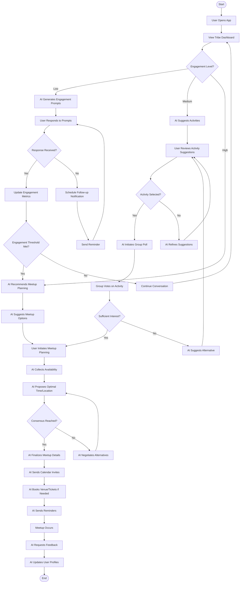

# Technical Specifications

## 1. INTRODUCTION

### 1.1 EXECUTIVE SUMMARY

Tribe is an AI-powered matchmaking and engagement platform designed to create and sustain meaningful small-group connections (4-8 people) and encourage users to transition from digital to physical interactions. The platform specifically focuses on local connections and caters to introverts who may find traditional social networking challenging.

The core business problem Tribe addresses is the growing disconnect between online social networking and meaningful in-person relationships. Despite the proliferation of social media platforms, many people report feeling increasingly isolated and struggle to form genuine connections in their local communities.

#### Key Stakeholders and Users:

| Stakeholder Group | Description |
|-------------------|-------------|
| Primary Users | Individuals seeking meaningful local connections, particularly introverts |
| Community Organizers | Users who create and manage Tribes |
| Local Businesses | Partners for events, venues, and promotional opportunities |
| Investors | Financial backers interested in social technology innovation |

#### Value Proposition:

Tribe differentiates itself by using AI to actively facilitate real-world connections through personality-based matchmaking, automated group formation, and AI-driven engagement tools that encourage and simplify in-person meetups.

### 1.2 SYSTEM OVERVIEW

#### 1.2.1 Project Context

Tribe positions itself in the market as a hybrid between traditional social networks and event planning platforms, with a unique focus on small group dynamics and AI-facilitated real-world interactions. Unlike existing social platforms that primarily focus on digital engagement or one-to-one connections, Tribe emphasizes small group formation based on psychological compatibility and shared interests.

The platform enters a market where users are increasingly experiencing "digital fatigue" and seeking more meaningful connections. Current solutions either lack the psychological foundation for effective group matching or fail to bridge the gap between online interaction and real-world meetups.

#### 1.2.2 High-Level Description

Tribe's primary capabilities include AI-powered matchmaking, personality-based user profiling, AI-driven engagement tools, real-time event recommendations, and optimized planning features.

The system architecture follows a mobile-first approach with a cross-platform application built on React Native, supported by a Node.js backend and leveraging AI services through OpenRouter API.

Major system components include:

| Component | Description |
|-----------|-------------|
| User Profiling System | Collects and analyzes personality traits, interests, and communication styles |
| AI Matchmaking Engine | Forms balanced groups based on compatibility algorithms |
| Engagement Platform | Provides tools for communication, planning, and activity coordination |
| Event Discovery System | Curates and recommends local activities based on group preferences |
| Planning & Logistics Module | Handles scheduling, reservations, and payment splitting |

The core technical approach leverages AI for both initial matchmaking and ongoing engagement, with continuous learning to improve recommendations based on user behavior and feedback.

#### 1.2.3 Success Criteria

##### Measurable Objectives:
- Achieve 50% of matched groups meeting in person within 2 weeks of formation
- Maintain 70% user retention rate after 3 months
- Generate 30% month-over-month growth in active users during the first year

##### Critical Success Factors:
- Accuracy of AI matchmaking in creating compatible groups
- Effectiveness of engagement tools in facilitating real-world meetups
- User satisfaction with group dynamics and activities
- Seamless transition from digital planning to physical meetups

##### Key Performance Indicators (KPIs):
- Number of Tribes formed per week
- Average in-person meetups per Tribe per month
- User engagement metrics (app opens, message exchanges, event RSVPs)
- Conversion rate from digital interaction to physical meetups

### 1.3 SCOPE

#### 1.3.1 In-Scope

##### Core Features and Functionalities:

| Feature Category | Included Elements |
|------------------|-------------------|
| User Profiling | Personality assessment, interest mapping, communication style analysis |
| Group Formation | AI-powered matchmaking, auto-group creation, manual Tribe joining |
| Engagement Tools | Conversation prompts, group challenges, activity suggestions |
| Event Discovery | Local event recommendations, weather-based suggestions, budget options |
| Planning Features | Scheduling assistance, venue recommendations, RSVP tracking |
| Group Management | Logistics coordination, expense tracking, goal setting |
| Gamification | Badges, challenges, leaderboards, rewards system |

##### Implementation Boundaries:

The initial release will support:
- iOS and Android mobile platforms
- English language only
- Major metropolitan areas in the United States
- Integration with popular payment platforms (Stripe, Venmo)
- Local business partnerships in select launch cities

#### 1.3.2 Out-of-Scope

The following elements are explicitly excluded from the initial MVP:
- Web-based platform (mobile-only for MVP)
- International markets and multi-language support
- Corporate or enterprise group management features
- Large group formation (beyond 8 members)
- Custom event creation tools for businesses
- Advanced analytics dashboard for community organizers
- API access for third-party developers
- Virtual meetup facilitation tools

Future phases may consider expanding to include web platforms, international markets, enterprise features, and additional integration points with third-party services.

## 2. PRODUCT REQUIREMENTS

### 2.1 FEATURE CATALOG

#### 2.1.1 AI-Powered Smart Matchmaking & Auto Group Formation

| Metadata | Details |
|----------|---------|
| ID | F-001 |
| Feature Name | AI-Powered Smart Matchmaking & Auto Group Formation |
| Feature Category | Core Functionality |
| Priority Level | Critical |
| Status | Proposed |

**Description:**
- **Overview:** AI system that automatically assigns users to compatible Tribes based on psychological profiles, shared values, and communication styles.
- **Business Value:** Core differentiator that creates balanced, compatible groups more effectively than manual matching.
- **User Benefits:** Reduces social anxiety by automating the group-finding process and ensuring compatibility with group members.
- **Technical Context:** Requires sophisticated AI algorithms to analyze user profiles and optimize group composition.

**Dependencies:**
- **Prerequisite Features:** Personality-Based User Profiling (F-002)
- **System Dependencies:** AI/ML infrastructure, database of user profiles
- **External Dependencies:** OpenRouter API for AI capabilities
- **Integration Requirements:** Integration with notification system for match alerts

#### 2.1.2 Personality-Based Matching & User Profiling

| Metadata | Details |
|----------|---------|
| ID | F-002 |
| Feature Name | Personality-Based Matching & User Profiling |
| Feature Category | Core Functionality |
| Priority Level | Critical |
| Status | Proposed |

**Description:**
- **Overview:** System for collecting and analyzing user personality traits, interests, and communication styles through assessments and ongoing behavior analysis.
- **Business Value:** Provides the foundation for effective matchmaking and personalized engagement.
- **User Benefits:** Creates more meaningful connections based on compatibility rather than superficial factors.
- **Technical Context:** Requires secure storage of sensitive personality data and continuous refinement of user profiles.

**Dependencies:**
- **Prerequisite Features:** User Registration and Authentication (F-008)
- **System Dependencies:** Database for storing user profiles
- **External Dependencies:** Personality assessment frameworks (e.g., Big Five/OCEAN model)
- **Integration Requirements:** Integration with matchmaking algorithms

#### 2.1.3 User-Driven Tribe Creation & Search

| Metadata | Details |
|----------|---------|
| ID | F-003 |
| Feature Name | User-Driven Tribe Creation & Search |
| Feature Category | Core Functionality |
| Priority Level | High |
| Status | Proposed |

**Description:**
- **Overview:** Functionality allowing users to search for existing Tribes or create their own, with limits on membership (max 8 per Tribe) and participation (max 3 Tribes per user).
- **Business Value:** Empowers users to take initiative in forming groups while maintaining optimal group sizes.
- **User Benefits:** Provides flexibility for users who want to create specific types of groups or join existing ones.
- **Technical Context:** Requires robust search functionality and group management systems.

**Dependencies:**
- **Prerequisite Features:** User Registration and Authentication (F-008)
- **System Dependencies:** Database for storing Tribe information
- **External Dependencies:** None
- **Integration Requirements:** Integration with notification system for Tribe invitations

#### 2.1.4 AI-Driven Continuous Engagement

| Metadata | Details |
|----------|---------|
| ID | F-004 |
| Feature Name | AI-Driven Continuous Engagement |
| Feature Category | Engagement |
| Priority Level | High |
| Status | Proposed |

**Description:**
- **Overview:** AI tools that provide conversation prompts, real-time group challenges, and spontaneous activity ideas to maintain group engagement.
- **Business Value:** Increases user retention by preventing group stagnation and encouraging ongoing interaction.
- **User Benefits:** Reduces social awkwardness by providing conversation starters and activity suggestions.
- **Technical Context:** Requires natural language processing capabilities and contextual awareness of group dynamics.

**Dependencies:**
- **Prerequisite Features:** AI-Powered Smart Matchmaking (F-001)
- **System Dependencies:** AI/ML infrastructure
- **External Dependencies:** OpenRouter API for AI capabilities
- **Integration Requirements:** Integration with notification system for engagement prompts

#### 2.1.5 AI-Powered Real-Time Event & Activity Curation

| Metadata | Details |
|----------|---------|
| ID | F-005 |
| Feature Name | AI-Powered Real-Time Event & Activity Curation |
| Feature Category | Content |
| Priority Level | High |
| Status | Proposed |

**Description:**
- **Overview:** System that suggests local events, weather-based activities, and budget-friendly options tailored to group preferences.
- **Business Value:** Facilitates the transition from digital to physical interactions by removing the friction of finding suitable activities.
- **User Benefits:** Saves time in planning and introduces users to new experiences they might not discover on their own.
- **Technical Context:** Requires integration with local event databases and real-time data sources.

**Dependencies:**
- **Prerequisite Features:** Personality-Based User Profiling (F-002)
- **System Dependencies:** Event database, recommendation engine
- **External Dependencies:** Local event APIs, weather APIs
- **Integration Requirements:** Integration with planning and coordination system

#### 2.1.6 AI-Optimized Planning & Coordination

| Metadata | Details |
|----------|---------|
| ID | F-006 |
| Feature Name | AI-Optimized Planning & Coordination |
| Feature Category | Utility |
| Priority Level | Medium |
| Status | Proposed |

**Description:**
- **Overview:** Tools for scheduling, venue recommendations, RSVP tracking, and automated reminders to facilitate meetups.
- **Business Value:** Increases conversion rate from digital interaction to physical meetups.
- **User Benefits:** Reduces planning friction and ensures maximum attendance at events.
- **Technical Context:** Requires calendar integration and scheduling optimization algorithms.

**Dependencies:**
- **Prerequisite Features:** AI-Powered Real-Time Event Curation (F-005)
- **System Dependencies:** Calendar system, notification system
- **External Dependencies:** Booking APIs for venues
- **Integration Requirements:** Integration with payment systems for reservations

#### 2.1.7 AI-Enhanced Group Management

| Metadata | Details |
|----------|---------|
| ID | F-007 |
| Feature Name | AI-Enhanced Group Management |
| Feature Category | Utility |
| Priority Level | Medium |
| Status | Proposed |

**Description:**
- **Overview:** Tools for managing group logistics, tracking expenses, setting shared goals, and monitoring engagement.
- **Business Value:** Improves group cohesion and increases likelihood of sustained engagement.
- **User Benefits:** Simplifies group coordination and provides accountability for meeting social goals.
- **Technical Context:** Requires goal tracking systems and expense management functionality.

**Dependencies:**
- **Prerequisite Features:** User-Driven Tribe Creation (F-003)
- **System Dependencies:** Database for storing group goals and metrics
- **External Dependencies:** Payment processing APIs
- **Integration Requirements:** Integration with engagement tracking systems

#### 2.1.8 User Registration and Authentication

| Metadata | Details |
|----------|---------|
| ID | F-008 |
| Feature Name | User Registration and Authentication |
| Feature Category | Infrastructure |
| Priority Level | Critical |
| Status | Proposed |

**Description:**
- **Overview:** Secure system for user registration, authentication, and profile management.
- **Business Value:** Ensures user data security and provides foundation for personalized experiences.
- **User Benefits:** Protects personal information and enables persistent user profiles.
- **Technical Context:** Requires secure authentication methods and user data storage.

**Dependencies:**
- **Prerequisite Features:** None
- **System Dependencies:** User database, authentication system
- **External Dependencies:** Possibly OAuth providers for social login
- **Integration Requirements:** Integration with personality profiling system

#### 2.1.9 AI-Driven Gamification & Rewards

| Metadata | Details |
|----------|---------|
| ID | F-009 |
| Feature Name | AI-Driven Gamification & Rewards |
| Feature Category | Engagement |
| Priority Level | Medium |
| Status | Proposed |

**Description:**
- **Overview:** System of badges, challenges, streaks, leaderboards, and rewards to incentivize real-world meetups and consistent engagement.
- **Business Value:** Increases user retention and encourages desired behaviors.
- **User Benefits:** Provides motivation and recognition for social achievements.
- **Technical Context:** Requires achievement tracking system and rewards management.

**Dependencies:**
- **Prerequisite Features:** AI-Enhanced Group Management (F-007)
- **System Dependencies:** Achievement database, notification system
- **External Dependencies:** Possibly partner APIs for rewards
- **Integration Requirements:** Integration with engagement tracking systems

### 2.2 FUNCTIONAL REQUIREMENTS TABLE

#### 2.2.1 AI-Powered Smart Matchmaking & Auto Group Formation (F-001)

| Requirement Details | Specifications |
|---------------------|----------------|
| ID: F-001-RQ-001 | **Description:** System must automatically assign users to Tribes based on compatibility algorithms<br>**Acceptance Criteria:** Users receive Tribe matches within 48 hours of opting in<br>**Priority:** Must-Have<br>**Complexity:** High |
| ID: F-001-RQ-002 | **Description:** Users must be able to opt-in for weekly auto-matching<br>**Acceptance Criteria:** Toggle option available in user settings<br>**Priority:** Must-Have<br>**Complexity:** Low |
| ID: F-001-RQ-003 | **Description:** System must maintain balanced groups of 4-8 members<br>**Acceptance Criteria:** No auto-formed Tribe exceeds 8 members or falls below 4<br>**Priority:** Must-Have<br>**Complexity:** Medium |

**Technical Specifications:**
- **Input Parameters:** User profiles, personality data, interests, location, availability
- **Output/Response:** Tribe assignments, compatibility scores, match notifications
- **Performance Criteria:** Matching algorithm must complete within 30 seconds per user
- **Data Requirements:** Access to complete user profiles and historical interaction data

**Validation Rules:**
- **Business Rules:** Groups must be balanced for personality types and interests
- **Data Validation:** Location data must be verified for proximity matching
- **Security Requirements:** Matching data must be encrypted in transit and at rest
- **Compliance Requirements:** User matching preferences must be respected

#### 2.2.2 Personality-Based Matching & User Profiling (F-002)

| Requirement Details | Specifications |
|---------------------|----------------|
| ID: F-002-RQ-001 | **Description:** Users must complete a personality test before joining their first Tribe<br>**Acceptance Criteria:** Test completion is enforced before group assignment<br>**Priority:** Must-Have<br>**Complexity:** Medium |
| ID: F-002-RQ-002 | **Description:** AI must refine group recommendations based on engagement patterns<br>**Acceptance Criteria:** Recommendation algorithm incorporates user interaction history<br>**Priority:** Should-Have<br>**Complexity:** High |
| ID: F-002-RQ-003 | **Description:** Users must be able to view their personality profile<br>**Acceptance Criteria:** Profile page displays personality traits and compatibility metrics<br>**Priority:** Should-Have<br>**Complexity:** Medium |

**Technical Specifications:**
- **Input Parameters:** User responses to personality questions, behavioral data
- **Output/Response:** Personality profile, compatibility metrics, trait visualization
- **Performance Criteria:** Profile generation must complete within 5 seconds
- **Data Requirements:** Secure storage of personality assessment responses

**Validation Rules:**
- **Business Rules:** Personality profiles must be updated at least monthly based on new data
- **Data Validation:** Assessment responses must be checked for consistency
- **Security Requirements:** Personality data must be classified as sensitive information
- **Compliance Requirements:** Users must be able to request deletion of personality data

### 2.3 FEATURE RELATIONSHIPS

#### 2.3.1 Feature Dependencies Map


#### 2.3.2 Integration Points

| Feature | Integration Points |
|---------|-------------------|
| F-001: AI-Powered Smart Matchmaking | Integrates with User Profiling (F-002), Notification System |
| F-005: AI-Powered Real-Time Event Curation | Integrates with external event APIs, weather services, Planning System (F-006) |
| F-006: AI-Optimized Planning & Coordination | Integrates with payment systems (Stripe, Venmo), venue booking APIs |
| F-007: AI-Enhanced Group Management | Integrates with expense tracking, goal setting systems |

#### 2.3.3 Shared Components

| Component | Used By Features |
|-----------|------------------|
| AI Engine | F-001, F-002, F-004, F-005, F-007, F-009 |
| Notification System | F-001, F-003, F-004, F-006, F-009 |
| User Profile Database | F-001, F-002, F-003, F-007, F-008 |
| Event Recommendation Engine | F-004, F-005, F-006 |

### 2.4 IMPLEMENTATION CONSIDERATIONS

#### 2.4.1 Technical Constraints

| Feature | Technical Constraints |
|---------|----------------------|
| F-001: AI-Powered Smart Matchmaking | Requires significant computational resources for complex matching algorithms |
| F-005: AI-Powered Real-Time Event Curation | Dependent on availability and quality of local event data sources |
| F-006: AI-Optimized Planning & Coordination | Requires integration with multiple external booking and payment systems |
| F-008: User Registration and Authentication | Must comply with data protection regulations across different jurisdictions |

#### 2.4.2 Performance Requirements

| Feature | Performance Requirements |
|---------|--------------------------|
| F-001: AI-Powered Smart Matchmaking | Matching algorithm must complete within 30 seconds per user |
| F-004: AI-Driven Continuous Engagement | Engagement prompts must be generated within 3 seconds of request |
| F-005: AI-Powered Real-Time Event Curation | Event recommendations must be generated within 5 seconds |
| F-008: User Registration and Authentication | Authentication process must complete within 2 seconds |

#### 2.4.3 Scalability Considerations

| Feature | Scalability Considerations |
|---------|----------------------------|
| F-001: AI-Powered Smart Matchmaking | Algorithm complexity increases exponentially with user base growth |
| F-003: User-Driven Tribe Creation & Search | Search functionality must scale to handle thousands of concurrent searches |
| F-005: AI-Powered Real-Time Event Curation | Event database must scale to accommodate multiple geographic regions |
| F-007: AI-Enhanced Group Management | Must support thousands of active Tribes simultaneously |

#### 2.4.4 Security Implications

| Feature | Security Implications |
|---------|----------------------|
| F-002: Personality-Based Matching | Contains sensitive personal data requiring enhanced protection |
| F-006: AI-Optimized Planning & Coordination | Handles payment information requiring PCI compliance |
| F-007: AI-Enhanced Group Management | Contains private group communications requiring encryption |
| F-008: User Registration and Authentication | Critical security component requiring robust protection against attacks |

#### 2.4.5 Traceability Matrix

| Requirement ID | Feature ID | Business Need | Validation Method |
|----------------|------------|---------------|-------------------|
| F-001-RQ-001 | F-001 | Core matchmaking functionality | Automated testing of match quality |
| F-002-RQ-001 | F-002 | Ensure quality profile data | User flow validation |
| F-003-RQ-001 | F-003 | User autonomy in group formation | User acceptance testing |
| F-004-RQ-001 | F-004 | Maintain group engagement | Engagement metrics analysis |

## 3. TECHNOLOGY STACK

### 3.1 PROGRAMMING LANGUAGES

| Component | Language | Version | Justification |
|-----------|----------|---------|---------------|
| Mobile Frontend | JavaScript/TypeScript | TypeScript 4.9+ | Provides type safety for complex UI interactions and integrates seamlessly with React Native |
| Backend | JavaScript/TypeScript | Node.js 18+ | Enables shared code between frontend and backend, reducing development time and maintenance overhead |
| AI Services | Python | 3.10+ | Industry standard for AI/ML implementations with robust library support for natural language processing and recommendation systems |
| Database Access | SQL | PostgreSQL dialect | Required for complex queries across user profiles, group relationships, and engagement metrics |

The selection of JavaScript/TypeScript for both frontend and backend creates a unified development experience, allowing for shared types, utilities, and business logic. Python is specifically used for AI components due to its extensive machine learning ecosystem and integration capabilities with OpenRouter API.

### 3.2 FRAMEWORKS & LIBRARIES

#### 3.2.1 Frontend Frameworks

| Framework/Library | Version | Purpose | Justification |
|-------------------|---------|---------|---------------|
| React Native | 0.72+ | Cross-platform mobile development | Enables single codebase for iOS and Android, critical for rapid MVP deployment |
| Redux Toolkit | 1.9+ | State management | Provides predictable state management for complex user interactions and real-time updates |
| React Navigation | 6.0+ | Navigation management | Handles complex navigation flows between user profiles, group interactions, and event planning |
| React Native Maps | 1.7+ | Location services | Essential for local event discovery and meetup coordination |
| React Native Calendar | 1.1+ | Event scheduling | Required for AI-optimized planning and coordination feature |

#### 3.2.2 Backend Frameworks

| Framework/Library | Version | Purpose | Justification |
|-------------------|---------|---------|---------------|
| Express.js/Nest.js | 5.0+/10.0+ | API framework | Provides structured approach to building scalable APIs with middleware support |
| Prisma | 4.16+ | ORM | Type-safe database access with migration support for evolving data models |
| Socket.io | 4.7+ | Real-time communication | Enables instant messaging and live updates for group coordination |
| Passport.js | 0.6+ | Authentication | Flexible authentication middleware supporting multiple strategies |
| Bull | 4.10+ | Job queue | Manages asynchronous tasks like AI matchmaking and notification delivery |

#### 3.2.3 AI/ML Libraries

| Framework/Library | Version | Purpose | Justification |
|-------------------|---------|---------|---------------|
| OpenRouter SDK | Latest | AI service integration | Provides access to multiple AI models through a unified API |
| TensorFlow.js | 4.10+ | Client-side ML | Enables lightweight ML operations directly on client devices |
| scikit-learn | 1.3+ | Machine learning | Powers recommendation systems and user clustering algorithms |
| pandas | 2.0+ | Data manipulation | Processes user interaction data for AI model training |
| FastAPI | 0.100+ | AI microservices | Creates high-performance API endpoints for AI services |

### 3.3 DATABASES & STORAGE

| Database/Storage | Version | Purpose | Justification |
|------------------|---------|---------|---------------|
| PostgreSQL | 15+ | Primary database | Provides robust relational data storage with advanced query capabilities for complex social relationships |
| Redis | 7.0+ | Caching & session storage | Improves performance for frequently accessed data and supports real-time features |
| Amazon S3 | Latest | Media storage | Scalable solution for user-generated content and profile images |
| ElasticSearch | 8.0+ | Search engine | Powers advanced search capabilities for Tribes, events, and interests |
| TimescaleDB | 2.10+ | Time-series data | Extension for PostgreSQL to handle engagement metrics and activity tracking |

**Data Persistence Strategy:**
- Transactional data stored in PostgreSQL with regular backups
- Frequently accessed data cached in Redis with appropriate TTL
- User media stored in S3 with CDN distribution
- Search indexes maintained in ElasticSearch with automated reindexing
- Time-series analytics data stored in TimescaleDB for efficient querying

### 3.4 THIRD-PARTY SERVICES

| Service Category | Provider | Purpose | Justification |
|------------------|----------|---------|---------------|
| AI/ML | OpenRouter API | AI capabilities | Provides access to state-of-the-art language models for engagement and matchmaking |
| Authentication | Auth0 | User authentication | Secure, compliant authentication with social login support |
| Payments | Stripe, Venmo API | Payment processing | Handles secure payment splitting and event bookings |
| Event Data | Eventbrite, Meetup APIs | Event discovery | Sources local events for AI recommendations |
| Location | Google Places API | Venue information | Provides detailed venue data for meetup planning |
| Notifications | Firebase Cloud Messaging | Push notifications | Cross-platform notification delivery for engagement prompts |
| Analytics | Mixpanel | User behavior tracking | Measures engagement and conversion metrics |
| Weather | OpenWeatherMap API | Weather data | Supports weather-based activity recommendations |

**Integration Requirements:**
- All third-party services must support OAuth 2.0 where applicable
- API rate limiting strategies implemented for all external services
- Fallback mechanisms for critical services in case of outages
- Secure credential management using environment variables and secrets management

### 3.5 DEVELOPMENT & DEPLOYMENT

#### 3.5.1 Development Tools

| Tool | Version | Purpose | Justification |
|------|---------|---------|---------------|
| Visual Studio Code | Latest | IDE | Supports JavaScript/TypeScript development with extensive plugin ecosystem |
| ESLint/Prettier | 8.0+/3.0+ | Code quality | Enforces consistent code style and catches common errors |
| Jest | 29.0+ | Testing framework | Comprehensive testing for both frontend and backend |
| Postman | Latest | API testing | Simplifies API development and testing |
| Git | Latest | Version control | Industry standard for collaborative development |

#### 3.5.2 DevOps & Infrastructure

| Tool/Service | Version | Purpose | Justification |
|--------------|---------|---------|---------------|
| Docker | 24.0+ | Containerization | Ensures consistent development and production environments |
| Kubernetes | 1.27+ | Container orchestration | Manages scalable deployment of microservices |
| GitHub Actions | Latest | CI/CD | Automates testing and deployment workflows |
| AWS/Firebase | Latest | Cloud hosting | Provides scalable infrastructure for application components |
| Terraform | 1.5+ | Infrastructure as code | Manages cloud resources with version-controlled configuration |
| New Relic | Latest | Monitoring | Provides application performance monitoring and alerting |

#### 3.5.3 Deployment Architecture


### 3.6 TECHNOLOGY CONSTRAINTS & CONSIDERATIONS

| Constraint | Impact | Mitigation Strategy |
|------------|--------|---------------------|
| Mobile-only MVP | Limited initial reach | Design backend APIs to support future web client |
| AI processing latency | User experience during matching | Implement background processing with notifications |
| Third-party API reliability | Dependency on external services | Implement caching and fallback mechanisms |
| Data privacy regulations | Handling of personality data | Design data storage with privacy-by-design principles |
| Cross-platform consistency | UI/UX differences | Implement platform-specific adaptations where necessary |
| Scalability for group matching | Computational complexity | Optimize algorithms and implement batch processing |

The technology stack has been designed to prioritize rapid MVP development while establishing a foundation for future scalability. The mobile-first approach with React Native enables quick market entry on both iOS and Android platforms, while the Node.js backend provides flexibility for the complex social interactions required by the platform. The AI components leverage industry-standard tools and the OpenRouter API to deliver sophisticated matching and engagement features without requiring extensive AI infrastructure development.

## 4. PROCESS FLOWCHART

### 4.1 SYSTEM WORKFLOWS

#### 4.1.1 Core Business Processes

##### User Onboarding and Tribe Formation


##### In-App Engagement and Meetup Planning



##### Real-World Meetup Execution


#### 4.1.2 Integration Workflows

##### AI Matchmaking Process


##### Event Discovery and Recommendation


### 4.2 FLOWCHART REQUIREMENTS

#### 4.2.1 User Registration and Profile Creation


#### 4.2.2 AI-Powered Matchmaking Process


#### 4.2.3 Event Planning and Coordination


### 4.3 TECHNICAL IMPLEMENTATION

#### 4.3.1 State Management

##### User Profile State Transitions


##### Tribe Lifecycle States


#### 4.3.2 Error Handling

##### Authentication Error Flow


##### Meetup Planning Error Recovery


### 4.4 INTEGRATION SEQUENCE DIAGRAMS

#### 4.4.1 User Authentication and Profile Creation


#### 4.4.2 Tribe Formation and Matchmaking


#### 4.4.3 Event Planning and Execution


## 5. SYSTEM ARCHITECTURE

### 5.1 HIGH-LEVEL ARCHITECTURE

#### 5.1.1 System Overview

Tribe employs a microservices-based architecture to support its AI-powered matchmaking and engagement platform. This architectural approach was selected to enable independent scaling of critical components, facilitate rapid feature development, and support the diverse technical requirements of the system.

- **Architectural Style**: Microservices architecture with event-driven communication patterns for real-time features and RESTful APIs for synchronous operations
- **Key Architectural Principles**:
  - Separation of concerns between user-facing services and AI processing components
  - Event-driven design for real-time notifications and updates
  - Domain-driven design for clear boundaries between business capabilities
  - Cloud-native approach for scalability and resilience
  - Mobile-first design with offline capabilities

- **System Boundaries**:
  - Client applications (iOS and Android) as the primary user interface
  - External service integrations for events, payments, and location data
  - AI services boundary for personality analysis and matchmaking
  - Data persistence layer for user profiles, tribes, and engagement metrics

#### 5.1.2 Core Components Table

| Component Name | Primary Responsibility | Key Dependencies | Critical Considerations |
|----------------|------------------------|------------------|-------------------------|
| Mobile Client | User interface, local data caching, offline capabilities | Authentication Service, Profile Service, Tribe Service | Must support both iOS and Android with consistent experience |
| Authentication Service | User registration, authentication, session management | User Database, External OAuth Providers | Security, compliance with data protection regulations |
| Profile Service | Personality assessment, user profile management | AI Analysis Service, User Database | Privacy of sensitive personality data |
| Tribe Service | Group formation, tribe management, member interactions | Profile Service, Matching Service | Real-time updates for group activities |
| Matching Service | AI-powered user compatibility analysis, tribe formation algorithms | Profile Service, AI Engine | Computational efficiency, accuracy of matches |
| Engagement Service | Conversation prompts, challenges, activity suggestions | AI Engine, Tribe Service, Event Service | Contextual relevance, timing of suggestions |
| Event Service | Event discovery, recommendations, weather-based suggestions | External Event APIs, Location Service | Data freshness, geographic relevance |
| Planning Service | Scheduling, venue recommendations, RSVP tracking | Calendar APIs, Venue APIs, Notification Service | Coordination across time zones, handling conflicts |
| Payment Service | Split payments, venue bookings, expense tracking | External Payment Providers, Planning Service | Security, transaction integrity |
| Notification Service | Push notifications, in-app alerts, email communications | All services, Push Notification Providers | Delivery reliability, user preferences |
| AI Engine | Natural language processing, recommendation algorithms, personality analysis | OpenRouter API, Profile Service, Engagement Service | Model performance, API rate limits |

#### 5.1.3 Data Flow Description

The Tribe platform's data flows are centered around user profiles, tribe interactions, and event coordination:

- **User Onboarding Flow**: User registration data flows from the Mobile Client to the Authentication Service, which creates user credentials. The Profile Service then collects personality assessment data, which is processed by the AI Engine to generate a personality profile stored in the User Database.

- **Matchmaking Flow**: The Profile Service provides user profile data to the Matching Service, which uses the AI Engine to analyze compatibility and form tribes. Match results flow to the Tribe Service, which creates tribe entities and notifies users via the Notification Service.

- **Engagement Flow**: User interactions within tribes flow from the Mobile Client to the Tribe Service. The Engagement Service monitors activity levels and uses the AI Engine to generate contextual prompts and challenges, which are delivered to users via the Notification Service.

- **Event Planning Flow**: The Event Service aggregates data from external Event APIs and the user's location to generate recommendations. The Planning Service coordinates scheduling by collecting availability data from tribe members, determining optimal meeting times, and managing RSVPs. Booking confirmations flow through the Payment Service for financial transactions.

- **Data Persistence Strategy**: User profiles, personality data, and tribe relationships are stored in the primary PostgreSQL database. Real-time chat messages use Redis for temporary storage before being persisted. Event recommendations and activity data are cached for performance but refreshed regularly from external sources.

#### 5.1.4 External Integration Points

| System Name | Integration Type | Data Exchange Pattern | Protocol/Format | SLA Requirements |
|-------------|------------------|------------------------|-----------------|------------------|
| OpenRouter API | AI Services | Request-Response | REST/JSON | 99.5% availability, <2s response time |
| Auth0 | Authentication | OAuth 2.0 | REST/JSON | 99.9% availability, <1s response time |
| Stripe/Venmo | Payment Processing | Webhook/API | REST/JSON | 99.95% availability, <3s transaction time |
| Eventbrite/Meetup | Event Discovery | Polling/Webhook | REST/JSON | 99% availability, <5s response time |
| Google Places | Location Services | Request-Response | REST/JSON | 99.5% availability, <2s response time |
| Firebase Cloud Messaging | Push Notifications | Publish-Subscribe | REST/JSON | 99.5% delivery rate, <5s delivery time |
| OpenWeatherMap | Weather Data | Polling | REST/JSON | 99% availability, <3s response time |

### 5.2 COMPONENT DETAILS

#### 5.2.1 Mobile Client

- **Purpose**: Provides the primary user interface for the Tribe platform, enabling users to create profiles, join tribes, plan events, and engage with other members.
- **Technologies**: React Native, Redux Toolkit, React Navigation
- **Key Interfaces**:
  - Authentication API for user login/registration
  - Profile API for personality assessment and profile management
  - Tribe API for group interactions
  - Event API for discovering and planning activities
- **Data Persistence**: Local SQLite database for offline capabilities, secure storage for authentication tokens
- **Scaling Considerations**: Efficient data synchronization, bandwidth optimization, battery usage management


#### 5.2.2 Authentication Service

- **Purpose**: Manages user registration, authentication, and session management
- **Technologies**: Node.js, Express.js, Auth0 integration, JWT
- **Key Interfaces**:
  - Registration API for creating new user accounts
  - Authentication API for validating credentials
  - Token refresh API for maintaining sessions
- **Data Persistence**: User credentials stored securely in PostgreSQL with encryption
- **Scaling Considerations**: Stateless design for horizontal scaling, token validation caching


#### 5.2.3 Profile Service

- **Purpose**: Manages user profiles, personality assessments, and preference settings
- **Technologies**: Node.js, Express.js, Prisma ORM
- **Key Interfaces**:
  - Profile API for retrieving and updating user information
  - Assessment API for personality test management
  - Preference API for user settings
- **Data Persistence**: User profiles stored in PostgreSQL, personality data with enhanced security
- **Scaling Considerations**: Caching of read-heavy profile data, batch processing for profile updates


#### 5.2.4 Tribe Service

- **Purpose**: Manages tribe creation, membership, and group interactions
- **Technologies**: Node.js, Express.js, Socket.io for real-time features
- **Key Interfaces**:
  - Tribe API for creating and managing tribes
  - Membership API for joining/leaving tribes
  - Activity API for tracking tribe engagement
- **Data Persistence**: Tribe data and relationships in PostgreSQL, real-time chat in Redis
- **Scaling Considerations**: Sharding by tribe ID, caching of active tribe data

```mermaid
stateDiagram-v2
    [*] --> Created
    Created --> Forming: Initial Members Joining
    Forming --> Active: Minimum Members Reached
    Active --> Engaged: First Meetup Completed
    Engaged --> Established: Regular Meetups
    
    Active --> AtRisk: Low Activity
    AtRisk --> Active: Activity Resumed
    AtRisk --> Inactive: No Activity
    Inactive --> Dissolved: Extended Inactivity
    
    Established --> AtRisk: Activity Decline
    
    Dissolved --> [*]
```

#### 5.2.5 Matching Service

- **Purpose**: Implements AI-powered matchmaking algorithms for tribe formation
- **Technologies**: Node.js, Python for ML components, Redis for job processing
- **Key Interfaces**:
  - Matching API for initiating and retrieving match results
  - Compatibility API for analyzing user compatibility
  - Recommendation API for suggesting tribes to users
- **Data Persistence**: Match results cached in Redis, historical match data in PostgreSQL
- **Scaling Considerations**: Compute-intensive operations, batch processing for matching jobs

```mermaid
sequenceDiagram
    participant User
    participant MobileClient
    participant MatchingService
    participant ProfileService
    participant AIEngine
    participant TribeService
    
    User->>MobileClient: Request Auto-Matching
    MobileClient->>MatchingService: Initiate Matching
    MatchingService->>ProfileService: Fetch User Profile
    ProfileService->>MatchingService: Return Profile Data
    MatchingService->>AIEngine: Process Compatibility
    
    AIEngine->>MatchingService: Return Match Results
    
    alt Join Existing Tribe
        MatchingService->>TribeService: Add User to Tribe
        TribeService->>MatchingService: Confirm Addition
    else Create New Tribe
        MatchingService->>TribeService: Create New Tribe
        TribeService->>MatchingService: Return New Tribe ID
    end
    
    MatchingService->>MobileClient: Return Match Results
    MobileClient->>User: Display Tribe Assignment
```

#### 5.2.6 Engagement Service

- **Purpose**: Generates AI-driven engagement prompts and monitors group activity
- **Technologies**: Node.js, Express.js, OpenRouter API integration
- **Key Interfaces**:
  - Prompt API for generating conversation starters
  - Challenge API for creating group activities
  - Engagement API for tracking interaction metrics
- **Data Persistence**: Engagement metrics in TimescaleDB, prompt templates in PostgreSQL
- **Scaling Considerations**: Caching of frequently used prompts, rate limiting for AI requests

```mermaid
sequenceDiagram
    participant TribeService
    participant EngagementService
    participant AIEngine
    participant NotificationService
    participant MobileClient
    
    TribeService->>EngagementService: Report Low Activity
    EngagementService->>AIEngine: Request Engagement Prompt
    AIEngine->>EngagementService: Return Personalized Prompt
    EngagementService->>NotificationService: Send Prompt to Tribe
    NotificationService->>MobileClient: Deliver Notification
    MobileClient->>EngagementService: Track User Response
    EngagementService->>TribeService: Update Engagement Metrics
```

### 5.3 TECHNICAL DECISIONS

#### 5.3.1 Architecture Style Decisions

| Decision | Options Considered | Selected Approach | Rationale |
|----------|-------------------|-------------------|-----------|
| Overall Architecture | Monolithic, Microservices, Serverless | Microservices | Enables independent scaling of AI components, supports rapid feature development, and allows specialized technology choices for different domains |
| Communication Pattern | REST, GraphQL, gRPC, Event-driven | REST + Event-driven hybrid | REST for standard CRUD operations, event-driven for real-time features and asynchronous processing |
| Mobile Strategy | Native, Hybrid, PWA | React Native (Hybrid) | Balances development efficiency with near-native performance, critical for MVP timeline |
| AI Integration | Custom ML models, Third-party APIs | OpenRouter API with custom processing | Leverages existing AI capabilities while allowing for specialized processing of personality and matching data |

```mermaid
graph TD
    A[Architecture Decision] --> B{Scalability Requirements?}
    B -->|High| C{Real-time Features?}
    B -->|Low| D[Monolithic]
    C -->|Yes| E[Microservices + Event-driven]
    C -->|No| F[Microservices + REST]
    
    G[Mobile Strategy Decision] --> H{Development Timeline?}
    H -->|Short| I{Performance Critical?}
    H -->|Long| J[Native Development]
    I -->|Yes| K[React Native]
    I -->|No| L[PWA]
```

#### 5.3.2 Data Storage Solution Rationale

| Data Type | Storage Solution | Justification |
|-----------|------------------|---------------|
| User Profiles | PostgreSQL | Relational integrity for complex user-tribe relationships, ACID compliance for critical user data |
| Personality Data | PostgreSQL with encryption | Security and privacy requirements for sensitive personal information |
| Real-time Chat | Redis + PostgreSQL | Redis for low-latency message delivery, PostgreSQL for persistent storage |
| Engagement Metrics | TimescaleDB | Optimized for time-series data, efficient querying of historical engagement patterns |
| Media Content | Amazon S3 | Scalable object storage for user-generated content, CDN integration for fast delivery |
| Search Indexes | ElasticSearch | Specialized full-text search capabilities for tribe and event discovery |

#### 5.3.3 Caching Strategy Justification

| Cache Type | Implementation | Use Case | Justification |
|------------|----------------|----------|---------------|
| API Response Cache | Redis | Frequently accessed data | Reduces database load, improves response times for common requests |
| User Profile Cache | Redis | Active user profiles | Reduces latency for profile-dependent operations like matchmaking |
| Tribe Data Cache | Redis | Active tribe information | Supports real-time tribe interactions with minimal latency |
| Event Recommendation Cache | Redis | Personalized event suggestions | Improves performance for recommendation display while allowing background refreshes |
| Authentication Token Cache | Redis | Token validation | Reduces authentication overhead for frequent API calls |

#### 5.3.4 Security Mechanism Selection

| Security Concern | Selected Mechanism | Rationale |
|------------------|-------------------|-----------|
| Authentication | JWT + OAuth 2.0 | Industry standard for secure authentication, supports social login integration |
| Data Protection | Field-level encryption | Protects sensitive personality data while allowing analysis |
| API Security | Rate limiting, HTTPS, CORS | Prevents abuse, ensures secure transmission, controls access |
| Mobile Security | Secure storage, certificate pinning | Protects local data and API communications on mobile devices |
| Payment Processing | PCI-compliant third-party services | Offloads payment security compliance to specialized providers |

### 5.4 CROSS-CUTTING CONCERNS

#### 5.4.1 Monitoring and Observability Approach

Tribe implements a comprehensive monitoring strategy to ensure system health and performance:

- **Infrastructure Monitoring**: AWS CloudWatch/Firebase monitoring for resource utilization and availability
- **Application Performance Monitoring**: New Relic for end-to-end transaction tracing and performance metrics
- **User Experience Monitoring**: Custom analytics to track engagement, conversion rates, and feature usage
- **AI Performance Monitoring**: Specialized metrics for matching quality, recommendation relevance, and AI response times
- **Alerting Strategy**: Tiered alerting based on severity, with automated remediation for common issues

Key metrics tracked include:
- API response times (95th percentile < 500ms)
- Matching algorithm completion time (< 30 seconds)
- Tribe formation success rate (> 95%)
- Real-world meetup conversion rate (> 50%)
- System availability (99.9% uptime)

#### 5.4.2 Logging and Tracing Strategy

| Component | Logging Approach | Retention Policy | Key Log Events |
|-----------|------------------|------------------|----------------|
| Mobile Client | Local logging with upload | 7 days local, 30 days server | User interactions, error events, performance metrics |
| Backend Services | Structured JSON logging | 90 days | API requests, authentication events, service interactions |
| AI Engine | Detailed operation logging | 30 days | Model invocations, processing times, input/output samples |
| Database | Transaction and query logging | 14 days | Slow queries, errors, schema changes |

The logging system implements:
- Correlation IDs for request tracing across services
- Structured log format for automated analysis
- Log level filtering based on environment
- PII redaction for privacy compliance

#### 5.4.3 Error Handling Patterns

Tribe implements a multi-layered error handling strategy:

- **Client-Side Error Handling**: Graceful degradation, offline support, and retry mechanisms
- **API Error Standardization**: Consistent error response format with error codes and user-friendly messages
- **Service Resilience**: Circuit breakers for external dependencies, fallback mechanisms for critical features
- **Error Aggregation**: Centralized error collection and analysis for proactive issue resolution

```mermaid
flowchart TD
    A[Error Detected] --> B{Error Type?}
    
    B -->|Transient| C[Implement Retry with Backoff]
    C --> D{Retry Successful?}
    D -->|Yes| E[Continue Operation]
    D -->|No| F[Escalate to Fallback]
    
    B -->|Dependency Failure| G[Activate Circuit Breaker]
    G --> H[Use Cached Data if Available]
    H --> I[Degrade Functionality Gracefully]
    
    B -->|Client Error| J[Return Actionable Feedback]
    J --> K[Log Error Details]
    
    B -->|Server Error| L[Return Generic Message]
    L --> M[Log Detailed Error]
    M --> N[Trigger Alert]
    
    F --> O[Log Failed Operation]
    I --> O
    K --> P[Aggregate for Analysis]
    N --> P
    
    E --> Q[Operation Complete]
    O --> R[User Notified]
    P --> S[DevOps Investigation]
```

#### 5.4.4 Authentication and Authorization Framework

The authentication and authorization system for Tribe is designed to balance security with user experience:

- **Authentication Methods**:
  - Email/password with strong password requirements
  - Social login (Google, Apple, Facebook) for frictionless onboarding
  - Phone number verification for additional security

- **Authorization Model**:
  - Role-based access control for administrative functions
  - Resource-based permissions for tribe content and activities
  - Attribute-based access for feature availability based on user status

- **Security Measures**:
  - JWT with short expiration and refresh token rotation
  - Rate limiting for authentication attempts
  - Device fingerprinting for suspicious activity detection
  - Secure storage of authentication tokens on mobile devices

#### 5.4.5 Disaster Recovery Procedures

| Scenario | Recovery Approach | RTO | RPO | Testing Frequency |
|----------|-------------------|-----|-----|-------------------|
| Database Failure | Automated failover to replica | 5 minutes | < 1 minute | Monthly |
| Service Outage | Container orchestration auto-recovery | 2 minutes | 0 (stateless) | Weekly health checks |
| Region Failure | Multi-region deployment with DNS failover | 30 minutes | 5 minutes | Quarterly |
| Data Corruption | Point-in-time recovery from backups | 1 hour | 1 hour | Monthly verification |
| API Dependency Failure | Circuit breaking with degraded functionality | Immediate | 0 (cached data) | Continuous monitoring |

Key disaster recovery principles:
- Regular automated backups with encryption
- Documented recovery procedures with assigned responsibilities
- Regular recovery testing and validation
- Incremental recovery capability for partial system restoration

## 6. SYSTEM COMPONENTS DESIGN

### 6.1 COMPONENT ARCHITECTURE

#### 6.1.1 Component Diagram

```mermaid
graph TD
    subgraph "Client Layer"
        MobileApp["Mobile Application"]
        MobileApp --> AuthModule["Authentication Module"]
        MobileApp --> ProfileModule["Profile & Personality Module"]
        MobileApp --> TribeModule["Tribe Management Module"]
        MobileApp --> EventModule["Event & Planning Module"]
        MobileApp --> EngagementModule["Engagement & Gamification Module"]
    end

    subgraph "API Gateway Layer"
        APIGateway["API Gateway"]
        MobileApp --> APIGateway
    end

    subgraph "Service Layer"
        AuthService["Authentication Service"]
        ProfileService["Profile Service"]
        TribeService["Tribe Service"]
        MatchingService["Matching Service"]
        EventService["Event Service"]
        PlanningService["Planning Service"]
        EngagementService["Engagement Service"]
        NotificationService["Notification Service"]
        PaymentService["Payment Service"]
        
        APIGateway --> AuthService
        APIGateway --> ProfileService
        APIGateway --> TribeService
        APIGateway --> MatchingService
        APIGateway --> EventService
        APIGateway --> PlanningService
        APIGateway --> EngagementService
        APIGateway --> NotificationService
        APIGateway --> PaymentService
    end

    subgraph "AI Layer"
        AIEngine["AI Engine"]
        MatchingAlgorithm["Matching Algorithm"]
        RecommendationEngine["Recommendation Engine"]
        EngagementGenerator["Engagement Generator"]
        
        MatchingService --> AIEngine
        EventService --> AIEngine
        EngagementService --> AIEngine
        ProfileService --> AIEngine
        
        AIEngine --> MatchingAlgorithm
        AIEngine --> RecommendationEngine
        AIEngine --> EngagementGenerator
    end

    subgraph "External Integration Layer"
        OpenRouterAPI["OpenRouter API"]
        EventAPIs["Event APIs"]
        LocationAPIs["Location APIs"]
        PaymentAPIs["Payment APIs"]
        WeatherAPI["Weather API"]
        
        AIEngine --> OpenRouterAPI
        EventService --> EventAPIs
        PlanningService --> LocationAPIs
        PaymentService --> PaymentAPIs
        EventService --> WeatherAPI
    end

    subgraph "Data Layer"
        UserDB["User Database"]
        TribeDB["Tribe Database"]
        EventDB["Event Database"]
        EngagementDB["Engagement Metrics"]
        MediaStorage["Media Storage"]
        
        AuthService --> UserDB
        ProfileService --> UserDB
        TribeService --> TribeDB
        MatchingService --> UserDB
        MatchingService --> TribeDB
        EventService --> EventDB
        EngagementService --> EngagementDB
        TribeService --> MediaStorage
    end
```

#### 6.1.2 Component Interaction Matrix

| Component | Interacts With | Interaction Type | Purpose |
|-----------|----------------|------------------|---------|
| Mobile Application | API Gateway | REST/WebSocket | All client-server communication |
| API Gateway | All Services | REST | Request routing, authentication, rate limiting |
| Authentication Service | User Database | CRUD | User credential management |
| Profile Service | User Database, AI Engine | CRUD, API | Profile management, personality analysis |
| Tribe Service | Tribe Database, Notification Service | CRUD, Event | Tribe management, member notifications |
| Matching Service | AI Engine, User Database, Tribe Database | API, CRUD | User matching, tribe formation |
| Event Service | Event Database, External Event APIs, Weather API | CRUD, API | Event discovery, recommendations |
| Planning Service | Event Database, Location APIs | CRUD, API | Meetup scheduling, venue selection |
| Engagement Service | AI Engine, Engagement Database | API, CRUD | Generating prompts, tracking engagement |
| Notification Service | All Services | Event | Delivering notifications to users |
| Payment Service | Payment APIs, User Database | API, CRUD | Processing payments, expense tracking |
| AI Engine | OpenRouter API | API | AI processing for various features |

### 6.2 MOBILE CLIENT DESIGN

#### 6.2.1 Screen Flow Diagram

```mermaid
graph TD
    SplashScreen --> OnboardingScreen
    OnboardingScreen --> AuthScreen
    
    AuthScreen --> RegistrationScreen
    AuthScreen --> LoginScreen
    RegistrationScreen --> PersonalityAssessmentScreen
    LoginScreen --> HomeScreen
    PersonalityAssessmentScreen --> HomeScreen
    
    HomeScreen --> ProfileScreen
    HomeScreen --> TribeListScreen
    HomeScreen --> DiscoveryScreen
    HomeScreen --> NotificationsScreen
    
    TribeListScreen --> TribeDetailScreen
    TribeDetailScreen --> TribeChatScreen
    TribeDetailScreen --> MemberListScreen
    TribeDetailScreen --> EventPlanningScreen
    
    EventPlanningScreen --> EventSuggestionScreen
    EventPlanningScreen --> AvailabilitySelectionScreen
    EventPlanningScreen --> VenueSelectionScreen
    EventPlanningScreen --> PaymentSplitScreen
    
    DiscoveryScreen --> TribeSearchScreen
    DiscoveryScreen --> CreateTribeScreen
    DiscoveryScreen --> EventDiscoveryScreen
    
    ProfileScreen --> PersonalityProfileScreen
    ProfileScreen --> AchievementsScreen
    ProfileScreen --> SettingsScreen
    
    NotificationsScreen --> EventDetailScreen
    NotificationsScreen --> TribeInviteScreen
    NotificationsScreen --> EngagementPromptScreen
```

#### 6.2.2 Key Screen Descriptions

| Screen | Purpose | Key Components | Interactions |
|--------|---------|----------------|--------------|
| Onboarding | Introduce app concept | Carousel, Sign-up CTA | Swipe through intro, tap to register |
| Personality Assessment | Collect user traits | Question cards, Progress indicator | Answer questions, submit assessment |
| Home | Central navigation hub | Tribe cards, Event suggestions, Engagement prompts | Navigate to main sections, quick actions |
| Tribe Detail | Manage specific tribe | Member list, Activity feed, Meetup schedule | View tribe info, plan events, chat |
| Event Planning | Coordinate meetups | Date picker, Venue suggestions, RSVP tracker | Select date/time, choose venue, invite members |
| Discovery | Find tribes and events | Search bar, Filters, Recommendation cards | Search/filter tribes, browse events |
| Personality Profile | View trait analysis | Trait visualization, Compatibility metrics | View personality breakdown, see tribe fit |

#### 6.2.3 Mobile Component Structure

```mermaid
graph TD
    subgraph "Core Components"
        AppContainer["App Container"]
        NavigationService["Navigation Service"]
        AuthManager["Auth Manager"]
        APIClient["API Client"]
        StorageManager["Storage Manager"]
        NotificationHandler["Notification Handler"]
        OfflineManager["Offline Manager"]
    end
    
    subgraph "Feature Components"
        ProfileComponents["Profile Components"]
        TribeComponents["Tribe Components"]
        EventComponents["Event Components"]
        ChatComponents["Chat Components"]
        EngagementComponents["Engagement Components"]
        PaymentComponents["Payment Components"]
    end
    
    subgraph "UI Components"
        UIKit["UI Kit"]
        ThemeProvider["Theme Provider"]
        FormComponents["Form Components"]
        FeedComponents["Feed Components"]
        CardComponents["Card Components"]
        ModalComponents["Modal Components"]
        AnimationComponents["Animation Components"]
    end
    
    AppContainer --> NavigationService
    AppContainer --> AuthManager
    AppContainer --> APIClient
    AppContainer --> StorageManager
    AppContainer --> NotificationHandler
    AppContainer --> OfflineManager
    
    NavigationService --> ProfileComponents
    NavigationService --> TribeComponents
    NavigationService --> EventComponents
    NavigationService --> ChatComponents
    NavigationService --> EngagementComponents
    NavigationService --> PaymentComponents
    
    ProfileComponents --> UIKit
    TribeComponents --> UIKit
    EventComponents --> UIKit
    ChatComponents --> UIKit
    EngagementComponents --> UIKit
    PaymentComponents --> UIKit
    
    UIKit --> ThemeProvider
    UIKit --> FormComponents
    UIKit --> FeedComponents
    UIKit --> CardComponents
    UIKit --> ModalComponents
    UIKit --> AnimationComponents
```

#### 6.2.4 Offline Capabilities

| Feature | Offline Support | Sync Strategy | Data Storage |
|---------|-----------------|---------------|--------------|
| User Profile | Full | Background sync on reconnection | Local SQLite |
| Tribe Information | Read-only | Periodic sync, delta updates | Local SQLite |
| Chat Messages | Queued sending | Send on reconnection, conflict resolution | Local SQLite + Queue |
| Event Details | Read-only | Background sync on reconnection | Local SQLite |
| Personality Data | Full | One-way sync to server | Secure storage |
| Media Content | Cached | Lazy loading, background prefetch | File system cache |

### 6.3 BACKEND SERVICES DESIGN

#### 6.3.1 Authentication Service

**Purpose**: Manage user registration, authentication, and session management

**Key Endpoints**:

| Endpoint | Method | Purpose | Request Parameters | Response |
|----------|--------|---------|-------------------|----------|
| /auth/register | POST | Create new user account | email, password, name | User object, JWT token |
| /auth/login | POST | Authenticate existing user | email, password | User object, JWT token |
| /auth/social | POST | Social media login | provider, token | User object, JWT token |
| /auth/refresh | POST | Refresh authentication token | refreshToken | New JWT token |
| /auth/logout | POST | Invalidate user session | token | Success confirmation |
| /auth/verify | GET | Verify email address | verificationToken | Success confirmation |
| /auth/password/reset | POST | Request password reset | email | Success confirmation |
| /auth/password/update | POST | Update password | token, newPassword | Success confirmation |

**Internal Components**:
- TokenManager: Generates and validates JWT tokens
- PasswordManager: Handles secure password storage and validation
- SocialAuthAdapter: Interfaces with OAuth providers
- SessionTracker: Manages active user sessions

**Security Considerations**:
- Password hashing with bcrypt
- JWT with short expiration (15 minutes)
- Refresh token rotation
- Rate limiting for authentication attempts
- HTTPS for all communications

#### 6.3.2 Profile Service

**Purpose**: Manage user profiles, personality assessments, and preferences

**Key Endpoints**:

| Endpoint | Method | Purpose | Request Parameters | Response |
|----------|--------|---------|-------------------|----------|
| /profile | GET | Retrieve user profile | userId (optional) | Profile object |
| /profile | PUT | Update user profile | profileData | Updated profile |
| /profile/assessment | POST | Submit personality assessment | assessmentResponses | Personality profile |
| /profile/assessment | GET | Get personality profile | userId (optional) | Personality traits |
| /profile/preferences | GET | Get user preferences | - | Preferences object |
| /profile/preferences | PUT | Update user preferences | preferencesData | Updated preferences |
| /profile/compatibility | GET | Get compatibility with users/tribes | userId/tribeId | Compatibility scores |
| /profile/media | POST | Upload profile media | mediaFile | Media URL |

**Internal Components**:
- AssessmentProcessor: Analyzes personality assessment responses
- ProfileManager: Handles CRUD operations for user profiles
- CompatibilityCalculator: Determines user-to-user and user-to-tribe compatibility
- PreferenceManager: Manages user settings and preferences

**Data Models**:

```mermaid
erDiagram
    User ||--o{ Profile : has
    Profile ||--o{ PersonalityTrait : contains
    Profile ||--o{ Interest : has
    Profile ||--o{ Preference : has
    Profile ||--o{ Media : contains
    
    User {
        string id PK
        string email
        string passwordHash
        datetime createdAt
        datetime lastLogin
        boolean isVerified
    }
    
    Profile {
        string id PK
        string userId FK
        string name
        string bio
        string location
        date birthdate
        string phoneNumber
        datetime lastUpdated
    }
    
    PersonalityTrait {
        string id PK
        string profileId FK
        string traitName
        float score
        datetime assessedAt
    }
    
    Interest {
        string id PK
        string profileId FK
        string category
        string name
        int level
    }
    
    Preference {
        string id PK
        string profileId FK
        string category
        string setting
        string value
    }
    
    Media {
        string id PK
        string profileId FK
        string type
        string url
        datetime uploadedAt
    }
```

#### 6.3.3 Tribe Service

**Purpose**: Manage tribe creation, membership, and interactions

**Key Endpoints**:

| Endpoint | Method | Purpose | Request Parameters | Response |
|----------|--------|---------|-------------------|----------|
| /tribes | GET | List user's tribes | filters | Array of tribes |
| /tribes | POST | Create new tribe | tribeData | Tribe object |
| /tribes/:id | GET | Get tribe details | tribeId | Tribe details |
| /tribes/:id | PUT | Update tribe | tribeId, tribeData | Updated tribe |
| /tribes/:id/members | GET | List tribe members | tribeId | Array of members |
| /tribes/:id/members | POST | Add member to tribe | tribeId, userId | Updated member list |
| /tribes/:id/members/:userId | DELETE | Remove member | tribeId, userId | Success confirmation |
| /tribes/:id/chat | GET | Get tribe chat history | tribeId, pagination | Chat messages |
| /tribes/:id/chat | POST | Send chat message | tribeId, message | Message object |
| /tribes/:id/activity | GET | Get tribe activity feed | tribeId, pagination | Activity items |

**Internal Components**:
- TribeManager: Handles CRUD operations for tribes
- MembershipController: Manages tribe membership
- ChatHandler: Processes real-time and stored messages
- ActivityTracker: Records and retrieves tribe activities

**Data Models**:

```mermaid
erDiagram
    Tribe ||--o{ TribeMembership : has
    User ||--o{ TribeMembership : joins
    Tribe ||--o{ ChatMessage : contains
    User ||--o{ ChatMessage : sends
    Tribe ||--o{ TribeActivity : records
    User ||--o{ TribeActivity : performs
    
    Tribe {
        string id PK
        string name
        string description
        string location
        string imageUrl
        datetime createdAt
        string createdBy FK
        string status
        int maxMembers
    }
    
    TribeMembership {
        string id PK
        string tribeId FK
        string userId FK
        datetime joinedAt
        string role
        string status
    }
    
    ChatMessage {
        string id PK
        string tribeId FK
        string userId FK
        string content
        datetime sentAt
        boolean isRead
        string messageType
    }
    
    TribeActivity {
        string id PK
        string tribeId FK
        string userId FK
        string activityType
        string description
        datetime timestamp
        json metadata
    }
```

#### 6.3.4 Matching Service

**Purpose**: Implement AI-powered matchmaking for tribe formation

**Key Endpoints**:

| Endpoint | Method | Purpose | Request Parameters | Response |
|----------|--------|---------|-------------------|----------|
| /matching/opt-in | POST | Opt in for auto-matching | preferences | Confirmation |
| /matching/opt-out | POST | Opt out of auto-matching | - | Confirmation |
| /matching/status | GET | Check matching status | - | Status object |
| /matching/compatibility | GET | Get compatibility scores | userId/tribeId | Compatibility data |
| /matching/suggestions | GET | Get tribe suggestions | filters | Suggested tribes |
| /matching/batch | POST | Admin: Run batch matching | parameters | Job status |

**Internal Components**:
- MatchingEngine: Core algorithm for user-tribe matching
- CompatibilityAnalyzer: Calculates user compatibility scores
- GroupBalancer: Ensures psychological balance in tribes
- BatchProcessor: Handles scheduled matching operations

**Algorithm Overview**:

```mermaid
graph TD
    A[Start Matching Process] --> B[Collect Eligible Users]
    B --> C[Extract User Traits & Preferences]
    C --> D[Apply Initial Filters]
    D --> E{Creating New Tribe?}
    
    E -->|Yes| F[Select Seed Members]
    F --> G[Apply Clustering Algorithm]
    G --> H[Optimize for Psychological Balance]
    H --> I[Create Tribe Entity]
    
    E -->|No| J[Identify Compatible Existing Tribes]
    J --> K[Calculate Impact on Group Dynamics]
    K --> L{Positive Impact?}
    
    L -->|Yes| M[Add User to Tribe]
    L -->|No| N[Return to Pool]
    
    I --> O[Notify Users]
    M --> O
    N --> P[Queue for Next Batch]
    
    O --> Q[Update User Status]
    P --> Q
    Q --> R[End Process]
```

#### 6.3.5 Event Service

**Purpose**: Manage event discovery, recommendations, and tracking

**Key Endpoints**:

| Endpoint | Method | Purpose | Request Parameters | Response |
|----------|--------|---------|-------------------|----------|
| /events/discover | GET | Discover local events | location, filters | Event listings |
| /events/recommendations | GET | Get personalized recommendations | tribeId, filters | Recommended events |
| /events/weather | GET | Get weather-based suggestions | location, date | Activity suggestions |
| /events | POST | Create custom event | eventData | Event object |
| /events/:id | GET | Get event details | eventId | Event details |
| /events/:id | PUT | Update event | eventId, eventData | Updated event |
| /events/:id/rsvp | POST | RSVP to event | eventId, status | Updated RSVP |
| /events/:id/attendees | GET | List event attendees | eventId | Attendee list |

**Internal Components**:
- EventDiscovery: Interfaces with external event APIs
- RecommendationEngine: Generates personalized event suggestions
- WeatherAdapter: Integrates weather data for activity suggestions
- EventManager: Handles CRUD operations for events

**Data Models**:

```mermaid
erDiagram
    Event ||--o{ EventAttendee : has
    User ||--o{ EventAttendee : attends
    Tribe ||--o{ Event : organizes
    Event ||--o{ EventMedia : contains
    
    Event {
        string id PK
        string name
        string description
        string location
        datetime startTime
        datetime endTime
        string venueId
        string tribeId FK
        string createdBy FK
        string status
        json weatherData
        float cost
        string paymentStatus
    }
    
    EventAttendee {
        string id PK
        string eventId FK
        string userId FK
        string rsvpStatus
        datetime rsvpTime
        boolean hasCheckedIn
        datetime checkedInAt
    }
    
    EventMedia {
        string id PK
        string eventId FK
        string type
        string url
        datetime uploadedAt
    }
```

### 6.4 AI ENGINE DESIGN

#### 6.4.1 AI Engine Architecture

```mermaid
graph TD
    subgraph "AI Engine Core"
        AIOrchestrator["AI Orchestrator"]
        ModelSelector["Model Selector"]
        PromptManager["Prompt Manager"]
        ResponseProcessor["Response Processor"]
        FeedbackCollector["Feedback Collector"]
    end
    
    subgraph "Domain-Specific Modules"
        PersonalityAnalyzer["Personality Analyzer"]
        MatchingAlgorithm["Matching Algorithm"]
        RecommendationEngine["Recommendation Engine"]
        EngagementGenerator["Engagement Generator"]
        ConversationManager["Conversation Manager"]
    end
    
    subgraph "Integration Layer"
        OpenRouterAdapter["OpenRouter Adapter"]
        DataPreprocessor["Data Preprocessor"]
        ResponseFormatter["Response Formatter"]
        CacheManager["Cache Manager"]
    end
    
    AIOrchestrator --> ModelSelector
    AIOrchestrator --> PromptManager
    AIOrchestrator --> ResponseProcessor
    AIOrchestrator --> FeedbackCollector
    
    ModelSelector --> OpenRouterAdapter
    PromptManager --> OpenRouterAdapter
    OpenRouterAdapter --> ResponseProcessor
    
    AIOrchestrator --> PersonalityAnalyzer
    AIOrchestrator --> MatchingAlgorithm
    AIOrchestrator --> RecommendationEngine
    AIOrchestrator --> EngagementGenerator
    AIOrchestrator --> ConversationManager
    
    PersonalityAnalyzer --> DataPreprocessor
    MatchingAlgorithm --> DataPreprocessor
    RecommendationEngine --> DataPreprocessor
    EngagementGenerator --> DataPreprocessor
    ConversationManager --> DataPreprocessor
    
    PersonalityAnalyzer --> ResponseFormatter
    MatchingAlgorithm --> ResponseFormatter
    RecommendationEngine --> ResponseFormatter
    EngagementGenerator --> ResponseFormatter
    ConversationManager --> ResponseFormatter
    
    DataPreprocessor --> CacheManager
    ResponseFormatter --> CacheManager
```

#### 6.4.2 AI Module Specifications

| Module | Purpose | Input Data | Output Data | AI Models Used |
|--------|---------|------------|-------------|----------------|
| Personality Analyzer | Process personality assessments | Assessment responses | Personality profile, traits, communication style | GPT-4, Claude-2 |
| Matching Algorithm | Match users to compatible tribes | User profiles, tribe compositions | Compatibility scores, match recommendations | Custom clustering algorithm, GPT-4 |
| Recommendation Engine | Generate personalized event suggestions | User preferences, tribe history, local events | Ranked event recommendations | GPT-4, recommendation system |
| Engagement Generator | Create conversation prompts and challenges | Tribe context, interaction history, member profiles | Engagement prompts, challenges, activities | GPT-4, Claude-2 |
| Conversation Manager | Facilitate group conversations | Chat history, member profiles, conversation context | Conversation starters, facilitation prompts | GPT-4 |

#### 6.4.3 Prompt Engineering Strategy

| Use Case | Prompt Structure | Example Prompt Template | Considerations |
|----------|------------------|-------------------------|----------------|
| Personality Analysis | Context + Assessment Data + Specific Questions | "Analyze the following personality assessment responses and identify the key personality traits, communication style, and social preferences: [assessment_data]. Focus on traits relevant to group dynamics and social compatibility." | Ensure consistent trait categorization, avoid bias in analysis |
| Group Matching | Context + Multiple Profiles + Matching Criteria | "Evaluate the compatibility of the following user [user_profile] with this tribe [tribe_profiles]. Consider personality traits, interests, communication styles, and group balance. Provide a compatibility score and reasoning." | Balance psychological diversity with shared interests, consider existing group dynamics |
| Event Recommendation | Context + Group Preferences + Local Options | "Based on this tribe's interests [interests], past activities [history], and these local events [events], recommend the top 3 activities that would appeal to the group. Consider weather conditions [weather] and budget preferences [budget]." | Ensure recommendations are practical, accessible, and match group preferences |
| Engagement Prompts | Context + Group History + Engagement Goal | "This tribe [tribe_context] has been inactive for [time_period]. Generate 3 conversation starters or challenges that would re-engage the members based on their shared interests [interests] and past interactions [history]." | Tailor prompts to group context, ensure they encourage participation from all members |

#### 6.4.4 AI Performance Metrics

| Metric | Description | Target Value | Measurement Method |
|--------|-------------|-------------|-------------------|
| Matching Accuracy | Percentage of matches resulting in successful tribe formation | >85% | Track tribe formation completion rate |
| Recommendation Relevance | Percentage of recommended events that receive positive user feedback | >75% | User ratings of recommendations |
| Engagement Effectiveness | Percentage of AI prompts that generate user responses | >60% | Response rate to AI-generated prompts |
| Response Time | Time to generate AI responses for user interactions | <2 seconds | Performance monitoring |
| Learning Rate | Improvement in recommendation relevance over time | 5% increase per month | A/B testing of recommendation algorithms |

### 6.5 DATA STORAGE DESIGN

#### 6.5.1 Database Schema

```mermaid
erDiagram
    User ||--o{ Profile : has
    User ||--o{ TribeMembership : joins
    User ||--o{ ChatMessage : sends
    User ||--o{ EventAttendee : attends
    User ||--o{ UserAchievement : earns
    
    Profile ||--o{ PersonalityTrait : contains
    Profile ||--o{ Interest : has
    Profile ||--o{ Preference : has
    
    Tribe ||--o{ TribeMembership : has
    Tribe ||--o{ Event : organizes
    Tribe ||--o{ ChatMessage : contains
    Tribe ||--o{ TribeActivity : records
    
    Event ||--o{ EventAttendee : has
    Event ||--o{ EventMedia : contains
    
    Achievement ||--o{ UserAchievement : awarded
    
    User {
        uuid id PK
        string email
        string passwordHash
        datetime createdAt
        datetime lastLogin
        boolean isVerified
        string status
    }
    
    Profile {
        uuid id PK
        uuid userId FK
        string name
        string bio
        string location
        point coordinates
        date birthdate
        string phoneNumber
        string avatarUrl
        datetime lastUpdated
    }
    
    PersonalityTrait {
        uuid id PK
        uuid profileId FK
        string traitName
        float score
        datetime assessedAt
    }
    
    Interest {
        uuid id PK
        uuid profileId FK
        string category
        string name
        int level
    }
    
    Preference {
        uuid id PK
        uuid profileId FK
        string category
        string setting
        string value
    }
    
    Tribe {
        uuid id PK
        string name
        string description
        string location
        point coordinates
        string imageUrl
        datetime createdAt
        uuid createdBy FK
        string status
        int maxMembers
        json metadata
    }
    
    TribeMembership {
        uuid id PK
        uuid tribeId FK
        uuid userId FK
        datetime joinedAt
        string role
        string status
    }
    
    ChatMessage {
        uuid id PK
        uuid tribeId FK
        uuid userId FK
        string content
        datetime sentAt
        boolean isRead
        string messageType
        json metadata
    }
    
    TribeActivity {
        uuid id PK
        uuid tribeId FK
        uuid userId FK
        string activityType
        string description
        datetime timestamp
        json metadata
    }
    
    Event {
        uuid id PK
        string name
        string description
        string location
        point coordinates
        datetime startTime
        datetime endTime
        string venueId
        uuid tribeId FK
        uuid createdBy FK
        string status
        json weatherData
        float cost
        string paymentStatus
        json metadata
    }
    
    EventAttendee {
        uuid id PK
        uuid eventId FK
        uuid userId FK
        string rsvpStatus
        datetime rsvpTime
        boolean hasCheckedIn
        datetime checkedInAt
    }
    
    EventMedia {
        uuid id PK
        uuid eventId FK
        string type
        string url
        datetime uploadedAt
    }
    
    Achievement {
        uuid id PK
        string name
        string description
        string category
        int pointValue
        string iconUrl
        json criteria
    }
    
    UserAchievement {
        uuid id PK
        uuid userId FK
        uuid achievementId FK
        datetime awardedAt
        json metadata
    }
```

#### 6.5.2 Data Access Patterns

| Entity | Common Access Patterns | Indexing Strategy | Caching Approach |
|--------|------------------------|-------------------|------------------|
| User | Lookup by email, ID | Primary key, email index | Cache active user profiles |
| Profile | Lookup by user ID, query by location | Foreign key index, geospatial index | Cache with user data |
| Tribe | Lookup by ID, query by location, search by name/description | Primary key, geospatial index, full-text search | Cache active tribes |
| TribeMembership | Query by user ID, tribe ID | Composite index on (userId, tribeId) | Cache with tribe data |
| Event | Lookup by ID, query by date range, location | Primary key, date index, geospatial index | Cache upcoming events |
| ChatMessage | Query by tribe ID with pagination | Index on (tribeId, sentAt) | Cache recent messages |
| Achievement | Lookup by ID, category | Primary key, category index | Cache all achievements |

#### 6.5.3 Data Migration Strategy

| Migration Type | Approach | Tools | Validation |
|----------------|----------|-------|------------|
| Schema Updates | Incremental migrations with versioning | Prisma Migrate | Automated tests for each migration |
| Data Transformations | Batch processing with temporary tables | Custom scripts, Prisma | Data integrity checks |
| Performance Optimizations | Analyze query patterns, add indexes | PostgreSQL EXPLAIN, pg_stat_statements | Before/after performance metrics |
| Backup Strategy | Daily full backups, continuous WAL archiving | PostgreSQL native tools, AWS RDS | Regular restore testing |

### 6.6 INTEGRATION DESIGN

#### 6.6.1 External API Integration

| External Service | Integration Purpose | Authentication Method | Request Rate | Error Handling |
|------------------|---------------------|----------------------|--------------|----------------|
| OpenRouter API | AI capabilities | API key | 10 req/sec | Retry with exponential backoff, fallback to cached responses |
| Auth0 | User authentication | OAuth 2.0 | 20 req/sec | Circuit breaker, local authentication fallback |
| Stripe/Venmo | Payment processing | API key | 5 req/sec | Transaction logging, manual resolution process |
| Eventbrite/Meetup | Event discovery | OAuth 2.0 | 2 req/sec | Cache results, fallback to internal events |
| Google Places | Venue information | API key | 5 req/sec | Cache results, allow manual entry |
| Firebase Cloud Messaging | Push notifications | Service account | 10 req/sec | Queue failed notifications, retry delivery |
| OpenWeatherMap | Weather data | API key | 1 req/min | Cache results, use historical averages as fallback |

#### 6.6.2 Service-to-Service Communication

| Service Pair | Communication Pattern | Protocol | Data Format | Synchronization |
|--------------|------------------------|----------|------------|-----------------|
| Mobile Client  API Gateway | Request-Response | HTTPS | JSON | N/A |
| API Gateway  Backend Services | Request-Response | HTTPS | JSON | N/A |
| Tribe Service  Notification Service | Publish-Subscribe | AMQP | JSON | Asynchronous |
| Matching Service  AI Engine | Request-Response | HTTPS | JSON | Synchronous |
| Event Service  Planning Service | Request-Response | HTTPS | JSON | Synchronous |
| Backend Services  Databases | Connection Pool | TCP | Binary | Synchronous |

#### 6.6.3 Webhook Implementation

| Webhook | Purpose | Payload Structure | Security Measures |
|---------|---------|-------------------|------------------|
| Payment Webhook | Process payment confirmations | `{ event_type, payment_id, status, amount, metadata }` | HMAC signature verification, IP whitelisting |
| Event Update Webhook | Receive external event changes | `{ event_id, update_type, changes, timestamp }` | API key authentication, payload validation |
| User Activity Webhook | Track external social interactions | `{ user_id, activity_type, timestamp, details }` | JWT authentication, rate limiting |

### 6.7 SECURITY DESIGN

#### 6.7.1 Authentication Mechanism

| Component | Authentication Method | Token Handling | Session Management |
|-----------|----------------------|----------------|-------------------|
| Mobile Client | JWT + Secure Storage | Encrypted local storage, auto-refresh | Background token refresh, secure logout |
| API Gateway | JWT Validation | Token verification, role extraction | Rate limiting by user/IP |
| Backend Services | Service-to-service auth | API keys, mutual TLS | N/A |
| External APIs | API Key + HMAC | Secure key storage, key rotation | Request signing |

#### 6.7.2 Authorization Model

| User Role | Permissions | Access Control Implementation |
|-----------|-------------|-------------------------------|
| Anonymous User | View public tribes, register | Public routes, no authentication required |
| Authenticated User | Join tribes, create events, send messages | JWT claims, resource ownership validation |
| Tribe Creator | Manage tribe settings, remove members | Resource-based permissions, ownership records |
| Admin | System management, content moderation | Role-based access control, admin dashboard |

#### 6.7.3 Data Protection Measures

| Data Category | Protection Measure | Encryption Method | Access Control |
|---------------|-------------------|-------------------|---------------|
| User Credentials | Password hashing | bcrypt (cost factor 12) | Authentication service only |
| Personality Data | Field-level encryption | AES-256 | Profile service with authorization |
| Payment Information | Tokenization | PCI-compliant provider | Payment service only |
| Chat Messages | Transport encryption | TLS 1.3 | Tribe members only |
| Location Data | Precision limiting | N/A | Tribe members, fuzzy for non-members |

#### 6.7.4 Security Testing Approach

| Test Type | Frequency | Tools | Remediation Process |
|-----------|-----------|-------|---------------------|
| Static Code Analysis | CI/CD pipeline | ESLint, SonarQube | Block deployment for critical issues |
| Dependency Scanning | Weekly | npm audit, OWASP Dependency Check | Automated updates for non-breaking changes |
| Penetration Testing | Quarterly | OWASP ZAP, manual testing | Prioritized fix schedule based on severity |
| Security Review | Before major releases | Manual code review, threat modeling | Required fixes before release |

### 6.1 CORE SERVICES ARCHITECTURE

#### 6.1.1 SERVICE COMPONENTS

Tribe's architecture follows a microservices approach to enable independent scaling, facilitate rapid feature development, and support the diverse technical requirements of the platform.

##### Service Boundaries and Responsibilities

| Service | Primary Responsibility | Key Functions |
|---------|------------------------|--------------|
| Authentication Service | User identity management | Registration, login, token management, social auth |
| Profile Service | User profile and personality data | Personality assessment, profile management, trait analysis |
| Tribe Service | Group formation and management | Tribe creation, membership, activity tracking |
| Matching Service | AI-powered user compatibility | Matchmaking algorithms, tribe formation, compatibility scoring |
| Engagement Service | User interaction facilitation | Conversation prompts, challenges, engagement tracking |
| Event Service | Activity discovery and curation | Event recommendations, weather-based suggestions, local activities |
| Planning Service | Meetup coordination | Scheduling, availability collection, venue selection |
| Payment Service | Financial transactions | Split payments, venue bookings, expense tracking |
| Notification Service | User communications | Push notifications, email, in-app alerts |
| AI Orchestration Service | AI capabilities management | Model selection, prompt management, response processing |

##### Inter-service Communication Patterns

```mermaid
graph TD
    subgraph "Communication Patterns"
        A[API Gateway] --> B[Authentication Service]
        A --> C[Profile Service]
        A --> D[Tribe Service]
        A --> E[Event Service]
        A --> F[Planning Service]
        A --> G[Payment Service]
        
        D <--> H[Matching Service]
        D <--> I[Engagement Service]
        D <--> J[Notification Service]
        E <--> F
        F <--> G
        
        H <--> K[AI Orchestration Service]
        I <--> K
        E <--> K
        
        subgraph "Pattern Types"
            L[REST: Synchronous Request-Response]
            M[Event-based: Asynchronous Pub-Sub]
            N[gRPC: High-performance Internal Calls]
        end
    end
```

| Pattern | Use Case | Implementation |
|---------|----------|----------------|
| REST API | Client-to-service communication | Express/Nest.js endpoints with JWT authentication |
| Event-based | Asynchronous service notifications | RabbitMQ for event publishing and subscription |
| gRPC | High-performance internal service calls | Used for AI service communication |

##### Service Discovery and Load Balancing

| Component | Implementation | Purpose |
|-----------|----------------|---------|
| Service Registry | Consul | Dynamic service registration and discovery |
| API Gateway | Kong | Request routing, authentication, rate limiting |
| Load Balancer | NGINX | Traffic distribution across service instances |
| Health Checks | Consul + Custom endpoints | Service availability monitoring |

The system implements a service mesh pattern where each service registers with Consul upon startup. The API Gateway uses this registry to route requests to appropriate service instances, with NGINX providing load balancing across multiple instances of each service.

##### Circuit Breaker and Resilience Patterns

| Pattern | Implementation | Purpose |
|---------|----------------|---------|
| Circuit Breaker | Hystrix/Resilience4j | Prevent cascading failures across services |
| Retry Mechanism | Exponential backoff | Handle transient failures in service calls |
| Fallback Strategy | Cached responses | Provide degraded functionality when services fail |
| Bulkhead Pattern | Thread pool isolation | Contain failures to specific components |

```mermaid
stateDiagram-v2
    [*] --> Closed
    Closed --> Open: Error threshold exceeded
    Open --> HalfOpen: Timeout period elapsed
    HalfOpen --> Closed: Success threshold met
    HalfOpen --> Open: Errors continue
    Open --> [*]: Service restored
```

#### 6.1.2 SCALABILITY DESIGN

##### Scaling Approach

Tribe implements a hybrid scaling strategy tailored to each service's requirements:

| Service | Scaling Approach | Rationale |
|---------|------------------|-----------|
| Authentication Service | Horizontal | High request volume, stateless operations |
| Profile Service | Horizontal with caching | Read-heavy workload |
| Tribe Service | Horizontal with sharding | Group-based data partitioning |
| Matching Service | Vertical + Horizontal | Compute-intensive operations |
| AI Orchestration Service | Vertical | Resource-intensive AI processing |
| Event/Planning Services | Horizontal | Geographically distributed load |

##### Auto-scaling Configuration

```mermaid
graph TD
    subgraph "Auto-scaling Workflow"
        A[Monitoring System] -->|Collects Metrics| B[Metrics Analysis]
        B -->|Triggers Based on Rules| C{Scale Decision}
        C -->|Scale Out| D[Provision New Instances]
        C -->|Scale In| E[Terminate Excess Instances]
        D --> F[Register with Service Discovery]
        E --> G[Graceful Shutdown]
        F --> H[Join Load Balancer Pool]
        G --> I[Remove from Load Balancer]
    end
```

| Service | Scale-Out Trigger | Scale-In Trigger | Min/Max Instances |
|---------|-------------------|------------------|-------------------|
| Authentication | CPU > 70% for 3 min | CPU < 30% for 10 min | 2/10 |
| Profile | Request queue > 100 | Request queue < 10 for 5 min | 2/8 |
| Tribe | Active connections > 1000 | Active connections < 200 for 15 min | 2/12 |
| Matching | Job queue > 50 | Job queue empty for 10 min | 1/6 |
| AI Orchestration | GPU utilization > 80% | GPU utilization < 40% for 15 min | 1/4 |

##### Resource Allocation Strategy

| Service | CPU Allocation | Memory Allocation | Storage Requirements |
|---------|---------------|-------------------|---------------------|
| Authentication | 1-2 vCPUs | 2-4 GB RAM | 10 GB SSD |
| Profile | 2-4 vCPUs | 4-8 GB RAM | 50 GB SSD |
| Tribe | 2-4 vCPUs | 4-8 GB RAM | 100 GB SSD |
| Matching | 4-8 vCPUs | 8-16 GB RAM | 20 GB SSD |
| AI Orchestration | 4-8 vCPUs + GPU | 16-32 GB RAM | 50 GB SSD |
| Databases | 8-16 vCPUs | 32-64 GB RAM | 500 GB-1 TB SSD |

##### Performance Optimization Techniques

| Technique | Implementation | Services Affected |
|-----------|----------------|-------------------|
| Caching | Redis for frequently accessed data | Profile, Tribe, Event |
| Connection Pooling | Database connection management | All database-dependent services |
| Asynchronous Processing | Background job queues for non-critical operations | Matching, Notification, AI |
| Data Partitioning | Sharding by tribe ID and geographic region | Tribe, Event, Planning |
| Read Replicas | For read-heavy services | Profile, Event |

#### 6.1.3 RESILIENCE PATTERNS

##### Fault Tolerance Mechanisms

```mermaid
graph TD
    subgraph "Fault Tolerance Architecture"
        A[Client Request] --> B[API Gateway]
        B --> C{Service Available?}
        C -->|Yes| D[Process Normally]
        C -->|No| E{Fallback Available?}
        E -->|Yes| F[Execute Fallback]
        E -->|No| G[Graceful Degradation]
        
        H[Health Check System] -->|Monitors| I[Service Instances]
        I -->|Reports Status| J[Service Registry]
        J -->|Updates| B
        
        K[Circuit Breaker] -->|Protects| L[Dependent Services]
        M[Retry Mechanism] -->|Attempts Recovery| L
    end
```

| Mechanism | Implementation | Purpose |
|-----------|----------------|---------|
| Health Checks | Active and passive monitoring | Detect service failures |
| Redundancy | Multiple instances per service | Eliminate single points of failure |
| Graceful Degradation | Feature toggles | Disable non-critical features during high load |
| Timeout Management | Configurable timeouts | Prevent resource exhaustion |
| Rate Limiting | Per-user and global limits | Protect against traffic spikes |

##### Disaster Recovery Procedures

| Scenario | Recovery Procedure | Recovery Time Objective | Recovery Point Objective |
|----------|-------------------|--------------------------|--------------------------|
| Service Failure | Auto-healing via orchestration | < 5 minutes | 0 (stateless services) |
| Database Failure | Automated failover to replica | < 10 minutes | < 1 minute |
| Region Outage | Cross-region failover | < 30 minutes | < 5 minutes |
| Data Corruption | Point-in-time recovery | < 60 minutes | < 24 hours |
| Complete System Failure | Infrastructure as Code restoration | < 4 hours | < 1 hour |

##### Data Redundancy Approach

| Data Type | Redundancy Strategy | Backup Frequency | Retention Period |
|-----------|---------------------|------------------|------------------|
| User Profiles | Multi-region database replication | Real-time | Indefinite |
| Tribe Data | Database replication + daily snapshots | Real-time + Daily | 90 days |
| Chat History | Database replication + archiving | Real-time + Weekly | 1 year |
| Event Data | Multi-region replication | Real-time | 1 year |
| System Configurations | Version-controlled infrastructure as code | Per change | Indefinite |

##### Service Degradation Policies

```mermaid
flowchart TD
    A[System Under Stress] --> B{Criticality Assessment}
    B --> C[Tier 1: Critical Functions]
    B --> D[Tier 2: Core Functions]
    B --> E[Tier 3: Enhanced Features]
    B --> F[Tier 4: Non-essential Features]
    
    C --> G[Maintain Full Functionality]
    D --> H[Reduce Quality of Service]
    E --> I[Disable Temporarily]
    F --> J[Disable Until System Recovery]
    
    G --> K[Authentication, Basic Tribe Functions]
    H --> L[Matching with Cached Data, Basic Chat]
    I --> M[AI Recommendations, Advanced Planning]
    J --> N[Analytics, Non-critical Notifications]
```

| Degradation Level | Affected Features | User Impact | Recovery Criteria |
|-------------------|-------------------|-------------|-------------------|
| Level 1 (Minor) | AI recommendations, advanced planning | Reduced personalization | CPU < 70%, Memory < 80% |
| Level 2 (Moderate) | Real-time features, matching quality | Delayed responses, basic matching | CPU < 60%, Memory < 70% |
| Level 3 (Severe) | New tribe formation, event creation | Limited to existing interactions | CPU < 50%, Memory < 60% |
| Level 4 (Critical) | Read-only mode | No new interactions | Manual intervention required |

The system implements feature toggles that can be dynamically adjusted based on system health metrics, allowing for graceful degradation during high load or partial outages while maintaining core functionality.

## 6.2 DATABASE DESIGN

### 6.2.1 SCHEMA DESIGN

#### Entity Relationship Diagram

```mermaid
erDiagram
    User ||--o{ Profile : has
    User ||--o{ TribeMembership : joins
    User ||--o{ ChatMessage : sends
    User ||--o{ EventAttendee : attends
    User ||--o{ UserAchievement : earns
    User ||--o{ UserPreference : configures
    
    Profile ||--o{ PersonalityTrait : contains
    Profile ||--o{ Interest : has
    
    Tribe ||--o{ TribeMembership : has
    Tribe ||--o{ Event : organizes
    Tribe ||--o{ ChatMessage : contains
    Tribe ||--o{ TribeActivity : records
    Tribe ||--o{ TribeGoal : sets
    
    Event ||--o{ EventAttendee : has
    Event ||--o{ EventMedia : contains
    Event ||--o{ Payment : requires
    
    Achievement ||--o{ UserAchievement : awarded
    
    Payment ||--o{ PaymentShare : splits
    User ||--o{ PaymentShare : pays
```

#### Core Data Models

| Entity | Primary Fields | Description |
|--------|----------------|-------------|
| User | id, email, passwordHash, createdAt, lastLogin, status | Core user account information |
| Profile | id, userId, name, bio, location, coordinates, birthdate, avatarUrl | User profile and demographic data |
| PersonalityTrait | id, profileId, traitName, score, assessedAt | Individual personality characteristics |
| Interest | id, profileId, category, name, level | User interests and preference strengths |
| Tribe | id, name, description, location, createdAt, createdBy, status, maxMembers | Group entity for user connections |
| TribeMembership | id, tribeId, userId, joinedAt, role, status | User-tribe relationship |
| Event | id, name, description, location, startTime, endTime, tribeId, status, cost | Planned meetups and activities |
| EventAttendee | id, eventId, userId, rsvpStatus, checkedIn | Event participation tracking |

#### Indexing Strategy

| Table | Index Type | Fields | Purpose |
|-------|------------|--------|---------|
| User | Primary | id | Unique identifier |
| User | Unique | email | Login and lookup |
| Profile | Foreign | userId | User relationship |
| Profile | Spatial | coordinates | Location-based queries |
| Tribe | Primary | id | Unique identifier |
| Tribe | Spatial | coordinates | Location-based matching |
| Tribe | Full-text | name, description | Search functionality |
| TribeMembership | Composite | userId, tribeId | Membership lookup |
| Event | Primary | id | Unique identifier |
| Event | Range | startTime, endTime | Date-based filtering |
| Event | Spatial | coordinates | Location-based filtering |
| ChatMessage | Composite | tribeId, sentAt | Message retrieval |

#### Partitioning Approach

| Entity | Partition Key | Partition Strategy | Rationale |
|--------|--------------|-------------------|-----------|
| User | id | Hash-based | Even distribution |
| Tribe | location | Geographic | Location-based queries |
| Event | startTime | Time-based | Temporal access patterns |
| ChatMessage | tribeId | Hash-based | Group-based access |
| EventAttendee | eventId | Reference-based | Event-centric access |
| PersonalityTrait | profileId | Reference-based | Profile-centric access |

#### Replication Configuration

```mermaid
graph TD
    subgraph "Primary Region"
        PrimaryDB[(Primary Database)]
        PrimaryReadReplica1[(Read Replica 1)]
        PrimaryReadReplica2[(Read Replica 2)]
        
        PrimaryDB -->|Sync| PrimaryReadReplica1
        PrimaryDB -->|Sync| PrimaryReadReplica2
    end
    
    subgraph "Secondary Region"
        SecondaryDB[(Secondary Database)]
        SecondaryReadReplica1[(Read Replica 1)]
        
        SecondaryDB -->|Sync| SecondaryReadReplica1
    end
    
    PrimaryDB -->|Async| SecondaryDB
```

| Database Type | Replication Mode | Purpose |
|---------------|------------------|---------|
| Primary Database | N/A | Write operations, critical reads |
| Read Replicas | Synchronous | Read scaling, load distribution |
| Secondary Region | Asynchronous | Disaster recovery, geographic redundancy |
| Cache Layer | Write-through | Performance optimization |

#### Backup Architecture

| Backup Type | Frequency | Retention | Storage |
|-------------|-----------|-----------|---------|
| Full Database | Daily | 30 days | Encrypted S3 |
| Incremental | Hourly | 7 days | Encrypted S3 |
| Transaction Logs | Continuous | 7 days | Encrypted S3 |
| Schema Snapshots | On change | Indefinite | Version control |
| Point-in-time Recovery | N/A | 7 days | Database service |

### 6.2.2 DATA MANAGEMENT

#### Migration Procedures

```mermaid
graph TD
    A[Schema Change Required] --> B[Create Migration Script]
    B --> C[Test in Development]
    C --> D{Tests Pass?}
    D -->|No| B
    D -->|Yes| E[Review & Approval]
    E --> F[Schedule Maintenance Window]
    F --> G[Apply to Staging]
    G --> H{Staging Verification}
    H -->|Fail| I[Rollback & Fix]
    I --> B
    H -->|Pass| J[Apply to Production]
    J --> K[Verify Production]
    K --> L{Success?}
    L -->|No| M[Execute Rollback Plan]
    M --> N[Post-mortem]
    N --> B
    L -->|Yes| O[Update Documentation]
    O --> P[Close Migration Task]
```

| Migration Phase | Tools | Validation Steps |
|-----------------|-------|-----------------|
| Development | Prisma Migrate | Schema validation, test suite |
| Staging | Prisma Migrate, CI/CD | Integration tests, performance tests |
| Production | Prisma Migrate, Monitoring | Health checks, query performance |
| Rollback | Prisma Migrate, Backup | Restore from backup if needed |

#### Versioning Strategy

| Version Component | Approach | Example |
|-------------------|----------|---------|
| Schema Version | Semantic versioning | v2.3.1 |
| Migration Files | Timestamped + descriptive | 20230615120000_add_tribe_goals |
| Database Snapshots | Environment + timestamp | prod_20230615 |
| Data Format Changes | Backward compatible | Support both old and new formats |

#### Archival Policies

| Data Type | Active Retention | Archive Trigger | Archive Storage |
|-----------|------------------|----------------|----------------|
| User Profiles | Indefinite | Account deletion | Cold storage (7 years) |
| Chat Messages | 1 year in active DB | Age > 1 year | Compressed archive (3 years) |
| Events | 90 days after completion | Event completed + 90 days | Data warehouse (2 years) |
| Activity Logs | 30 days | Age > 30 days | Log archive (1 year) |
| Deleted Tribes | 30 days (soft delete) | 30 days after deletion | Compressed archive (1 year) |

#### Data Storage and Retrieval Mechanisms

| Data Category | Storage Type | Access Pattern | Retrieval Mechanism |
|---------------|--------------|----------------|---------------------|
| User Profiles | PostgreSQL | Read-heavy | Direct query + cache |
| Tribe Data | PostgreSQL | Balanced read/write | Direct query + cache |
| Chat History | PostgreSQL + Redis | Write-heavy, recent reads | Redis for recent, PostgreSQL for history |
| Event Data | PostgreSQL | Read-heavy | Direct query + cache |
| Media Content | S3 + CDN | Read-heavy | CDN with signed URLs |
| Analytics Data | TimescaleDB | Write-heavy, aggregated reads | Materialized views |

#### Caching Policies

| Cache Type | Implementation | Invalidation Strategy | TTL |
|------------|----------------|------------------------|-----|
| User Profile | Redis | On update, TTL | 24 hours |
| Tribe Data | Redis | On update, TTL | 1 hour |
| Event Listings | Redis | On update, TTL | 15 minutes |
| Chat Messages | Redis | Message count, TTL | 6 hours |
| Authentication Tokens | Redis | On logout, TTL | 15 minutes |
| API Responses | CDN/Redis | Cache-Control headers | Varies by endpoint |

### 6.2.3 COMPLIANCE CONSIDERATIONS

#### Data Retention Rules

| Data Category | Retention Period | Justification | Deletion Process |
|---------------|------------------|---------------|------------------|
| User Accounts | Until deletion request | Service provision | Soft delete, then hard delete after 30 days |
| Personality Data | Until deletion request | Core functionality | Anonymized after account deletion |
| Location History | 90 days | Recommendation relevance | Automatic purge after 90 days |
| Payment Information | 7 years | Financial regulations | Tokenized storage, hard delete after period |
| Chat Messages | 1 year active, 3 years archive | User experience | Automatic archival and purge |
| Server Logs | 90 days | Security monitoring | Automatic purge after 90 days |

#### Backup and Fault Tolerance Policies

| Component | Backup Frequency | Recovery Time Objective | Recovery Point Objective |
|-----------|------------------|--------------------------|--------------------------|
| User Database | Continuous + Daily | < 1 hour | < 5 minutes |
| Media Storage | Daily | < 4 hours | < 24 hours |
| Configuration | On change | < 30 minutes | < 1 hour |
| Analytics Data | Weekly | < 24 hours | < 1 week |
| Tribe Database | Continuous + Daily | < 1 hour | < 5 minutes |
| Event Database | Continuous + Daily | < 1 hour | < 5 minutes |

#### Privacy Controls

| Privacy Measure | Implementation | Data Categories | Verification Method |
|-----------------|----------------|-----------------|---------------------|
| Data Encryption | AES-256 at rest | PII, Personality data | Regular security audits |
| Anonymization | Data transformation | Analytics, Deleted accounts | Privacy review process |
| Data Minimization | Schema design | All categories | Regular data audits |
| Consent Management | User preferences | Marketing, Analytics | Consent audit trail |
| Right to be Forgotten | Deletion workflow | All user data | Verification process |
| Data Portability | Export API | User-generated content | Format validation |

#### Audit Mechanisms

| Audit Type | Frequency | Scope | Tools |
|------------|-----------|-------|-------|
| Access Audit | Real-time | Authentication events | Logging system |
| Data Modification | Real-time | Critical data changes | Triggers, audit tables |
| Schema Changes | On change | Database structure | Version control, change logs |
| Compliance Audit | Quarterly | Regulatory requirements | Automated checks, manual review |
| Security Audit | Monthly | Access patterns, vulnerabilities | Automated scanning |

#### Access Controls

| Access Level | Permissions | Implementation | Verification |
|--------------|-------------|----------------|-------------|
| Anonymous | Public data only | Role-based access | Authentication checks |
| Authenticated User | Own data, shared tribe data | Row-level security | Permission validation |
| Tribe Creator | Tribe management | Application logic | Role verification |
| System Admin | All data with audit trail | Admin role, logging | Regular access review |
| Service Accounts | Limited functional access | API keys, service roles | Automated monitoring |

### 6.2.4 PERFORMANCE OPTIMIZATION

#### Query Optimization Patterns

| Pattern | Implementation | Use Cases | Benefits |
|---------|----------------|-----------|----------|
| Materialized Views | Refresh on schedule | Analytics, recommendations | Faster read performance |
| Denormalization | Calculated fields | User profiles, tribe stats | Reduced join complexity |
| Composite Indexes | Multi-column indexes | Filtered searches, sorting | Faster complex queries |
| Query Parameterization | Prepared statements | All database access | Prevent SQL injection, query reuse |
| Pagination | Limit/offset or keyset | List views, search results | Reduced memory usage |
| Partial Indexes | Conditional indexes | Active users, upcoming events | Smaller, faster indexes |

#### Caching Strategy

```mermaid
graph TD
    A[Client Request] --> B{Cache Hit?}
    B -->|Yes| C[Return Cached Data]
    B -->|No| D[Query Database]
    D --> E[Process Data]
    E --> F[Store in Cache]
    F --> G[Return Data to Client]
    
    H[Data Update] --> I[Invalidate Related Cache]
    I --> J[Update Database]
    
    K[Background Job] --> L[Precompute Common Queries]
    L --> M[Warm Cache]
```

| Cache Level | Implementation | Data Types | Invalidation Strategy |
|-------------|----------------|-----------|------------------------|
| Application Cache | In-memory store | Configuration, reference data | On update, TTL |
| Distributed Cache | Redis | Session data, frequently accessed entities | On update, TTL |
| Database Cache | PostgreSQL buffer | Query results, indexes | Automatic |
| CDN Cache | CloudFront/Fastly | Static assets, media | Cache-Control, invalidation API |
| Client Cache | Browser storage | UI state, user preferences | Cache headers, version-based |

#### Connection Pooling

| Pool Type | Size | Timeout | Monitoring |
|-----------|------|---------|------------|
| Web Tier | 10-20 connections | 30 second idle | Connection usage metrics |
| Service Tier | 20-50 connections | 60 second idle | Pool saturation alerts |
| Background Jobs | 5-10 connections | 120 second idle | Job completion rates |
| Read Replicas | 10-30 connections per replica | 60 second idle | Read distribution metrics |

#### Read/Write Splitting

| Operation Type | Database Target | Implementation | Fallback Strategy |
|----------------|-----------------|----------------|-------------------|
| Write Operations | Primary database | Direct routing | Retry with backoff |
| Critical Reads | Primary database | Direct routing | None needed |
| Standard Reads | Read replicas | Round-robin | Failover to primary |
| Reporting Queries | Analytics replicas | Dedicated connection | Scheduled batch processing |
| Real-time Dashboards | Read replicas + cache | Cache with TTL | Reduced refresh rate |

#### Batch Processing Approach

| Process Type | Scheduling | Batch Size | Error Handling |
|--------------|------------|------------|----------------|
| Matchmaking | Daily, off-peak | 1000 users | Partial processing, retry |
| Notifications | Real-time, rate-limited | 100 notifications | Queue with retry |
| Analytics | Hourly | All new data | Skip and log errors |
| Recommendation Generation | Daily | Per tribe | Independent processing |
| Data Archiving | Weekly | Age-based | Transaction with verification |
| Index Rebuilding | Weekly, off-peak | Per table | Maintenance window |

### 6.2.5 DATA FLOW DIAGRAMS

#### User Data Flow

```mermaid
graph TD
    A[User Registration] --> B[Create User Record]
    B --> C[Generate Profile]
    C --> D[Store in User Database]
    
    E[Personality Assessment] --> F[Process Responses]
    F --> G[Generate Traits]
    G --> H[Update Profile]
    
    I[Profile Update] --> J[Validate Changes]
    J --> K[Update Profile Record]
    K --> L[Invalidate Caches]
    
    M[Account Deletion] --> N[Soft Delete User]
    N --> O[Schedule Hard Delete]
    O --> P[Anonymize Analytics]
    
    Q[User Login] --> R[Authenticate]
    R --> S[Create Session]
    S --> T[Cache User Data]
```

#### Tribe Formation Flow

```mermaid
graph TD
    A[User Opts for Matching] --> B[Retrieve User Profile]
    B --> C[Extract Matching Criteria]
    C --> D[Query Compatible Users]
    
    D --> E[Run AI Matching Algorithm]
    E --> F[Score Compatibility]
    F --> G{Existing Tribe Match?}
    
    G -->|Yes| H[Evaluate Tribe Fit]
    G -->|No| I[Form New Tribe]
    
    H --> J{Good Fit?}
    J -->|Yes| K[Add to Tribe]
    J -->|No| L[Return to Pool]
    
    I --> M[Select Compatible Members]
    M --> N[Create Tribe Record]
    N --> O[Add Members]
    
    K --> P[Update Membership Records]
    O --> P
    P --> Q[Notify Members]
```

#### Event Planning Flow

```mermaid
graph TD
    A[Tribe Member Initiates Event] --> B[Create Event Record]
    B --> C[Query External Event APIs]
    C --> D[Generate Recommendations]
    
    D --> E[Present Options to Tribe]
    E --> F[Collect Responses]
    F --> G[Finalize Event Details]
    
    G --> H[Create Calendar Entries]
    H --> I{Booking Required?}
    
    I -->|Yes| J[Process Payment]
    J --> K[Book Venue]
    K --> L[Update Event Record]
    
    I -->|No| M[Send Confirmations]
    L --> M
    
    M --> N[Set Reminders]
    N --> O[Track Attendance]
    O --> P[Collect Feedback]
    P --> Q[Update User Profiles]
```

## 6.3 INTEGRATION ARCHITECTURE

The Tribe platform requires extensive integration with external systems to deliver its core functionality. This section outlines the integration architecture that enables AI-powered matchmaking, real-world event discovery, payment processing, and other essential features.

### 6.3.1 API DESIGN

#### Protocol Specifications

| Protocol | Usage | Implementation | Security Considerations |
|----------|-------|----------------|------------------------|
| REST | Primary API protocol | JSON over HTTPS | TLS 1.3, CORS policy |
| WebSocket | Real-time communications | Socket.io | Authentication token validation |
| GraphQL | Complex data queries | Apollo Server | Query complexity limits |
| Webhook | External event notifications | HTTP POST callbacks | HMAC signature verification |

The Tribe platform primarily uses RESTful APIs for most service-to-service and client-server communications, with WebSockets for real-time features like chat and notifications. GraphQL is implemented for complex data retrieval operations where clients need flexible query capabilities.

#### Authentication Methods

```mermaid
graph TD
    A[Client Request] --> B{Authentication Type}
    B -->|User Authentication| C[JWT Token]
    B -->|Service-to-Service| D[API Key + HMAC]
    B -->|Third-party OAuth| E[OAuth 2.0 Flow]
    B -->|Webhook| F[Signature Verification]
    
    C --> G[Validate Token]
    D --> H[Verify API Key & Signature]
    E --> I[Validate OAuth Token]
    F --> J[Verify Webhook Signature]
    
    G --> K{Valid?}
    H --> K
    I --> K
    J --> K
    
    K -->|Yes| L[Process Request]
    K -->|No| M[Return 401 Unauthorized]
```

| Auth Method | Use Case | Implementation | Token Lifespan |
|-------------|----------|----------------|----------------|
| JWT | User authentication | Bearer token in Authorization header | Access: 15 min, Refresh: 7 days |
| API Keys | Service-to-service | Key ID + HMAC signature | Rotated quarterly |
| OAuth 2.0 | Third-party integrations | Authorization code flow | Based on provider (typically 60 min) |
| Webhook Signatures | Incoming webhooks | HMAC-SHA256 signature | Per-request verification |

#### Authorization Framework

The platform implements a multi-layered authorization framework:

| Authorization Layer | Implementation | Purpose |
|---------------------|----------------|---------|
| Role-Based Access Control | User roles and permissions | Control access to administrative functions |
| Resource-Based Authorization | Ownership and membership checks | Ensure users can only access their data and tribes |
| Attribute-Based Access | Feature flags and user status | Control access to premium features |
| Scoped Tokens | OAuth scopes for third-party access | Limit third-party access to specific resources |

```mermaid
graph TD
    A[Request with Authentication] --> B[Extract Identity]
    B --> C[Determine Roles/Permissions]
    C --> D{Resource Access?}
    
    D -->|User Resource| E{Resource Owner?}
    D -->|Tribe Resource| F{Tribe Member?}
    D -->|Admin Resource| G{Admin Role?}
    
    E -->|Yes| H[Grant Access]
    E -->|No| I[Access Denied]
    
    F -->|Yes| J{Permission Level?}
    F -->|No| I
    
    G -->|Yes| H
    G -->|No| I
    
    J -->|Sufficient| H
    J -->|Insufficient| I
```

#### Rate Limiting Strategy

| API Category | Rate Limit | Window | Overage Handling |
|--------------|------------|--------|------------------|
| Public APIs | 60 requests | Per minute | 429 Too Many Requests |
| Authenticated APIs | 300 requests | Per minute | 429 with Retry-After header |
| Critical Operations | 10 requests | Per minute | Exponential backoff required |
| AI Operations | 30 requests | Per minute | Queue with priority system |

The system implements a token bucket algorithm for rate limiting with the following features:
- Per-user and per-IP rate limiting
- Burst allowance for legitimate traffic spikes
- Rate limit headers in responses (X-RateLimit-*)
- Graduated throttling based on user tier

#### Versioning Approach

| Versioning Component | Strategy | Example |
|----------------------|----------|---------|
| API Version | URI path prefix | `/v1/tribes` |
| Data Models | Schema versioning | `"schemaVersion": "2.1"` |
| Backward Compatibility | Minimum 6 months | Deprecation notices in headers |
| Breaking Changes | Major version increment | v1  v2 |
| Non-breaking Additions | Minor version increment | v1.1  v1.2 |

The API versioning strategy follows these principles:
- All endpoints include version in the path
- Multiple versions supported simultaneously during transition periods
- Deprecation notices provided at least 3 months before end-of-life
- Version-specific documentation maintained for all active versions

#### Documentation Standards

| Documentation Type | Tool/Format | Update Frequency | Audience |
|--------------------|-------------|------------------|----------|
| API Reference | OpenAPI 3.0 | On every release | Developers |
| Integration Guides | Markdown + Examples | Monthly | Partners |
| SDK Documentation | JSDoc/TypeDoc | On SDK release | Client developers |
| Postman Collections | Postman | On major changes | Integration testers |

### 6.3.2 MESSAGE PROCESSING

#### Event Processing Patterns

```mermaid
graph TD
    A[Event Source] --> B[Event Bus]
    B --> C[Event Processor]
    C --> D[Event Store]
    
    B --> E[Real-time Processors]
    B --> F[Batch Processors]
    B --> G[Analytics Pipeline]
    
    E --> H[Notification Service]
    E --> I[Real-time Updates]
    
    F --> J[Reporting Service]
    F --> K[Data Warehouse]
    
    G --> L[Metrics Dashboard]
    G --> M[ML Training Pipeline]
```

| Event Type | Processing Pattern | Delivery Guarantee | Consumers |
|------------|-------------------|-------------------|-----------|
| User Actions | Publish-Subscribe | At-least-once | Engagement tracking, notifications |
| Tribe Updates | Event sourcing | Exactly-once | Tribe service, notification service |
| System Events | Command pattern | At-least-once | Monitoring, logging |
| External Events | Webhook + Queue | At-least-once | Event service, recommendation engine |

#### Message Queue Architecture

The platform uses a multi-tier message queue architecture to handle different types of workloads:

| Queue Type | Technology | Use Cases | Processing Characteristics |
|------------|------------|-----------|----------------------------|
| High-Priority | RabbitMQ | Notifications, chat messages | Low latency, immediate processing |
| Background Jobs | Bull/Redis | Matchmaking, recommendations | Scheduled, can be delayed |
| Event Stream | Kafka | Analytics, activity tracking | High throughput, ordered processing |
| Dead Letter | RabbitMQ | Failed message handling | Manual review, retry logic |

```mermaid
graph TD
    A[Producer Services] --> B{Message Type}
    
    B -->|Real-time| C[High-Priority Queue]
    B -->|Background| D[Job Queue]
    B -->|Event Stream| E[Event Stream]
    
    C --> F[Real-time Consumers]
    D --> G[Worker Processes]
    E --> H[Stream Processors]
    
    F --> I{Processing Success?}
    G --> I
    H --> I
    
    I -->|No| J[Dead Letter Queue]
    I -->|Yes| K[Processing Complete]
    
    J --> L[Error Handling Service]
    L --> M[Manual Review]
    L --> N[Automatic Retry]
```

#### Stream Processing Design

| Stream | Data Sources | Processing Logic | Consumers |
|--------|--------------|------------------|-----------|
| User Activity | App events, API calls | Sessionization, aggregation | Engagement service, analytics |
| Tribe Interactions | Chat, event RSVPs | Pattern detection, sentiment analysis | Recommendation engine |
| Location Data | Check-ins, GPS updates | Geofencing, proximity detection | Event discovery service |
| External Events | API integrations, webhooks | Filtering, enrichment | Event recommendation service |

The stream processing architecture implements:
- Windowed processing for time-based analytics
- Stateful processing for user session tracking
- Exactly-once semantics for critical business events
- Parallel processing with dynamic scaling

#### Batch Processing Flows

```mermaid
graph TD
    A[Scheduled Trigger] --> B[Extract Data]
    B --> C[Transform Data]
    C --> D[Load Results]
    
    E[Daily Batch Window] --> F[Matchmaking Job]
    E --> G[Recommendation Generation]
    E --> H[Analytics Aggregation]
    
    F --> I[Update User Matches]
    G --> J[Update Recommendations]
    H --> K[Update Dashboards]
    
    L[Weekly Batch Window] --> M[Tribe Rebalancing]
    L --> N[Engagement Analysis]
    
    M --> O[Update Tribe Compositions]
    N --> P[Update Engagement Strategies]
```

| Batch Process | Schedule | Data Volume | Processing Window |
|---------------|----------|-------------|-------------------|
| Matchmaking | Daily, 2 AM | All eligible users | 2 hours |
| Recommendation Generation | Daily, 4 AM | All active tribes | 3 hours |
| Analytics Aggregation | Hourly | Incremental events | 15 minutes |
| Tribe Rebalancing | Weekly, Sunday | At-risk tribes | 4 hours |
| Data Archiving | Monthly | Aged data | 8 hours |

#### Error Handling Strategy

| Error Type | Detection Method | Recovery Strategy | Notification |
|------------|------------------|-------------------|-------------|
| Transient Errors | Status codes, exceptions | Retry with exponential backoff | Log only |
| Integration Failures | Timeout, connection errors | Circuit breaker, fallback | Alert on threshold |
| Data Validation Errors | Schema validation | Reject message, send to DLQ | Alert on volume |
| Business Logic Errors | Application validation | Compensating transaction | Alert immediately |
| Critical System Errors | Health checks, monitors | Failover, manual intervention | Pager duty |

```mermaid
flowchart TD
    A[Error Detected] --> B{Error Type?}
    
    B -->|Transient| C[Apply Retry Strategy]
    C --> D{Retry Successful?}
    D -->|Yes| E[Continue Processing]
    D -->|No| F[Circuit Breaker Evaluation]
    
    B -->|Validation| G[Send to Dead Letter Queue]
    G --> H[Trigger Validation Alert]
    
    B -->|Integration| I[Apply Fallback Strategy]
    I --> J{Fallback Available?}
    J -->|Yes| K[Use Fallback Response]
    J -->|No| L[Degrade Functionality]
    
    B -->|Critical| M[Trigger Incident Response]
    M --> N[Execute Recovery Procedure]
    
    F --> O{Circuit Open?}
    O -->|Yes| P[Use Cached Data]
    O -->|No| C
    
    H --> Q[Review and Reprocess]
    L --> R[Log and Monitor]
    N --> S[Post-mortem Analysis]
    
    E --> T[Processing Complete]
    K --> T
    P --> T
    Q --> T
    R --> T
    S --> T
```

### 6.3.3 EXTERNAL SYSTEMS

#### Third-party Integration Patterns

```mermaid
graph TD
    subgraph "Tribe Platform"
        A[API Gateway]
        B[Integration Service]
        C[Adapter Layer]
        D[Cache Layer]
    end
    
    subgraph "External Services"
        E[OpenRouter API]
        F[Event APIs]
        G[Payment Services]
        H[Location Services]
        I[Weather Services]
        J[Calendar Services]
    end
    
    A --> B
    B --> C
    C --> D
    
    C --> E
    C --> F
    C --> G
    C --> H
    C --> I
    C --> J
    
    K[Mobile Client] --> A
```

| Integration Category | Services | Integration Pattern | Resilience Strategy |
|----------------------|----------|---------------------|---------------------|
| AI Services | OpenRouter API | REST API with SDK | Circuit breaker, fallback prompts |
| Event Discovery | Eventbrite, Meetup | REST API + webhooks | Caching, multiple providers |
| Payment Processing | Stripe, Venmo | REST API + webhooks | Transaction idempotency |
| Location Services | Google Places, Mapbox | REST API | Caching, provider fallback |
| Weather Services | OpenWeatherMap | REST API | Caching, forecast prediction |
| Calendar Services | Google, Apple, Microsoft | OAuth + REST API | Local calendar fallback |

#### Legacy System Interfaces

Not applicable for the initial MVP as Tribe is a new platform without legacy system dependencies.

#### API Gateway Configuration

```mermaid
graph TD
    A[Client Request] --> B[API Gateway]
    
    B --> C{Request Type}
    
    C -->|Authentication| D[Auth Service]
    C -->|User Profile| E[Profile Service]
    C -->|Tribe Management| F[Tribe Service]
    C -->|Event Discovery| G[Event Service]
    C -->|Payments| H[Payment Service]
    C -->|AI Features| I[AI Orchestration Service]
    
    B --> J[Rate Limiting]
    B --> K[Request Validation]
    B --> L[Authentication]
    B --> M[Request Logging]
    B --> N[Response Caching]
```

| Gateway Feature | Implementation | Purpose |
|-----------------|----------------|---------|
| Request Routing | Path-based, service mapping | Direct requests to appropriate microservices |
| Authentication | JWT validation, API key verification | Centralized auth enforcement |
| Rate Limiting | Token bucket algorithm | Protect services from overload |
| Request Transformation | Request/response mapping | Normalize API formats |
| Response Caching | TTL-based caching | Improve performance for common requests |
| Analytics | Request logging, metrics collection | Monitor API usage patterns |

#### External Service Contracts

| Service | Contract Type | SLA | Contingency Plan |
|---------|--------------|-----|------------------|
| OpenRouter API | Paid API subscription | 99.5% uptime, <2s response | Fallback to simpler AI models |
| Eventbrite/Meetup | OAuth API integration | 99% uptime, rate limits apply | Cache event data, internal event creation |
| Stripe/Venmo | API integration + webhooks | 99.95% uptime, PCI compliance | Alternative payment methods, manual tracking |
| Google Places | API key integration | 99.9% uptime, quota limits | Location caching, user input fallback |
| OpenWeatherMap | API key integration | 99% uptime, rate limits apply | Weather data caching, generalized suggestions |
| Firebase/AWS | Cloud services | 99.9% uptime, variable SLAs | Multi-region deployment, degraded operation modes |

### 6.3.4 INTEGRATION FLOWS

#### User Authentication Flow

```mermaid
sequenceDiagram
    participant User
    participant MobileApp
    participant APIGateway
    participant AuthService
    participant Auth0
    participant ProfileService
    
    User->>MobileApp: Login Request
    MobileApp->>APIGateway: Authentication Request
    APIGateway->>AuthService: Forward Auth Request
    
    alt Social Login
        AuthService->>Auth0: Initiate OAuth Flow
        Auth0->>User: Redirect to Provider
        User->>Auth0: Authorize Application
        Auth0->>AuthService: Return Auth Code
        AuthService->>Auth0: Exchange for Token
    else Email/Password
        AuthService->>Auth0: Validate Credentials
    end
    
    Auth0->>AuthService: Return Authentication Result
    
    alt Authentication Successful
        AuthService->>APIGateway: Return JWT Token
        APIGateway->>MobileApp: Return Authentication Response
        MobileApp->>APIGateway: Request User Profile
        APIGateway->>ProfileService: Forward Profile Request
        ProfileService->>APIGateway: Return Profile Data
        APIGateway->>MobileApp: Return Profile Response
        MobileApp->>User: Display Dashboard
    else Authentication Failed
        AuthService->>APIGateway: Return Error
        APIGateway->>MobileApp: Return Error Response
        MobileApp->>User: Display Error Message
    end
```

#### Event Discovery and Booking Flow

```mermaid
sequenceDiagram
    participant User
    participant MobileApp
    participant APIGateway
    participant EventService
    participant ExternalEventAPIs
    participant AIService
    participant PaymentService
    participant ExternalPaymentAPI
    
    User->>MobileApp: Request Event Recommendations
    MobileApp->>APIGateway: Event Discovery Request
    APIGateway->>EventService: Forward Request
    
    EventService->>ExternalEventAPIs: Query Available Events
    ExternalEventAPIs->>EventService: Return Event Data
    
    EventService->>AIService: Request Personalized Ranking
    AIService->>EventService: Return Ranked Recommendations
    
    EventService->>APIGateway: Return Recommendations
    APIGateway->>MobileApp: Return Response
    MobileApp->>User: Display Event Options
    
    User->>MobileApp: Select Event and Book
    MobileApp->>APIGateway: Booking Request
    APIGateway->>EventService: Forward Booking Request
    
    EventService->>ExternalEventAPIs: Check Availability
    ExternalEventAPIs->>EventService: Confirm Availability
    
    EventService->>PaymentService: Process Payment
    PaymentService->>User: Request Payment Authorization
    User->>PaymentService: Authorize Payment
    
    PaymentService->>ExternalPaymentAPI: Process Transaction
    ExternalPaymentAPI->>PaymentService: Confirm Payment
    
    PaymentService->>EventService: Confirm Payment
    EventService->>ExternalEventAPIs: Complete Booking
    ExternalEventAPIs->>EventService: Return Booking Confirmation
    
    EventService->>APIGateway: Return Booking Confirmation
    APIGateway->>MobileApp: Return Response
    MobileApp->>User: Display Booking Confirmation
```

#### AI Matchmaking Integration Flow

```mermaid
sequenceDiagram
    participant ScheduledJob
    participant MatchingService
    participant ProfileService
    participant AIOrchestrationService
    participant OpenRouterAPI
    participant TribeService
    participant NotificationService
    participant User
    
    ScheduledJob->>MatchingService: Trigger Matching Process
    MatchingService->>ProfileService: Retrieve Eligible Users
    ProfileService->>MatchingService: Return User Profiles
    
    MatchingService->>AIOrchestrationService: Request Compatibility Analysis
    AIOrchestrationService->>OpenRouterAPI: Send Matching Prompt
    OpenRouterAPI->>AIOrchestrationService: Return Analysis Results
    
    AIOrchestrationService->>MatchingService: Return Compatibility Scores
    
    MatchingService->>MatchingService: Apply Matching Algorithm
    
    alt Create New Tribe
        MatchingService->>TribeService: Create New Tribe
        TribeService->>MatchingService: Return Tribe ID
        MatchingService->>TribeService: Add Members to Tribe
    else Add to Existing Tribe
        MatchingService->>TribeService: Add User to Existing Tribe
    end
    
    TribeService->>NotificationService: Send Match Notifications
    NotificationService->>User: Deliver Tribe Assignment Notification
```

### 6.3.5 EXTERNAL DEPENDENCIES

| Dependency | Purpose | Integration Type | Criticality |
|------------|---------|------------------|-------------|
| OpenRouter API | AI capabilities for matching, engagement | REST API | Critical |
| Auth0 | User authentication and identity management | OAuth + API | Critical |
| Stripe | Payment processing for event bookings | API + Webhooks | High |
| Venmo | Peer-to-peer payments for expense splitting | API + OAuth | Medium |
| Eventbrite | Event discovery and ticket booking | API + OAuth | High |
| Meetup | Local group and event discovery | API + OAuth | Medium |
| Google Places | Venue information and location services | API | High |
| OpenWeatherMap | Weather data for activity recommendations | API | Medium |
| Firebase Cloud Messaging | Push notifications | API | High |
| Google/Apple Calendar | Calendar integration for events | API + OAuth | Medium |

#### Dependency Risk Assessment

| Dependency | Risk Factors | Mitigation Strategy |
|------------|--------------|---------------------|
| OpenRouter API | Service disruption, cost increases | Implement fallback AI models, cache common responses |
| Auth0 | Authentication failures, downtime | Implement local authentication fallback |
| Payment Providers | Transaction failures, API changes | Support multiple payment methods, implement manual override |
| Event APIs | Data quality issues, API deprecation | Diversify event sources, build internal event creation |
| Location Services | Accuracy issues, quota limits | Cache location data, implement user input fallback |
| Push Notification Services | Delivery failures | Implement in-app notification center, email fallbacks |

The integration architecture is designed with resilience in mind, implementing circuit breakers, fallback mechanisms, and graceful degradation to ensure the platform remains functional even when external dependencies experience issues.

## 6.4 SECURITY ARCHITECTURE

The Tribe platform handles sensitive user data including personality profiles, location information, and payment details, requiring a comprehensive security architecture to protect user privacy and ensure system integrity.

### 6.4.1 AUTHENTICATION FRAMEWORK

#### Identity Management

| Component | Implementation | Purpose | Security Controls |
|-----------|----------------|---------|------------------|
| User Registration | Email/phone verification | Verify user identity | Rate limiting, CAPTCHA |
| Identity Providers | Auth0 + native authentication | Multiple login options | OAuth 2.0, OpenID Connect |
| Account Recovery | Multi-channel verification | Secure account recovery | Time-limited tokens, verification codes |
| Identity Lifecycle | Automated account states | Manage user lifecycle | Automated deactivation, audit trails |

#### Multi-factor Authentication

```mermaid
flowchart TD
    A[User Login Attempt] --> B{MFA Required?}
    B -->|Yes| C[Generate MFA Challenge]
    B -->|No| D[Complete Authentication]
    
    C --> E{Challenge Type}
    E -->|SMS| F[Send SMS Code]
    E -->|Email| G[Send Email Code]
    E -->|Authenticator App| H[Request TOTP Code]
    
    F --> I[Validate SMS Code]
    G --> J[Validate Email Code]
    H --> K[Validate TOTP Code]
    
    I --> L{Valid?}
    J --> L
    K --> L
    
    L -->|Yes| D
    L -->|No| M[Increment Failed Attempts]
    M --> N{Max Attempts?}
    N -->|Yes| O[Lock Account]
    N -->|No| C
    
    D --> P[Generate Session Token]
    P --> Q[Return Token to Client]
```

| MFA Type | Implementation | User Segment | Trigger Conditions |
|----------|----------------|--------------|-------------------|
| SMS Verification | Twilio integration | All users | New device login, sensitive actions |
| Email Verification | Custom implementation | All users | Password reset, account changes |
| TOTP | RFC 6238 compliant | Optional for all users | Every login (when enabled) |
| Push Notifications | Firebase Cloud Messaging | Mobile app users | Login attempts, sensitive actions |

#### Session Management

| Component | Implementation | Security Controls |
|-----------|----------------|-------------------|
| Session Creation | JWT with secure claims | Short expiration (15 minutes) |
| Session Validation | Signature verification | Token validation on every request |
| Session Refresh | Refresh token rotation | Single-use refresh tokens |
| Session Termination | Explicit logout + auto-expiry | Blacklist for revoked tokens |

#### Token Handling

```mermaid
sequenceDiagram
    participant User
    participant Client
    participant API
    participant AuthService
    participant ResourceService
    
    User->>Client: Login Request
    Client->>AuthService: Authentication Request
    AuthService->>AuthService: Validate Credentials
    AuthService->>Client: Access Token + Refresh Token
    Client->>Client: Store Tokens Securely
    
    User->>Client: Resource Request
    Client->>API: Request with Access Token
    API->>API: Validate Token
    API->>ResourceService: Forward Request
    ResourceService->>API: Resource Response
    API->>Client: Response
    
    Note over Client,API: When Access Token Expires
    
    Client->>AuthService: Refresh Request with Refresh Token
    AuthService->>AuthService: Validate Refresh Token
    AuthService->>Client: New Access Token + Refresh Token
    AuthService->>AuthService: Invalidate Old Refresh Token
```

| Token Type | Format | Storage Location | Security Measures |
|------------|--------|------------------|-------------------|
| Access Token | JWT | Memory/Secure Storage | Short TTL (15 min), encryption |
| Refresh Token | Opaque | Secure Storage | Rotation, single-use, longer TTL (7 days) |
| API Keys | UUID v4 | Server-side only | HMAC signing, IP restrictions |
| Social Tokens | OAuth format | Secure Storage | Encryption, minimal scope |

#### Password Policies

| Policy | Requirement | Enforcement |
|--------|-------------|-------------|
| Minimum Length | 10 characters | Registration and change validation |
| Complexity | Require 3 of 4: uppercase, lowercase, numbers, symbols | Client and server validation |
| History | No reuse of last 5 passwords | Password history database |
| Expiration | 90 days (optional for users) | Expiration notifications |
| Breach Detection | Check against known breached passwords | Integration with HaveIBeenPwned API |

### 6.4.2 AUTHORIZATION SYSTEM

#### Role-Based Access Control

```mermaid
graph TD
    subgraph "Role Hierarchy"
        A[Anonymous User]
        B[Authenticated User]
        C[Tribe Member]
        D[Tribe Creator]
        E[System Admin]
        
        A --> B
        B --> C
        C --> D
        B --> E
    end
    
    subgraph "Permission Sets"
        F[Public Access]
        G[User Permissions]
        H[Tribe Permissions]
        I[Creator Permissions]
        J[Admin Permissions]
        
        A --- F
        B --- G
        C --- H
        D --- I
        E --- J
    end
```

| Role | Description | Base Permissions | Special Capabilities |
|------|-------------|------------------|----------------------|
| Anonymous User | Unauthenticated visitor | View public content, register | None |
| Authenticated User | Basic registered user | Manage profile, join tribes | Create tribes, RSVP to events |
| Tribe Member | User in a specific tribe | View tribe content, participate | Send messages, attend events |
| Tribe Creator | Founder of a tribe | All tribe member permissions | Manage tribe settings, remove members |
| System Admin | Platform administrator | System-wide access | Moderation, configuration management |

#### Permission Management

| Permission Category | Implementation | Granularity | Assignment Method |
|---------------------|----------------|-------------|-------------------|
| User Permissions | Attribute-based | Feature-level | Role inheritance + explicit grants |
| Resource Permissions | Resource-based | Object-level | Ownership + membership |
| Feature Permissions | Feature flags | Feature-level | Role-based + subscription tier |
| Administrative Permissions | Role-based | System-level | Explicit assignment |

#### Resource Authorization

```mermaid
flowchart TD
    A[Request with Authentication] --> B[Extract Identity & Context]
    B --> C[Determine Applicable Policies]
    C --> D{Resource Type}
    
    D -->|User Resource| E{Ownership Check}
    D -->|Tribe Resource| F{Membership Check}
    D -->|System Resource| G{Role Check}
    
    E -->|Owner| H[Full Access]
    E -->|Not Owner| I{Special Permission?}
    
    F -->|Member| J{Permission Level?}
    F -->|Not Member| K[Access Denied]
    
    G -->|Admin| L[Full Access]
    G -->|Not Admin| M{Delegated Access?}
    
    I -->|Yes| N[Limited Access]
    I -->|No| K
    
    J -->|Sufficient| O[Authorized Access]
    J -->|Insufficient| K
    
    M -->|Yes| P[Scoped Access]
    M -->|No| K
    
    H --> Q[Execute Request]
    N --> Q
    O --> Q
    L --> Q
    P --> Q
```

| Resource Type | Access Control Method | Authorization Rules |
|---------------|------------------------|---------------------|
| User Profile | Ownership-based | Owner has full access, others have limited view |
| Tribe Data | Membership-based | Members have role-based access, non-members have no access |
| Event Information | Participation-based | Participants have full access, tribe members have view access |
| Payment Information | Strict ownership | Only owner and payment service can access |
| System Settings | Role-based | Only administrators can access |

#### Policy Enforcement Points

| Enforcement Point | Implementation | Protection Scope |
|-------------------|----------------|------------------|
| API Gateway | Request validation, token verification | All API endpoints |
| Service Layer | Permission checks, resource validation | Service-specific resources |
| Database Layer | Row-level security, data filtering | Data access control |
| Client Application | UI element visibility, action enablement | User interface controls |

#### Audit Logging

| Log Category | Events Captured | Retention Period | Access Control |
|--------------|-----------------|------------------|----------------|
| Authentication | Login attempts, password changes, MFA events | 90 days | Security team only |
| Authorization | Access attempts, permission changes | 90 days | Security team only |
| Resource Access | Resource creation, modification, deletion | 30 days | Administrators |
| Administrative | System configuration changes, user management | 1 year | Security team only |
| Payment | Transaction attempts, payment processing | 7 years | Financial team only |

### 6.4.3 DATA PROTECTION

#### Encryption Standards

| Data Category | Encryption Standard | Implementation | Key Rotation |
|---------------|---------------------|----------------|-------------|
| Data at Rest | AES-256 | Database and file encryption | Annual |
| Data in Transit | TLS 1.3 | HTTPS for all communications | Certificate-based (90 days) |
| Sensitive Fields | Field-level encryption | Application-layer encryption | Quarterly |
| Backups | AES-256 | Encrypted backup files | With each backup |
| Authentication Tokens | JWT with RS256 | Asymmetric encryption | Monthly (signing keys) |

#### Key Management

```mermaid
graph TD
    subgraph "Key Hierarchy"
        A[Master Key]
        B[Data Encryption Keys]
        C[Service Keys]
        D[User Keys]
        
        A --> B
        A --> C
        B --> D
    end
    
    subgraph "Key Lifecycle"
        E[Key Generation]
        F[Key Distribution]
        G[Key Usage]
        H[Key Rotation]
        I[Key Revocation]
        
        E --> F
        F --> G
        G --> H
        H --> G
        G --> I
    end
    
    subgraph "Storage Locations"
        J[Hardware Security Module]
        K[Key Management Service]
        L[Application Memory]
        M[Secure Storage]
        
        A --- J
        B --- K
        C --- K
        D --- M
    end
```

| Key Type | Storage Location | Access Control | Rotation Policy |
|----------|------------------|----------------|----------------|
| Master Keys | Hardware Security Module | Split knowledge, multi-person | Annual |
| Data Encryption Keys | Key Management Service | Service authentication | Quarterly |
| API Keys | Secure credential store | Role-based access | Quarterly |
| User Encryption Keys | Derived from user credentials | User authentication | On password change |

#### Data Masking Rules

| Data Type | Masking Method | Display Format | Applicable Contexts |
|-----------|----------------|----------------|---------------------|
| Credit Card | Partial masking | XXXX-XXXX-XXXX-1234 | User interfaces, logs |
| Email Address | Partial masking | j***@example.com | Public profiles, logs |
| Phone Number | Partial masking | (XXX) XXX-1234 | User interfaces, logs |
| Location Data | Precision reduction | Neighborhood level only | Public sharing |
| Personality Data | Aggregation | Trait categories only | Public profiles |

#### Secure Communication

| Communication Path | Protocol | Security Measures |
|--------------------|----------|-------------------|
| Client to API | HTTPS | TLS 1.3, certificate pinning |
| Service to Service | HTTPS/gRPC | Mutual TLS, service mesh |
| Database Connections | TLS | Encrypted connections, certificate validation |
| External API Calls | HTTPS | TLS 1.3, API key authentication |
| Push Notifications | HTTPS | Token-based authentication |

#### Compliance Controls

| Regulation | Control Implementation | Verification Method |
|------------|------------------------|---------------------|
| GDPR | Data minimization, consent management, right to be forgotten | Regular audits, data protection impact assessments |
| CCPA | Privacy notices, opt-out mechanisms, data inventory | Compliance reviews, user request tracking |
| PCI DSS | Tokenization, scope reduction, secure processing | Annual assessment, penetration testing |
| HIPAA | Not applicable (no health data) | N/A |
| SOC 2 | Security controls, availability measures, confidentiality | Annual audit, continuous monitoring |

### 6.4.4 SECURITY ZONES

```mermaid
graph TD
    subgraph "Public Zone"
        A[CDN]
        B[API Gateway]
        C[Load Balancer]
    end
    
    subgraph "DMZ"
        D[Authentication Service]
        E[Public API Services]
    end
    
    subgraph "Application Zone"
        F[Core Services]
        G[Integration Services]
        H[Processing Services]
    end
    
    subgraph "Data Zone"
        I[Databases]
        J[Cache Servers]
        K[Storage Services]
    end
    
    subgraph "Admin Zone"
        L[Admin Services]
        M[Monitoring Systems]
    end
    
    A <--> B
    B <--> C
    C <--> D
    C <--> E
    D <--> F
    E <--> F
    F <--> G
    F <--> H
    F <--> I
    F <--> J
    G <--> K
    H <--> I
    L <--> F
    L <--> I
    M <--> F
    M <--> I
```

| Security Zone | Components | Access Controls | Network Controls |
|---------------|------------|-----------------|-----------------|
| Public Zone | CDN, API Gateway, Load Balancer | Public access with rate limiting | DDoS protection, WAF |
| DMZ | Authentication Service, Public APIs | Authenticated access | Restricted ingress/egress |
| Application Zone | Core Services, Integration Services | Service authentication | Internal network only |
| Data Zone | Databases, Cache, Storage | Service authentication, encryption | No public access, encrypted traffic |
| Admin Zone | Admin Services, Monitoring | MFA, role-based access | VPN access only, restricted IPs |

### 6.4.5 SECURITY CONTROLS MATRIX

| Security Control | Implementation | Verification Method | Responsibility |
|------------------|----------------|---------------------|----------------|
| Access Control | RBAC, ABAC | Access reviews, penetration testing | Security team |
| Authentication | Multi-factor, JWT | Authentication logs, security testing | Identity team |
| Authorization | Policy-based | Authorization logs, access reviews | Development team |
| Data Protection | Encryption, masking | Security scans, code reviews | Data team |
| Network Security | Segmentation, firewalls | Network scans, penetration testing | Infrastructure team |
| Application Security | SAST, DAST | Automated testing, code reviews | Development team |
| Monitoring | SIEM, IDS/IPS | Alert reviews, incident response drills | Security operations |
| Incident Response | Playbooks, on-call rotation | Tabletop exercises, post-mortems | Security operations |

### 6.4.6 THREAT MITIGATION STRATEGIES

| Threat Category | Potential Threats | Mitigation Strategies |
|-----------------|-------------------|----------------------|
| Authentication Attacks | Credential stuffing, brute force | Rate limiting, MFA, CAPTCHA, account lockout |
| Authorization Bypass | Insecure direct object references, missing access controls | Resource validation, consistent authorization checks |
| Data Exposure | Sensitive data leakage, improper access | Encryption, data classification, access controls |
| Injection Attacks | SQL injection, XSS, CSRF | Input validation, parameterized queries, CSP |
| API Abuse | Rate limiting bypass, API scraping | Rate limiting, API keys, usage monitoring |
| Infrastructure Attacks | DDoS, server vulnerabilities | CDN protection, regular patching, hardening |
| Social Engineering | Phishing, pretexting | User education, email filtering, verification procedures |

### 6.4.7 SECURITY MONITORING AND INCIDENT RESPONSE

```mermaid
flowchart TD
    A[Security Event Sources] --> B[Log Collection]
    B --> C[SIEM Processing]
    C --> D{Alert Triggered?}
    
    D -->|Yes| E[Initial Assessment]
    D -->|No| F[Routine Monitoring]
    
    E --> G{Severity Level?}
    
    G -->|Low| H[Ticket Creation]
    G -->|Medium| I[Security Team Notification]
    G -->|High| J[Incident Declaration]
    G -->|Critical| K[Emergency Response]
    
    H --> L[Scheduled Resolution]
    I --> M[Same-Day Investigation]
    J --> N[Incident Response Team]
    K --> O[Executive Notification]
    
    N --> P[Containment]
    O --> P
    P --> Q[Eradication]
    Q --> R[Recovery]
    R --> S[Post-Incident Analysis]
    
    L --> T[Resolution Verification]
    M --> T
    S --> T
    
    T --> U[Documentation & Closure]
    U --> V[Process Improvement]
```

| Monitoring Category | Tools | Alert Thresholds | Response Time |
|--------------------|-------|------------------|---------------|
| Authentication | Auth logs, SIEM | 5 failed attempts in 5 minutes | 15 minutes |
| Authorization | Service logs, SIEM | Any unauthorized access attempt | 30 minutes |
| Data Access | Database logs, SIEM | Unusual data access patterns | 1 hour |
| API Usage | API Gateway logs | Threshold exceeding, pattern anomalies | 30 minutes |
| Infrastructure | System logs, monitoring | Resource utilization spikes, availability drops | 15 minutes |
| Threat Intelligence | Threat feeds, SIEM | Matches to known IOCs | 1 hour |

The security architecture for Tribe is designed with a defense-in-depth approach, implementing multiple layers of security controls to protect user data and system integrity while enabling the platform's core functionality of connecting users in meaningful ways.

## 6.5 MONITORING AND OBSERVABILITY

### 6.5.1 MONITORING INFRASTRUCTURE

The Tribe platform implements a comprehensive monitoring infrastructure to ensure system health, performance, and user experience quality across all components of the application.

#### Metrics Collection

```mermaid
graph TD
    subgraph "Application Layer"
        A[Mobile Client]
        B[API Gateway]
        C[Microservices]
        D[Databases]
        E[External Integrations]
    end
    
    subgraph "Collection Layer"
        F[Prometheus]
        G[CloudWatch]
        H[Custom Metrics API]
        I[Database Metrics]
    end
    
    subgraph "Processing Layer"
        J[Metrics Aggregation]
        K[Anomaly Detection]
        L[Correlation Engine]
    end
    
    subgraph "Visualization Layer"
        M[Grafana Dashboards]
        N[Service Health Map]
        O[Business Metrics]
    end
    
    A --> H
    B --> F
    C --> F
    C --> H
    D --> I
    E --> H
    
    F --> J
    G --> J
    H --> J
    I --> J
    
    J --> K
    J --> L
    
    K --> M
    L --> M
    J --> M
    J --> N
    J --> O
```

| Metric Category | Collection Method | Retention Period | Sampling Rate |
|-----------------|-------------------|------------------|---------------|
| System Metrics | Prometheus/CloudWatch | 30 days | 15 seconds |
| Application Metrics | Custom Metrics API | 90 days | 30 seconds |
| Business Metrics | Event-based | 1 year | Real-time |
| User Experience | Client telemetry | 180 days | Session-based |

The metrics collection system implements:
- Push-based metrics from services to central collectors
- Pull-based metrics for infrastructure components
- Custom instrumentation for AI-specific performance metrics
- Real-time streaming for critical business metrics

#### Log Aggregation

| Log Source | Collection Method | Retention | Indexing Strategy |
|------------|-------------------|-----------|-------------------|
| Application Logs | Fluentd agents | 30 days | Service, severity, correlation ID |
| System Logs | CloudWatch/Fluentd | 14 days | Host, service, severity |
| Security Logs | Dedicated pipeline | 90 days | Event type, resource, actor |
| Access Logs | API Gateway/NGINX | 7 days | Endpoint, status, client |

The log aggregation system implements:
- Structured logging with JSON format
- Correlation IDs across service boundaries
- PII redaction for sensitive data
- Automated log rotation and archiving
- Real-time log streaming for critical services

#### Distributed Tracing

```mermaid
graph TD
    A[Client Request] -->|Generate Trace ID| B[API Gateway]
    B -->|Propagate Context| C[Auth Service]
    B -->|Propagate Context| D[Profile Service]
    B -->|Propagate Context| E[Tribe Service]
    
    C -->|Add Span| F[User Database]
    D -->|Add Span| G[AI Service]
    E -->|Add Span| H[Event Service]
    G -->|Add Span| I[OpenRouter API]
    H -->|Add Span| J[External Event APIs]
    
    F -->|Complete Span| C
    G -->|Complete Span| D
    H -->|Complete Span| E
    I -->|Complete Span| G
    J -->|Complete Span| H
    
    C -->|Complete Span| B
    D -->|Complete Span| B
    E -->|Complete Span| B
    
    B -->|Complete Trace| K[Trace Collector]
    K --> L[Trace Storage]
    L --> M[Trace Analysis]
    M --> N[Performance Dashboards]
    M --> O[Anomaly Detection]
```

| Tracing Component | Implementation | Purpose | Retention |
|-------------------|----------------|---------|-----------|
| Trace Collection | OpenTelemetry | Capture distributed transactions | 14 days |
| Context Propagation | HTTP headers, gRPC metadata | Maintain trace context across services | N/A |
| Sampling Strategy | Adaptive sampling | Balance coverage and overhead | N/A |
| Visualization | Jaeger UI | Trace exploration and analysis | N/A |

The distributed tracing system implements:
- End-to-end transaction visibility
- Service dependency mapping
- Performance bottleneck identification
- Error correlation across service boundaries
- Sampling rates adjusted based on service criticality

#### Alert Management

```mermaid
graph TD
    A[Alert Sources] --> B{Alert Severity}
    
    B -->|Critical| C[PagerDuty]
    B -->|High| D[Slack + Email]
    B -->|Medium| E[Slack]
    B -->|Low| F[Dashboard]
    
    C --> G[On-Call Engineer]
    D --> H[Service Team]
    E --> H
    F --> I[Daily Review]
    
    G --> J[Incident Response]
    H --> K{Requires Immediate Action?}
    
    K -->|Yes| J
    K -->|No| L[Scheduled Fix]
    
    J --> M[Resolution]
    L --> M
    
    M --> N[Post-Mortem]
    N --> O[Improvement Tracking]
```

| Alert Category | Notification Channel | Response SLA | Auto-remediation |
|----------------|----------------------|--------------|------------------|
| Service Outage | PagerDuty  Phone | 15 minutes | Restart service |
| Performance Degradation | Slack + Email | 1 hour | Scale resources |
| Error Rate Spike | Slack | 2 hours | None |
| Capacity Warning | Email | 24 hours | None |

The alert management system implements:
- Alert deduplication and correlation
- Alert routing based on service ownership
- Escalation policies for unacknowledged alerts
- Alert suppression during maintenance windows
- Alert fatigue prevention through tuning

#### Dashboard Design

```mermaid
graph TD
    subgraph "Executive Dashboard"
        A[Platform Health]
        B[User Engagement]
        C[Business Metrics]
        D[SLA Compliance]
    end
    
    subgraph "Service Dashboards"
        E[API Performance]
        F[Database Health]
        G[AI Service Metrics]
        H[Integration Status]
    end
    
    subgraph "Operational Dashboards"
        I[Resource Utilization]
        J[Error Rates]
        K[Deployment Status]
        L[Security Events]
    end
    
    subgraph "User Experience Dashboards"
        M[App Performance]
        N[Feature Usage]
        O[Conversion Funnels]
        P[Satisfaction Metrics]
    end
    
    A --> E
    A --> F
    A --> G
    A --> H
    
    B --> N
    B --> O
    
    C --> P
    
    D --> E
    D --> G
    D --> H
    
    E --> I
    E --> J
    
    F --> I
    
    G --> I
    G --> J
    
    H --> J
    H --> K
    
    I --> K
    J --> L
```

| Dashboard Type | Primary Audience | Refresh Rate | Key Metrics |
|----------------|------------------|--------------|-------------|
| Executive | Leadership | Daily | User growth, engagement, tribe formation |
| Service | Engineering teams | 5 minutes | Latency, error rates, throughput |
| Operational | DevOps | 1 minute | CPU, memory, disk, network |
| User Experience | Product team | 15 minutes | App performance, feature usage |

### 6.5.2 OBSERVABILITY PATTERNS

#### Health Checks

| Component | Check Type | Frequency | Failure Threshold |
|-----------|------------|-----------|-------------------|
| API Endpoints | HTTP status | 30 seconds | 3 consecutive failures |
| Microservices | Custom endpoint | 1 minute | 2 consecutive failures |
| Databases | Connection test | 1 minute | 2 consecutive failures |
| External APIs | Synthetic transaction | 5 minutes | 2 consecutive failures |
| AI Services | Functional test | 5 minutes | 2 consecutive failures |

Health check implementation includes:
- Shallow checks for basic connectivity
- Deep checks for functional verification
- Dependency checks for external services
- Synthetic transactions for critical flows
- Circuit breaker integration for failure handling

#### Performance Metrics

```mermaid
graph TD
    subgraph "Request Performance"
        A[API Response Time]
        B[Database Query Time]
        C[External API Latency]
        D[AI Processing Time]
    end
    
    subgraph "Resource Utilization"
        E[CPU Usage]
        F[Memory Consumption]
        G[Network Throughput]
        H[Disk I/O]
    end
    
    subgraph "Capacity Metrics"
        I[Request Queue Depth]
        J[Connection Pool Usage]
        K[Thread Pool Utilization]
        L[Cache Hit Ratio]
    end
    
    subgraph "Error Metrics"
        M[Error Rate]
        N[Timeout Rate]
        O[Retry Rate]
        P[Circuit Breaker Status]
    end
```

| Metric | Warning Threshold | Critical Threshold | Measurement Window |
|--------|-------------------|-------------------|-------------------|
| API Response Time | P95 > 500ms | P95 > 1000ms | 5 minutes |
| Database Query Time | P95 > 100ms | P95 > 250ms | 5 minutes |
| AI Processing Time | P95 > 2s | P95 > 5s | 5 minutes |
| Error Rate | > 1% | > 5% | 5 minutes |

Performance metrics are collected with the following considerations:
- Percentile-based measurements (P50, P95, P99)
- Baseline comparison for anomaly detection
- Service-specific thresholds based on criticality
- Client-side and server-side measurement correlation

#### Business Metrics

| Metric Category | Key Metrics | Collection Method | Visualization |
|-----------------|-------------|-------------------|---------------|
| User Engagement | Active users, session length, feature usage | Event tracking | Trend charts, cohort analysis |
| Tribe Formation | Formation rate, tribe size, longevity | Database queries | Funnel charts, retention curves |
| Meetup Conversion | Digital to physical conversion rate, RSVP to attendance | Event tracking | Conversion funnels, geographic maps |
| AI Effectiveness | Match quality ratings, engagement prompt response rate | Feedback collection | Satisfaction scores, response rates |

Business metrics implementation includes:
- Real-time tracking of critical conversion points
- Funnel analysis for key user journeys
- Cohort analysis for engagement patterns
- A/B test result monitoring
- Correlation between engagement and retention

#### SLA Monitoring

| Service | SLA Target | Measurement Method | Reporting Frequency |
|---------|------------|-------------------|---------------------|
| API Availability | 99.9% | Synthetic probes | Hourly |
| API Response Time | 95% < 500ms | Real user monitoring | Daily |
| Matching Quality | > 85% satisfaction | User feedback | Weekly |
| Notification Delivery | > 99% within 5 minutes | Delivery tracking | Daily |
| AI Response Time | 95% < 2 seconds | Transaction timing | Hourly |

SLA monitoring implementation includes:
- Automated SLA compliance reporting
- SLO (Service Level Objective) tracking
- Error budget calculation and visualization
- Trend analysis for performance degradation
- Business impact correlation for SLA violations

#### Capacity Tracking

```mermaid
graph TD
    A[Resource Utilization Data] --> B[Capacity Models]
    C[Traffic Patterns] --> B
    D[Growth Projections] --> B
    
    B --> E[Current Capacity Analysis]
    B --> F[Capacity Forecasting]
    
    E --> G[Scaling Recommendations]
    F --> H[Infrastructure Planning]
    
    G --> I[Auto-scaling Policies]
    H --> J[Procurement Planning]
    
    I --> K[Short-term Capacity Management]
    J --> L[Long-term Capacity Management]
```

| Capacity Dimension | Tracking Metrics | Warning Threshold | Planning Horizon |
|--------------------|------------------|-------------------|------------------|
| Compute Capacity | CPU utilization, request queue | 70% sustained | 30/90 days |
| Storage Capacity | Disk usage, growth rate | 75% capacity | 60/180 days |
| Database Capacity | Connection count, query performance | 70% connections | 30/90 days |
| Network Capacity | Bandwidth utilization, packet loss | 60% bandwidth | 90/180 days |

Capacity tracking implementation includes:
- Predictive modeling based on historical patterns
- Seasonal adjustment for usage patterns
- Growth-based forecasting for user acquisition
- Automated scaling recommendation generation
- Capacity planning integrated with feature roadmap

### 6.5.3 INCIDENT RESPONSE

#### Alert Routing

```mermaid
flowchart TD
    A[Alert Triggered] --> B{Severity Level}
    
    B -->|Critical| C[Primary On-Call]
    B -->|High| D[Service Team]
    B -->|Medium| E[Team Channel]
    B -->|Low| F[Ticket Queue]
    
    C --> G{Acknowledged?}
    G -->|No| H[Secondary On-Call]
    G -->|Yes| I[Incident Response]
    
    H --> I
    D --> I
    E --> J{Requires Action?}
    
    J -->|Yes| K[Team Response]
    J -->|No| L[Monitor]
    
    F --> M[Daily Triage]
    
    I --> N[Resolution Process]
    K --> N
    L --> O[Close Alert]
    M --> P{Action Required?}
    
    P -->|Yes| Q[Scheduled Fix]
    P -->|No| O
    
    N --> R[Post-Incident Review]
    Q --> S[Implementation]
    S --> T[Verification]
    
    R --> U[Process Improvement]
    T --> U
```

| Alert Type | Primary Route | Escalation Path | Response Time |
|------------|---------------|-----------------|---------------|
| Service Outage | On-call engineer | Secondary on-call  Engineering manager | 15 minutes |
| Performance Degradation | Service team | Team lead  On-call engineer | 1 hour |
| Security Alert | Security team | Security lead  CISO | 30 minutes |
| Data Integrity | Data team | Data lead  CTO | 1 hour |

Alert routing implementation includes:
- Service ownership mapping for accurate routing
- Time-based escalation for unacknowledged alerts
- Follow-the-sun support for global coverage
- Contextual information included with alerts
- Automated incident creation for critical alerts

#### Escalation Procedures

| Escalation Level | Trigger Condition | Notification Method | Expected Response |
|------------------|-------------------|---------------------|-------------------|
| Level 1 | Initial critical alert | PagerDuty  Phone/SMS | Acknowledge within 5 minutes |
| Level 2 | No acknowledgment after 10 minutes | Secondary on-call + Team lead | Acknowledge within 5 minutes |
| Level 3 | No resolution progress after 30 minutes | Engineering manager | Join incident call |
| Level 4 | Service impact > 30 minutes | Director/VP level | Business continuity decisions |

Escalation procedures implementation includes:
- Clear definition of escalation paths by service
- Automated escalation based on acknowledgment and resolution timing
- Manual escalation option for complex incidents
- Business impact assessment for escalation decisions
- Executive notification for significant customer impact

#### Runbooks

| Incident Type | Runbook Coverage | Automation Level | Maintenance Frequency |
|---------------|------------------|------------------|----------------------|
| Service Outage | Restart procedures, failover steps | Partial automation | Monthly review |
| Database Issues | Connection problems, performance degradation | Manual with guided steps | Quarterly review |
| API Degradation | Scaling procedures, traffic management | Fully automated | Monthly review |
| Integration Failures | Dependency checks, circuit breaker management | Partial automation | Quarterly review |
| AI Service Issues | Model performance, API fallbacks | Manual with guided steps | Monthly review |

Runbook implementation includes:
- Step-by-step troubleshooting guides
- Decision trees for complex scenarios
- Links to relevant dashboards and tools
- Automated runbook execution where possible
- Post-incident runbook effectiveness review

#### Post-mortem Processes

```mermaid
graph TD
    A[Incident Resolved] --> B[Schedule Post-mortem]
    B --> C[Collect Data]
    C --> D[Analyze Timeline]
    D --> E[Identify Root Causes]
    E --> F[Determine Impact]
    F --> G[Document Findings]
    G --> H[Develop Action Items]
    H --> I[Assign Ownership]
    I --> J[Track Implementation]
    J --> K[Verify Effectiveness]
    K --> L[Share Learnings]
```

| Post-mortem Element | Template Section | Participants | Timeline |
|--------------------|------------------|--------------|----------|
| Incident Summary | Overview, timeline, impact | Incident responders | Within 1 day |
| Root Cause Analysis | Technical analysis, contributing factors | Technical team | Within 3 days |
| Action Items | Preventive measures, process improvements | Full team | Within 5 days |
| Implementation Plan | Tasks, owners, deadlines | Action item owners | Within 7 days |

Post-mortem process implementation includes:
- Blameless culture emphasis
- Structured template for consistency
- Required for all critical incidents
- Optional for lower-severity incidents
- Shared repository of post-mortems for knowledge building
- Regular review of action item implementation

#### Improvement Tracking

| Improvement Category | Tracking Method | Review Frequency | Success Metrics |
|----------------------|-----------------|------------------|-----------------|
| Incident Prevention | Action item completion rate | Bi-weekly | Reduction in similar incidents |
| Response Time | Time to acknowledge and resolve | Monthly | Improved MTTR trends |
| Process Efficiency | Runbook effectiveness | Quarterly | Reduced manual intervention |
| Tool Effectiveness | Alert accuracy, noise reduction | Monthly | Reduced alert fatigue |

Improvement tracking implementation includes:
- Centralized tracking of all improvement initiatives
- Regular review of implementation progress
- Measurement of effectiveness post-implementation
- Continuous feedback loop from incident responders
- Quarterly improvement summary for leadership

### 6.5.4 MONITORING IMPLEMENTATION PLAN

#### Phase 1: Core Infrastructure Monitoring

- Implement basic health checks for all services
- Set up infrastructure monitoring (CPU, memory, disk, network)
- Configure basic alerting for critical service outages
- Establish on-call rotation and escalation paths
- Deploy log aggregation for troubleshooting

#### Phase 2: Application Performance Monitoring

- Implement distributed tracing across services
- Set up detailed API performance monitoring
- Configure database query performance tracking
- Establish baseline performance metrics
- Create service-specific dashboards

#### Phase 3: Business Metrics and User Experience

- Implement user journey tracking
- Set up conversion funnel monitoring
- Configure AI effectiveness metrics
- Establish SLA monitoring and reporting
- Create executive dashboards

#### Phase 4: Advanced Observability

- Implement anomaly detection
- Set up predictive alerting
- Configure capacity forecasting
- Establish automated runbooks
- Create comprehensive post-mortem process

### 6.5.5 KEY MONITORING METRICS

| Category | Metric | Description | Target |
|----------|--------|-------------|--------|
| **User Experience** | App Responsiveness | Time to interactive for key screens | < 2 seconds |
| | Tribe Formation Success | Percentage of users successfully matched | > 90% |
| | Meetup Conversion | Digital to physical meetup conversion rate | > 50% |
| | User Satisfaction | NPS score for matchmaking quality | > 40 |
| **Service Performance** | API Response Time | 95th percentile response time | < 500ms |
| | AI Processing Time | Time to generate matches/recommendations | < 3 seconds |
| | Database Query Time | 95th percentile query execution time | < 100ms |
| | External API Latency | Response time for third-party services | < 1 second |
| **System Health** | Service Availability | Uptime percentage | > 99.9% |
| | Error Rate | Percentage of failed requests | < 0.5% |
| | Resource Utilization | CPU/memory usage | < 70% |
| | Background Job Success | Percentage of successful job executions | > 99% |
| **Business Metrics** | Active User Growth | Month-over-month growth rate | > 10% |
| | Tribe Retention | Percentage of tribes active after 30 days | > 70% |
| | Feature Adoption | Usage rate of key features | > 60% |
| | Revenue Metrics | Transaction volume, subscription growth | Varies |

The monitoring and observability system for Tribe is designed to provide comprehensive visibility into system health, performance, and user experience. By implementing a multi-layered approach to monitoring, the platform can ensure high availability, rapid incident response, and continuous improvement of both technical performance and business outcomes.

## 6.6 TESTING STRATEGY

### 6.6.1 TESTING APPROACH

#### Unit Testing

The Tribe platform will implement a comprehensive unit testing strategy to ensure the reliability and correctness of individual components across the system.

| Framework/Tool | Purpose | Implementation |
|----------------|---------|----------------|
| Jest | Primary testing framework for JavaScript/TypeScript | Used for both frontend and backend testing |
| React Testing Library | Component testing for React Native | Testing UI components in isolation |
| Supertest | HTTP assertions | Testing Express.js API endpoints |
| Sinon | Mocking and stubbing | Creating test doubles for dependencies |

**Test Organization Structure:**

```
src/
 components/
    __tests__/
       ComponentName.test.tsx
       ...
 services/
    __tests__/
       ServiceName.test.ts
       ...
 utils/
    __tests__/
       UtilName.test.ts
       ...
```

**Mocking Strategy:**

| Component Type | Mocking Approach | Tools |
|----------------|------------------|-------|
| External APIs | Mock responses based on contract | Jest mock functions, MSW |
| Database | In-memory test database | Prisma with SQLite |
| AI Services | Predefined response fixtures | Jest mock functions |
| Authentication | Mock auth context | Jest mock functions |

**Code Coverage Requirements:**

| Component | Coverage Target | Critical Paths |
|-----------|----------------|----------------|
| Core Services | 85% | 95% |
| UI Components | 80% | 90% |
| Utility Functions | 90% | 100% |
| API Endpoints | 85% | 95% |

**Test Naming Conventions:**

```
describe('ComponentName', () => {
  describe('methodName', () => {
    it('should behave in a certain way given certain conditions', () => {
      // Test implementation
    });
  });
});
```

**Test Data Management:**

- Factory functions to generate test data with sensible defaults
- Shared fixtures for common test scenarios
- Randomized data generation for edge cases
- Separate test data for different test categories

#### Integration Testing

Integration testing will focus on verifying interactions between different services and components of the Tribe platform.

| Integration Type | Testing Approach | Tools |
|------------------|------------------|-------|
| Service-to-Service | API contract testing | Jest, Supertest |
| Database Integration | Repository pattern testing | Prisma with test database |
| External API Integration | Mock server with recorded responses | MSW, Nock |
| Event-based Integration | Message queue testing | In-memory queue implementation |

**API Testing Strategy:**

```mermaid
flowchart TD
    A[Define API Contract] --> B[Generate Test Cases]
    B --> C[Implement Contract Tests]
    C --> D[Run Against Mock Endpoints]
    D --> E[Run Against Real Endpoints in Test Environment]
    E --> F[Validate Response Schema]
    F --> G[Validate Business Logic]
    G --> H[Report Test Results]
```

**Database Integration Testing:**

- Use test database with migrations applied
- Seed with known test data before each test suite
- Clean up after tests to ensure isolation
- Test repository implementations against actual database
- Verify data integrity constraints and business rules

**External Service Mocking:**

| External Service | Mocking Strategy | Implementation |
|------------------|------------------|----------------|
| OpenRouter API | Response fixtures based on prompt patterns | MSW with response templates |
| Payment Services | Simulated transaction flows | Stripe test mode, mock responses |
| Event APIs | Cached response fixtures | MSW with geographic data |
| Authentication | Test tokens and accounts | Auth0 test tenant |

**Test Environment Management:**

- Dedicated test environment with isolated resources
- Containerized services using Docker Compose
- Database snapshots for quick reset between test runs
- Feature flags to control test behavior
- Seeded with representative test data

#### End-to-End Testing

End-to-end testing will validate complete user journeys and critical business flows across the entire Tribe platform.

**E2E Test Scenarios:**

| User Journey | Test Scope | Priority |
|--------------|------------|----------|
| User Onboarding | Registration, personality assessment, profile creation | High |
| Tribe Formation | Auto-matching, tribe creation, joining tribes | High |
| Event Planning | Discovering events, scheduling, RSVPs, notifications | High |
| In-person Meetup | Check-ins, post-event feedback, achievements | Medium |
| Engagement Features | Chat, challenges, AI prompts | Medium |

**UI Automation Approach:**

- Detox for React Native mobile app testing
- Cypress for any web-based admin interfaces
- Page object model for test organization
- Visual regression testing for UI components
- Accessibility testing integrated into E2E flows

**Test Data Setup/Teardown:**

```mermaid
flowchart TD
    A[Start Test Run] --> B[Create Test Users]
    B --> C[Generate Test Tribes]
    C --> D[Setup Test Events]
    D --> E[Execute Test Cases]
    E --> F[Capture Test Results]
    F --> G[Clean Up Test Data]
    G --> H[Generate Test Report]
```

**Performance Testing Requirements:**

| Performance Aspect | Testing Method | Acceptance Criteria |
|--------------------|----------------|---------------------|
| API Response Time | Load testing with Artillery | P95 < 500ms |
| Matching Algorithm | Benchmark testing | < 30s for 1000 users |
| App Startup Time | Instrumented testing | < 3s on target devices |
| Database Queries | Query performance analysis | < 100ms for common queries |

**Cross-browser/Cross-device Testing Strategy:**

- Test on representative iOS and Android devices
- Prioritize testing on most common device types based on target audience
- Use device farm service for broad device coverage
- Focus on responsive design and platform-specific behaviors

### 6.6.2 TEST AUTOMATION

**CI/CD Integration:**

```mermaid
flowchart TD
    A[Code Commit] --> B[Static Analysis]
    B --> C[Unit Tests]
    C --> D[Build]
    D --> E[Integration Tests]
    E --> F[Deploy to Test Environment]
    F --> G[E2E Tests]
    G --> H[Performance Tests]
    H --> I[Security Scans]
    I --> J[Deploy to Staging]
    J --> K[Smoke Tests]
    K --> L[Ready for Production]
```

**Automated Test Triggers:**

| Trigger | Test Types | Environment |
|---------|------------|-------------|
| Pull Request | Static analysis, unit tests, linting | CI environment |
| Merge to Development | Integration tests, basic E2E | Test environment |
| Nightly Build | Full E2E suite, performance tests | Test environment |
| Release Candidate | Complete test suite, security scans | Staging environment |

**Parallel Test Execution:**

- Unit tests parallelized by test file
- Integration tests grouped by service domain
- E2E tests parallelized by user journey
- Resource-intensive tests scheduled to avoid conflicts

**Test Reporting Requirements:**

- JUnit XML format for CI/CD integration
- HTML reports with screenshots for E2E failures
- Test coverage reports integrated with code review
- Trend analysis for test performance over time
- Slack notifications for test failures

**Failed Test Handling:**

- Automatic retry for potentially flaky tests (max 2 retries)
- Detailed failure logs with context information
- Screenshots and video capture for UI test failures
- Environment state capture for debugging
- Quarantine mechanism for consistently failing tests

**Flaky Test Management:**

- Tracking system to identify flaky tests
- Statistical analysis of test reliability
- Dedicated time allocation for flaky test remediation
- Quarantine process to prevent blocking CI pipeline
- Regular review of test stability metrics

### 6.6.3 QUALITY METRICS

**Code Coverage Targets:**

| Component | Line Coverage | Branch Coverage | Function Coverage |
|-----------|---------------|----------------|-------------------|
| Core Services | 85% | 80% | 90% |
| UI Components | 80% | 75% | 85% |
| Utility Functions | 90% | 85% | 95% |
| Critical Paths | 95% | 90% | 100% |

**Test Success Rate Requirements:**

- 100% pass rate required for production deployment
- >98% pass rate required for staging deployment
- >95% pass rate required for development deployment
- Automated notification for any drop below thresholds

**Performance Test Thresholds:**

| Metric | Warning Threshold | Critical Threshold |
|--------|-------------------|-------------------|
| API Response Time | P95 > 300ms | P95 > 500ms |
| Mobile App Render Time | > 1s | > 2s |
| Database Query Time | > 50ms | > 100ms |
| AI Processing Time | > 2s | > 5s |

**Quality Gates:**

```mermaid
flowchart TD
    A[Code Changes] --> B{Static Analysis}
    B -->|Pass| C{Unit Tests}
    B -->|Fail| Z[Reject]
    
    C -->|Pass| D{Code Coverage}
    C -->|Fail| Z
    
    D -->|Meet Targets| E{Integration Tests}
    D -->|Below Target| Z
    
    E -->|Pass| F{E2E Tests}
    E -->|Fail| Z
    
    F -->|Pass| G{Performance Tests}
    F -->|Fail| Z
    
    G -->|Pass| H{Security Scan}
    G -->|Fail| Z
    
    H -->|Pass| I[Approve]
    H -->|Fail| Z
```

**Documentation Requirements:**

- Test plans for major features
- API test coverage documentation
- Test environment setup instructions
- Test data generation procedures
- Regression test checklists for manual verification

### 6.6.4 TEST ENVIRONMENT ARCHITECTURE

```mermaid
graph TD
    subgraph "Development Environment"
        A[Local Dev Environment]
        B[Unit Tests]
        C[Component Tests]
    end
    
    subgraph "CI Environment"
        D[Build Pipeline]
        E[Static Analysis]
        F[Automated Unit Tests]
        G[Integration Tests]
    end
    
    subgraph "Test Environment"
        H[Test API Services]
        I[Test Databases]
        J[Mock External Services]
        K[E2E Test Runner]
        L[Performance Test Tools]
    end
    
    subgraph "Staging Environment"
        M[Staging API Services]
        N[Staging Databases]
        O[Limited External Integrations]
        P[Smoke Test Runner]
    end
    
    A --> D
    D --> E
    E --> F
    F --> G
    G --> H
    H --> I
    H --> J
    H --> K
    K --> L
    L --> M
    M --> N
    M --> O
    M --> P
```

### 6.6.5 SPECIALIZED TESTING APPROACHES

#### Security Testing

| Security Test Type | Tools | Frequency | Focus Areas |
|--------------------|-------|-----------|------------|
| Static Application Security Testing | SonarQube, ESLint security plugins | Every build | Code vulnerabilities |
| Dependency Scanning | npm audit, OWASP Dependency Check | Daily | Vulnerable dependencies |
| Dynamic Application Security Testing | OWASP ZAP | Weekly | Runtime vulnerabilities |
| Penetration Testing | Manual testing, Burp Suite | Quarterly | Critical vulnerabilities |

**Security Test Scenarios:**

- Authentication bypass attempts
- Authorization control testing
- Data encryption verification
- Input validation and sanitization
- API rate limiting effectiveness
- Session management security
- Secure storage of sensitive data

#### Accessibility Testing

| Accessibility Aspect | Testing Approach | Tools |
|----------------------|------------------|-------|
| Screen Reader Compatibility | Automated + manual testing | VoiceOver, TalkBack |
| Color Contrast | Automated analysis | Contrast analyzers |
| Keyboard Navigation | Manual testing | N/A |
| Touch Target Size | Automated UI testing | Custom test helpers |
| Text Scaling | Visual testing | Screenshot comparison |

#### Localization Testing

For the initial MVP, localization testing will be limited to ensuring the system can support future localization efforts:

- Verify all user-facing strings are externalized
- Ensure UI can accommodate text expansion/contraction
- Test date/time formatting for different locales
- Verify currency handling for payment features

#### Data Integrity Testing

| Data Aspect | Testing Approach | Verification Method |
|-------------|------------------|---------------------|
| User Profiles | Create, update, delete operations | Database validation |
| Tribe Relationships | Member addition/removal | Relationship integrity checks |
| Event Data | Creation, modification, cancellation | State transition validation |
| Payment Information | Transaction processing | Balance reconciliation |

### 6.6.6 TEST DATA MANAGEMENT

```mermaid
flowchart TD
    A[Test Data Requirements] --> B[Data Generation Strategy]
    B --> C{Data Type}
    
    C -->|User Profiles| D[Synthetic User Generator]
    C -->|Personality Data| E[Personality Profile Generator]
    C -->|Tribe Data| F[Tribe Composition Generator]
    C -->|Event Data| G[Event Scenario Generator]
    
    D --> H[Test Data Repository]
    E --> H
    F --> H
    G --> H
    
    H --> I[Test Environment Seeding]
    H --> J[Test Case Data Selection]
    
    I --> K[Environment Reset]
    J --> L[Test Execution]
    
    K --> I
    L --> M[Test Data Cleanup]
```

**Test Data Generation:**

- Factory functions for creating test entities with realistic attributes
- Randomized data generation within defined constraints
- Special case data sets for edge case testing
- Anonymized production-like data for performance testing

**Test Data Storage:**

- Version-controlled test data fixtures
- Seeded database snapshots for quick environment reset
- Containerized data services for isolation
- Automated cleanup procedures after test execution

### 6.6.7 MOBILE APP TESTING STRATEGY

| Test Category | Testing Approach | Tools |
|---------------|------------------|-------|
| Device Compatibility | Testing on representative device matrix | BrowserStack App Live |
| Offline Functionality | Network condition simulation | Network Link Conditioner |
| Push Notifications | Notification delivery verification | Firebase Test Lab |
| App Performance | CPU/Memory/Battery monitoring | Xcode Instruments, Android Profiler |
| Installation/Updates | Fresh install and upgrade testing | Manual testing |

**Mobile-Specific Test Scenarios:**

- App behavior during interruptions (calls, notifications)
- Background/foreground transitions
- Permission handling (location, notifications, contacts)
- Deep linking functionality
- Local storage and data persistence
- Battery consumption during extended use

### 6.6.8 AI COMPONENT TESTING

| AI Feature | Testing Approach | Validation Method |
|------------|------------------|-------------------|
| Matchmaking | Controlled input scenarios | Expected output verification |
| Personality Analysis | Reference profiles | Consistency checking |
| Engagement Prompts | Prompt categorization | Relevance scoring |
| Event Recommendations | Simulated user preferences | Recommendation quality assessment |

**AI Testing Challenges and Solutions:**

- **Non-deterministic outputs**: Use statistical validation rather than exact matching
- **Model drift**: Baseline comparison testing to detect unexpected changes
- **Bias detection**: Diverse test data sets to identify potential biases
- **Performance degradation**: Benchmark testing for response time consistency

### 6.6.9 TEST EXECUTION FLOW

```mermaid
sequenceDiagram
    participant Developer
    participant CI as CI/CD Pipeline
    participant TestEnv as Test Environment
    participant TestRunner as Test Runner
    participant ReportSystem as Reporting System
    
    Developer->>CI: Commit Code
    CI->>CI: Static Analysis & Linting
    CI->>CI: Build Application
    CI->>CI: Run Unit Tests
    
    alt Tests Pass
        CI->>TestEnv: Deploy to Test Environment
        TestEnv->>TestEnv: Apply Migrations
        TestEnv->>TestEnv: Seed Test Data
        CI->>TestRunner: Trigger Integration Tests
        TestRunner->>TestEnv: Execute API Tests
        TestEnv->>TestRunner: Return Results
        
        alt Integration Tests Pass
            CI->>TestRunner: Trigger E2E Tests
            TestRunner->>TestEnv: Execute User Journeys
            TestEnv->>TestRunner: Return Results
            
            alt E2E Tests Pass
                CI->>TestRunner: Trigger Performance Tests
                TestRunner->>TestEnv: Execute Load Tests
                TestEnv->>TestRunner: Return Metrics
                TestRunner->>ReportSystem: Generate Test Reports
                ReportSystem->>CI: Publish Results
                CI->>Developer: Notify Success
            else E2E Tests Fail
                TestRunner->>ReportSystem: Generate Failure Report
                ReportSystem->>CI: Publish Results
                CI->>Developer: Notify Failure
            end
        else Integration Tests Fail
            TestRunner->>ReportSystem: Generate Failure Report
            ReportSystem->>CI: Publish Results
            CI->>Developer: Notify Failure
        end
    else Tests Fail
        CI->>ReportSystem: Generate Failure Report
        ReportSystem->>CI: Publish Results
        CI->>Developer: Notify Failure
    end
```

### 6.6.10 RISK-BASED TESTING APPROACH

| Component | Risk Level | Testing Intensity | Focus Areas |
|-----------|------------|-------------------|------------|
| Authentication | High | Comprehensive | Security, edge cases, performance |
| Matchmaking Algorithm | High | Comprehensive | Accuracy, performance, edge cases |
| Payment Processing | High | Comprehensive | Security, transaction integrity |
| Chat/Messaging | Medium | Thorough | Real-time functionality, offline behavior |
| Event Discovery | Medium | Thorough | Accuracy, performance |
| User Profiles | Medium | Thorough | Data integrity, privacy |
| Notifications | Low | Standard | Delivery, formatting |
| Static Content | Low | Standard | Display, accessibility |

This risk-based approach ensures that testing resources are allocated according to the potential impact of failures in each component, with critical features receiving more intensive testing coverage.

## 7. USER INTERFACE DESIGN

### 7.1 DESIGN PRINCIPLES

The Tribe application follows these core design principles:

1. **Simplicity First**: Clean interfaces that prioritize content and actions
2. **Engagement-Focused**: UI elements that encourage real-world interactions
3. **Accessibility**: Inclusive design for all users, including introverts
4. **Contextual Intelligence**: Surfaces relevant information at the right time
5. **Consistent Experience**: Unified design language across iOS and Android

### 7.2 DESIGN SYSTEM

#### 7.2.1 Color Palette

| Element | Primary Use | Secondary Use |
|---------|-------------|---------------|
| Primary Color | Navigation, CTAs, Branding | Active states, Selection |
| Secondary Color | Accents, Highlights | Badges, Progress indicators |
| Neutral Colors | Backgrounds, Text | Dividers, Inactive states |
| Success Color | Confirmations, Positive feedback | Progress completion |
| Warning Color | Alerts, Important notices | Time-sensitive information |
| Error Color | Error states, Destructive actions | Validation feedback |

#### 7.2.2 Typography

| Text Style | Use Case | Properties |
|------------|----------|------------|
| Heading 1 | Screen titles | Bold, 24pt |
| Heading 2 | Section headers | SemiBold, 20pt |
| Heading 3 | Card titles, List headers | SemiBold, 18pt |
| Body | Primary content text | Regular, 16pt |
| Caption | Secondary information | Regular, 14pt |
| Button | Action labels | Medium, 16pt |
| Small | Metadata, timestamps | Regular, 12pt |

#### 7.2.3 Common UI Components

| Component | Description | Variants |
|-----------|-------------|----------|
| Button | Action triggers | Primary, Secondary, Tertiary, Icon |
| Card | Content containers | Standard, Compact, Interactive |
| Input | Text entry fields | Text, Number, Date, Search |
| Avatar | User/Tribe representation | User, Tribe, Group |
| Badge | Status indicators | Notification, Status, Achievement |
| Tab | Section navigation | Top Tabs, Bottom Tabs |
| List Item | Repeating content rows | Standard, Interactive, Expandable |
| Dialog | Modal interactions | Alert, Confirmation, Input |

### 7.3 SCREEN WIREFRAMES

#### 7.3.1 Onboarding Flow

##### Welcome Screen

```
+-----------------------------------------------+
|                                               |
|                   [LOGO]                      |
|                                               |
|                   TRIBE                       |
|                                               |
|        Meaningful connections in your         |
|               local community                 |
|                                               |
|                                               |
|                                               |
|                                               |
|                                               |
|  [Continue with Email]    [Continue with      |
|                            Social Media]      |
|                                               |
|  Already have an account? [Sign In]           |
|                                               |
+-----------------------------------------------+
```

##### Personality Assessment

```
+-----------------------------------------------+
| [<] Personality Assessment           (1/12)   |
+-----------------------------------------------+
|                                               |
|  I consider myself more of a:                 |
|                                               |
|  ( ) Planner - I like to have things          |
|      organized in advance                     |
|                                               |
|  ( ) Spontaneous - I prefer to go with        |
|      the flow and be flexible                 |
|                                               |
|  ( ) Balanced - I appreciate both             |
|      approaches depending on the situation    |
|                                               |
|                                               |
|  [=================                ] 25%      |
|                                               |
|                [Continue]                     |
|                                               |
+-----------------------------------------------+
```

##### Interest Selection

```
+-----------------------------------------------+
| [<] Select Your Interests                     |
+-----------------------------------------------+
|                                               |
|  What activities interest you most?           |
|  (Select at least 3)                          |
|                                               |
|  [x] Outdoor Adventures                       |
|  [ ] Arts & Culture                           |
|  [x] Food & Dining                            |
|  [ ] Sports & Fitness                         |
|  [x] Games & Entertainment                    |
|  [ ] Learning & Education                     |
|  [ ] Technology                               |
|  [ ] Wellness & Mindfulness                   |
|                                               |
|  [=========================      ] 75%        |
|                                               |
|                [Continue]                     |
|                                               |
+-----------------------------------------------+
```

##### Location Setup

```
+-----------------------------------------------+
| [<] Your Location                             |
+-----------------------------------------------+
|                                               |
|  To find local Tribes and events:             |
|                                               |
|  [Enable Location Services]                   |
|                                               |
|  Or enter your location manually:             |
|                                               |
|  [Seattle, WA                           ]     |
|                                               |
|  Maximum distance for activities:             |
|                                               |
|  5 miles [===========|=======] 25 miles       |
|                                               |
|  [==================================] 90%     |
|                                               |
|                [Continue]                     |
|                                               |
+-----------------------------------------------+
```

##### Profile Creation

```
+-----------------------------------------------+
| [<] Create Your Profile                       |
+-----------------------------------------------+
|                                               |
|  [+]  Add Profile Photo                       |
|                                               |
|  Display Name                                 |
|  [Alex Johnson                          ]     |
|                                               |
|  Bio (optional)                               |
|  [I'm new to the area and looking to meet     |
|   like-minded people who enjoy outdoor        |
|   activities and good food!                   |
|                                         ]     |
|                                               |
|  [==================================] 100%    |
|                                               |
|            [Complete Profile]                 |
|                                               |
+-----------------------------------------------+
```

#### 7.3.2 Home & Discovery

##### Home Dashboard

```
+-----------------------------------------------+
| [#] Home                             [@][=]   |
+-----------------------------------------------+
|                                               |
|  Good afternoon, Alex                         |
|                                               |
|  [!] Your Tribe "Weekend Explorers" is        |
|      planning an event. Vote now!             |
|                                               |
|  YOUR TRIBES                                  |
|  +-----------------------------------+        |
|  | Weekend Explorers         [>]     |        |
|  | 6 members  Hiking this Saturday  |        |
|  +-----------------------------------+        |
|                                               |
|  +-----------------------------------+        |
|  | Foodies United             [>]     |        |
|  | 5 members  New restaurant poll    |        |
|  +-----------------------------------+        |
|                                               |
|  SUGGESTED FOR YOU                            |
|  +-----------------------------------+        |
|  | [*] Board Game Enthusiasts  [>]     |        |
|  | 4 members  Looking for new people  |        |
|  +-----------------------------------+        |
|                                               |
|  UPCOMING EVENTS                              |
|  +-----------------------------------+        |
|  | SAT | Trail Hike @ Discovery Park  |        |
|  | 10AM| 4 attending  2 spots left   |        |
|  +-----------------------------------+        |
|                                               |
+-----------------------------------------------+
| [Home]    [Discover]    [Events]    [Chat]    |
+-----------------------------------------------+
```

##### Discover Screen

```
+-----------------------------------------------+
| [#] Discover                         [@][=]   |
+-----------------------------------------------+
|                                               |
|  [Search for Tribes, interests...      ]      |
|                                               |
|  RECOMMENDED TRIBES                           |
|                                               |
|  +-----------------------------------+        |
|  | Photography Club            [>]    |        |
|  | 5 members  92% match             |        |
|  | "We explore the city through our  |        |
|  | lenses every weekend"             |        |
|  +-----------------------------------+        |
|                                               |
|  +-----------------------------------+        |
|  | Hiking Enthusiasts           [>]    |        |
|  | 7 members  87% match             |        |
|  | "From easy trails to challenging  |        |
|  | hikes around Seattle"             |        |
|  +-----------------------------------+        |
|                                               |
|  POPULAR NEAR YOU                             |
|  +-----------------------------------+        |
|  | Book Club                    [>]    |        |
|  | 6 members  2 miles away          |        |
|  +-----------------------------------+        |
|                                               |
|  [+] Create a New Tribe                       |
|                                               |
+-----------------------------------------------+
| [Home]    [Discover]    [Events]    [Chat]    |
+-----------------------------------------------+
```

##### Create Tribe

```
+-----------------------------------------------+
| [<] Create a New Tribe                        |
+-----------------------------------------------+
|                                               |
|  [+] Add Tribe Photo                          |
|                                               |
|  Tribe Name                                   |
|  [Urban Adventurers                     ]     |
|                                               |
|  Description                                  |
|  [A group for exploring hidden gems and       |
|   unique spots around the city. From          |
|   speakeasies to street art tours!      ]     |
|                                               |
|  Primary Interests                            |
|  [v] Urban Exploration                        |
|                                               |
|  Secondary Interests                          |
|  [v] Arts & Culture                           |
|  [v] Food & Dining                            |
|                                               |
|  Privacy                                      |
|  () Public - Anyone can find and request     |
|  ( ) Private - By invitation only             |
|                                               |
|              [Create Tribe]                   |
|                                               |
+-----------------------------------------------+
```

#### 7.3.3 Tribe Management

##### Tribe Detail

```
+-----------------------------------------------+
| [<] Weekend Explorers                 [=]     |
+-----------------------------------------------+
|                                               |
|  [Tribe Photo]                                |
|                                               |
|  Weekend Explorers                            |
|  6 members  Created 2 months ago             |
|                                               |
|  "We explore hiking trails, parks, and        |
|   outdoor activities every weekend."          |
|                                               |
|  UPCOMING EVENTS                              |
|  +-----------------------------------+        |
|  | SAT | Trail Hike @ Discovery Park  |        |
|  | 10AM| 4 attending  2 spots left   |        |
|  +-----------------------------------+        |
|                                               |
|  MEMBERS                                      |
|  +---+  +---+  +---+  +---+  +---+  +---+    |
|  |JD |  |SM |  |KL |  |TN |  |AP |  |You|    |
|  +---+  +---+  +---+  +---+  +---+  +---+    |
|                                               |
|  RECENT ACTIVITY                              |
|   Sarah suggested a new hiking trail         |
|   Poll: Best time for next weekend           |
|   AI suggested a waterfall hike              |
|                                               |
|  [Plan an Event]    [Chat with Tribe]         |
|                                               |
+-----------------------------------------------+
| [Home]    [Discover]    [Events]    [Chat]    |
+-----------------------------------------------+
```

##### Tribe Chat

```
+-----------------------------------------------+
| [<] Weekend Explorers Chat           [=]      |
+-----------------------------------------------+
|                                               |
|  TODAY                                        |
|                                               |
|  +-----------------------------------+        |
|  | [AI] Tribe Assistant         10:15 |        |
|  | I noticed your group enjoys hiking. |        |
|  | Discovery Park has a new trail that |        |
|  | opened this week! Would you like to |        |
|  | plan a visit?                       |        |
|  +-----------------------------------+        |
|                                               |
|  +-----------------------------------+        |
|  | Sarah                         10:22 |        |
|  | That sounds amazing! I've been      |        |
|  | wanting to check it out.            |        |
|  +-----------------------------------+        |
|                                               |
|  +-----------------------------------+        |
|  | You                           10:30 |        |
|  | I'm in! What day works for everyone? |        |
|  +-----------------------------------+        |
|                                               |
|  +-----------------------------------+        |
|  | [AI] Tribe Assistant         10:32 |        |
|  | Based on everyone's availability,   |        |
|  | Saturday morning works best. Shall  |        |
|  | I create an event?                  |        |
|  |                                     |        |
|  | [Yes, create event]  [Suggest time] |        |
|  +-----------------------------------+        |
|                                               |
|  [Type a message...                    ]  [>]  |
|                                               |
+-----------------------------------------------+
| [Home]    [Discover]    [Events]    [Chat]    |
+-----------------------------------------------+
```

##### AI Engagement Prompt

```
+-----------------------------------------------+
| [<] Weekend Explorers Chat           [=]      |
+-----------------------------------------------+
|                                               |
|  +-----------------------------------+        |
|  | [AI] Tribe Assistant         15:45 |        |
|  | It's been quiet in the group lately.|        |
|  | How about a quick icebreaker?        |        |
|  |                                     |        |
|  | If you could hike anywhere in the   |        |
|  | world, where would it be and why?   |        |
|  |                                     |        |
|  | [Respond]  [Skip]  [Suggest another]|        |
|  +-----------------------------------+        |
|                                               |
|  +-----------------------------------+        |
|  | Tom                           15:50 |        |
|  | Definitely the Inca Trail to Machu  |        |
|  | Picchu! The history and views must  |        |
|  | be incredible.                      |        |
|  +-----------------------------------+        |
|                                               |
|  +-----------------------------------+        |
|  | Sarah                         15:55 |        |
|  | The Norwegian fjords for me! Those  |        |
|  | landscapes look unreal.             |        |
|  +-----------------------------------+        |
|                                               |
|  [Type a message...                    ]  [>]  |
|                                               |
+-----------------------------------------------+
| [Home]    [Discover]    [Events]    [Chat]    |
+-----------------------------------------------+
```

#### 7.3.4 Event Planning & Management

##### Event Discovery

```
+-----------------------------------------------+
| [#] Events                           [@][=]   |
+-----------------------------------------------+
|                                               |
|  THIS WEEKEND                                 |
|                                               |
|  +-----------------------------------+        |
|  | SAT | Trail Hike @ Discovery Park  |        |
|  | 10AM| Weekend Explorers            |        |
|  |     | 4 attending  2 spots left   |        |
|  +-----------------------------------+        |
|                                               |
|  +-----------------------------------+        |
|  | SUN | Food Truck Festival          |        |
|  | 2PM | Foodies United               |        |
|  |     | 3 attending  2 spots left   |        |
|  +-----------------------------------+        |
|                                               |
|  RECOMMENDED FOR YOU                          |
|                                               |
|  +-----------------------------------+        |
|  | [*] Outdoor Movie Night            |        |
|  |     Gasworks Park  This Friday    |        |
|  |     Perfect weather forecasted!    |        |
|  +-----------------------------------+        |
|                                               |
|  +-----------------------------------+        |
|  | [*] Farmers Market Tour            |        |
|  |     Pike Place  Next Saturday     |        |
|  |     Based on your food interests   |        |
|  +-----------------------------------+        |
|                                               |
|  [+] Plan a New Event                         |
|                                               |
+-----------------------------------------------+
| [Home]    [Discover]    [Events]    [Chat]    |
+-----------------------------------------------+
```

##### Event Creation

```
+-----------------------------------------------+
| [<] Plan an Event                             |
+-----------------------------------------------+
|                                               |
|  Tribe                                        |
|  [v] Weekend Explorers                        |
|                                               |
|  Event Type                                   |
|  [v] Outdoor Activity                         |
|                                               |
|  Event Name                                   |
|  [Discovery Park Trail Hike              ]    |
|                                               |
|  Date & Time                                  |
|  [Saturday, July 15                ]          |
|  [10:00 AM                         ]          |
|                                               |
|  Location                                     |
|  [Discovery Park, Seattle                ]    |
|                                               |
|  Description                                  |
|  [Let's explore the new lighthouse trail      |
|   and have a picnic after. Bring water        |
|   and snacks!                           ]     |
|                                               |
|  [Let AI suggest optimal time based on        |
|   members' availability]                      |
|                                               |
|  [Create Event]    [Save Draft]               |
|                                               |
+-----------------------------------------------+
```

##### AI Time Suggestion

```
+-----------------------------------------------+
| [<] Optimal Time Suggestion                   |
+-----------------------------------------------+
|                                               |
|  [AI] Based on Weekend Explorers members'     |
|  availability, here are the best times:       |
|                                               |
|  RECOMMENDED TIMES                            |
|                                               |
|  +-----------------------------------+        |
|  | Saturday, July 15  10:00 AM      |        |
|  | 5/6 members available             |        |
|  | [Select]                          |        |
|  +-----------------------------------+        |
|                                               |
|  +-----------------------------------+        |
|  | Sunday, July 16  9:00 AM         |        |
|  | 4/6 members available             |        |
|  | [Select]                          |        |
|  +-----------------------------------+        |
|                                               |
|  +-----------------------------------+        |
|  | Saturday, July 15  2:00 PM       |        |
|  | 4/6 members available             |        |
|  | [Select]                          |        |
|  +-----------------------------------+        |
|                                               |
|  [Choose Different Time]                      |
|                                               |
+-----------------------------------------------+
```

##### Event Detail

```
+-----------------------------------------------+
| [<] Trail Hike @ Discovery Park               |
+-----------------------------------------------+
|                                               |
|  [Event Photo]                                |
|                                               |
|  Trail Hike @ Discovery Park                  |
|  Saturday, July 15  10:00 AM                 |
|  Discovery Park, Seattle                      |
|                                               |
|  Organized by Weekend Explorers               |
|                                               |
|  "Let's explore the new lighthouse trail      |
|   and have a picnic after. Bring water        |
|   and snacks!"                                |
|                                               |
|  WEATHER FORECAST                             |
|  Sunny, 75F                                  |
|                                               |
|  ATTENDING (4/6)                              |
|  +---+  +---+  +---+  +---+                  |
|  |JD |  |SM |  |KL |  |You|                  |
|  +---+  +---+  +---+  +---+                  |
|                                               |
|  RSVP                                         |
|  [Going]  [Maybe]  [Can't Go]                 |
|                                               |
|  [Get Directions]  [Chat About Event]         |
|                                               |
+-----------------------------------------------+
| [Home]    [Discover]    [Events]    [Chat]    |
+-----------------------------------------------+
```

##### Event Reminder

```
+-----------------------------------------------+
| [!] Event Reminder                      [x]   |
+-----------------------------------------------+
|                                               |
|  TOMORROW'S EVENT                             |
|                                               |
|  Trail Hike @ Discovery Park                  |
|  Saturday, July 15  10:00 AM                 |
|                                               |
|  4 members are going                          |
|                                               |
|  Weather will be sunny, 75F                  |
|                                               |
|  Don't forget:                                |
|   Water bottle                               |
|   Sunscreen                                  |
|   Comfortable shoes                          |
|   Snacks for picnic                          |
|                                               |
|  [View Event Details]                         |
|                                               |
+-----------------------------------------------+
```

#### 7.3.5 User Profile & Settings

##### User Profile

```
+-----------------------------------------------+
| [<] My Profile                        [=]     |
+-----------------------------------------------+
|                                               |
|  [Profile Photo]                              |
|                                               |
|  Alex Johnson                                 |
|  Seattle, WA                                  |
|  Member since June 2023                       |
|                                               |
|  MY PERSONALITY                               |
|  +-----------------------------------+        |
|  | Adventurous        [===========] |        |
|  | Social             [=======    ] |        |
|  | Creative           [========   ] |        |
|  | Organized          [=====      ] |        |
|  | Analytical         [=========  ] |        |
|  +-----------------------------------+        |
|                                               |
|  MY TRIBES (3)                                |
|   Weekend Explorers                          |
|   Foodies United                             |
|   Photography Enthusiasts                    |
|                                               |
|  ACHIEVEMENTS                                 |
|   Social Butterfly - Joined 3 Tribes        |
|   Explorer - Attended 5 events              |
|   Consistent - 3-week attendance streak     |
|                                               |
|  [Edit Profile]                               |
|                                               |
+-----------------------------------------------+
| [Home]    [Discover]    [Events]    [Chat]    |
+-----------------------------------------------+
```

##### Settings Screen

```
+-----------------------------------------------+
| [<] Settings                                  |
+-----------------------------------------------+
|                                               |
|  ACCOUNT                                      |
|  +-----------------------------------+        |
|  | Profile Information          [>]   |        |
|  +-----------------------------------+        |
|  | Privacy Settings             [>]   |        |
|  +-----------------------------------+        |
|  | Notification Preferences     [>]   |        |
|  +-----------------------------------+        |
|  | Connected Accounts           [>]   |        |
|  +-----------------------------------+        |
|                                               |
|  TRIBES & EVENTS                              |
|  +-----------------------------------+        |
|  | Auto-Matching Preferences    [>]   |        |
|  +-----------------------------------+        |
|  | Event Preferences            [>]   |        |
|  +-----------------------------------+        |
|  | Calendar Integration         [>]   |        |
|  +-----------------------------------+        |
|                                               |
|  PAYMENT METHODS                              |
|  +-----------------------------------+        |
|  | Add Payment Method           [>]   |        |
|  +-----------------------------------+        |
|                                               |
|  SUPPORT                                      |
|  +-----------------------------------+        |
|  | Help Center                  [>]   |        |
|  +-----------------------------------+        |
|  | Contact Support             [>]   |        |
|  +-----------------------------------+        |
|                                               |
|  [Log Out]                                    |
|                                               |
+-----------------------------------------------+
```

##### Auto-Matching Preferences

```
+-----------------------------------------------+
| [<] Auto-Matching Preferences                 |
+-----------------------------------------------+
|                                               |
|  AUTO-MATCHING                                |
|                                               |
|  [x] Enable weekly auto-matching              |
|                                               |
|  Match me with Tribes based on:               |
|                                               |
|  [x] Personality compatibility                |
|  [x] Shared interests                         |
|  [x] Location proximity                       |
|  [ ] Age group similarity                     |
|                                               |
|  Maximum distance for Tribes:                 |
|  5 miles [===========|=======] 25 miles       |
|                                               |
|  Preferred Tribe size:                        |
|  4 members [=====|===========] 8 members      |
|                                               |
|  MATCHING SCHEDULE                            |
|                                               |
|  Suggest new Tribes:                          |
|  () Weekly                                   |
|  ( ) Bi-weekly                                |
|  ( ) Monthly                                  |
|                                               |
|  [Save Preferences]                           |
|                                               |
+-----------------------------------------------+
```

#### 7.3.6 Notifications & Alerts

##### Notification Center

```
+-----------------------------------------------+
| [<] Notifications                             |
+-----------------------------------------------+
|                                               |
|  TODAY                                        |
|                                               |
|  +-----------------------------------+        |
|  | [!] Event Reminder              |        |
|  | Trail Hike @ Discovery Park      |        |
|  | Tomorrow at 10:00 AM             |        |
|  +-----------------------------------+        |
|                                               |
|  +-----------------------------------+        |
|  | [+] New Tribe Match              |        |
|  | "Board Game Enthusiasts" matches  |        |
|  | your interests (87% match)        |        |
|  +-----------------------------------+        |
|                                               |
|  YESTERDAY                                    |
|                                               |
|  +-----------------------------------+        |
|  | [@] New Message                  |        |
|  | Sarah: "Are you bringing snacks   |        |
|  | for the hike?"                    |        |
|  +-----------------------------------+        |
|                                               |
|  +-----------------------------------+        |
|  | [*] Event Suggestion             |        |
|  | Outdoor Movie Night at Gasworks   |        |
|  | Park this Friday                  |        |
|  +-----------------------------------+        |
|                                               |
|  +-----------------------------------+        |
|  | [] Achievement Unlocked         |        |
|  | "Social Butterfly" - Joined 3     |        |
|  | different Tribes                  |        |
|  +-----------------------------------+        |
|                                               |
+-----------------------------------------------+
| [Home]    [Discover]    [Events]    [Chat]    |
+-----------------------------------------------+
```

##### New Match Alert

```
+-----------------------------------------------+
| [!] New Tribe Match                     [x]   |
+-----------------------------------------------+
|                                               |
|  [AI] I've found a great Tribe match for you! |
|                                               |
|  Board Game Enthusiasts                       |
|  87% compatibility match                      |
|                                               |
|  "We meet weekly to play strategy and         |
|   cooperative board games. All skill          |
|   levels welcome!"                            |
|                                               |
|  Why this match?                              |
|   Matches your interest in games             |
|   Members have compatible personalities      |
|   Located within 3 miles of you              |
|   Meets on weekends (fits your schedule)     |
|                                               |
|  [View Tribe]    [Join Now]    [Not Interested]|
|                                               |
+-----------------------------------------------+
```

##### Achievement Notification

```
+-----------------------------------------------+
| [] Achievement Unlocked                [x]   |
+-----------------------------------------------+
|                                               |
|  ACHIEVEMENT UNLOCKED                         |
|                                               |
|   Social Butterfly                        |
|                                               |
|  You've joined 3 different Tribes!            |
|                                               |
|  Keep it up! Your next achievement:           |
|  "Community Builder" - Attend 5 events        |
|  across different Tribes                      |
|                                               |
|  [View All Achievements]                      |
|                                               |
+-----------------------------------------------+
```

### 7.4 INTERACTION PATTERNS

#### 7.4.1 Navigation Flow

```mermaid
graph TD
    A[Splash Screen] --> B[Onboarding]
    B --> C[Home Dashboard]
    
    C --> D[Tribe Detail]
    C --> E[Event Detail]
    C --> F[Discover]
    C --> G[Notifications]
    
    D --> H[Tribe Chat]
    D --> I[Member List]
    D --> J[Plan Event]
    
    F --> K[Create Tribe]
    F --> L[Join Tribe]
    
    E --> M[RSVP]
    E --> N[Event Chat]
    
    C --> O[Profile]
    O --> P[Settings]
    O --> Q[Achievements]
    
    P --> R[Auto-Matching Preferences]
    P --> S[Notification Settings]
    P --> T[Privacy Settings]
```

#### 7.4.2 Gesture Controls

| Gesture | Action | Screen Context |
|---------|--------|----------------|
| Tap | Select item, activate button | All screens |
| Long Press | Show additional options | List items, cards |
| Swipe Left | Dismiss notification, decline | Notifications, matches |
| Swipe Right | Accept, approve | Matches, invitations |
| Swipe Down | Refresh content | List screens |
| Swipe Up | Show more details | Cards, events |
| Pinch | Zoom map | Location screens |
| Double Tap | Like/favorite item | Events, activities |

#### 7.4.3 Micro-interactions

| Interaction | Visual Feedback | Purpose |
|-------------|-----------------|---------|
| Button Press | Color change, slight scale | Confirm action |
| Pull to Refresh | Loading spinner, progress indicator | Show content refreshing |
| Typing Indicator | Animated dots | Show someone is typing in chat |
| Match Animation | Particles, celebration effect | Highlight successful match |
| Achievement Unlock | Trophy animation, confetti | Celebrate user milestone |
| RSVP Confirmation | Checkmark animation | Confirm event attendance |
| Location Check-in | Map pin drop animation | Confirm arrival at event |

### 7.5 ACCESSIBILITY CONSIDERATIONS

#### 7.5.1 Visual Accessibility

| Feature | Implementation | Benefit |
|---------|----------------|---------|
| Dynamic Text Sizing | Support system font scaling | Users with visual impairments |
| Color Contrast | WCAG AA compliance (4.5:1 ratio) | Users with color vision deficiencies |
| Screen Reader Support | Semantic markup, ARIA labels | Blind and low-vision users |
| Reduced Motion Option | Disable animations when requested | Users with motion sensitivity |
| Focus Indicators | Clear visual focus states | Keyboard navigation users |

#### 7.5.2 Interaction Accessibility

| Feature | Implementation | Benefit |
|---------|----------------|---------|
| Touch Target Size | Minimum 44x44 points | Users with motor impairments |
| Keyboard Navigation | Full keyboard support | Users who can't use touch |
| Voice Control | Support for system voice commands | Users with mobility limitations |
| Timeout Controls | Adjustable timeouts, warnings | Users who need more time |
| Error Recovery | Clear error messages, recovery paths | All users |

### 7.6 RESPONSIVE DESIGN

#### 7.6.1 Device Adaptations

| Device Type | Screen Adaptations | Navigation Changes |
|-------------|-------------------|-------------------|
| Small Phones (< 5") | Simplified layouts, essential content | Bottom tab bar, reduced options |
| Standard Phones (5-6") | Standard layouts, full content | Bottom tab bar, full options |
| Large Phones (> 6") | Enhanced layouts, more content per screen | Bottom tab bar, expanded options |
| Tablets | Multi-column layouts, side panels | Split view, persistent navigation |

#### 7.6.2 Orientation Handling

| Orientation | Layout Changes | Content Adjustments |
|-------------|----------------|---------------------|
| Portrait | Vertical scrolling, stacked content | Full-width cards, larger images |
| Landscape | Horizontal organization, side-by-side content | Grid layouts, thumbnail images |

### 7.7 DESIGN IMPLEMENTATION GUIDELINES

#### 7.7.1 React Native Components

| UI Element | React Native Implementation | Custom Properties |
|------------|------------------------------|-------------------|
| Navigation | React Navigation | Custom transitions, tab styling |
| Lists | FlatList, SectionList | Pull-to-refresh, infinite scroll |
| Cards | Custom components | Shadow effects, rounded corners |
| Forms | Formik + Yup | Validation styling, error messages |
| Modals | React Native Modal | Custom animations, backdrop |
| Animations | Animated API, Reanimated | Custom timing, interpolation |

#### 7.7.2 Platform-Specific Considerations

| Feature | iOS Implementation | Android Implementation |
|---------|-------------------|------------------------|
| Navigation | iOS-style back gestures | Material navigation patterns |
| Typography | San Francisco font | Roboto font |
| Form Controls | iOS-native inputs | Material Design inputs |
| Status Bar | iOS light/dark modes | Android system themes |
| Haptic Feedback | iOS haptic patterns | Android vibration patterns |
| Deep Linking | Universal Links | App Links |

### 7.8 DESIGN VALIDATION APPROACH

#### 7.8.1 Usability Testing Plan

| Test Type | Participants | Focus Areas |
|-----------|--------------|-------------|
| Moderated Testing | 5-7 users per segment | Core user flows, new features |
| Unmoderated Testing | 15-20 users | Navigation, content findability |
| A/B Testing | Production users | Engagement features, CTAs |
| Accessibility Audit | Expert review | WCAG compliance, assistive tech |

#### 7.8.2 Design Review Process

1. Initial wireframe review with product team
2. Interactive prototype testing with stakeholders
3. Design system compliance check
4. Developer handoff with implementation notes
5. Implementation review against design specs
6. Post-release design effectiveness evaluation

### 7.9 DESIGN ASSET MANAGEMENT

#### 7.9.1 Asset Organization

| Asset Type | Format | Resolution Requirements |
|------------|--------|-------------------------|
| App Icons | PNG, SVG | Multiple resolutions for iOS/Android |
| UI Icons | SVG, PNG | 1x, 2x, 3x resolutions |
| Images | PNG, JPEG | Optimized for mobile, responsive sizes |
| Illustrations | SVG, PNG | Scalable, responsive |
| Animation | Lottie JSON | Optimized for performance |

#### 7.9.2 Design Handoff Process

1. Finalize designs in Figma/Sketch
2. Generate component specifications
3. Export assets in required formats
4. Document component behaviors and states
5. Create interactive prototypes for complex interactions
6. Conduct design-to-development handoff meeting
7. Provide ongoing design support during implementation

## 8. INFRASTRUCTURE

### 8.1 DEPLOYMENT ENVIRONMENT

#### 8.1.1 Target Environment Assessment

Tribe will be deployed as a cloud-native application to ensure scalability, flexibility, and global reach while minimizing operational overhead.

| Environment Aspect | Selection | Justification |
|-------------------|-----------|---------------|
| Environment Type | Cloud-based | Enables rapid scaling, reduces operational overhead, and provides global reach |
| Geographic Distribution | Multi-region | Ensures low latency for users across different geographic locations |
| Primary Regions | US East, US West, EU West | Initial focus on US market with EU expansion capability |

**Resource Requirements:**

| Resource Type | Development | Staging | Production |
|--------------|-------------|---------|------------|
| Compute | 4-8 vCPUs | 8-16 vCPUs | 16-32 vCPUs (auto-scaling) |
| Memory | 8-16 GB | 16-32 GB | 32-64 GB (auto-scaling) |
| Storage | 100 GB SSD | 250 GB SSD | 1 TB SSD (expandable) |
| Network | 100 Mbps | 1 Gbps | 10 Gbps |

**Compliance and Regulatory Requirements:**

| Requirement | Implementation Approach |
|-------------|-------------------------|
| GDPR Compliance | EU region deployment, data residency controls, privacy by design |
| CCPA Compliance | Data inventory, consent management, right to deletion workflows |
| Data Residency | Region-specific database instances, cross-region replication controls |
| PCI DSS | Tokenization for payment data, scope reduction, third-party payment processors |

#### 8.1.2 Environment Management

```mermaid
graph TD
    A[Infrastructure as Code Repository] --> B[CI/CD Pipeline]
    B --> C{Environment Target}
    C -->|Development| D[Development Environment]
    C -->|Staging| E[Staging Environment]
    C -->|Production| F[Production Environment]
    
    G[Monitoring & Alerting] --> D
    G --> E
    G --> F
    
    H[Configuration Management] --> D
    H --> E
    H --> F
    
    I[Backup System] --> D
    I --> E
    I --> F
```

**Infrastructure as Code Approach:**

| Tool | Purpose | Implementation |
|------|---------|----------------|
| Terraform | Primary IaC tool | Define all cloud resources, network configuration, and service dependencies |
| AWS CDK | Application-specific resources | Define application-specific resources that require programmatic configuration |
| GitOps workflow | Change management | Infrastructure changes follow the same PR and review process as application code |

**Configuration Management Strategy:**

| Aspect | Approach | Tools |
|--------|----------|-------|
| Application Config | Environment variables, config maps | Kubernetes ConfigMaps, AWS Parameter Store |
| Secrets Management | Encrypted storage, rotation | AWS Secrets Manager, Kubernetes Secrets |
| Environment-specific Config | Parameterized templates | Terraform variables, Helm values |
| Audit Trail | Version-controlled changes | Git history, AWS CloudTrail |

**Environment Promotion Strategy:**

```mermaid
flowchart TD
    A[Development] --> B{Automated Tests}
    B -->|Pass| C[Staging]
    B -->|Fail| A
    C --> D{Manual Approval}
    D -->|Approve| E[Production]
    D -->|Reject| A
    E --> F{Post-deployment Validation}
    F -->|Pass| G[Complete]
    F -->|Fail| H[Rollback]
    H --> A
```

**Backup and Disaster Recovery Plans:**

| Component | Backup Strategy | Recovery Time Objective | Recovery Point Objective |
|-----------|-----------------|--------------------------|--------------------------|
| Databases | Automated daily backups, continuous WAL archiving | < 1 hour | < 5 minutes |
| User Media | Cross-region replication | < 4 hours | < 1 hour |
| Application State | Stateless design with persistent storage | < 15 minutes | N/A |
| Infrastructure Configuration | Version-controlled IaC | < 2 hours | < 1 hour |

### 8.2 CLOUD SERVICES

#### 8.2.1 Cloud Provider Selection

AWS has been selected as the primary cloud provider for Tribe, with the following justification:

| Factor | AWS Advantage |
|--------|---------------|
| Global Reach | Extensive global infrastructure with regions covering target markets |
| Service Breadth | Comprehensive services for all application components |
| Managed Services | Reduces operational overhead for database, caching, and AI services |
| Security | Robust security controls, compliance certifications |
| Scalability | Auto-scaling capabilities at multiple levels |

#### 8.2.2 Core Services Required

| Service | Purpose | Configuration |
|---------|---------|--------------|
| EKS (Elastic Kubernetes Service) | Container orchestration | 1.27+, managed node groups |
| RDS (PostgreSQL) | Primary database | 15.x, multi-AZ deployment |
| ElastiCache (Redis) | Caching, session storage | 7.x, cluster mode enabled |
| S3 | Media storage, static assets | Standard storage class, lifecycle policies |
| CloudFront | CDN for static assets | Edge locations in target markets |
| ECR | Container registry | Immutable tags, vulnerability scanning |
| SQS | Message queuing | Standard and FIFO queues |
| SNS | Notification service | Push notifications, service alerts |
| Lambda | Serverless functions | Event processing, integrations |
| API Gateway | API management | REST APIs, throttling, authentication |

#### 8.2.3 High Availability Design

```mermaid
graph TD
    subgraph "Region A"
        A1[Availability Zone 1]
        A2[Availability Zone 2]
        A3[Availability Zone 3]
        
        A1 --- A2
        A2 --- A3
        A3 --- A1
    end
    
    subgraph "Region B"
        B1[Availability Zone 1]
        B2[Availability Zone 2]
        B3[Availability Zone 3]
        
        B1 --- B2
        B2 --- B3
        B3 --- B1
    end
    
    C[Route 53] --> A1
    C --> A2
    C --> A3
    C --> B1
    C --> B2
    C --> B3
    
    D[CloudFront] --> A1
    D --> B1
```

**High Availability Implementation:**

| Component | HA Strategy | Failover Mechanism |
|-----------|-------------|-------------------|
| Application Tier | Multi-AZ deployment, auto-scaling | Kubernetes pod distribution, health checks |
| Database Tier | Multi-AZ RDS, read replicas | Automated failover, connection pooling |
| Caching Tier | Redis cluster with replicas | Automatic failover, client-side fallbacks |
| Storage Tier | S3 with cross-region replication | Automatic, transparent to application |
| CDN | Multi-region edge locations | Automatic routing to nearest available edge |

#### 8.2.4 Cost Optimization Strategy

| Strategy | Implementation | Estimated Savings |
|----------|----------------|-------------------|
| Reserved Instances | 1-year commitment for baseline capacity | 30-40% |
| Spot Instances | For non-critical, stateless workloads | 60-80% |
| Auto-scaling | Scale down during low-traffic periods | 20-30% |
| Storage Tiering | Lifecycle policies for S3, infrequent access | 40-60% |
| Performance Efficiency | Right-sizing instances, optimized queries | 15-25% |

**Estimated Monthly Infrastructure Costs:**

| Environment | Estimated Cost Range | Major Cost Drivers |
|-------------|----------------------|-------------------|
| Development | $1,500 - $2,500 | EKS, RDS, Developer Resources |
| Staging | $2,500 - $4,000 | EKS, RDS, Testing Resources |
| Production | $8,000 - $15,000 | EKS, RDS, ElastiCache, Data Transfer |

#### 8.2.5 Security and Compliance Considerations

| Security Aspect | Implementation |
|-----------------|----------------|
| Network Security | VPC with private subnets, security groups, NACLs |
| Data Encryption | Encryption at rest and in transit for all services |
| Identity Management | IAM with least privilege, role-based access |
| Secrets Management | AWS Secrets Manager, rotation policies |
| Compliance Monitoring | AWS Config, Security Hub, GuardDuty |
| Audit Logging | CloudTrail, VPC Flow Logs, application logs to CloudWatch |

### 8.3 CONTAINERIZATION

#### 8.3.1 Container Platform Selection

Docker has been selected as the containerization platform for Tribe, with the following configuration:

| Aspect | Selection | Justification |
|--------|-----------|---------------|
| Container Runtime | Docker | Industry standard, broad ecosystem support |
| Image Format | OCI-compliant | Compatibility with all container registries |
| Build Tool | Docker Buildkit | Improved build performance, layer caching |
| Local Development | Docker Compose | Simplified multi-container development environment |

#### 8.3.2 Base Image Strategy

| Service Type | Base Image | Justification |
|--------------|------------|---------------|
| Node.js Services | node:18-alpine | Minimal size, security, LTS version |
| Python Services | python:3.10-slim | Balance of size and functionality |
| Utility Containers | alpine:3.17 | Minimal attack surface, small size |
| CI/CD Tools | ubuntu:22.04 | Compatibility with build tools |

**Image Versioning Approach:**

```mermaid
graph TD
    A[Git Commit] --> B[CI Pipeline]
    B --> C[Build Container Image]
    C --> D[Tag with Semantic Version]
    C --> E[Tag with Git SHA]
    D --> F[Push to Registry]
    E --> F
    F --> G[Deploy to Environment]
```

| Tag Type | Format | Purpose |
|----------|--------|---------|
| Semantic Version | v1.2.3 | Release versions, production deployments |
| Git SHA | git-a1b2c3d | Exact code version, debugging |
| Environment | dev, staging, prod | Environment-specific images |

#### 8.3.3 Build Optimization Techniques

| Technique | Implementation | Benefit |
|-----------|----------------|---------|
| Multi-stage Builds | Separate build and runtime stages | Smaller final images |
| Layer Caching | Optimize Dockerfile order | Faster builds |
| Dependency Caching | External cache for npm/pip | Reduced build times |
| Image Scanning | Integrated in CI pipeline | Security validation |
| Distroless Images | For production deployments | Reduced attack surface |

#### 8.3.4 Security Scanning Requirements

| Scan Type | Tool | Frequency | Action on Failure |
|-----------|------|-----------|-------------------|
| Vulnerability Scanning | Trivy, AWS ECR scanning | Every build | Block deployment for critical issues |
| Secret Detection | git-secrets, trufflehog | Pre-commit, CI | Block commit/build |
| Compliance Checking | OPA, Conftest | CI pipeline | Block deployment |
| Runtime Security | Falco | Continuous | Alert, potential pod termination |

### 8.4 ORCHESTRATION

#### 8.4.1 Orchestration Platform Selection

Kubernetes has been selected as the orchestration platform for Tribe, with the following configuration:

| Aspect | Selection | Justification |
|--------|-----------|---------------|
| Kubernetes Distribution | Amazon EKS | Managed service, reduced operational overhead |
| Kubernetes Version | 1.27+ | Stability, feature support, security updates |
| Node Types | EC2 (mix of on-demand and spot) | Cost optimization, performance |
| Cluster Management | eksctl, Terraform | Infrastructure as code, reproducibility |

#### 8.4.2 Cluster Architecture

```mermaid
graph TD
    subgraph "EKS Cluster"
        A[Control Plane] --> B[Node Group - System]
        A --> C[Node Group - Applications]
        A --> D[Node Group - Data Processing]
        
        B --> B1[System Namespaces]
        B1 --> B1a[kube-system]
        B1 --> B1b[monitoring]
        B1 --> B1c[ingress-nginx]
        
        C --> C1[Application Namespaces]
        C1 --> C1a[api-services]
        C1 --> C1b[frontend-services]
        C1 --> C1c[ai-services]
        
        D --> D1[Data Namespaces]
        D1 --> D1a[kafka]
        D1 --> D1b[elasticsearch]
    end
    
    E[AWS Load Balancer] --> A
    F[External Services] --> A
```

**Namespace Organization:**

| Namespace | Purpose | Components |
|-----------|---------|------------|
| kube-system | Kubernetes components | CoreDNS, kube-proxy |
| monitoring | Observability tools | Prometheus, Grafana, Loki |
| ingress-nginx | Ingress controllers | NGINX ingress |
| api-services | Backend API services | Authentication, Profile, Tribe services |
| frontend-services | Client-facing services | API Gateway, CDN origin |
| ai-services | AI processing | Matching, Recommendation services |

#### 8.4.3 Service Deployment Strategy

```mermaid
flowchart TD
    A[Container Image] --> B[Helm Chart]
    B --> C{Deployment Type}
    C -->|Stateless Service| D[Deployment]
    C -->|Stateful Service| E[StatefulSet]
    C -->|Background Job| F[CronJob]
    
    D --> G[HorizontalPodAutoscaler]
    D --> H[PodDisruptionBudget]
    E --> I[PersistentVolumeClaim]
    
    G --> J[Service]
    H --> J
    I --> J
    
    J --> K[Ingress]
```

| Deployment Pattern | Use Case | Configuration |
|--------------------|----------|---------------|
| Deployment | Stateless services | Replica count: 2-5, RollingUpdate strategy |
| StatefulSet | Ordered, stateful services | Persistent storage, ordered updates |
| DaemonSet | Node-level services | Monitoring agents, log collectors |
| CronJob | Scheduled tasks | Batch processing, data cleanup |

#### 8.4.4 Auto-scaling Configuration

| Scaling Type | Implementation | Triggers |
|--------------|----------------|----------|
| Horizontal Pod Autoscaling | HPA resources | CPU > 70%, custom metrics |
| Vertical Pod Autoscaling | VPA (recommendation mode) | Resource optimization |
| Cluster Autoscaling | EKS Cluster Autoscaler | Pending pods, node utilization |
| Node Group Scaling | EKS Managed Node Groups | Cluster Autoscaler signals |

**Auto-scaling Policies:**

| Service | Min Replicas | Max Replicas | Scale-up Trigger | Scale-down Trigger |
|---------|--------------|--------------|------------------|-------------------|
| API Services | 2 | 10 | CPU > 70%, 100 req/s | CPU < 30%, 10 req/s |
| Frontend Services | 2 | 8 | CPU > 70%, 50 req/s | CPU < 30%, 5 req/s |
| AI Services | 1 | 6 | CPU > 60%, queue > 10 | CPU < 20%, queue empty |
| Background Workers | 1 | 8 | Queue depth > 100 | Queue depth < 10 |

#### 8.4.5 Resource Allocation Policies

| Service Type | CPU Request | CPU Limit | Memory Request | Memory Limit |
|--------------|-------------|-----------|----------------|--------------|
| API Services | 0.5 | 1.0 | 512Mi | 1Gi |
| Frontend Services | 0.25 | 0.5 | 256Mi | 512Mi |
| AI Services | 1.0 | 2.0 | 1Gi | 2Gi |
| Background Workers | 0.5 | 1.0 | 512Mi | 1Gi |
| Database Sidecar | 0.1 | 0.2 | 128Mi | 256Mi |

**Quality of Service Classes:**

| QoS Class | Services | Configuration |
|-----------|----------|---------------|
| Guaranteed | Critical services | CPU/Memory requests = limits |
| Burstable | Standard services | CPU/Memory requests < limits |
| BestEffort | Non-critical jobs | No resource requests/limits |

### 8.5 CI/CD PIPELINE

#### 8.5.1 Build Pipeline

```mermaid
flowchart TD
    A[Developer Push] --> B[Source Control]
    B --> C[CI Trigger]
    
    C --> D[Static Analysis]
    D --> E[Unit Tests]
    E --> F[Build Container]
    F --> G[Container Scan]
    G --> H[Store Artifacts]
    
    H --> I{Branch Type}
    I -->|Feature Branch| J[Deploy to Dev]
    I -->|Main Branch| K[Deploy to Staging]
    I -->|Release Branch| L[Deploy to Production]
```

**Source Control Triggers:**

| Trigger | Action | Environment |
|---------|--------|-------------|
| Push to feature branch | Build, test | Development (on demand) |
| Pull request to main | Build, test, preview | Development (preview) |
| Merge to main | Build, test, deploy | Staging |
| Release tag | Build, test, deploy | Production |

**Build Environment Requirements:**

| Requirement | Implementation | Purpose |
|-------------|----------------|---------|
| Isolation | Ephemeral build agents | Security, reproducibility |
| Caching | Artifact caching, layer caching | Build performance |
| Secrets | Secure environment variables | Access to private resources |
| Parallelism | Matrix builds | Reduced build time |

**Dependency Management:**

| Dependency Type | Management Strategy | Security Measures |
|-----------------|---------------------|-------------------|
| Node.js Packages | npm with lockfile, Renovate | Vulnerability scanning, automatic updates |
| Python Packages | pip with requirements.txt, Renovate | Vulnerability scanning, automatic updates |
| Container Images | Digest pinning, Renovate | Vulnerability scanning, automatic updates |
| Infrastructure | Version constraints, Renovate | Compatibility testing, automatic updates |

#### 8.5.2 Deployment Pipeline

```mermaid
flowchart TD
    A[Artifact Repository] --> B[Deployment Pipeline]
    
    B --> C{Deployment Strategy}
    C -->|Blue-Green| D[Provision New Environment]
    C -->|Canary| E[Deploy to Subset]
    C -->|Rolling| F[Update Incrementally]
    
    D --> G[Switch Traffic]
    E --> H[Gradually Increase Traffic]
    F --> I[Complete Rollout]
    
    G --> J[Verify Deployment]
    H --> J
    I --> J
    
    J -->|Success| K[Finalize Deployment]
    J -->|Failure| L[Rollback]
    
    K --> M[Post-Deployment Tests]
    L --> N[Restore Previous Version]
    
    M -->|Success| O[Complete]
    M -->|Failure| L
```

**Deployment Strategies:**

| Strategy | Use Case | Implementation |
|----------|----------|----------------|
| Blue-Green | Critical services | Duplicate environment, instant cutover |
| Canary | User-facing services | Percentage-based traffic shifting |
| Rolling Update | Stateless services | Incremental pod replacement |

**Environment Promotion Workflow:**

| Stage | Promotion Criteria | Approval Process |
|-------|-------------------|------------------|
| Development | All tests pass | Automatic |
| Staging | Integration tests pass | Tech lead approval |
| Production | Staging validation, business approval | Product owner approval |

**Rollback Procedures:**

| Scenario | Rollback Method | Recovery Time |
|----------|-----------------|---------------|
| Failed Deployment | Revert to previous image | < 5 minutes |
| Database Migration Issue | Run down migration | < 15 minutes |
| Configuration Error | Revert configuration change | < 5 minutes |
| Major Incident | Restore from backup | < 60 minutes |

### 8.6 INFRASTRUCTURE MONITORING

#### 8.6.1 Resource Monitoring Approach

```mermaid
graph TD
    subgraph "Data Collection"
        A[Node Exporters]
        B[Kubernetes Metrics]
        C[Application Metrics]
        D[Log Aggregation]
    end
    
    subgraph "Processing"
        E[Prometheus]
        F[Loki]
        G[Tempo]
    end
    
    subgraph "Visualization"
        H[Grafana Dashboards]
        I[Alerting]
    end
    
    A --> E
    B --> E
    C --> E
    D --> F
    
    E --> H
    F --> H
    G --> H
    
    E --> I
    F --> I
```

**Monitoring Components:**

| Component | Tool | Purpose |
|-----------|------|---------|
| Metrics Collection | Prometheus | System and application metrics |
| Log Aggregation | Loki | Centralized logging |
| Distributed Tracing | Tempo | Request tracing across services |
| Visualization | Grafana | Dashboards and alerting |
| Synthetic Monitoring | Blackbox Exporter | External endpoint monitoring |

#### 8.6.2 Performance Metrics Collection

| Metric Category | Key Metrics | Collection Method |
|-----------------|------------|-------------------|
| Infrastructure | CPU, memory, disk, network | Node Exporter |
| Kubernetes | Pod status, resource usage | kube-state-metrics |
| Application | Request rate, latency, errors | Prometheus client libraries |
| Database | Query performance, connections | PostgreSQL Exporter |
| Cache | Hit rate, memory usage | Redis Exporter |

**SLI/SLO Monitoring:**

| Service | SLI | SLO | Measurement |
|---------|-----|-----|-------------|
| API Services | Availability | 99.9% | Synthetic probes |
| API Services | Latency | 95% < 200ms | Application metrics |
| Matching Service | Success Rate | 99% | Application metrics |
| Database | Query Latency | 95% < 100ms | Database metrics |

#### 8.6.3 Cost Monitoring and Optimization

| Monitoring Aspect | Implementation | Action Items |
|-------------------|----------------|-------------|
| Resource Utilization | Prometheus metrics, Kubecost | Right-sizing recommendations |
| AWS Cost Explorer | Daily cost reports | Identify cost anomalies |
| Idle Resources | Scheduled reports | Cleanup unused resources |
| Reserved Instance Coverage | Monthly review | Optimize RI purchases |

#### 8.6.4 Security Monitoring

| Security Aspect | Monitoring Approach | Response Plan |
|-----------------|---------------------|--------------|
| Vulnerability Detection | Trivy, AWS Inspector | Prioritized patching |
| Intrusion Detection | Falco, GuardDuty | Automated containment |
| Authentication Events | CloudTrail, Auth0 logs | Anomaly investigation |
| Network Traffic | VPC Flow Logs, Suricata | Traffic filtering |

#### 8.6.5 Compliance Auditing

| Compliance Aspect | Auditing Approach | Frequency |
|-------------------|-------------------|-----------|
| Infrastructure Compliance | AWS Config Rules | Continuous |
| Security Posture | Security Hub | Daily |
| Access Control | IAM Access Analyzer | Weekly |
| Data Protection | DLP scanning | Weekly |

### 8.7 NETWORK ARCHITECTURE

```mermaid
graph TD
    subgraph "Public Internet"
        A[End Users]
        B[External APIs]
    end
    
    subgraph "AWS Cloud"
        subgraph "VPC"
            subgraph "Public Subnets"
                C[NAT Gateway]
                D[Load Balancer]
            end
            
            subgraph "Private Subnets - App Tier"
                E[API Services]
                F[Frontend Services]
            end
            
            subgraph "Private Subnets - Data Tier"
                G[RDS]
                H[ElastiCache]
                I[Elasticsearch]
            end
        end
        
        J[S3]
        K[CloudFront]
    end
    
    A --> K
    K --> J
    K --> D
    D --> E
    D --> F
    E --> G
    E --> H
    E --> I
    F --> E
    E --> B
    F --> B
```

**Network Security Controls:**

| Control | Implementation | Purpose |
|---------|----------------|---------|
| VPC | Isolated network environment | Resource isolation |
| Security Groups | Service-level firewall | Control traffic between services |
| Network ACLs | Subnet-level firewall | Additional defense layer |
| WAF | Web application firewall | Protect against common attacks |
| Private Link | Private API access | Secure service integration |

**Network Performance Optimization:**

| Technique | Implementation | Benefit |
|-----------|----------------|---------|
| CDN | CloudFront distribution | Reduced latency, offload origin |
| Connection Pooling | Service mesh | Efficient resource utilization |
| Cross-AZ Traffic Reduction | Zone-aware routing | Reduced data transfer costs |
| Content Compression | GZIP/Brotli | Reduced bandwidth usage |
| HTTP/2 and HTTP/3 | Load balancer configuration | Improved connection efficiency |

### 8.8 DISASTER RECOVERY PLAN

#### 8.8.1 Recovery Objectives

| Component | Recovery Time Objective (RTO) | Recovery Point Objective (RPO) |
|-----------|-------------------------------|-------------------------------|
| Critical Services | < 1 hour | < 5 minutes |
| Non-critical Services | < 4 hours | < 1 hour |
| Data Stores | < 2 hours | < 15 minutes |
| Complete System | < 8 hours | < 1 hour |

#### 8.8.2 Disaster Scenarios and Recovery Procedures

```mermaid
flowchart TD
    A[Disaster Event] --> B{Severity Assessment}
    
    B -->|Single Component| C[Component Recovery]
    B -->|AZ Failure| D[AZ Failover]
    B -->|Region Failure| E[Region Failover]
    B -->|Data Corruption| F[Data Recovery]
    
    C --> G[Restore Component]
    D --> H[Redirect Traffic]
    E --> I[Activate DR Region]
    F --> J[Restore from Backup]
    
    G --> K[Verify Recovery]
    H --> K
    I --> K
    J --> K
    
    K -->|Success| L[Resume Operations]
    K -->|Failure| M[Escalate Response]
    M --> B
```

| Scenario | Recovery Procedure | Responsible Team |
|----------|-------------------|------------------|
| Service Outage | Restart service, scale up resources | DevOps |
| Database Failure | Promote read replica, restore from backup | Database Admin |
| Availability Zone Failure | Redirect traffic to healthy AZs | DevOps |
| Region Failure | Activate DR region, DNS failover | DevOps, Engineering |
| Data Corruption | Point-in-time recovery | Database Admin |
| Security Breach | Isolate affected systems, restore from clean backup | Security, DevOps |

#### 8.8.3 Backup Strategy

| Data Type | Backup Method | Frequency | Retention |
|-----------|--------------|-----------|-----------|
| Database | Automated snapshots, continuous WAL | Daily, Continuous | 30 days, 7 days |
| User Content | S3 cross-region replication | Real-time | Indefinite |
| Configuration | Git repository, IaC | On change | Indefinite |
| Application State | Stateless design | N/A | N/A |

#### 8.8.4 DR Testing Schedule

| Test Type | Frequency | Scope | Success Criteria |
|-----------|-----------|-------|------------------|
| Component Recovery | Monthly | Individual services | Service restored within RTO |
| Database Recovery | Quarterly | Database restoration | Data restored within RPO |
| AZ Failover | Quarterly | Traffic shifting | No service disruption |
| Full DR Test | Annually | Complete system | System operational in DR region |

### 8.9 CAPACITY PLANNING

#### 8.9.1 Growth Projections

| Metric | Current | 6 Months | 12 Months | 24 Months |
|--------|---------|----------|-----------|-----------|
| Daily Active Users | 5,000 | 25,000 | 100,000 | 500,000 |
| API Requests/Second | 50 | 250 | 1,000 | 5,000 |
| Storage Requirements | 100 GB | 500 GB | 2 TB | 10 TB |
| Database Size | 50 GB | 250 GB | 1 TB | 5 TB |

#### 8.9.2 Scaling Strategy

| Component | Scaling Approach | Trigger Points | Implementation |
|-----------|------------------|----------------|----------------|
| API Services | Horizontal | CPU > 70%, 100 req/s | HPA, Cluster Autoscaler |
| Database | Vertical, Read Replicas | CPU > 60%, Connections > 80% | Instance resizing, replica addition |
| Caching | Horizontal | Memory > 70%, Cache miss > 20% | Redis cluster scaling |
| Storage | Elastic | Utilization > 70% | S3 automatic scaling |

#### 8.9.3 Performance Testing Requirements

| Test Type | Frequency | Target | Success Criteria |
|-----------|-----------|--------|-----------------|
| Load Testing | Monthly | 2x current peak | Response time < 500ms, no errors |
| Stress Testing | Quarterly | 5x current peak | Graceful degradation, no crashes |
| Endurance Testing | Quarterly | Sustained load for 24h | Stable performance, no memory leaks |
| Scalability Testing | Bi-annually | Linear scaling verification | Resource usage proportional to load |

## APPENDICES

### A.1 ADDITIONAL TECHNICAL INFORMATION

#### A.1.1 AI Model Selection Criteria

| Criteria | Description | Importance |
|----------|-------------|------------|
| Personality Analysis | Ability to analyze and categorize personality traits from user inputs | High |
| Contextual Understanding | Understanding of social dynamics and group compatibility | High |
| Recommendation Quality | Effectiveness in suggesting relevant activities and conversation topics | Medium |
| Response Time | Speed of generating responses for real-time interactions | Medium |

#### A.1.2 Offline Mode Capabilities

| Feature | Offline Capability | Sync Behavior |
|---------|-------------------|---------------|
| Tribe Information | Cached read-only access | Background sync on reconnection |
| Event Details | Full offline access to confirmed events | Two-way sync with conflict resolution |
| Chat Messages | Queued sending | Ordered delivery on reconnection |
| User Profile | Full offline editing | Background sync on reconnection |

#### A.1.3 Third-Party API Fallback Mechanisms

```mermaid
flowchart TD
    A[API Request] --> B{Primary API Available?}
    B -->|Yes| C[Use Primary API]
    B -->|No| D{Cached Data Available?}
    D -->|Yes| E[Use Cached Data]
    D -->|No| F{Fallback API Available?}
    F -->|Yes| G[Use Fallback API]
    F -->|No| H[Use Default Values]
    C --> I[Return Response]
    E --> I
    G --> I
    H --> I
```

#### A.1.4 Data Migration Strategy

| Phase | Approach | Validation Method |
|-------|----------|-------------------|
| Schema Evolution | Incremental migrations with backward compatibility | Automated tests for each schema version |
| Data Transformation | ETL processes for complex transformations | Data integrity checks, sampling validation |
| Rollback Planning | Point-in-time recovery capabilities | Regular restore testing |
| User Data Portability | Standardized export/import formats | Format validation, import simulation |

### A.2 GLOSSARY

| Term | Definition |
|------|------------|
| Tribe | A small group of 4-8 users formed based on compatibility and shared interests |
| Auto-matching | AI-powered process that automatically assigns users to compatible Tribes |
| Personality Profile | Collection of user traits derived from assessment and behavior analysis |
| Engagement Prompt | AI-generated conversation starter or activity suggestion to maintain group interaction |
| Meetup | In-person gathering of Tribe members at a physical location |
| RSVP | Confirmation of attendance for a scheduled event |
| Check-in | Verification that a user has attended a physical meetup |
| Streak | Consecutive completion of certain actions (e.g., attending meetups) |
| Achievement | Recognition awarded for completing specific actions or milestones |
| Tribe Creator | User who initiates the formation of a new Tribe |
| Digital-to-Physical | The process of transitioning online connections to real-world interactions |
| Group Balance | Optimal mix of personality types and interests within a Tribe |
| Activity Recommendation | AI-suggested event or meetup based on Tribe preferences and context |

### A.3 ACRONYMS

| Acronym | Expanded Form |
|---------|---------------|
| AI | Artificial Intelligence |
| API | Application Programming Interface |
| CRUD | Create, Read, Update, Delete |
| CDN | Content Delivery Network |
| CI/CD | Continuous Integration/Continuous Deployment |
| CORS | Cross-Origin Resource Sharing |
| DLQ | Dead Letter Queue |
| GDPR | General Data Protection Regulation |
| HMAC | Hash-based Message Authentication Code |
| JWT | JSON Web Token |
| KPI | Key Performance Indicator |
| ML | Machine Learning |
| MVP | Minimum Viable Product |
| NLP | Natural Language Processing |
| OCEAN | Openness, Conscientiousness, Extraversion, Agreeableness, Neuroticism |
| ORM | Object-Relational Mapping |
| PII | Personally Identifiable Information |
| REST | Representational State Transfer |
| SDK | Software Development Kit |
| SLA | Service Level Agreement |
| SLO | Service Level Objective |
| TOTP | Time-based One-Time Password |
| TTL | Time To Live |
| UI/UX | User Interface/User Experience |
| UUID | Universally Unique Identifier |
| WAF | Web Application Firewall |
| WAL | Write-Ahead Logging |

### A.4 EXTERNAL DEPENDENCIES MATRIX

| Dependency | Purpose | Integration Complexity | Alternatives |
|------------|---------|------------------------|--------------|
| OpenRouter API | AI capabilities | Medium | Azure OpenAI, Anthropic Claude |
| Auth0 | Authentication | Low | Firebase Auth, Amazon Cognito |
| Stripe | Payment processing | Medium | Braintree, Square |
| Venmo | P2P payments | Medium | Zelle, Cash App |
| Google Places | Location services | Low | Mapbox, HERE |
| Eventbrite | Event discovery | Medium | Meetup API, Ticketmaster |
| OpenWeatherMap | Weather data | Low | AccuWeather, Weather.gov |
| Firebase Cloud Messaging | Push notifications | Low | OneSignal, Amazon SNS |

### A.5 PERFORMANCE BENCHMARKS

| Operation | Target Response Time | Load Capacity | Measurement Method |
|-----------|----------------------|---------------|-------------------|
| User Login | < 1 second | 100 concurrent | Response time at P95 |
| Tribe Matching | < 30 seconds | 1000 users/batch | Batch completion time |
| Event Recommendations | < 2 seconds | 50 requests/second | Response time at P95 |
| Chat Message Delivery | < 500ms | 1000 messages/minute | End-to-end delivery time |
| Profile Updates | < 1 second | 20 requests/second | Response time at P95 |
| Event Creation | < 2 seconds | 10 requests/second | Response time at P95 |

### A.6 FEATURE ROLLOUT PLAN

```mermaid
gantt
    title Feature Rollout Timeline
    dateFormat  YYYY-MM-DD
    section Core Features
    User Registration & Profiles       :2023-09-01, 30d
    Personality Assessment             :2023-09-15, 30d
    Basic Tribe Formation              :2023-10-01, 30d
    section AI Features
    AI Matchmaking                     :2023-10-15, 45d
    Engagement Prompts                 :2023-11-01, 30d
    Event Recommendations              :2023-11-15, 30d
    section Social Features
    In-app Chat                        :2023-12-01, 30d
    Event Planning                     :2023-12-15, 30d
    Check-ins & Verification           :2024-01-01, 30d
    section Advanced Features
    Payment Splitting                  :2024-01-15, 45d
    Gamification & Rewards             :2024-02-01, 45d
    Advanced Analytics                 :2024-03-01, 45d
```